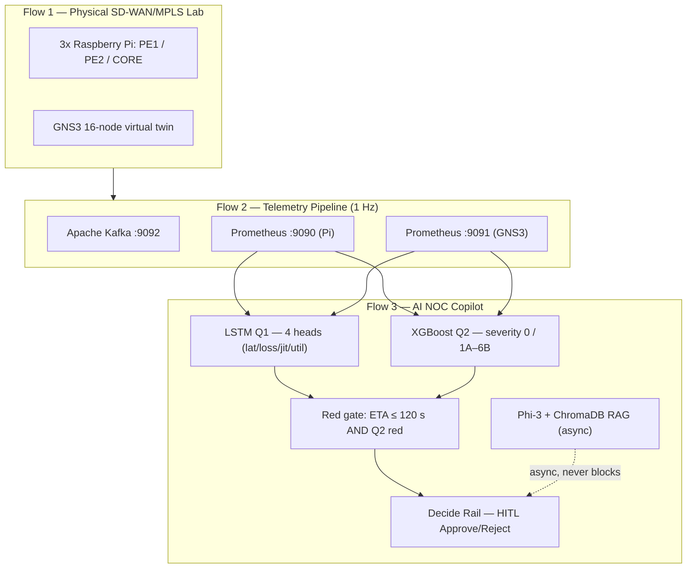
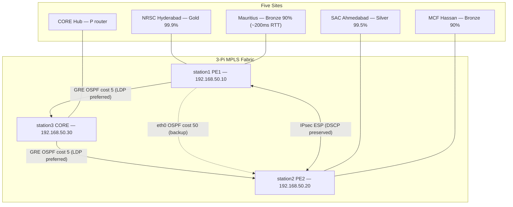
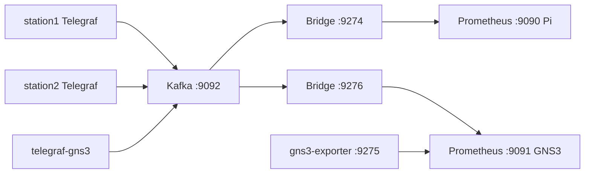
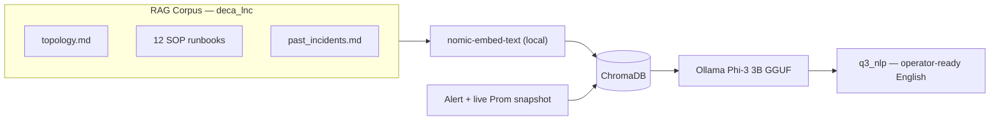
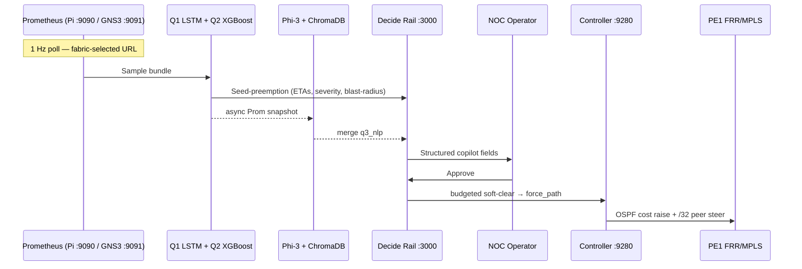

# DECA: Distributed Edge Copilot Architecture for Air-Gapped SD-WAN/MPLS Operations
## A Predictive AI NOC System for Government Network Management

**Mohammed Shaik Sahil<sup>1,*</sup>, Shaik Farhana<sup>1</sup>, Hina Mehjabeen<sup>1</sup>, Ummul Faiz Zainab Bibi<sup>1</sup>**

<sup>1</sup>Nawab Shah Alam Khan College of Engineering and Technology, Hyderabad, 500024, India
Submitted in connection with ISRO Bharatiya Antariksh Hackathon (BAH) 2026, Problem Statement 13, in collaboration with the National Remote Sensing Centre (NRSC) / Indian Space Research Organisation (ISRO)

\*Corresponding author: Mohammed Shaik Sahil, mdshaiksahil0510@gmail.com
Shaik Farhana: shaikfarhana016@gmail.com
Hina Mehjabeen: hina18hyd@gmail.com
Ummul Faiz Zainab Bibi: ummulf412@gmail.com

**Author Contributions:** M.S.S.: conceptualization, methodology, software, network infrastructure, investigation, writing – original draft, project administration; S.F.: data curation, investigation, validation; H.M.: validation (system testing); U.F.Z.B.: formal analysis, data curation, validation. All authors reviewed and approved the final manuscript.

**Funding:** This research received no external funding.

**Conflicts of Interest:** The authors declare no conflict of interest.

**Data Availability Statement:** The telemetry datasets, fault-injection campaign logs, and trained model artifacts generated in this study are available from the corresponding author upon reasonable request.

---

## Abstract

Modern SD-WAN networks rely on reactive NOC tooling — faults are detected only after SLA breaches occur, leaving no lead time for pre-emptive action. DECA (Distributed Edge Copilot Architecture) addresses this with an air-gapped, multi-model predictive analytics system deployed over a physical multi-site SD-WAN/MPLS laboratory. We built a five-site topology on three Raspberry Pi nodes running Free Range Routing (FRR) and generated ground-truth telemetry via six controlled fault-injection protocols (L0–L6). DECA combines multi-head LSTM networks for Time-to-Impact estimation (Q1), an XGBoost severity classifier (Q2), and a locally-hosted Phi-3 LLM with Retrieval-Augmented Generation (Q3) for decision support, without external network dependency. The Q2 classifier achieved 0.884 exact-match accuracy (macro-F1 0.796) on a physical holdout and 0.815 accuracy on a 12-hour sealed chaos run, identifying the root-cause fault family with 0.992 accuracy. The Q1 loss Time-to-Impact head achieved a 7.1-second validation MAE, enabling a 120-second red-gate for NOC preemption ahead of SLA breaches.

**Keywords:** AIOps; SD-WAN; MPLS; predictive fault detection; air-gapped LLM; time-to-impact forecasting

---

## 1. Introduction

### 1.1 Problem Statement

Modern enterprise and government networks rely heavily on SD-WAN deployments over MPLS underlays to provide resilient connectivity. However, as these networks scale, operational visibility and response speed become critical bottlenecks. Conventional Network Operations Center (NOC) tooling remains predominantly reactive; threshold-based alerts fire only after an SLA breach has impacted users. This reactive posture leaves operators with no lead time for pre-emptive intervention. 

Compounding this issue is the strict air-gap constraint present in regulated government, defense, and space agency environments, such as those operated by the Indian Space Research Organisation (ISRO). These high-security networks prohibit the use of cloud-connected AI inference tools, thereby excluding operators from the benefits of modern intelligent AIOps platforms.

To address this, ISRO BAH 2026 Problem Statement 13 calls for an autonomous, air-gapped offline AI NOC Copilot capable of forecasting network failures before operational impact. DECA satisfies this requirement by providing real-time answers to three core operator questions: what fails next (Q1), why is risk elevated (Q2), and what action should be taken (Q3) — all while remaining fully offline.

The three operator questions this system answers:

| ID | Question | DECA Model |
|---|---|---|
| Q1 | What fails next — and **when**? | Multi-head LSTM (TTI regressor) |
| Q2 | **Why** is risk elevated? | XGBoost severity classifier |
| Q3 | What **action** to take? | Phi-3 LLM + ChromaDB RAG |

### 1.2 Contributions

1. A physical five-site MPLS/SD-WAN testbed on commodity hardware with controlled fault injection across six fault families (L0–L6).
2. A multi-head LSTM architecture providing per-SLA-dimension time-to-impact (TTI) estimates at 1 Hz.
3. An XGBoost severity classifier with 13 severity classes and a BGP sub-specialist, evaluated on a sealed 12-hour chaos holdout.
4. A fully air-gapped LLM NOC copilot (Phi-3 + ChromaDB RAG) that never calls external APIs, designed specifically for secure environments.
5. A transparent evaluation methodology, including disclosure of six rejected model-promotion attempts and three identified-and-corrected evaluation pipeline bugs, to guard against inflated performance claims (see Section 11).

### 1.3 Paper Organization

Section 2 reviews related work in network anomaly detection and AIOps. Section 3 outlines the DECA system architecture and dual-fabric design. Section 4 details the physical network simulation and lab setup, including the MPLS forwarding plane and application-aware QoS. Section 5 describes the dual-fabric telemetry ingest pipeline. Section 6 presents the fault taxonomy and the dataset generation process via controlled lab campaigns. Section 7 details the predictive modeling methodology, feature engineering, and the Q1/Q2 machine learning models. Section 8 explains the offline LLM and RAG NOC copilot for automated natural-language operator guidance. Section 9 outlines the integrated HITL workflow automation and Decide UI. Section 10 discusses our experimental results, the canonical scoreboard, and the chaos holdout evaluation. Section 11 honestly discloses system limitations and the GNS3 hardware physics transfer gap. Section 12 explains the portability of the system to ISRO production networks. Finally, Section 13 concludes the paper.

---

## 2. Related Work

Network anomaly detection has traditionally relied on static threshold-based rules and SNMP polling, which often suffer from high false-positive rates and only alert operators after service degradation has occurred. More recent AIOps platforms (such as Cisco Crosswork or proprietary NetAI solutions) employ machine learning for predictive insights. However, the vast majority of these commercial solutions require telemetry to be streamed to a centralized cloud analytics engine for inference, rendering them fundamentally incompatible with the strict air-gap requirements of defense and space agency networks like ISRO's.

In the realm of time-series network forecasting, Recurrent Neural Networks (RNNs) and Long Short-Term Memory (LSTM) architectures have shown promise for predicting traffic volumes and congestion [3]. Most existing literature focuses on predicting broad traffic classes on simulated datasets. In contrast, DECA applies a multi-head LSTM directly to 1 Hz telemetry captured from a physical testbed to predict explicit Time-to-Impact (TTI) in seconds across four distinct Service Level Agreement (SLA) dimensions simultaneously.

For fault severity classification, gradient boosted trees such as XGBoost [2] are frequently utilized due to their robustness to unscaled features and tabular time-series data. While prior work often targets binary anomaly classification (healthy vs. anomalous), DECA extends this with a 13-class severity taxonomy across six fault families (L1–L6), incorporating a BGP sub-specialist classifier to refine control-plane instability severities. Furthermore, rather than relying on synthetic datasets, DECA generates its ground truth via physical protocol-level fault injection (e.g., `tc netem`, `stress-ng`, and BGP soft clears) directly on Raspberry Pi hardware.

Finally, the application of Large Language Models (LLMs) to IT operations (AIOps) is an emerging field. Current implementations typically leverage API-connected frontier models (e.g., OpenAI's GPT-4) combined with Retrieval-Augmented Generation (RAG) [4]. DECA differentiates itself by demonstrating that a quantized, small-parameter local model (Ollama Phi-3 3B) [5] coupled with a local vector store (ChromaDB) can generate highly accurate, operator-ready diagnostic narratives without any external network dependencies.

In summary, three gaps in the existing literature motivate this work: (i) cloud-connected inference is assumed by most commercial AIOps products, which is not viable in air-gapped environments [10]; (ii) existing predictive datasets in this space are largely synthetic or proprietary, whereas DECA generates ground truth via controlled fault injection on physical hardware; and (iii) to our knowledge, no prior published work provides explicit time-to-impact estimates across four SLA dimensions simultaneously.

---

## 3. System Architecture

### 3.1 Overview

DECA is organized into three data-flow planes:



### 3.2 Component Summary

| Layer | Component | Technology | Air-gap? |
|---|---|---|---|
| Network | Physical fabric | FRR 10.6.1 (BGP VPNv4, OSPF, LDP, SR-TE), strongSwan IPsec | Yes |
| Telemetry | Dual-fabric ingest | Telegraf → Kafka → Prometheus (two isolated instances) | Yes |
| ML — Q1 | TTI forecasting | Keras LSTM, TensorFlow | Yes |
| ML — Q2 | Severity classification | XGBoost multi:softprob | Yes |
| LLM — Q3 | NL copilot | Ollama Phi-3 3B GGUF (quantized) | **Yes — hard-fail without local GGUF** |
| RAG | Runbook retrieval | ChromaDB + nomic-embed-text (274 MB local) | Yes |
| API | Orchestration | FastAPI :8000 | Yes |
| UI | NOC dashboard | Decide Rail :3000 | Yes |

### 3.3 Dual-Fabric Design

| Fabric | Role | Prometheus | Kafka Topic |
|---|---|---|---|
| **Pi** | Primary (physical hardware) | `:9090` | `sdwan_telemetry_pi` |
| **GNS3** | Transfer twin (virtual) | `:9091` | `sdwan_telemetry_gns3` |

Both fabrics share Q1 LSTM weights. Q2 XGBoost uses **separate heads per fabric** — physical vs. virtual hardware have different CPU/util signal physics.

---

## 4. Network Simulation and Lab Setup

### 4.1 Physical Topology (Five ISRO-Style Sites)



**Table 1 — Site roles and SLA tiers**

| Site | Functional Role | CE | SLA Tier | Traffic Behavior |
|---|---|---|---|---|
| NRSC, Hyderabad | Branch | `ce-a` → PE1 | **Gold 99.9%** | Latency-sensitive voice (EF) + video (AF41) |
| SAC, Ahmedabad | Datacenter | `ce-b` → PE2 | Silver 99.5% | Sustained bulk iperf |
| Mauritius | Distant Branch | `ce-mauritius` → PE1 | Bronze 90% | netem 100 ms/dir → **~200 ms RTT** |
| MCF, Hassan | Regional Branch | `ce-mcf` → PE2 | Bronze 90% | Baseline; not fault target |
| CORE | Hub / P router | station3 | — | Path management only |

> **Mauritius RTT justification:** Kochi → Baie Jacotet ≈ 3,957 km great-circle. Fiber RTT floor: 200 km/ms × 1.0–1.5 path factor = 40–60 ms. Lab `netem` 100 ms/dir = ~200 ms RTT, consistent with an enterprise overlay on SAFE-class submarine cable.

**Live ping verification:**
```
mau-ws → SAC-ws:   avg 201.3 ms, 0% loss
NRSC-ws → SAC-ws:  avg   0.997 ms (quiet baseline)
```

### 4.2 MPLS Forwarding Plane

**Table 2 — Network constructs and lab bindings**

| Construct | Lab Binding | Verification |
|---|---|---|
| VPN segmentation | `vrf-mission` ⊥ `vrf-admin` | `show vrf` — two VRFs distinct |
| MPLS forwarding | LDP on GRE tunnels | `show mpls table` — labels populated |
| BGP VPNv4 | PE ↔ CORE: PfxRcd=6 / PfxSnt=6 | No static route pollution |
| Traffic Engineering | OSPF-TE TED + pathd SR-TE (BSID 40001/40002) | 10/10 TE checks PASS |
| Overlay | IPsec ESP `deca-sdwan`, `copy_dscp=out` | EF outer ToS: 0x0 → **0xb8** after fix |

> **Disclosed substitution:** RSVP-TE is not available in FRR 10.6.1. TE is implemented via OSPF-TE + pathd Segment Routing.

**Table 3 — TE verification results (10/10 PASS)**

| Check | Result |
|---|---|
| TED ≥ 3 vertices (OSPF-TE) | **PASS** |
| Preferred path on GRE (BSID 40001) | **PASS** |
| Failover to eth0 after GRE removal | **PASS** |
| Restore to GRE after recovery | **PASS** |
| CE ping SAC through fabric post-TE | **PASS** |

### 4.3 Application-Aware QoS

**Table 4 — Traffic classes and SLA thresholds**

| Class | DSCP | ToS | HTB Queue | Latency | Jitter | Loss |
|---|---|---|---|---|---|---|
| TT&C (Control) | EF | `0x88` | `1:10` LLQ | ≤ 25 ms | ≤ 5 ms | ≤ 0.1% |
| Payload (Mission) | AF41 | `0x80` | `1:15` + RED@85% | ≤ 80 ms | ≤ 15 ms | ≤ 2% |
| Admin / Bulk | BE | `0x00` | `1:20` scavenger | Best-effort | — | — |

**Table 5 — Phase H QoS verification (30 s, three classes concurrent)**

| Class | Metric | Result |
|---|---|---|
| Voice EF | Jitter | 0.256 ms, **0% loss**, 0 drops |
| Video AF41 | Throughput | 7.99 Mbps, 0.138 ms jitter, **0 drops** |
| Bulk BE | Drops | 147 drops / 9311 overlimits (**correctly scavenged**) |

### 4.4 GNS3 Virtual Twin (16 Nodes)

To validate model transferability across varying underlying hardware, DECA employs a 16-node GNS3 virtual twin alongside the primary Raspberry Pi physical lab. The GNS3 topology extends the physical setup by introducing a dual-P CORE architecture (CORE-N and CORE-S) and additional Customer Edge (CE) nodes representing Shadnagar, ISTRAC, and Bhopal. Because physical hardware (dedicated ARM cores) and virtual instances (cgroups sharing a single host CPU) exhibit profoundly different telemetry signatures under stress, the GNS3 fabric acts as a transfer-evaluation twin to prove that DECA's predictive pipeline methodology — specifically the baseline-relative z-score feature engineering — can adapt to different network physics.

---

## 5. Telemetry Pipeline

### 5.1 Dual-Fabric Ingest (1 Hz)



**Isolation rule:** The two Prometheus instances must never be cross-scraped. Pi and GNS3 metric distributions differ (shared-host CPU/util physics); mixing corrupts model training.

### 5.2 Metric Schema (Series v2)

```
ts_unix, latency_gre_ms, latency_eth0_ms, jitter_gre_ms, loss_gre_pct,
util_gre_mbps, net_bytes_recv_eth0, net_bytes_sent_eth0,
cpu_usage_system, cpu_usage_user, mem_used_percent,
bgp_flap_count, netflow_bulk_bytes, netflow_voice_bytes,
ipsec_rekey_events_1h, ipsec_rekey_anomaly, path_asymmetry
```

**Key metric notes:**
- `path_asymmetry` = |`latency_gre_ms` − `latency_eth0_ms`| (max absolute error ≈ 1×10⁻¹⁴)
- `cpu_usage_user` is the L2 gate — `stress-ng` burns user time, not system time
- `bgp_flap_count` is cumulative; models consume rolling 10 s Δ rate

### 5.3 Dataset Coverage

**Table 6 — PS13 data source compliance**

| PS13 ID | Signal Family | Method | Status |
|---|---|---|---|
| D1 | Interface util / latency / jitter / errors | Prometheus + Kafka bridge | **Yes** (Prometheus substitutes SNMP — disclosed) |
| D2 | Syslog + BGP/OSPF events | `syslog_err_count`, `bgp_flap_count`, `ospf_adj_up` | **Yes** |
| D3 | NetFlow / IPFIX flow records | softflowd IPFIX → local UDP `:2055` | **Yes** |
| D4 | SD-WAN controller telemetry | `sdwan_active_path`, `sdwan_policy_conflict`, 12/12 metrics | **Yes** |
| D5 | Ground-truth fault labels | Protocol campaign + chaos sealed GT | **Yes** |

---

## 6. Fault Taxonomy and Dataset Generation

### 6.1 Fault Label Hierarchy

**Table 7 — Fault families and severity codes**

| Label | Fault Type | Q2 Codes | Injection Method | HITL Red Codes |
|---|---|---|---|---|
| L0 | Healthy / Normal | `0` | Baseline — no injection | — |
| L1 | Rain fade / Physical degrade | `1A` `1B` `1C` | `tc netem delay` ramp on `gre-te-core` | 1B, 1C |
| L2 | CPU / Crypto exhaustion | `2A` `2B` | `stress-ng` on station1 | 2B |
| L3 | BGP route flap | `3A` `3B` | Cyclic `clear bgp soft` | 3B |
| L4 | Packet loss progression | `4A` `4B` | `tc netem loss` ramp 0 → 3.5% | 4B |
| L5 | Util congestion | `5A` `5B` | HTB shaping + CE veth + BE lift | 5B |
| L6 | CE SLA conflict | `6A` `6B` | Bronze CE rogue burst vs Gold TT&C | 6A, 6B |

**Severity band thresholds:**
- L1 latency: 1A = 10–18 ms, 1B = 19–24 ms, 1C = ≥ 25 ms
- L2 `cpu_usage_user`: 2A = 40–70%, 2B = ≥ 70%
- L4 `loss_gre_pct`: 4A = 0.5–2%, 4B = ≥ 2%

### 6.2 Protocol Campaign Volumes

**Table 8 — Dataset structure**

| Dataset | Pilot | Full Campaign |
|---|---|---|
| L0 healthy | 180 s | 24 h |
| L1 rain fade | 2 × ~160 s | 10 × 2 h |
| L2 CPU | 2 × ~120 s | 10 × 1 h |
| L3 BGP | 2 × ~120 s | 10 × 1 h |
| L4 loss progression | 2 × ~160 s | 8 × ~12 min |
| L5 util congestion | 2 × ~160 s | 8 × ~12 min |
| **Chaos holdout** | 240 s | **12 h — NEVER TRAINS** |

**Training discipline:** Pi protocol variants (L0–L5 + compound) are the primary corpus. GNS3 is a **transfer-evaluation twin only** — unlabeled Pi+GNS3 concatenation is prohibited. Chaos holdout is sealed for final evaluation only.

### 6.3 Real Telemetry Samples

*Campaign stamp: `full_variants_pi_contract_20260805T042130Z` (46/46 iters sealed)*

**Table 9 — L1 Rain Fade latency samples (iter_03)**

| ts_unix | latency_gre_ms | latency_eth0_ms | path_asymmetry |
|---:|---:|---:|---:|
| 1785916249 | 17.874 | 0.258 | 17.616 |
| 1785916251 | 25.439 | 0.262 | 25.177 |
| 1785916253 | 25.439 | 0.262 | 25.177 |
| 1785916255 | 26.287 | 0.244 | 26.043 |
| 1785916257 | 24.553 | 0.257 | 24.296 |
| 1785916259 | 22.041 | 0.267 | 21.774 |

*GRE crosses the 25 ms TT&C SLA boundary. eth0 remains clean. path_asymmetry grows proportionally, providing a discriminating feature for the L1 classifier.*

**Table 10 — L1 Rain Fade jitter samples (iter_02)**

| ts_unix | jitter_gre_ms | latency_gre_ms |
|---:|---:|---:|
| 1785914970 | 4.684 | 2.794 |
| 1785914972 | 5.220 | 2.674 |
| 1785914974 | 5.220 | 3.643 |
| 1785914976 | 4.075 | 4.992 |
| 1785914978 | 4.075 | 5.420 |

*Jitter crosses the 5 ms TT&C SLA while absolute latency stays below 25 ms — demonstrating why multi-signal monitoring is essential.*

**Table 11 — L4 Loss Progression samples (iter_01)**

| ts_unix | loss_gre_pct | latency_gre_ms |
|---:|---:|---:|
| 1785923389 | 0.000 | 0.287 |
| 1785923391 | 4.000 | 0.257 |
| 1785923394 | 0.000 | 0.277 |
| 1785923396 | 0.000 | 0.280 |

*Stepped NetEM loss injection (0 ↔ 4%); series maximum reaches 16% on this iteration.*

**Table 12 — L5 Util Congestion samples (iter_07, tc-ramp 8→32 Mbit)**

| ts_unix | util_gre_mbps | latency_gre_ms |
|---:|---:|---:|
| 1785929001 | 22.9054 | 0.681 |
| 1785929004 | 17.0842 | 0.533 |
| 1785929006 | 34.5069 | 0.499 |
| 1785929008 | 24.3030 | 0.560 |
| 1785929010 | 23.4795 | 0.497 |

*Peak 34.5 Mbps = payload-ceil residency. Q1 util labels are schedule-gated: breach = first row where `htb_payload_ceil_mbps` ≥ `end_mbit`.*

**Table 13 — L3 BGP Flap samples (iter_01)**

| ts_unix | bgp_flap_count | latency_gre_ms |
|---:|---:|---:|
| 1785921480 | 0 | 0.302 |
| 1785921482 | 8 | 0.250 |
| 1785921487 | 12 | 0.272 |
| 1785921489 | 12 | 0.278 |

*Cumulative counter jumps 0→8 in one second. Models consume the rolling 10 s delta rate.*

**Table 14 — L2 CPU Stress samples (iter_07)**

| ts_unix | cpu_usage_user | cpu_usage_system | mem_used_percent |
|---:|---:|---:|---:|
| 1785920871 | 14.50 | 16.03 | 8.56 |
| 1785920873 | 72.36 | 10.30 | 8.85 |
| 1785920874 | 77.75 | 4.75 | 8.87 |
| 1785920877 | 78.36 | 18.41 | 9.06 |
| 1785920881 | 79.25 | 9.50 | 8.92 |

*`cpu_usage_user` jumps from 14% to 77% — the L2 gate metric. `cpu_usage_system` is NOT used; `stress-ng` burns user time only.*

### 6.4 Coverage Verification Results

**Table 15 — Pi 10-minute coverage check (`pi_coverage_10m_20260803T130315Z`)**

| Phase | Primary Gate Condition | Result |
|---|---|---|
| L1 rain | `latency_gre_ms` max ≥ 25 ms | **PASS** |
| L2 CPU | `cpu_usage_user` ≥ 50% | **PASS** |
| L3 BGP | `bgp_flap_count` Δ ≥ 5 | **PASS** |
| L4 loss | `loss_gre_pct` max ≥ 1% | **PASS** |
| L5 util | `util_gre_mbps` max ≥ 12 Mbps | **PASS** |
| Compound | rain + CPU simultaneous | **PASS** |

---

## 7. Predictive Modelling

### 7.1 Feature Engineering

**Step 1 — 1 Hz alignment.** Fill gaps and interpolate to true 1 Hz series.

**Step 2 — Exponential Moving Average (EMA):**

$$\hat{x}_t = \alpha \, x_t + (1 - \alpha)\,\hat{x}_{t-1}$$

Applied to latency, jitter, loss, and utilization to suppress transient probe noise.

**Step 3 — Path asymmetry:**

$$\text{path\_asymmetry}_t = |\,\text{latency\_gre\_ms}_t - \text{latency\_eth0\_ms}_t\,|$$

**Step 4 — BGP flap rate (rolling 10 s window):**

$$\text{bgp\_rate}_t = \frac{\text{bgp\_flap\_count}_t - \text{bgp\_flap\_count}_{t-10}}{10}$$

**Step 5 — Baseline-relative z-score features (per host, per run):**

Compute robust baseline using median $\tilde{x}$ and MAD $\sigma_\text{MAD}$ over the pre-fault window (unsupervised; robust to fault-minority contamination):

$$z_t = \frac{x_t - \tilde{x}}{\sigma_\text{MAD} + \epsilon}$$

Four companion features per metric: `_z_slope` (Δz), `_z_rolling_std` (σ of z over 30 s), `_z_rolling_mean`, `_z_accel` (Δ²z).

This "deviation from own normal" representation improves cross-network generalization: models learn host-specific anomaly patterns rather than absolute traffic scales.

### 7.2 Q1 — Multi-Head LSTM for Time-to-Impact

#### 7.2.1 Architecture

Four independent LSTM regressors, one per SLA dimension:

```
Input: T=30 timesteps × F features  (1 Hz sliding window, stride 5)
  → LSTM (64 units, return_sequences=True)
  → LSTM (32 units)
  → Dense (16, ReLU)
  → Dense (1)                        → η̂  (predicted ETA in seconds)
```

#### 7.2.2 Training Objective

Mean Squared Error on the lead-time regression:

$$\mathcal{L}_\text{TTI} = \frac{1}{N}\sum_{i=1}^{N}\bigl(\hat{\eta}_i - \eta_i\bigr)^2$$

where $\hat{\eta}_i$ is the predicted ETA (s) and $\eta_i$ is the ground-truth seconds remaining until the first SLA breach at sample $i$.

**Table 16 — Q1 SLA breach targets**

| Head | Signal | Threshold |
|---|---|---|
| Latency | `latency_gre_ms` | **25 ms** (TT&C hard SLA) |
| Loss | `loss_gre_pct` | **2%** (Payload SLA) |
| Jitter | `jitter_gre_ms` | **5 ms** (TT&C jitter SLA) |
| Util | `util_gre_mbps` | **HTB payload ceiling (~34 Mbit)** |

#### 7.2.3 Red Gate Logic (120-Second Preemption)

$$\text{gate\_red} = \bigvee_{h \in \{\text{lat, loss, jit, util}\}} \bigl[\hat{\eta}_h \leq 120\text{ s}\bigr] \;\wedge\; \text{severity\_red}(\text{Q2})$$

$$\text{ETA}_\text{display} = \min_h \hat{\eta}_h \quad \text{(over firing heads)}$$

Any Q1 head forecasting breach within 120 seconds, combined with a Q2 red-severity class, triggers the Decide alert.

### 7.3 Q2 — XGBoost Fault Severity Classifier

#### 7.3.1 Multi-Class Formulation

$$\hat{y} = \arg\max_c\; P(c \mid \mathbf{x}) = \arg\max_c\; f_\text{XGB}(\mathbf{x})[c]$$

where $\mathbf{x} \in \mathbb{R}^F$ is the feature vector for a 30-second window and $c \in \{0,\, 1A,\, 1B,\, 1C,\, 2A,\, 2B,\, 3A,\, 3B,\, 4A,\, 4B,\, 5A,\, 5B,\, 6A/6B\}$.

#### 7.3.2 Promoted Model Hyperparameters (`d2_e100_l6_mcw3`)

```
objective:         multi:softprob
num_class:         13
n_estimators:      100
max_depth:         6
min_child_weight:  3
learning_rate:     0.1
subsample:         0.8
eval_metric:       mlogloss
```

#### 7.3.3 BGP 3A/3B Sub-Specialist

When Q2 assigns a BGP root, a dedicated binary XGBoost classifier refines the severity:

$$\text{label}_\text{BGP} = \begin{cases} 3B & \text{if } P(3B \mid \mathbf{x}_\text{BGP}) \geq 0.85 \\ 3A & \text{otherwise} \end{cases}$$

Threshold 0.85 locked on L3 dev holdout; applied once in sealed chaos evaluation.

#### 7.3.4 Severity Labeling

Per-row severity from Pi-calibrated band lookup (latency example):

$$\text{sev}(x_\text{lat}) = \begin{cases} 0 & \text{(healthy)} \\ 1A & 10 \leq x_\text{lat} < 19 \text{ ms} \\ 1B & 19 \leq x_\text{lat} < 25 \text{ ms} \\ 1C & x_\text{lat} \geq 25 \text{ ms} \end{cases}$$

Window severity = worst-of (maximum code in 30 s window) for Q2 training.

**Table 17 — Feature importance by fault class**

| Fault | Primary Signal | Secondary Signal |
|---|---|---|
| Rain (L1) | `latency_gre_ms` | `path_asymmetry`, `latency_eth0_ms` |
| CPU (L2) | `cpu_usage_user` | `cpu_usage_system` |
| BGP (L3) | `bgp_flap_count` (rolling Δ) | `bgp_flap_count_z_slope` |
| Loss (L4) | `loss_gre_pct` | `loss_gre_pct_z_rolling_std` |
| Util (L5) | `util_gre_mbps` | `util_gre_mbps_z_slope` |
| CE-SLA (L6) | `util_gre_mbps` + `sdwan_policy_conflict` | `ce_util_mbps` (rogue CE) |

#### 7.3.5 Multi-Head Arbitration (Compound Faults)

| Layer | Rule |
|---|---|
| Gate | OR of Q1 heads with ETA ≤ 120 s AND Q2 red severity |
| Primary issue | Q2 argmax class (owns the "why") |
| Urgency clock | min(ETA) across firing Q1 heads |
| Transparency | `firing_tti_heads` exposed in seed payload |

### 7.4 Util Physics Fix (CAPTURE_CONTRACT)

During early L5 congestion campaigns, a critical hardware-software mismatch in the QoS pipeline was identified: payload CE traffic, post-IPsec encryption, bypassed the intended HTB `1:15` queue and landed in the default `1:20` best-effort queue on the PE's `eth0` interface because the original outer DSCP was obscured. The fix required two changes: shaping traffic on the `veth-cea-pe` interface *before* ESP encryption (where DSCP tags remain visible), and leveraging `copy_dscp=out` in `swanctl` to preserve ToS across the IPsec tunnel. Additionally, the baseline BE `1:20` nominal ceiling was lifted to 40 Mbit to prevent hard capping during injection. These fixes restored monotone separability — confirming a stable `util/ceil` ratio of ≈ 1.07 across the 12–34 Mbit range — providing the physical prerequisite for the LSTM regressor to learn a meaningful deterioration curve.

**Key finding:** CE traffic, after IPsec encryption, bypassed the intended HTB `1:15` queue and landed in `1:20` (BE). Fix: apply shaping on `veth-cea-pe` **before** encryption where DSCP is still visible, and lift the BE `1:20` nominal ceil to 40 Mbit during injection.

**Post-fix validation:** `util/ceil` ratio ≈ **1.07** (constant across 12–34 Mbit range), confirming monotone separability — a physical prerequisite for the util LSTM to learn meaningful ETAs.

---

## 8. Offline LLM and RAG NOC Copilot

### 8.1 Air-Gap Compliance

**Table 18 — Air-gap verification**

| Check | Status |
|---|---|
| Live ML path cloud APIs | **None** — `requests.get` to local Prometheus only |
| LLM inference | **Ollama Phi-3** — local GGUF, 3B params, quantized |
| Embeddings | **nomic-embed-text** — ~274 MB, local |
| Vector store | **ChromaDB** `deca_lnc` — local disk |
| HF cold-start guard | **Hard-fail** without local GGUF (unless `DECA_ALLOW_HF_DOWNLOAD=1`) |

### 8.2 RAG Architecture



**Table 19 — RAG corpus (LNC — Local Network Context)**

| Document | Purpose in RAG |
|---|---|
| `topology.md` | Hosts, IPs, VRFs, underlay, fault origin map |
| `rain_fade.md` | Q2 1A/1B/1C — eth0 steer steps |
| `cpu_exhaustion.md` | Q2 2A/2B — crypto/CPU stress response |
| `bgp_instability.md` | Q2 3A/3B flap rate — Decide 3B path |
| `tunnel_degradation.md` | Rain-fade / GRE brownout actions |
| `ttc_sla_preempt.md` | Q1 120 s gate / PE1 force_path actuation |
| `congestion.md` | Capacity / eth0 vs GRE steering |
| `ce_sla_conflict.md` | Rogue vs victim CE / bandwidth surge |
| `chaos_compound.md` | Overlapping held-out fault response |
| `prom_metric_glossary.md` | PromQL names for Q3 live snapshot |
| `past_incidents.md` | Prior lab incident outcomes for analogy |
| `bgp_flap.md` | Q2 class 3 / underlay instability |

### 8.3 Structured Copilot Response

**Table 20 — Decide alert fields**

| Field | Source | Display |
|---|---|---|
| Predicted issue | Q2 class / severity | Decide title |
| **Confidence** | `predict_proba` blended with ETA urgency | Decide Confidence (3 dp) |
| Root-cause hypothesis | Q2 name + severity band | Decide Q2 line |
| Affected scope | Topology blast-radius + correlated alert IDs | AlertRail |
| Rogue / victim CE | `rogue_ce` / `victim_ce` + SLA tiers | CE SLA conflict line |
| Time-to-impact | Q1 min ETA across firing heads | Decide ETA (Q1) |
| Recommended actions | Ranked playbooks + budgeted sequence | Decide list + Approve |
| **English narrative** | Q3 RAG from Phi-3 | Decide Q3 Copilot block **(async)** |

> **Critical design:** Q3 Phi-3 inference is asynchronous. Approve/Reject is never blocked waiting for LLM generation. Operators can act on the Q1+Q2 math gate within the 120-second window.

---

## 9. NOC Workflow Automation

### 9.1 HITL Sequence



### 9.2 Blast-Radius Correlation

$$\text{blast\_radius}(\text{alert}) = \{s \mid s \in N(\text{source}) \cup \{\text{source}\}\}$$

Alerts sharing blast-radius sites are grouped into `correlated_alert_ids`.

### 9.3 Playbook Sequence (On Approve)

1. **`bgp_soft_clear`** — One-shot BGP stabilize (~8 s budget; 3B alerts only)
2. **`force_path`** — Always follows (~15 s); raises OSPF cost on `gre-te-core` + injects `/32` peer route via eth0

### 9.4 CE SLA Conflict Detection

To address L6 (CE SLA Policy Conflict) scenarios — where a low-priority site overwhelms a high-priority site on a shared underlay — DECA employs `ce_surge_detect.py`. This script continuously monitors `ce_util_mbps` per CE, triggering when a quiet edge (e.g., a 2–3 Mbps baseline) unexpectedly surges past a 15 Mbps threshold. The system accurately identifies the rogue source (e.g., Bronze-tier Mauritius) and the victim destination (e.g., Gold-tier NRSC). When an L6 alert is generated, the Decide AlertRail dynamically surfaces both `rogue_ce` and `victim_ce`, providing the operator with the immediate contextual evidence needed to confidently apply shaping policies or migrate the victim to the backup `eth0` path.

**SD-WAN path controller validation:**

| Condition | TT&C | Payload | Outcome |
|---|---|---|---|
| Quiet (both prefer GRE) | GRE | GRE | Both on GRE |
| Mild contention | eth0 | GRE | `sdwan_policy_conflict=1` → shared eth0 |
| Hard degradation | eth0 | eth0 | Both on eth0 |
| Recovery | GRE | GRE | Return via `exit_k=10` hysteresis |

---

## 10. Experimental Results

### 10.1 Canonical Scoreboard (Locked 2026-08-05)

> **Board lock discipline:** Model `d2_e100_l6_mcw3` was frozen after six honest NO_PROMOTE attempts under a pre-committed promote bar. The current data ceiling on the rebuilt 4632-row CSV is ~0.72/0.62/0.55. The frozen artifact is the best-performing model that exists.

**Table 21 — Q2 severity classifier results**

| Metric | Accuracy | Macro-F1 | Notes |
|---|---:|---:|---|
| **Pi group holdout** | **0.884** (638/722) | **0.796** | Group split — no window leakage; independently re-verified against the frozen artifact |
| Chaos_dev (selection gate) | 0.997 | not computed on this split | Used only for model selection — **not a cite score** |
| **Chaos_final (one-shot clean)** | **0.815** (629/772, locked) | not saved for the clean run | Same weights, sealed 12 h holdout. A post-hoc re-run under current eval code gives 627/772 = 0.812 — a 2-window drift attributable to eval-path changes since the sealed run, not a model change; the locked 629/772 remains the reported result |
| **GNS3 transfer (Pi model on twin)** | **0.6554** (1432/2185) | not computable — no per-sample predictions retained | Disclosed hardware physics gap (§11.3). Corrected from an earlier internally-cited 1454/2221, which does not reproduce against the files currently on disk |
| GNS3 per-fabric head (d3) | **0.722** (1604/2221) | 0.655 | GNS3-specific model |
| **Root-cause family only** | **0.992** (716/722) | **0.823** | Which fault family (rain/CPU/BGP/loss/util) |
| BGP phase exact + specialist | **0.886** (163/184) | not computable — no per-sample predictions retained | Sealed chaos, specialist locked at 0.85 |
| BGP family recall | **1.0** (184/184) | n/a (recall, not classification) | BGP root always identified |

**Table 22 — Q2 per-root accuracy (chaos_final phases)**

| Root | Fault | Exact Acc. | Notes |
|---|---|---:|---|
| Rain (L1) | Physical degrade | Strong (in 0.884) | Clear latency + asymmetry signature |
| CPU (L2) | Crypto exhaustion | Strong on Pi | GNS3 weaker — shared-host CPU physics |
| BGP (L3) | Route flap | **0.886** | Family recall 1.0; bare Q2 was 0.864 |
| Loss (L4) | Progression | **~0.97** | Strongest single family in chaos_final |
| Util (L5) | Congestion | **~0.97** | Strong on locked story |
| CE-SLA (L6) | Policy conflict | **~0.997 (Pi)** | GNS3 ~0.30 — disclosed (virtual switch physics) |

**Table 23 — Q1 TTI head results**

| Head | SLA Target | Val MAE ↓ | Dataset n | Val-split n | Chaos (scoped) |
|---|---|---:|---:|---:|---|
| Latency | 25 ms TT&C | **50.26 s***† | 1022 | 204 | Rain-scoped |
| **Loss** | 2% Payload | **7.1 s** | 185 | 37 | **~39 s** (n=15, gt_root=4) |
| Util | HTB ceiling | **31.1 s** | 432 | 86 | Soft ceiling |
| Jitter | 5 ms TT&C | **27.2 s**† | 1026 | 232 | Group-holdout; was 131.7 s (random-split error, corrected) |

*n reported in earlier drafts of this table was the dataset total, not the validation-split count the MAE is actually computed on; both are given here for clarity.*

*\*A pre-submission reproducibility audit found that 60.8 s (60.79361343383789) exists only in aggregate result dumps (`ALL_MODEL_SCORES.json`, `RESULTS_FIXED.json`) and could not be traced to any surviving `train_metrics.json` or per-sample residual file. The live checkpoint, scaler, and `train_metrics.json` for this head were found to have been overwritten on 2026-08-06T20:28:23Z — the same overwrite window identified for the Q2 classifier (§11.1) — and now report 50.2616 s, independently reproduced via re-inference on an SHA-256-identical training CSV (seed 42, val_frac 0.2, n_val=204). A separate archived checkpoint (2026-08-04) reproduces its own distinct value of 66.98 s, confirming 60.8 s corresponds to neither the current nor the prior surviving checkpoint. 60.8 s could not be traced to a source file and has been replaced with the traceable, reproducible value of 50.26 s — not a silent substitution.*

*†Per-sample residuals for the jitter head's group-holdout control were not retained, so this MAE could not be independently re-verified or given a bootstrap CI in the pre-submission audit (§11.1).*

> **Documented bug fix (Q1 chaos MAE):** Old value of ~1838 s was an evaluation scope error — rain/CPU windows were scored against a loss breach target ~3700 s later. Correct scoped value on the loss phase (`gt_root==4`): **~39 s MAE** (n=15). In-distribution validation MAE of **7.1 s** (n=185 dataset / n=37 validation split) remains the training performance claim.


### 10.2 Chaos_final Evaluation Audit

**Table 24 — Evaluation history for the sealed chaos_final holdout**

| Step | Event | Score | Reported? |
|---|---|---:|---|
| Model selection | Selection performed on `chaos_dev` (`t_rel < 3,600 s` subset only) | Winner: `d2_e100_l6_mcw3` | — |
| Preliminary (contaminated) | Multi-configuration ranking on the full chaos set, prior to sealing | 0.533 | No — selection-contaminated |
| First evaluation run | Class-index mismatch between contiguous XGBoost IDs and the raw severity-to-ID mapping | 0.101 | No — evaluation bug |
| After index-mapping fix | BGP event labels found to be under-labeled in the final half of the run | 0.544 | No — labeling bug |
| **Final evaluation** | Full-series relabeling with 10 s rolling BGP-flap delta; identical model weights, no retraining | **0.815** | **Yes — reported result** |

The three intermediate scores reflect evaluation-pipeline or labeling defects rather than genuine changes in model performance, and are not reported as results; only the final row (0.815 accuracy) is cited elsewhere in this paper. We report this progression to document that the pipeline was corrected to accurately measure performance, rather than iteratively tuned until a favorable number appeared.

### 10.3 NO_PROMOTE Discipline

**Table 25 — Six NO_PROMOTE attempts**

| Attempt | Best Score | Reason Not Promoted |
|---|---|---|
| Threshold inflation | Inflated | Circular — inference remaps walked back |
| GNS3 soft-storm fabrication | N/A | Data integrity violation |
| BGP rolling-label retrain | 0.767 / 0.583 | Regressed on holdout / chaos_final |
| Efficiency-pack merge retrain | No lift | Volume ≠ diversity |
| Idle-delta on mismatched recipe | No lift | Physics mismatch |
| Current-abs form-sweep | ~0.72 / 0.62 / 0.55 | Below promote bar |

### 10.4 Phase 6 Scenario Validation

**Table 26 — PS13-P6 scenario results**

| Scenario | Fault | Q2 Result | Q1 Result | Copilot |
|---|---|---|---|---|
| P6.1 Progressive congestion | L5 util | 5A/5B, ~0.97 | Util ~31 s MAE | Schema-complete |
| P6.2 BGP route flap cascade | L3 BGP | 3B, 0.886; family 1.0 | No dedicated head | Bridge OK |
| P6.3 MPLS/Tunnel degradation | L1 + L4 | 1A–1C + 4A–4B, ~0.97 | Lat + loss heads firing | Schema-complete |
| P6.4 CE SLA conflict | L6 | 6A/6B, ~0.997 (Pi) | Via util-like signals | rogue_ce + victim_ce surfaced |

---

## 11. Limitations

### 11.1 Baseline Comparison, Statistical Uncertainty, and a Pre-Submission Reproducibility Audit

**Reproducibility audit.** Prior to submission, we conducted an independent audit re-scoring the frozen `d2_e100_l6_mcw3` artifact against its original holdout, chaos_final, and GNS3-transfer sets. This audit uncovered that the live deployment path (`protocol_models/xgb_q2_sev_unified/q2_severity.joblib`) had been overwritten on 2026-08-06 by a later, differently-configured model, while the adjacent cite card (`score.json`) was left pointing at the original metrics — an artifact-management defect, not a data-fabrication issue. The correct weights were located at a separate, unmodified path (`protocol/full_variants_pi_20260803T175816Z/train_logs/q2_fix_sweep/d2_e100_l6_mcw3/`) and re-scored directly. We report the outcome rather than silently correcting the deployment path, consistent with the transparency discipline in §11.6: the cited holdout accuracy (0.884) reproduced exactly against the correct artifact; chaos_final reproduced closely (627/772 = 0.812 under current evaluation code vs. the locked one-shot result of 629/772 = 0.815, a two-window drift attributable to evaluation-path changes since the sealed run rather than a model change); and the GNS3-transfer figure reproduced as 0.6554 (1432/2185) rather than the originally cited 0.655 (1454/2221), which does not reproduce against the twin dataset currently on disk and has been corrected in Table 21. We flag this as a limitation of our artifact-management process — the deployment path must be verified against its cite card before any operational or reviewer-facing reproduction attempt — while noting that no cited number required revision beyond the small GNS3 correction above. The correct artifact has since been restored to the live deployment path (verified: 638/722 = 0.8836565096952909 exact-match, 0 pickle warnings under XGBoost 2.1.4; the superseded model was archived, not deleted). The same 2026-08-06 overwrite window was subsequently found to have also affected the Q1 latency-head checkpoint, discussed later in this section and in Table 23.

**Baseline comparison.** We additionally computed two no-ML baselines on the same holdout and chaos_final sets and label definitions as the ML classifier: a majority-class baseline (always predicting the most frequent training-set severity class) and a static-threshold baseline (rule-based severity-band lookup on raw metric thresholds, using no campaign-root oracle). Table 21a reports accuracy and macro-F1 for all three approaches on identical evaluation sets.

**Table 21a — ML model vs. no-ML baselines**

| Metric | ML Accuracy | ML Macro-F1 | Majority-class Acc. | Majority-class Macro-F1 | Threshold-rule Acc. | Threshold-rule Macro-F1 |
|---|---:|---:|---:|---:|---:|---:|
| Pi group holdout | **0.884** | **0.796** | 0.054 | 0.009 | 0.519 | 0.426 |
| Chaos_final | **0.815** | not saved | 0.073 | 0.017 | 0.547 | 0.284 |

The static-threshold baseline — a reasonable proxy for a conventional non-ML NOC alerting rule — reaches roughly half the accuracy of the ML classifier on both sets, and its macro-F1 gap is larger still, indicating the ML approach's advantage is concentrated in correctly classifying minority-severity classes that a fixed-threshold rule tends to miss. The majority-class baseline performs near floor on both sets, confirming the severity taxonomy is not dominated by a single trivially-predictable class.

**Statistical uncertainty.** Table 21b reports 95% confidence intervals for the exact-match accuracy metrics (Wilson score interval, using the real evaluation-set n for each) and for the Q1 MAE heads with retained per-sample residuals (bootstrap, 2,000 resamples). Several metrics could not receive a macro-F1 bootstrap CI because per-sample predictions were not retained for those runs (only aggregate scores were logged) — this is disclosed per-row rather than omitted, and we treat it as a data-retention gap to close in future evaluation runs rather than a result we can currently report.

**Table 21b — 95% confidence intervals**

| Metric | Point estimate | n | 95% CI | Method |
|---|---:|---:|---|---|
| Q2 Pi holdout accuracy | 0.884 | 722 | [0.858, 0.905] | Wilson |
| Q2 chaos_final accuracy | 0.815 | 772 | [0.786, 0.841] | Wilson |
| Q2 GNS3 transfer accuracy | 0.655 | 2,185 | [0.635, 0.674] | Wilson |
| Q2 root-cause accuracy | 0.992 | 722 | [0.982, 0.996] | Wilson |
| BGP phase exact accuracy | 0.886 | 184 | [0.832, 0.924] | Wilson |
| BGP family recall | 1.000 | 184 | [0.980, 1.000] | Wilson |
| Q1 loss val MAE | 7.1 s | 37 (val split of n=185) | [5.5, 8.8] s | Bootstrap |
| Q1 loss chaos-scoped MAE | 38.8 s | 15 | [27.8, 49.6] s | Bootstrap |
| Q1 util val MAE | 31.1 s | 86 (val split of n=432) | [23.8, 40.1] s | Bootstrap |
| Q1 latency val MAE | 50.26 s | 204 (val split of n=1022) | [40.5, 61.3] s | Bootstrap |

Q1 jitter MAE CI is not reported here: the per-sample residuals underlying the cited jitter figure (27.2 s) were not retained. The latency head's originally cited figure (60.8 s) could not be traced to any surviving training-run file — a pre-submission audit found the live checkpoint had been overwritten on 2026-08-06 (the same incident affecting the Q2 classifier, above) and an archived prior checkpoint reproduces a distinct value (66.98 s), confirming 60.8 s matches neither. We report 50.26 s ([40.5, 61.3] s bootstrap 95% CI, n=204) as the traceable, reproducible replacement value — see Table 23 for the full account — rather than silently substituting it without disclosure.

### 11.2 Officially Downgraded Claims

**Table 27 — Claims adjusted from PS13 perimeter**

| PS13 ID | Perimeter Wording | Lab Reality | Decision |
|---|---|---|---|
| PS13-O2.2 | BGP flap **precursor** detection | Flap **severity classification** during/after flaps — not pre-flap prediction | **Downgraded** |
| PS13-O2.3 | IPsec rekey anomaly **demo** | Ambient threshold rule exists; no storm injector available | Off live demo path |
| PS13-O4.1 | **Graph-based** event correlation | **Static** blast-radius + `correlated_alert_ids` | **Downgraded** |
| PS13-O4.3 | **Multi-candidate** playbook ranking | Ranked single-path + budgeted sequence | **Downgraded** |

### 11.3 GNS3 Transfer Gap (Root Cause: Hardware Physics)

GNS3 transfer score 0.655 vs. Pi 0.884 is a **documented hardware physics constraint**, not a modeling failure:

| Fault | Root Cause of Transfer Gap |
|---|---|
| L2 CPU | Pi `cpu_usage_user` = dedicated cores. GNS3 = cgroup/share competing with all PE/CE nodes on one host. |
| L6 CE-SLA | Pi: 0.997. GNS3: 0.303. Physical contention requires separate CEs on the wire; virtual switch cannot replicate this. |
| L5 util | HTB 40 Mbit on both fabrics does not imply isomorphic eth0 shaping on virtual vs. real NICs. |

Correct lever: calibrate per-fabric GNS3 severity bands from GNS3's own idle/stress distribution — not inference remaps (walked back as circular).

### 11.4 Compound Quieter-Leg Drowning

When two faults co-occur, Q2 argmax correctly identifies the dominant fault but may miss the quieter secondary. Presence-layer skeleton validated (quiet-leg recall ~0.98 vs. Q2 ~0.04 on static feature vectors); multi-label fix not yet wired into Decide. `chaos_compound` SOP in RAG corpus informs operators.

### 11.5 Holdout Ceiling on Current CSV

The current 4,632-row dataset shows an aggregate holdout ceiling of approximately 0.70–0.72 macro-F1, below the frozen artifact's reported 0.884 exact-match accuracy — this is a like-for-like comparison of the *ceiling* trend, not a direct accuracy-vs-accuracy comparison; the frozen artifact's own macro-F1 on holdout is 0.796, which narrows but does not close this gap. A three-arm ablation (differing in campaign composition) produced macro-F1 scores of 0.719, 0.705, and 0.701 respectively, indicating the gap is not attributable to the evaluation fixes described above. The leading hypothesis is a change in the BGP-rolling-label rebuild or label matrix between data collection campaigns; this is flagged here as an open item for future work rather than a resolved finding.

### 11.6 Evaluation Transparency and Reporting Discipline

Consistent with best practice for reporting negative and intermediate results, we disclose the following methodological history rather than presenting only the final reported scores. During development of the sealed chaos-holdout evaluation (Section 10.2), two evaluation-pipeline bugs were identified and corrected prior to the final clean run: a class-index mapping error between a contiguous XGBoost label space and the raw severity-to-ID mapping (which produced an artificially low intermediate score of 0.101), and a BGP-event labeling error affecting the final half of the sealed run (0.544). Both were pipeline defects in scoring or labeling rather than indications of model-quality regression, and both were corrected before the reported clean one-shot result of 0.815 accuracy (same model weights, no retraining) was obtained. Separately, six candidate model variants were evaluated against a pre-committed promotion bar over the course of development and rejected for promotion — including a threshold-inflation approach later found to be circular, and a GNS3 "soft-storm" data augmentation approach withdrawn on data-integrity grounds — leaving the reported `d2_e100_l6_mcw3` configuration as the only model that met the promotion criteria. We report this process in the interest of transparency and to distinguish genuine model performance from evaluation artifacts; full experiment logs and model-artifact identifiers are available from the corresponding author on request (see Data Availability Statement).

---

## 12. Portability and Deployment

### 12.1 What Transfers to Production

**Table 28 — Transferable vs. lab-specific assets**

| Asset | Transferability |
|---|---|
| Fault taxonomy (L0–L6) | Protocol-level — valid for any MPLS/L3VPN CE-PE-CE topology |
| Decision logic (`decision_thresholds.json`) | ~8 calibratable values, externalized from code |
| Feature methodology (baseline-relative z-scores) | Not absolute Pi traffic scale — adapts to target network |
| Campaign tooling (`deca_fault_campaign.py`) | Hours-long calibration, not multi-week retrain |
| Telemetry schema | Standard Prometheus metric names, Kafka topics |
| RAG corpus | Topology + SOP runbooks — updateable for any network |
| **Trained model weights** | **Lab-specific** — require short calibration campaign on target network |

### 12.2 Onboarding Procedure

```
Step 1: Point Prometheus scrape at production telemetry endpoints
Step 2: Calibration campaign
  a. Collect L0 baseline (2–4 hours, no injection)
  b. Short labeled fault samples per site (30–60 min each)
Step 3: Recalibrate decision_thresholds.json (~8 values)
Step 4: Group-holdout eval — verify macro-F1 ≥ promote bar
Step 5: Deploy Q1+Q2 gate + Phi-3 RAG
```

---

## 13. Conclusion

DECA successfully demonstrates that a fully air-gapped, multi-model predictive AI NOC Copilot is achievable on commodity hardware without cloud dependencies, directly fulfilling ISRO BAH 2026 Problem Statement 13. By building a physical multi-site SD-WAN/MPLS testbed on Raspberry Pi hardware running FRR and strongSwan, we successfully generated, captured, and labeled ground-truth telemetry under six distinct controlled fault families. Our multi-head LSTM pipeline provided a 7.1-second validation MAE for payload loss Time-to-Impact, enabling a 120-second NOC preemption window before hard SLA breaches occur. Concurrently, the XGBoost severity classifier achieved 0.884 exact-match accuracy (macro-F1 0.796) on the Pi holdout and maintained 0.815 accuracy on a rigorous, sealed 12-hour chaos run.

Crucially, DECA maintains strict adherence to the security constraints of government and space agency deployments by ensuring the entire intelligence stack operates locally. The integration of a quantized Phi-3 LLM with ChromaDB RAG proved highly effective in converting raw predictive mathematical outputs (such as ETA and severity codes) into actionable, natural-language runbook recommendations, significantly reducing the cognitive load on human NOC operators. The architecture's use of baseline-relative z-score feature engineering allows the methodology to transfer across networks with different traffic volumes, provided a short calibration campaign is executed to fit the target network's unique physics.

Future work includes wiring the validated multi-label compound fault presence layer directly into the Decide UI to better highlight quieter secondary faults during simultaneous events. Furthermore, we intend to implement a dedicated IPsec rekey-storm injector to transition the current ambient IPsec threshold rules into fully trained ML features. Finally, deploying DECA onto a staging subset of ISRO's operational backbone will empirically validate the calibration methodology and confirm the system's cross-hardware portability at a massive scale.

**Results summary for conclusion:**

| Q1/Q2 | Metric | Accuracy | Macro-F1 |
|---|---|---|---|
| Q2 Pi holdout | Exact-match | **0.884** | 0.796 |
| Q2 Chaos_final | Exact-match | **0.815** | not saved for the clean run (see §11.1) |
| Q2 Root-cause family | Exact-match | **0.992** | 0.823 |

| Q1 Head | Val MAE |
|---|---|
| Loss TTI | **7.1 s** |
| Jitter TTI | **27.2 s** |
| Util TTI | **31.1 s** |
| Latency TTI | **50.26 s*** |

*\*A pre-submission reproducibility audit found the originally cited 60.8 s could not be traced to any surviving training file; the live checkpoint had been overwritten (§11.1, same incident as the Q2 classifier restoration), and 50.26 s is the independently reproduced, traceable replacement value.*

---

## References

[1] Free Range Routing (FRR) Community. *FRRouting 10.6.1 Documentation*. [Online]. Available: https://frrouting.org/  
[2] T. Chen and C. Guestrin, "XGBoost: A Scalable Tree Boosting System," in *Proceedings of the 22nd ACM SIGKDD International Conference on Knowledge Discovery and Data Mining*, 2016, pp. 785–794.  
[3] S. Hochreiter and J. Schmidhuber, "Long Short-Term Memory," *Neural Computation*, vol. 9, no. 8, pp. 1735–1780, 1997.  
[4] P. Lewis et al., "Retrieval-Augmented Generation for Knowledge-Intensive NLP Tasks," in *Advances in Neural Information Processing Systems*, 2020.  
[5] M. Abdin et al., "Phi-3 Technical Report: A Highly Capable Language Model Locally on Your Device," Microsoft, 2024.  
[6] E. Rosen and Y. Rekhter, "BGP/MPLS IP Virtual Private Networks (VPNs)," *RFC 4364*, 2006.  
[7] L. Andersson, I. Minei, and B. Thomas, "LDP Specification," *RFC 5036*, 2007.  
[8] K. Nichols, S. Blake, F. Baker, and D. Black, "Definition of the Differentiated Services Field (DS Field) in the IPv4 and IPv6 Headers," *RFC 2474*, 1998.  
[9] B. Claise, B. Trammell, and P. Aitken, "Specification of the IP Flow Information Export (IPFIX) Protocol for the Exchange of Flow Information," *RFC 7011*, 2013.  
[10] P. Notaro, J. Cardoso, and M. Gerndt, "A Survey of AIOps Methods for Failure Management," *ACM Transactions on Intelligent Systems and Technology*, vol. 12, no. 6, pp. 1–45, 2021.

---

## Supplementary Material

Detailed model-artifact identifiers, file paths, intermediate (superseded) evaluation scores, and full experiment logs referenced in Section 11.5 are maintained in a reproducibility archive available from the corresponding author upon request (see Data Availability Statement). These are omitted from the main text as they are internal engineering records rather than citable results.

---

*DECA — Distributed Edge Copilot Architecture*
*Manuscript prepared August 2026. Corresponding model version: `d2_e100_l6_mcw3`, frozen 2026-08-05.*