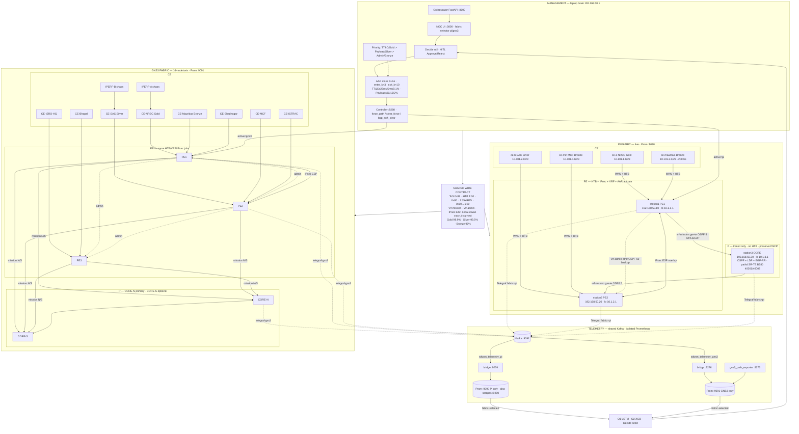
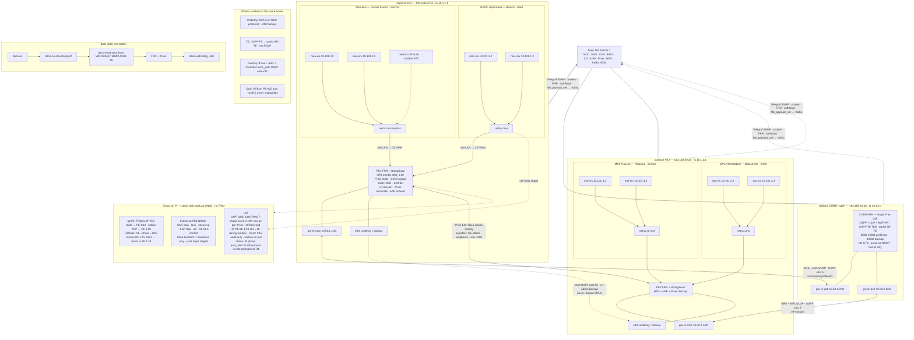
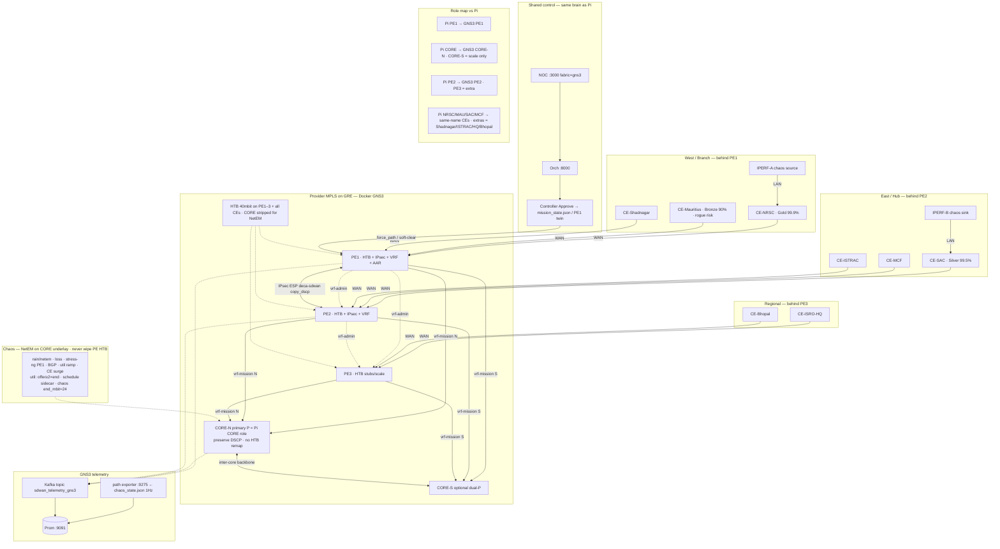
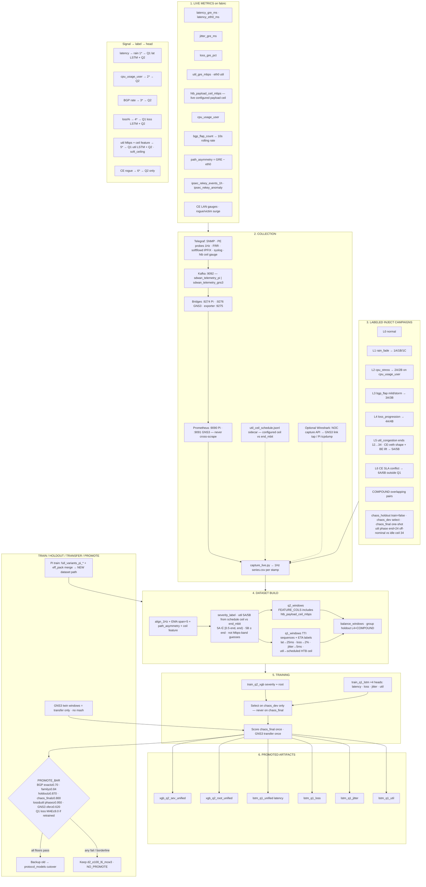
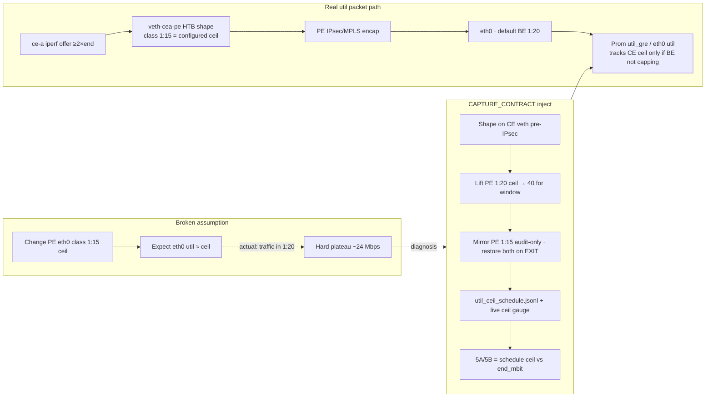
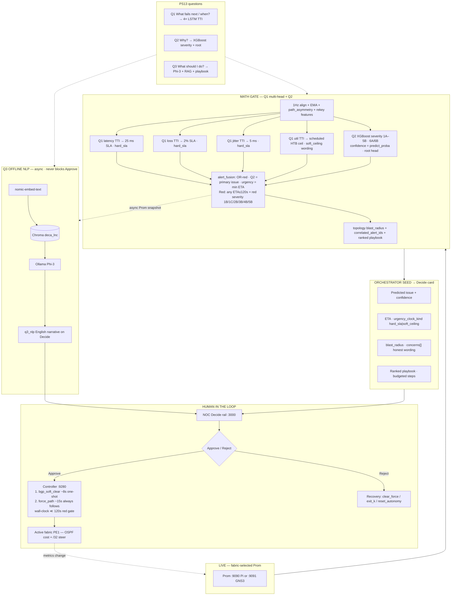
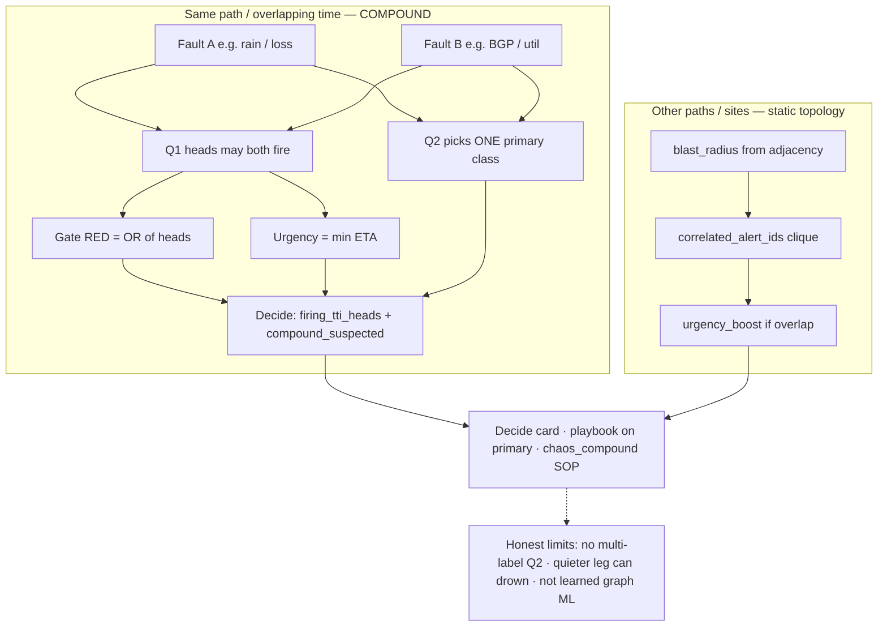
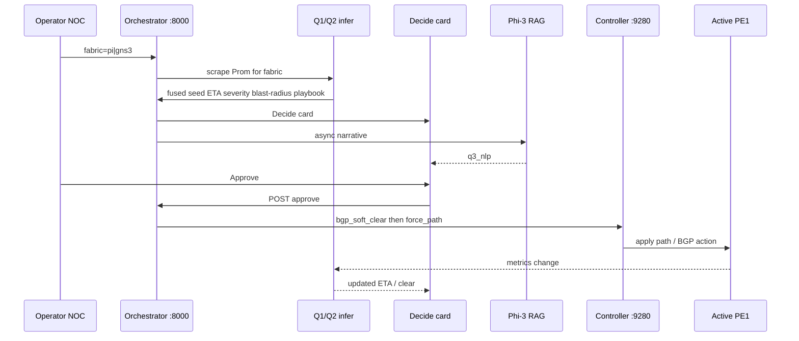

# DECA — Mermaid Maps

Five maps (+ util capture subsection 4.1). Paste into [mermaid.live](https://mermaid.live) if a viewer truncates a large graph.

Sources: [`STATION_NETWORK_SETUP.md`](./STATION_NETWORK_SETUP.md) · [`lab/gns3/TOPOLOGY.md`](../lab/gns3/TOPOLOGY.md) · [`EDGE_POLICY_LAYERS.md`](./EDGE_POLICY_LAYERS.md) · [`DECA_SDWAN_PROCESS_FLOW.md`](./DECA_SDWAN_PROCESS_FLOW.md) · [`scripts/inject_util_congestion.sh`](../scripts/inject_util_congestion.sh)

---

## 1. Complete network map

One NOC · one Decide · one controller · shared wire contract · two isolated fabrics · dual Prom · dual Kafka topics. Do not mash scrapes or unlabeled train data.

---

## 2. Pi network map

Three Raspberry Pis · four sites · namespaces · GRE/VRF/IPsec · HTB · planes · boot order — as-built single CORE (dual-core netns not applied).

---

## 3. GNS3 network map

Same Flow-1 roles as Pi; scale adds PE3, CORE-S, extra CEs, IPERF chaos. Dual-P exists here only.

---

## 4. Metrics → collection → dataset → training → model building

End-to-end: live gauges → Kafka/Prom → labeled campaigns → windows → Q1/Q2 train → chaos_final once → promote bar. Pi primary; GNS3 transfer only.

### 4.1 Util capture contract — why PE `1:15` alone failed

Encapped CE→PE flows miss PE ToS/dport filters and land in BE `1:20` (nominal ceil **24**). Changing PE `1:15` was a no-op for measured eth0 util. Fix order: CE pre-IPsec shape → offer≥2×end → lift BE ceil→40 during inject → schedule-sourced 5A/5B → live `htb_payload_ceil_mbps`. Do not retrain until util separates across L5 ends.

---

## 5. AI NOC Copilot map

Math gate never waits on LLM. Q1 = what/when · Q2 = why · Q3 = English narrative. Approve → soft-clear then force_path.

### 5.1 Multi-fault — same path (compound) + other paths/sites

First-class: COMPOUND train + live arbitration. Not a separate model; not multi-label Q2 (Phase-2).

Train: `full_variants` COMPOUND ×8 · eff_pack ×4 (`bgp+loss`, `rain+bgp`, `loss+util`, `bgp+util`) both fabrics. See [`MULTI_FAULT.md`](../data/deca/predictive/MULTI_FAULT.md).

