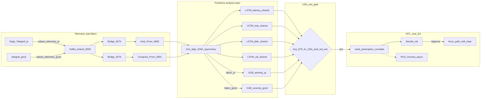

# DECA Predictive Engine Plan (Q1 / Q2 / Q3)

Authoritative architecture for the air-gapped AI NOC path.  
**Telemetry ingest is live** — dual Flow 2:

- **Pi:** Telegraf → Kafka `sdwan_telemetry_pi` → bridge `:9274` → host Prometheus **`:9090`**
- **GNS3:** telegraf-gns3 → Kafka `sdwan_telemetry_gns3` → bridge `:9276` → compose Prometheus **`:9091`**

**Q1 / Q2 math gate + Q3 RAG are live** (pilot/cutover weights; full-corpus retrain after stamp `20260729T202832Z`). Fabric selector picks Prom via `prom_url_for_fabric()`.

**Related:** [Process flow](./DECA_SDWAN_PROCESS_FLOW.md) · [Predictive README](../predictive/README.md) · [Telemetry pipeline](../lab/telemetry-pipeline/README.md) · [Dual-fabric telemetry](../deca-backend/runbooks/dual_fabric_telemetry.md) · [Unified dual-architecture ML](../deca-backend/runbooks/unified_dual_architecture_ml.md) · [PS13 perimeter](./PROBLEM_STATEMENT_13.md)

---

## 1. End-to-end data path

Prophet / generic graph-anomaly ML are **Suggested Tools only** — not in the live path. Topology **blast-radius correlation** is a static graph on seed (not a separate ML model).

---

## 2. Operator questions

| Q | Model | Output |
| --- | --- | --- |
| **Q1** What fails next / when? | Multi-head **LSTM** TTI (**shared** across fabrics) | ETA to latency / loss / jitter / util — **thresholds** from active fabric SLA |
| **Q2** Why? | **XGBoost** severity (**fabric-selected** head) | `0` / `1A–1C` / `2A–2B` / `3A–3B` / `4A–4B` / `5A–5B` + asymmetry |
| **Q3** What action (English)? | **Phi-3 + Chroma** RAG | `q3_nlp` on Decide — async; never blocks Approve |

Red HITL when any ETA ≤ **120 s** and severity in `{1B,1C,2B,3B,4B,5B}` (evaluate against **active** fabric SLA table).

### 2b. Unified dual-architecture ML (Pi + GNS3)

**Pitch:** Same LSTM blinking light; XGBoost severity / root-cause head adapts by fabric; telemetry stays split so training is not confused.

| Piece | Policy |
| --- | --- |
| Q1 LSTM | **One** weight set — train on **Pi** protocol stamp; GNS3 reuses it |
| SLA / red thresholds | **Aligned** (§1c): TT&C ≤25 ms · Gold 99.9% on Pi and GNS3 |
| Q2 XGBoost | **Two heads** preferred (`q2_pi` / `q2_gns3`) switched by Simulation source; optional single model + `fabric` feature later |
| Training data | **Do not** concat Pi + GNS3 series unlabeled; unify at **metric names** after L1–L5 NetEM+iperf textures match ([`shared_fault_book.json`](shared_fault_book.json)); TRex removed |
| Inference | `prom_url_for_fabric()` → shared feature align → Q1 → Q2(head) → Decide → Approve → active PE1 |

Canonical runbook: [`deca-backend/runbooks/unified_dual_architecture_ml.md`](../deca-backend/runbooks/unified_dual_architecture_ml.md).

---

## 3. Protocol capture (schema v2)

| Dataset | Pilot | Full (`--full`) |
| --- | --- | --- |
| L0 healthy | 180 s | 24 h |
| L1 rain fade | 2 × ~160 s | 10 × 2 h |
| L2 CPU | 2 × ~120 s | 10 × 1 h |
| L3 BGP | 2 × ~120 s | 10 × 1 h |
| L4 loss progression | 2 × ~160 s | 8 × ~12 min (0→3.5% netem) |
| L5 util congestion | 2 × ~160 s | 8 × ~12 min (HTB 1:15 ToS 0x80) |
| Chaos (never train) | 240 s | 12 h |

**Series extras:** `util_gre_mbps`, `ipsec_rekey_events_1h`, `ipsec_rekey_anomaly`, `path_asymmetry`.

**Active stamp:** `20260729T202832Z` · resume: `predictive/resume_active_protocol.sh` · boot units: `deca-protocol-campaign.service` + `deca-protocol-watchdog.service`.

---

## 6. Lab constants

| Constant | Value |
| --- | --- |
| Hard SLA (TT&C latency) | **25 ms** |
| Payload loss SLA | **2%** |
| TT&C jitter SLA | **5 ms** |
| Util near-ceil | **~38 Mbps** (HTB root 40 Mbit) |
| Preemption window | **120 s** |
| Pi Prom | Host **`:9090`** (`DECA_PROM_URL_PI`) |
| GNS3 Prom | Compose **`:9091`** (`DECA_PROM_URL_GNS3`) |
| Kafka topics | `sdwan_telemetry_pi` · `sdwan_telemetry_gns3` |
| Bridges | `:9274` (Pi) · `:9276` (GNS3) |

---

## 7. Status vs next handoff (2026-08-01)

| Piece | Status |
| --- | --- |
| Secondary telemetry pipeline | **Live** |
| Process-flow wiring diagram | **Live** ([`DECA_SDWAN_PROCESS_FLOW.md`](./DECA_SDWAN_PROCESS_FLOW.md)) |
| Protocol campaign schema v2 | **Capturing** `20260729T202832Z` (L0+L1 done · L2+) |
| Q1 multi-head LSTM (lat/loss/jitter/util) | **Live cutover** — `protocol_models/lstm_q1*` |
| Q2 XGBoost severity + asymmetry | **Live** — `protocol_models/xgb_q2_sev` |
| Live gate + Decide seed | **Live** — `infer_q1_q2_live` / `launch_infer_q1_q2_cutover.sh` |
| Topology correlation + ranked playbooks + budgeted soft-clear→force_path | **Live** |
| Rekey anomaly Prom signals | **Live** (threshold rules) |
| Chaos held-out eval | **Live** (pilot; full after stamp) |
| Q3 Phi-3 + Chroma on Decide | **Live** (async) |
| Prophet / graph-anomaly ML | **Not claimed** (Suggested Tools only) |
| Full-corpus retrain | **After** stamp completes (~2026-08-03) |

### Severity tiers (Q2)

| Code | Rule | HITL red? |
| --- | --- | --- |
| 0 | healthy | no |
| 1A / 1B / 1C | GRE 10–18 / 19–24 / ≥25 ms | 1B, 1C yes |
| 2A / 2B | CPU 40–70% / ≥70% | 2B yes |
| 3A / 3B | BGP flap mild / severe | 3B yes |
| 4A / 4B | loss 0.5–2% / ≥2% | 4B yes |
| 5A / 5B | util 20–35 / ≥35 Mbps | 5B yes |
