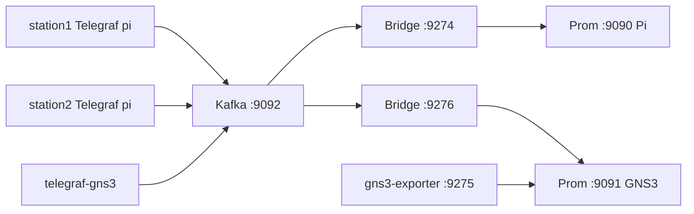
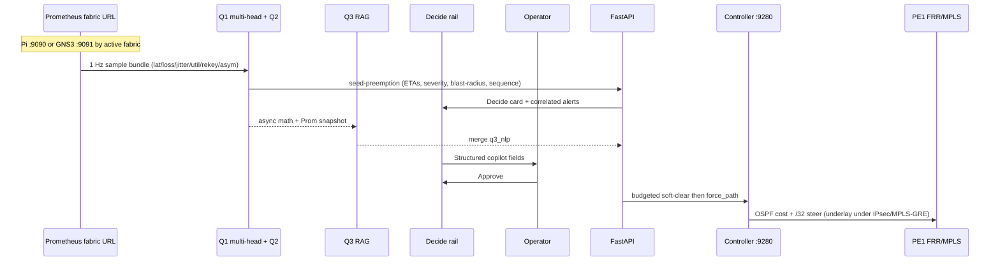
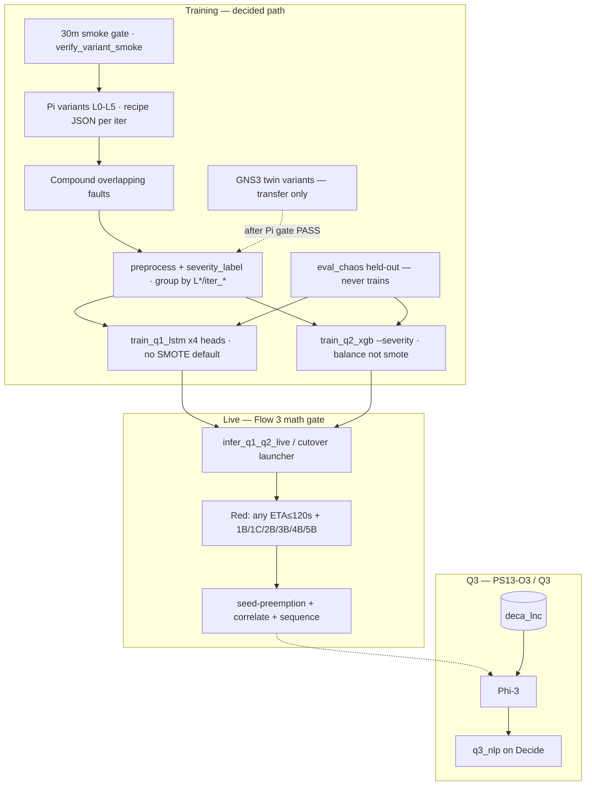
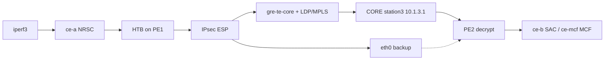

# DECA Aerospace SD-WAN — End-to-End Process Flow

How the **management**, **control**, **data**, and **AI NOC** planes work together in the DECA lab — aligned to [PS13](./PROBLEM_STATEMENT_13.md) with honest gap disclosure.

| Field | Value |
| --- | --- |
| **Doc date** | **2026-08-03** (variant+compound train path · PS13↔mermaid mapping) |
| **Train corpus (decided)** | Pi **primary** (L0–L5 **variant recipes** + compound) · GNS3 = **transfer twin** · never mash unlabeled Pi+GNS3 · chaos **held-out** |
| **Baseline stamp** | Schema-v2 **`20260729T202832Z`** (volume × single recipe — keep for history; **retrain on variants**) |
| **Live models today** | Cutover heads under `protocol_models/`: latency / **loss** / **jitter** / **util** LSTMs + Q2 severity · `predictive/launch_infer_q1_q2_cutover.sh` |
| **LLM stack** | **Ollama Phi-3** + **nomic-embed-text** + Chroma `deca_lnc` · Orchestrator API `:8000` (user systemd) |
| **MPLS (verified)** | **LDP OPERATIONAL** PE↔CORE; `show mpls table` has LDP + SR(OSPF) labels; `gre-te-core` UP |
| **SR-TE / pathd** | **`pathd` running**; preferred BSID via GRE; re-run `deca_te_verify.sh` before demos |
| **Dual P netns** | Scripts exist; **station3 remains single CORE** — dual netns **not** applied |
| **L2 CPU signature** | Gate/train on **`cpu_usage_user`** (stress-ng burns user time — not `cpu_usage_system`) |

Math gate does **not** wait on the LLM; Q3 is parallel English NLP on the Decide rail.

**Related:** [PS13 perimeter](./PROBLEM_STATEMENT_13.md) · [PS13 findings](./PROBLEM_STATEMENT_13_FINDINGS.md) · [**Model scores**](./PREDICTIVE_MODEL_SCORES.md) · [Policy](./EDGE_POLICY_LAYERS.md) · [Station network / MPLS](./STATION_NETWORK_SETUP.md) · [Orchestrator](../DECA_ORCHESTRATOR_README.md) · [Telemetry](../lab/telemetry-pipeline/README.md) · [Predictive plan](./DECA_PREDICTIVE_ENGINE_PLAN.md) · [Q3 KB](./DECA_Q3_KNOWLEDGE_BASE.md)

---

## 0. PS13 alignment scoreboard (lead with this)

### Strongest sell (lead in demos)

| PS13 ask | Lab answer |
| --- | --- |
| **Q1** — what fails next / time-to-impact | **Shared multi-head LSTM** (Pi-trained) · **aligned** fabric SLA thresholds (TT&C ≤25 ms both fabrics; see EDGE_POLICY_LAYERS) |
| **Q2** — why | **Fabric-selected XGBoost** severity head · asymmetry feats · do not mash Pi+GNS3 unlabeled ([unified ML](../deca-backend/runbooks/unified_dual_architecture_ml.md)) |
| **Q3** — what action (NLP) | **Phi-3 + RAG** over internal LNC → `q3_nlp` on Decide |
| Air-gap (`PS13-O3`) | Local Ollama · local Chroma · no cloud · **no temporary WAN on brain** |
| Predictive not reactive | **120 s red gate** (OR across latency/loss/jitter/util ETAs) |
| Correlation / sequencing | Topology **blast-radius + correlated alert IDs**; Approve runs **budgeted soft-clear → force_path** |
| **CE SLA conflict (mentor)** | Gold/Silver/Bronze CE tiers · rogue vs victim on Decide · surge **2–3→≥15 Mbps** (`ce_sla_conflict`) |
| Method rigor | Variant recipes (not clone iters) + compound + real loss/HTB util + **held-out chaos** |

### Structured copilot response (`PS13-O3.3`) — Decide payload

| Field | Source | Surfaced |
| --- | --- | --- |
| Predicted issue | Q2 class / severity + alert `class` | Decide title / Q2 line |
| **Confidence score** | XGBoost `predict_proba` blended with ETA urgency | Decide **Confidence** (3 dp) |
| Root-cause hypothesis | Q2 name + severity | Decide Q2 line |
| Affected scope | Topology blast-radius + **correlated alert IDs** | Decide Site / scope / AlertRail |
| **Rogue / victim CE** | Seed `rogue_ce` / `victim_ce` + SLA tiers | AlertRail CE SLA conflict line |
| Time-to-impact | Q1 latency ETA (+ optional loss/jitter/util ETAs) | Decide **ETA (Q1)** |
| Path asymmetry | `path_asymmetry_ms` / flag from GRE−eth0 | Contributing signals |
| Rekey anomaly | `ipsec_rekey_anomaly` / `ipsec_rekey_events_1h` | Prom + Decide signals |
| Recommended actions | Ranked playbooks + **budgeted sequence** | Decide list + Approve |
| English narrative | Q3 RAG | Decide **Q3 Copilot** block (async) |

### Gaps — closed vs remaining (2026-07-30)

Cross-check is against **literal PS13 objective text**, not narrative stretch goals.

#### Closed in lab (gap-closure campaign — do claim carefully with acceptance artifacts)

| ID | Ask | Lab status now |
| --- | --- | --- |
| `PS13-O2.3` | Packet-loss **progression** ML | **Real netem** loss inject + dedicated **loss-TTI LSTM** (`lstm_q1_loss`); synthetic loss retained as smoke only — not claimed GT |
| `PS13-O2.3` | IPsec **rekey anomaly** | Rules/ambient gauges only — **no rekey-storm inject** in variant campaign (out of forced live demo) |
| `PS13-O2.2` | Path **asymmetry** + BGP | Asymmetry live. BGP = **flap severity** via `bgp_flap_count` — **not** precursor-to-flap ML (see FINDINGS honesty) |
| `PS13-O4.1` | Graph-based event correlation | **Partial:** static topology blast-radius + `correlated_alert_ids` / urgency boost — **not** full graph-correlation engine (see FINDINGS) |
| `PS13-O4.3` | Playbook + **action sequencing** | **Partial:** ranked single-path playbook; Approve runs **budgeted `bgp_soft_clear` (≤8s) then `force_path` (≤15s)** — **not** multi-candidate engine |
| `PS13-O2.1` | Congestion / util ceiling | Util-TTI LSTM trained **through HTB 1:15** (ToS `0x80`); series `util_gre_mbps` |

#### Still honest limits (do not oversell)

| Item | Fact |
| --- | --- |
| Variant retrain | Baseline stamp done; **smoke → full variants** on Pi then GNS3; live weights stay cutover until group-holdout retrain lands |
| Dual-P CORE netns | Not applied (singular P role satisfies PS13 text) |
| Prophet / generic graph-anomaly ML | Suggested Tools only — **not** in live path |
| TE backup failover | Preferred GRE path solid; eth0 BSID failover can flake under lab stress — re-run `deca_te_verify.sh` before demos |

**Judge framing:** Obj-2/Obj-4 lab *slices* above are live; full-spec O4.1/O4.3 and O2.2 precursor language are **downgraded in FINDINGS**. Honest proof = variant+compound corpus + chaos holdout (not clone-iter stamp alone). Dual-P and Prophet stay off the critical path.

#### Multi-head arbitration (compound)

When several Q1 TTI heads + Q2 fire together: **OR-red gate** · **Q2 argmax = primary issue** · **min firing TTI = urgency clock** · expose `firing_tti_heads` (`predictive/alert_fusion.py`). Not a learned fusion model.

### MPLS judge answer (`PS13-O1.2`) — prepare this

**What is live today (verified):** FRR **LDP** neighbors OPERATIONAL (PE1↔CORE, PE2↔CORE), MPLS enabled on GRE, `show mpls table` populated with **LDP** and **SR (OSPF)** SID labels, GRE underlay UP, OSPF Full on `gre-te-*`. Overlay remains PE↔PE **IPsec**.

**What is live for TE:** `pathd` running on PE/CORE; preferred BSID via `gre-te-core`, backup candidate via `eth0`. Re-run `bash lab/deca_te_verify.sh` before demos (preferred path is the sell; eth0 failover can flake under lab stress). Not RSVP-TE.

**Dual P:** Design + bootstrap/apply scripts exist for CORE-NORTH/SOUTH netns; **station3 remains a single CORE** (`10.1.3.1`) with two GRE legs (`gre-te-pe1` / `gre-te-pe2`). Do not claim dual netns until `ip netns list` shows them **and** netns FRR LDP is real (not host vtysh false-green).

**One-liner if asked “show me label switching”:**  
“`vtysh -c 'show mpls ldp neighbor'` and `show mpls table` — LDP OPERATIONAL over GRE; SR-TE BSID 40001/40002 Active via pathd; overlay stays PE↔PE IPsec.”

Verify: `bash lab/deca_te_verify.sh` · `vtysh -c "show mpls ldp neighbor"` · `vtysh -c "show mpls table"` · `vtysh -c "show daemon"` · `vtysh -c "show sr-te policy"`.
---

## 1. Big picture — lab architecture (as of 2026-08-02)

Blueprint-comparable layout (Flow 1 / 2 / 3). **Node names are as-built bindings** — dual fabric (`pi` + `gns3`), no TRex, no Prophet/cloud LLM.

**GNS3 canvas (project DECA):** 16 nodes · HTB on **PE+CE only** (CORE stripped for NetEM) · captures via GNS3 API → Wireshark · storage on `/media/brain/Shaik's/gns3/`.

```mermaid
flowchart TD
    %% ==========================================
    %% DECA LAB — AS-BUILT dual fabric + Wireshark
    %% Air-gapped SD-WAN + AI Predictive Copilot
    %% ==========================================

    %% ==========================================
    %% FLOW 1A: PI LIVE FABRIC (physical)
    %% ==========================================
    subgraph Flow1Pi["Flow 1a: Pi live fabric — single CORE"]
        direction TB

        subgraph ChaosPi["Chaos — same fault book as GNS3"]
            TG_PI("iperf3 ToS: TT&C UDP 1M/0x88/:5004 · Payload UDP 50M/0x80/:5006 · Admin TCP 20M/:5201")
            FI_PI("Injects: rain/netem · loss · stress-ng · BGP soft-clear · util ramp · CE SLA conflict")
        end

        subgraph PiBranch["station1 branch"]
            CEA["ce-a NRSC Gold"]
            CEM["ce-mauritius Bronze ~200ms"]
            HTB_PI{"HTB 40mbit PE1+CE: 1:10 TT&C / 1:15 payload+RED / 1:20 BE"}
            IPSEC_PI(("IPsec ESP deca-sdwan copy_dscp=out"))
            CEA --> HTB_PI
            CEM --> HTB_PI
            HTB_PI --> IPSEC_PI
        end

        subgraph PiUnderlay["Provider — station1/2/3"]
            PE1_PI["PE1 10.1.1.1 gre-te-core"]
            PE2_PI["PE2 10.1.2.1 gre-te-core"]
            CORE_PI["CORE station3 10.1.3.1 — single P · no HTB"]
            SRTE_PI["pathd SR-TE BSID 40001/40002"]
            VRF_M_PI[("vrf-mission GRE+LDP")]
            VRF_A_PI[("vrf-admin eth0 backup")]
            PE1_PI --> VRF_M_PI & VRF_A_PI
            VRF_M_PI -->|"MPLS/LDP over GRE"| CORE_PI
            CORE_PI -->|"MPLS/LDP over GRE"| PE2_PI
            VRF_A_PI -.->|"eth0 underlay"| PE2_PI
            SRTE_PI -.-> PE1_PI & PE2_PI & CORE_PI
        end

        subgraph PiDC["station2 hub"]
            CEB["ce-b SAC Silver"]
            CEMCF["ce-mcf MCF Bronze"]
        end

        TG_PI --> CEA
        FI_PI -.->|"NetEM/CPU/BGP on PE1 · util via HTB"| PiUnderlay
        IPSEC_PI ===|"ESP PE1↔PE2"| PE1_PI
        PE2_PI === CEB & CEMCF
    end

    %% ==========================================
    %% FLOW 1B: GNS3 SIM FABRIC — ALL NODES + EDGES
    %% ==========================================
    subgraph Flow1Gns["Flow 1b: GNS3 DECA canvas — 16 nodes · twin policy"]
        direction TB

        subgraph ChaosGns["Chaos gens — no TRex"]
            IPA["IPERF-A"]
            IPB["IPERF-B"]
            FI_GNS("NetEM on CORE eth0/GRE · stress-ng PE1 · BGP soft-clear · util ramp · CE surge")
        end

        subgraph GnsWest["PE1 west CEs"]
            NRSC["CE-NRSC Gold"]
            MAU["CE-Mauritius Bronze"]
            SHAD["CE-Shadnagar"]
            HTB_G{"HTB 40mbit on PE1–3 + all CEs · CORE stripped"}
        end

        subgraph GnsCore["Dual-P underlay + PE triangle"]
            PE1["PE1"]
            PE2["PE2"]
            PE3["PE3"]
            COREN["CORE-N primary P · preserve DSCP"]
            CORES["CORE-S dual-P · preserve DSCP"]
            VRF_M[("vrf-mission PE↔CORE MPLS/LDP stand-in")]
            VRF_A[("vrf-admin PE↔PE eth0-style")]
            IPSEC_G(("IPsec ESP PE1↔PE2 copy_dscp=out"))
        end

        subgraph GnsEast["PE2 east CEs"]
            SAC["CE-SAC Silver"]
            MCF["CE-MCF Bronze"]
            ISTRAC["CE-ISTRAC"]
        end

        subgraph GnsSouth["PE3 regional CEs"]
            HQ["CE-ISRO-HQ"]
            BHO["CE-Bhopal"]
        end

        %% Chaos attach
        IPA -->|"LAN"| NRSC
        IPB -->|"LAN"| SAC

        %% CE attach
        NRSC --> PE1
        MAU --> PE1
        SHAD --> PE1
        SAC --> PE2
        MCF --> PE2
        ISTRAC --> PE2
        HQ --> PE3
        BHO --> PE3
        HTB_G -.-> PE1 & PE2 & PE3 & NRSC & MAU & SHAD & SAC & MCF & ISTRAC & HQ & BHO

        %% vrf-mission: PE ↔ dual CORE
        PE1 -->|"mission N"| COREN
        PE1 -->|"mission S"| CORES
        PE2 -->|"mission N"| COREN
        PE2 -->|"mission S"| CORES
        PE3 -->|"mission N"| COREN
        PE3 -->|"mission S"| CORES
        COREN <-->|"inter-core backbone"| CORES
        VRF_M -.-> PE1 & PE2 & PE3 & COREN & CORES

        %% vrf-admin PE triangle
        PE1 -.->|"admin"| PE2
        PE1 -.->|"admin"| PE3
        PE2 -.->|"admin"| PE3
        VRF_A -.-> PE1 & PE2 & PE3
        IPSEC_G === PE1 & PE2

        FI_GNS -.->|"brownouts on CORE underlay — never wipe PE HTB"| COREN
    end

    %% ==========================================
    %% FLOW 2: DUAL TELEMETRY + WIRESHARK
    %% ==========================================
    subgraph Flow2["Flow 2: Sub-second telemetry + packet capture"]
        direction TB

        subgraph RawPi["Pi raw sources"]
            SNMP["snmpd if-util"]
            BGP_LOG["Syslog BGP/OSPF :5514"]
            NETFLOW["softflowd IPFIX eth0+gre → :2055"]
            PROBE["PE probes 1Hz GRE/eth0 RTT"]
        end

        subgraph RawGns["GNS3 sources"]
            GNS_EXP["gns3_path_exporter :9275 ← chaos_state.json 1Hz"]
            GNS_TG["telegraf-gns3 optional FRR agents"]
        end

        subgraph Ingest["Shared Kafka on brain"]
            T_PI{"Edge Telegraf fabric=pi"}
            T_GNS{"telegraf-gns3 fabric=gns3"}
            KAFKA[("Kafka :9092")]
            BR_PI[("Pi bridge :9274")]
            BR_GNS[("GNS3 bridge :9276")]
        end

        subgraph Proms["Isolated Prometheus — do not cross-scrape"]
            PROM_PI[("Host Prom :9090 · Pi only · also scrapes controller :9280")]
            PROM_GNS[("Compose Prom :9091 · GNS3 only · scrapes :9275/:9276")]
        end

        subgraph Capture["Wireshark packet sniffer — off root disk"]
            CAP_API["NOC POST /api/v1/capture/open"]
            CAP_GNS["GNS3 API :3080 link start_capture"]
            CAP_PI["Pi SSH tcpdump -i gre|eth0|ce-*"]
            PCAP_G[("pcaps → …/gns3/projects/DECA/project-files/captures/")]
            PCAP_PI[("pcaps → …/gns3/captures/pi/")]
            WS["Wireshark: tail -F pcap | wireshark -k -i -"]
            TMPDIR_NOTE["TMPDIR=…/gns3/tmp — never /tmp/GNS3.* on 50GB root"]
        end

        CEA & PE1_PI & CORE_PI & CEB -.-> RawPi
        SNMP & BGP_LOG & NETFLOW & PROBE --> T_PI
        T_PI -->|"sdwan_telemetry_pi"| KAFKA
        T_GNS -->|"sdwan_telemetry_gns3"| KAFKA
        GNS_EXP --> PROM_GNS
        GNS_TG --> T_GNS
        KAFKA --> BR_PI & BR_GNS
        BR_PI --> PROM_PI
        BR_GNS --> PROM_GNS

        CAP_API -->|"fabric=gns3"| CAP_GNS
        CAP_API -->|"fabric=pi"| CAP_PI
        CAP_GNS --> PCAP_G
        CAP_PI --> PCAP_PI
        PCAP_G & PCAP_PI --> WS
        TMPDIR_NOTE -.-> WS
        PE1 & COREN & PE2 -.->|"link taps e.g. PE1↔CORE-N · CE-NRSC↔PE1"| CAP_GNS
    end

    %% ==========================================
    %% FLOW 3: AI NOC + FABRIC-AWARE CONTROL
    %% ==========================================
    subgraph Flow3["Flow 3: AI NOC Copilot and Control Plane"]
        direction TB

        subgraph ML_Layer["Math gate — shared Q1 · fabric-selected Q2"]
            PREP["1Hz align + EMA + path_asymmetry"]
            Q1L["LSTM latency → 25ms"]
            Q1Loss["LSTM loss → 2%"]
            Q1Jit["LSTM jitter → 5ms"]
            Q1Util["LSTM util → HTB ceil"]
            Q2["XGBoost severity 1A–5B + CE rogue/victim"]
            CORR["Topology blast-radius + correlated IDs"]
            GATE["Red gate: any ETA ≤ 120s + red severity"]
        end

        subgraph GenAI["Q3 offline NLP — never blocks gate"]
            LLM(("Ollama Phi-3"))
            VECTOR[("Chroma deca_lnc")]
            EMBED["nomic-embed-text"]
        end

        subgraph ControlPlane["Management plane"]
            API["FastAPI Orchestrator :8000"]
            NOC{"NOC Decide rail :3000 · fabric pi|gns3"}
            CTRL_PI["Pi controller :9280 force_path / soft-clear"]
            CTRL_GNS["GNS3 twin mission_state.json"]
            REKEY["ipsec_rekey_* · Pi Prom only"]
            CAP_BTN["Capture open/stop → Wireshark"]
        end

        PROM_PI & PROM_GNS -->|"fabric-selected series"| PREP
        PREP --> Q1L & Q1Loss & Q1Jit & Q1Util & Q2
        Q1L & Q1Loss & Q1Jit & Q1Util & Q2 --> GATE
        GATE --> CORR
        CORR -->|"seed: issue · confidence · ETAs · scope · sequence"| API
        REKEY -.-> API
        API --> NOC
        GATE -.->|"async Prom snapshot"| LLM
        EMBED --> VECTOR
        LLM <-->|"RAG LNC runbooks"| VECTOR
        LLM -.->|"q3_nlp on Decide card"| API
        NOC -->|"Approve: soft-clear budget then force_path"| CTRL_PI
        NOC -->|"Approve fabric=gns3"| CTRL_GNS
        CTRL_PI -->|"OSPF cost /32 steer PE1"| PE1_PI
        CTRL_GNS -->|"mission RTT / path overlay"| PE1
        NOC --> CAP_BTN
        CAP_BTN --> CAP_API
    end

    %% ==========================================
    %% STYLING
    %% ==========================================
    classDef traffic fill:#ffecb3,stroke:#f57f17,stroke-width:2px,color:#000
    classDef edgeRouter fill:#bbdefb,stroke:#0d47a1,stroke-width:2px,color:#000
    classDef coreRouter fill:#c8e6c9,stroke:#1b5e20,stroke-width:2px,color:#000
    classDef vrf fill:#e8f5e9,stroke:#2e7d32,stroke-width:2px,stroke-dasharray: 5 5,color:#000
    classDef rawData fill:#f3e5f5,stroke:#4a148c,stroke-width:1px,color:#000
    classDef db fill:#e1bee7,stroke:#6a1b9a,stroke-width:2px,color:#000
    classDef aiModel fill:#ffe0b2,stroke:#e65100,stroke-width:2px,color:#000
    classDef copilot fill:#ffccbc,stroke:#bf360c,stroke-width:3px,color:#000
    classDef management fill:#cfd8dc,stroke:#263238,stroke-width:3px,color:#000
    classDef capture fill:#b2ebf2,stroke:#006064,stroke-width:2px,color:#000

    class TG_PI,FI_PI,IPA,IPB,FI_GNS traffic
    class CEA,CEM,CEB,CEMCF,HTB_PI,IPSEC_PI,NRSC,MAU,SHAD,SAC,MCF,ISTRAC,HQ,BHO,HTB_G,IPSEC_G edgeRouter
    class PE1_PI,PE2_PI,CORE_PI,SRTE_PI,PE1,PE2,PE3,COREN,CORES coreRouter
    class VRF_M_PI,VRF_A_PI,VRF_M,VRF_A vrf
    class SNMP,BGP_LOG,NETFLOW,PROBE,GNS_EXP,GNS_TG rawData
    class T_PI,T_GNS,KAFKA,BR_PI,BR_GNS,PROM_PI,PROM_GNS,VECTOR db
    class PREP,Q1L,Q1Loss,Q1Jit,Q1Util,Q2,CORR,GATE aiModel
    class LLM,EMBED copilot
    class API,NOC,CTRL_PI,CTRL_GNS,REKEY,CAP_BTN management
    class CAP_API,CAP_GNS,CAP_PI,PCAP_G,PCAP_PI,WS,TMPDIR_NOTE capture
```



**GNS3 edge inventory (from `build_deca_topology.py`):**

| Lane | Links |
| --- | --- |
| **vrf-mission** | PE1↔CORE-N · PE1↔CORE-S · PE2↔CORE-N · PE2↔CORE-S · PE3↔CORE-N · PE3↔CORE-S · CORE-N↔CORE-S |
| **vrf-admin** | PE1↔PE2 · PE1↔PE3 · PE2↔PE3 |
| **CE attach** | NRSC/Mauritius/Shadnagar→PE1 · SAC/MCF/ISTRAC→PE2 · HQ/Bhopal→PE3 |
| **Chaos** | IPERF-A→CE-NRSC · IPERF-B→CE-SAC |

**Side-by-side vs PS13 reference (what we deliberately do *not* draw):**

| Reference node | Lab reality |
| --- | --- |
| Cisco TRex | **Removed** — chaos = iperf3 + NetEM + stress-ng + BGP + util |
| Dual P on Pi | **Single CORE** `10.1.3.1` — dual-P is **GNS3-only** (CORE-N/S) |
| HTB on CORE | **Never** — PE+CE HTB only; NetEM sits on CORE underlay |
| Prophet / graph ML | **Not in live path** — LSTM + XGBoost + static topology corr |
| LLaMA 3 / Mistral | **Phi-3** via Ollama |
| One Prometheus | **Dual** `:9090` Pi / `:9091` GNS3 — never cross-scrape |
| Controller always `:9280` | **Pi only** — GNS3 Approve writes `mission_state.json` |
| Controller → CE | Steers **PE1** underlay (`force_path`), not CE |

**Lab notes:** Overlay ESP is PE↔PE; underlay is MPLS/LDP on GRE (preferred) or eth0 (backup). Math gate never waits on Phi-3. Util must traverse HTB **1:15** (ToS `0x80`). Wireshark temps must use `TMPDIR=…/gns3/tmp` — `/tmp/GNS3.*` fills the 50 GB root. Stop link captures when done.

| Plane | Status (2026-08-02) | Notes |
| --- | --- | --- |
| Management / telemetry / control / data | **Live** | Dual Prom · dual Kafka topics/bridges · `:9275` exporter · Wireshark via NOC |
| Q1/Q2 live gate | **Live (cutover heads)** | Shared LSTM · fabric-selected Q2 · aligned SLAs both fabrics |
| Variant train path | **In progress** | Smoke → full variants + compound · Pi primary · GNS3 twin |
| Graph corr + sequencing + rekey | **Live** | `topology.py` · budgeted Approve · `ipsec_rekey_*` |
| Q3 RAG + Orchestrator API | **Live** | Chroma `deca_lnc` · Phi-3 · `:8000` |
| Dual-fabric NOC | **Live** | Fabric selector · GNS3 16-node twin · capture drawer |
| SR-TE pathd (Pi) | **Live** | Preferred GRE BSID; verify before demo |
| Dual-P netns (Pi) | **Absent** | GNS3 has CORE-N/S instead |
| Prophet / TRex | **Not claimed** | Out of scope |

---

## 2. Management plane — Telemetry → Dashboard → Controller

### 2.1 Telemetry pipeline (dual fabric)



| Fabric | Kafka topic | Bridge | Prometheus | ML env |
| --- | --- | --- | --- | --- |
| **Pi** | `sdwan_telemetry_pi` | `:9274` | host **`:9090`** | `DECA_PROM_URL_PI` |
| **GNS3** | `sdwan_telemetry_gns3` | `:9276` | compose **`:9091`** | `DECA_PROM_URL_GNS3` |

Controller `:9280` is scraped **only** by `:9090`. PE probes ~1 Hz on GRE/eth0 (Pi); GNS3 uses exporter + Kafka probe stand-in until FRR L3 agents are live. Verify: `bash lab/telemetry-pipeline/verify_dual_prom.sh`.

### 2.2 HITL sequence



| Component | Location |
| --- | --- |
| Dashboard | `:3000` |
| API | `:8000` · [`q3_lnc.py`](../deca-backend/q3_lnc.py) · [`topology.py`](../deca-backend/topology.py) · [`playbooks.py`](../deca-backend/playbooks.py) |
| Controller | `:9280` (`bgp_soft_clear` remediation + `force_path`) |
| Predictive | `predictive/` + `.venv-predictive` · cutover launcher |
| Watchdog | `predictive/watch_protocol_capture.sh` (Pi outage pause/resume) |
| LLM | Ollama **phi3** · embeddings **nomic-embed-text** |

### 2.3 AI NOC — Q1 / Q2 / Q3



#### PS13 questions → models (same as Flow 3)

| PS13 | Model | Signal / GT |
| --- | --- | --- |
| **Q1** what / when | 4× LSTM TTI | lat →25 ms · loss →2% · jitter →5 ms · util → HTB ceil |
| **Q2** why | XGBoost `1A–5B` | rain / **cpu_usage_user** / BGP Δ / loss% / util Mbps + asymmetry |
| **Q3** what action | Phi-3 + RAG | async `q3_nlp` — never blocks Approve |
| **P6.1–P6.3** | Inject book | L5 util · L3 BGP · L1 rain + L4 loss |
| **P6.4** | CE SLA conflict | rogue/victim on Decide (separate from L0–L5 protocol) |

#### Protocol volumes (schema v2 + variants)

| Dataset | Role | Notes |
| --- | --- | --- |
| Baseline `20260729T202832Z` | Historical volume | Single inject recipe per label — **do not treat iters as diversity** |
| Pi smoke `smoke_variants_pi_*` | Gate | Must PASS `verify_variant_smoke.py` (L2 = **user** CPU) |
| Pi / GNS3 full variants | Primary train | Param sweeps in `variant_recipes.py` + compound |
| Chaos holdout | Eval only | Never in `train_q2` / LSTM fit |

**Series columns (v2):** prior Q1/Q2 metrics **plus** `util_gre_mbps`, `ipsec_rekey_events_1h`, `ipsec_rekey_anomaly`, `path_asymmetry` (asymmetry also derived gre−eth0 in preprocess).

**L2 note:** severity `2A/2B` thresholds use **`cpu_usage_user`**; smoke/full gates must not use `cpu_usage_system` alone.

**Outage pause:** if stations lose power while brain stays up, watchdog **SIGSTOP**s capture/campaign until ping + Telegraf `:9273` + Prom Q1 recover; Pi boot writes `/run/deca/station-ready`. If the **desktop** loses power, user systemd units `deca-protocol-campaign.service` + `deca-protocol-watchdog.service` (Linger=yes) call [`resume_active_protocol.sh`](../predictive/resume_active_protocol.sh) after boot.

After variant corpus completes: `build_protocol_dataset` → group-holdout retrain → replace `protocol_models/`.  
**Current measured scores** (Pi stamp only): [`PREDICTIVE_MODEL_SCORES.md`](./PREDICTIVE_MODEL_SCORES.md) — cite **0.884 / 0.815 / 0.655 / 0.992 / 7.1s** · jitter **27.2**. chaos_final 0.815 = same model after eval/label fixes (not a retune). BGP specialist @0.85 fresh one-shot **0.886** (do not cite stale exact ~0.62 as the live claim). Do not cite 0.101 / 0.533 / 0.544 / ~1838s / jitter 131.7.

#### Severity tiers (Q2)

| Code | Rule | HITL red? |
| --- | --- | --- |
| 0 | healthy | no |
| 1A / 1B / 1C | GRE 10–18 / 19–24 / ≥25 ms | 1B, 1C **yes** |
| 2A / 2B | **cpu_usage_user** 40–70% / ≥70% | 2B **yes** |
| 3A / 3B | BGP flap rate mild / severe | 3B **yes** |
| 4A / 4B | loss 0.5–2% / ≥2% Payload SLA | 4B **yes** |
| 5A / 5B | CAPTURE_CONTRACT: schedule ceil ∈ `[0.5·end, end)` / ceil ≥ end (not raw Mbps alone) | 5B **yes** |

#### Q3 LNC (sufficient for demo)

Six pinpoint SOPs: `rain_fade` · `cpu_exhaustion` · `ttc_sla_preempt` · `chaos_compound` · `bgp_instability` · `prom_metric_glossary` (+ topology / tunnel / congestion / VRF / policy / incidents).

#### Playbooks + sequencing (`PS13-O4.3` partial — not multi-candidate engine)

Decide shows **ranked** SOP-sourced candidates. On Approve (e.g. 3B BGP):

1. **`bgp_soft_clear`** — remediation **one-shot** stabilize (hard budget ~8 s); **not** the multi-cycle flap inducer.
2. **`force_path`** — always follows (budget ~15 s) even if soft-clear fails; seed→force_path wall-clock must stay ≪ 120 s gate.

Recovery: `clear_force` / `exit_k` / `reset_autonomy`.
---

## 3. Control plane — Dynamic routing

| Path | Role | Actuation |
| --- | --- | --- |
| **`gre-te-core`** | Preferred (OSPF **5**) · MPLS/LDP | Cost 5; `/32` via GRE |
| **`eth0`** | Backup (OSPF **50**) | Raise GRE cost; `/32` via eth0 |

AAR: `enter_k=3` · `exit_k=10` · TT&C preempts Payload.

| Class | Latency | Jitter | Loss |
| --- | --- | --- | --- |
| TT&C | ≤ 25 ms | ≤ 5 ms | ≤ 0.1% |
| Payload | ≤ 80 ms | ≤ 15 ms | ≤ 2.0% |

Loss / jitter / util have **dedicated TTI heads** in addition to SLA thresholds (see Flow 3).

---

## 4. Synthetic traffic & chaos

| Tool | Role |
| --- | --- |
| iperf3 | ToS-tagged where filters apply (`0x88`→1:10 / `0x80`→1:15). **Util bulk** is CE→IPsec→eth0 and often lands in BE `1:20` — see util inject |
| `inject_rain_fade.sh` | Latency ramp (L1) |
| `inject_loss_progression.sh` | Real netem loss 0→3.5% (L4 / loss-TTI GT) |
| `inject_util_congestion.sh` | CE `veth` HTB shape + offer≥2×end + BE `1:20` lift during window (L5 / util-TTI GT) |
| `inject_cpu_stress.sh` | CPU (L2) — signature = **`cpu_usage_user`** |
| `inject_bgp_flap.sh` | Multi-cycle flap **inducer** (L3 train) — distinct from remediation soft-clear |
| Controller `bgp_soft_clear` | Approve remediation one-shot |

No Cisco TRex / DPDK.

---

## 5. Data plane — CE → PE → MPLS-on-GRE CORE → PE → CE



| Construct | Lab binding |
| --- | --- |
| VPN segmentation | `vrf-mission` ⟂ `vrf-admin` |
| MPLS forwarding | LDP + `mpls enable` on GRE (boot: `ensure_mpls_gre`) |
| TE | OSPF-TE + pathd SR-TE (BSID 40001/40002) — **not RSVP** |
| Overlay security | IPsec ESP `deca-sdwan` · `copy_dscp=out` |
| Provider core | **Single CORE** `10.1.3.1` · GRE legs `gre-te-pe1` / `gre-te-pe2` (dual-P netns not applied) |

---

## 6. Lab hosts

| Host | Role |
| --- | --- |
| station1 | PE1 · NRSC/Mauritius · HTB/IPsec/LDP · inject target · `/run/deca/station-ready` |
| station2 | PE2 · SAC/MCF |
| station3 | **Single CORE** P / BGP RR (`10.1.3.1`) — dual-P netns not applied |
| brain | Prom · Kafka · Orchestrator · controller · predictive · Ollama/Chroma · **campaign watchdog** |

---

## 7. Demo narrative (Q&A-safe)

1. Clear weather on GRE + MPLS/LDP; Prom shows dual-path latency + util + rekey gauges.
2. Inject rain / loss / util / CPU / BGP (or natural hot path).
3. **Math gate** fires Decide with **issue + confidence + ETA(s) + root cause + blast-radius + ranked playbook** — before SLA breach when any ETA ≤ 120 s.
4. Correlated alerts (e.g. PE1 + CORE) share scope on AlertRail.
5. **Q3** fills English NLP asynchronously (Approve never waits).
6. Approve → budgeted soft-clear (if BGP) then PE1 steer to eth0.
7. Recover → clear inject / `clear_force` / `reset_autonomy` → `exit_k` fail-back.

**If asked about Prophet / dual-P / cloud LLM:** “Not in live path. Live loop is multi-head LSTM + XGBoost + topology correlation + RAG, air-gapped HITL.”

**If asked about power outage:** “Brain stays on battery; campaign pauses until all three Pis + Telegraf + Prom Q1 are healthy, then resumes without burning capture budget.”

---

## 8. Explicit boundaries

| Item | Fact |
| --- | --- |
| Silent auto-remediate | No — Approve required |
| Cloud LLM / temporary WAN on brain | No — Phi-3 local; air-gap purity |
| RSVP-TE | No — OSPF-TE + SR-TE |
| Dual-P CORE netns | Not applied |
| Prophet / generic graph-anomaly ML | Not claimed |
| Soft-clear vs flap inducer | Remediates once on Approve; L3 train uses separate multi-cycle script |
| Clone-iter protocol | Baseline stamp OK for volume; **diversity requires variant recipes + compound** |
| Full variant corpus | Smoke gate → full Pi → full GNS3 twin → group-holdout retrain |

---

## 9. Commands

```bash
# Pi 10m fault-book coverage (L0–L5 + compound; L2 gates on cpu_usage_user)
bash predictive/run_pi_coverage_10m.sh
# cat data/deca/predictive/protocol/pi_coverage_10m_*/coverage_report.json

# Variant smoke → full (Pi then GNS3 after gate PASS)
bash predictive/run_variant_campaign.sh --fabric pi --mode smoke
python predictive/verify_variant_smoke.py --stamp-dir data/deca/predictive/protocol/smoke_variants_pi_*
# bash predictive/run_variant_campaign.sh --fabric pi --mode full

# MPLS / TE sanity
bash lab/deca_te_verify.sh
ssh station1 'sudo vtysh -c "show mpls ldp neighbor" -c "show mpls table"'

# Live gate (cutover: latency + loss + jitter + util + Q2)
bash predictive/launch_infer_q1_q2_cutover.sh --seconds 0

# Q3
export PATH="$HOME/.local/bin:$PATH"
export LD_LIBRARY_PATH="$HOME/.local/lib/ollama:${LD_LIBRARY_PATH:-}"
cd ~/deca-copilot && . .venv/bin/activate
python query_lnc.py "GRE rain fade 1B — Approve eth0 on PE1?"
curl -sf http://127.0.0.1:11434/api/generate -d '{"model":"phi3","keep_alive":0,"prompt":""}' >/dev/null

# Lab heal after Pi power return
bash lab/deca_ops.sh heal
```
