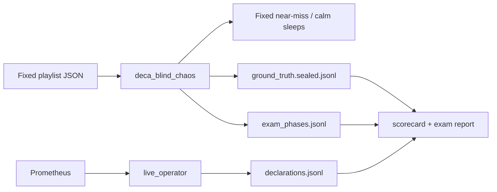

# DECA deterministic specificity exam

Design and runbook for the **fixed playlist** false-positive exam. Replaces jittered `--control` as the primary instrument for examining residual cry-wolf (near-miss confirms + tunnel/congestion/VRF spurious) after the BGP densify / evidence-gate fix.

**Live results:** [`results/SPECIFICITY_EXAM_V1.md`](results/SPECIFICITY_EXAM_V1.md)  
**Playlist v1 (diagnosed against):** [`scripts/playlists/specificity_exam_v1.json`](../scripts/playlists/specificity_exam_v1.json)  
**Playlist v2 (durability — different timings, never used to diagnose a fix):** [`scripts/playlists/specificity_exam_v2.json`](../scripts/playlists/specificity_exam_v2.json)  
**Blind harness overview:** [`DECA_BLIND_TEST.md`](DECA_BLIND_TEST.md)

---

## Goal

Stop using random control rests and random near-miss holds as the only FP lab. Ship a **human-authored timeline** that isolates failure modes phase-by-phase, then tighten confirmed-tier patience until that exam can pass.

**Pass bar** (live, ~40 min wall):

| Check | Require |
| --- | ---: |
| Near-miss FA (confirmed tier only; advisory may flicker) | **0 / N** |
| Spurious confirms in scored calm segments | **0** |
| BGP confirms with no stamped pulse | **0** (already gated) |

---

## Why not random `--control`

| Random control | Playlist exam |
| --- | --- |
| Jittered rests (`uniform` around slices) | Fixed calm minutes |
| Near-miss hold `uniform(25, 55)` s | Fixed `hold_s` per bait |
| Failures smear across the hour | Failures pin to named phases (`calm_a`, `nm03`, …) |
| Hard to re-test the same paper | Re-run the **same** playlist after a loom tweak |

Random `--control` remains useful as a smoke check; the playlist is the trust gate.

---

## Architecture



| Piece | Path | Role |
| --- | --- | --- |
| Playlist | `scripts/playlists/specificity_exam_v1.json` | Human-authored phases |
| Adversary | `scripts/deca_blind_chaos.py --playlist` | Walk phases; stamp `exam_phases.jsonl`; seal near-misses |
| Near-miss injector | `scripts/deca_fault_campaign.py` `inject_near_miss_aborted(..., hold_s=)` | Fixed hold when playlist supplies it |
| Operator | `scripts/deca_live_operator.py` | Prom + BGP densify/evidence gate; never reads seal |
| Judge | `scripts/deca_blind_scorecard.py` | Near-miss FA vs spurious |
| Pass bar | `scripts/deca_blind_exam_report.py` | Per-phase grade; exit non-zero on fail |
| Orchestrator | `scripts/deca_blind_test.sh` | Operator + chaos + scorecard + exam report |

---

## Playlist v1 phases

No real faults — specificity only (`kind: calm | near_miss`).

| Phase | Action | Purpose |
| --- | --- | --- |
| `warm` | calm ~8 min | Feature warm-up (**not** scored for spurious) |
| `calm_a` | calm ~6 min | Residual station2 tunnel / congestion / VRF FPs |
| `nm01` | near-miss `hold_s=30` | Discrimination |
| `calm_b` | calm ~5 min | Recover / residual spurious |
| `nm02` | near-miss `hold_s=40` | Discrimination |
| `calm_c` | calm ~5 min | Residual FPs |
| `nm03` | near-miss `hold_s=35` | Discrimination |
| `calm_d` | calm ~4 min | Final calm |

CLI: `--playlist` is mutually exclusive with `--control` and with the random chaos schedule.

---

## How to run

```bash
cd ~/deca-isro && source .venv/bin/activate
check stations    # or: bash lab/deca_diagnostic.sh
curl -s localhost:9090/-/ready

scripts/deca_blind_test.sh specificity_exam_v1 "" 40 -- \
  --playlist scripts/playlists/specificity_exam_v1.json
```

Watch the NOC feed:

```bash
tail -f data/rpi-net/live/<run_id>/operator_feed.log
```

After the run:

```bash
python scripts/deca_blind_scorecard.py --run-id <run_id>
python scripts/deca_blind_exam_report.py --run-id <run_id>   # exit 1 if trust bar fails
```

(`deca_blind_test.sh` already runs both when `exam_phases.jsonl` is present.)

Archive under `data/rpi-net/blind-tests/<run_id>/` and update [`results/SPECIFICITY_EXAM_V1.md`](results/SPECIFICITY_EXAM_V1.md).

---

## Loom trust knobs (confirmed tier)

Target mechanisms that turned near-misses into confirms on `control_fp_check2` (4/4 FA) without reopening BGP NaN invention.

| Knob | Promoted value | Why |
| --- | --- | --- |
| `circumstance_prearm` | **false** | Pre-arm shortened confirmed entry when existence agreed with a short onset |
| `enter_k_by_class` for `tunnel_degradation`, `congestion_breach`, `bgp_route_flap` | soft cumulative **≥ 3** | Patience on the noisy triangle + BGP |
| BGP densify-zero + no-pulse evidence gate | on | Calm path with empty pulses must not invent flaps |

Sources of truth: `models/fault_classifier/decision_thresholds.json` + pickle `loom`, defaults in `scripts/deca_inference.py` `DEFAULT_LOOM`.

Offline chrono-tail Macro-F1 after these knobs: persistent **~0.928** (was ~0.933) — small lake hit; **live playlist exam** is the acceptance test for specificity.

**Do not** turn on `ttb_gate` / `branch_agreement` / `topology_gate` for this problem — already measured harmful on the lake.

---

## Scoring rules

- **Near-miss FA:** any confirmed non-healthy on the sealed host inside `[fault_start, breach_time + 3 min]` (same grace as the scorecard).
- **Calm spurious:** `confirmed_raise` inside a scored calm phase window, outside every near-miss window.
- **Warm:** `score_spurious: false` — ignored for the pass bar.
- Advisory raises alone do **not** fail the exam.

---

## Next loop (after exam v1 FAIL)

Ordered path — steps 1–3 done **2026-07-18**; do **not** re-run until promote is live:

1. **Loom / gate fixes** ✓  
   Soft `enter_k`: tunnel **4**, congestion/BGP/VRF **3**; `circumstance_prearm` **false**
2. **Targeted data campaign** ✓ — `spec_data_20260717_2352`  
   nm_pe1 **8** / nm_pe2 **4** / reals **3×4**; `precursor_aborted` → healthy in rebuild
3. **Retrain + promote** ✓  
   ```bash
   python scripts/rebuild_unified.py --all-rpi-runs
   python scripts/deca_school_exam_train.py --auto-promote --baseline-macro-f1 0.7157
   python scripts/deca_score_temporal.py --soft-streak
   ```
   Promoted wm Macro-F1 **0.722**; soft-streak chrono persistent **0.840**
4. **Re-run the same playlist** (`specificity_exam_v1`) — **PASS** 18 Jul (`specificity_exam_v1_20260718_0848`). Same morning ultimate: blind 3/4 + control **clean** — [`BLIND_TEST_AGGREGATE_20260718.md`](results/BLIND_TEST_AGGREGATE_20260718.md)
5. **Durability** — `specificity_exam_v2` (different timings / 4 near-misses; never used to diagnose a fix)
6. **VRF recall** — lean completed VRF reals via `deca_vrf_recall_campaign.py`, then re-check v1+v2 + short control (must not reopen cry-wolf)

Live exam scoreboard: [`results/SPECIFICITY_EXAM_V1.md`](results/SPECIFICITY_EXAM_V1.md).

---

## Out of scope (this instrument)

- Full adversarial blind playlist with real faults (third blind night stays separate).
- Severity recalibration.
- Enabling topology / branch gates.

---

## Related

| Doc / artifact | Role |
| --- | --- |
| [`DECA_BLIND_TEST.md`](DECA_BLIND_TEST.md) | Full blind harness runbook |
| [`results/SPECIFICITY_EXAM_V1.md`](results/SPECIFICITY_EXAM_V1.md) | Live attempt scoreboard |
| [`results/SPECIFICITY_DATA_CAMPAIGN_20260717.md`](results/SPECIFICITY_DATA_CAMPAIGN_20260717.md) | Post-FAIL data campaign (quotas + export) |
| [`results/BLIND_TEST_CONTROL_FP_CHECK2_20260717.md`](results/BLIND_TEST_CONTROL_FP_CHECK2_20260717.md) | Post–BGP-fix random control |
| [`results/BLIND_TEST_AGGREGATE_20260716.md`](results/BLIND_TEST_AGGREGATE_20260716.md) | Aggregate framing + chase order |
| [`DECA_TEMPORAL_LOOM.md`](DECA_TEMPORAL_LOOM.md) | Loom semantics |
| [`scripts/backup/`](../scripts/backup/) | Pre-specificity campaign script backups |
