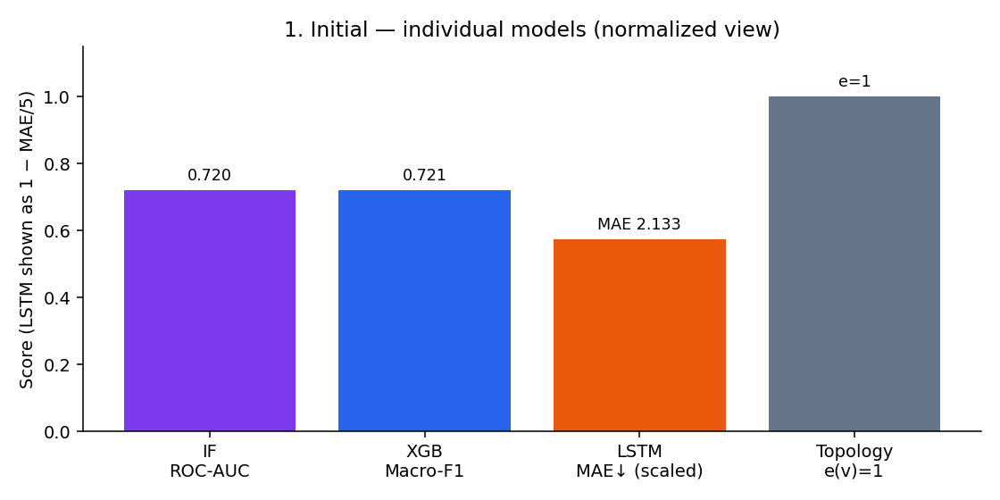
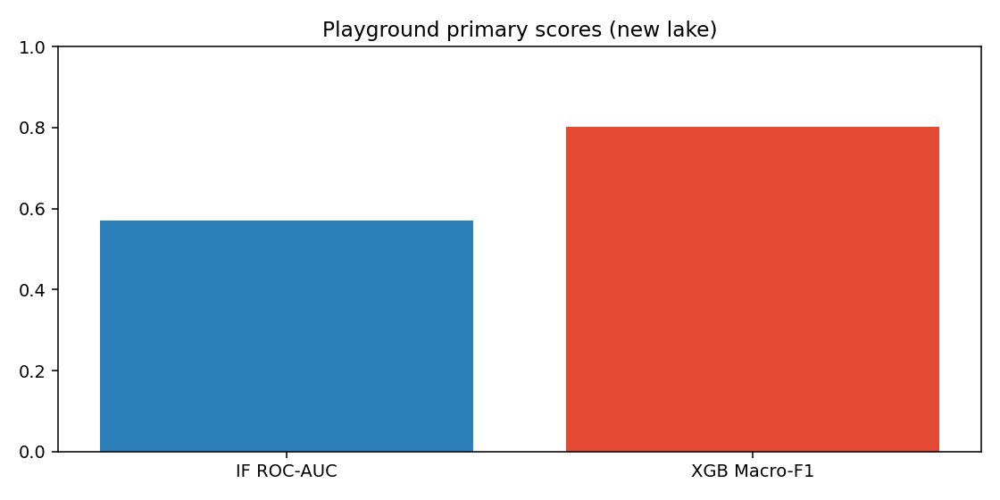
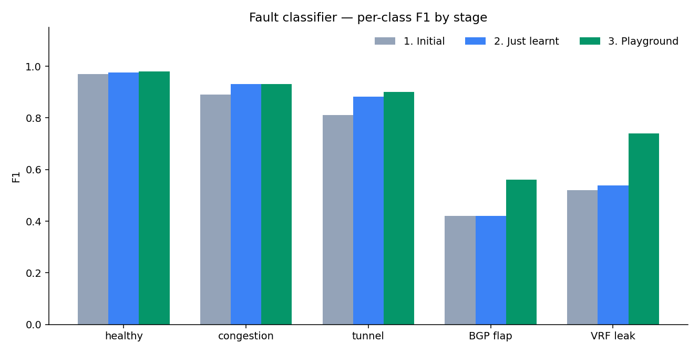
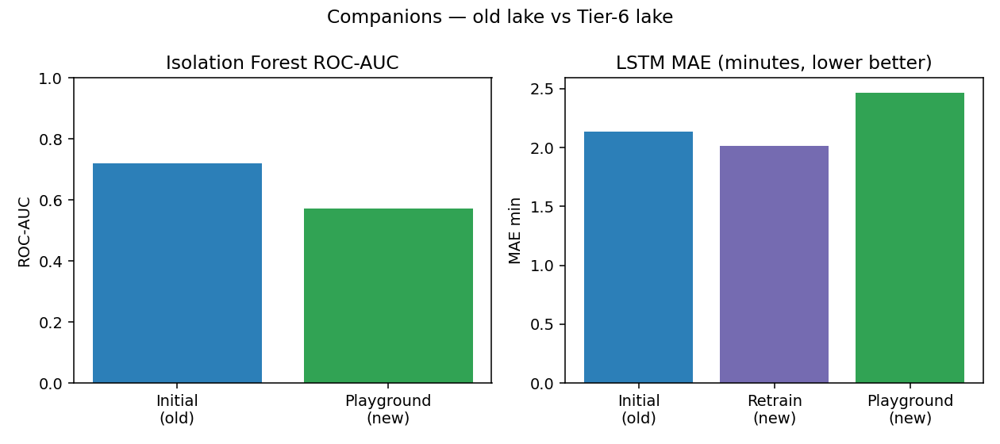
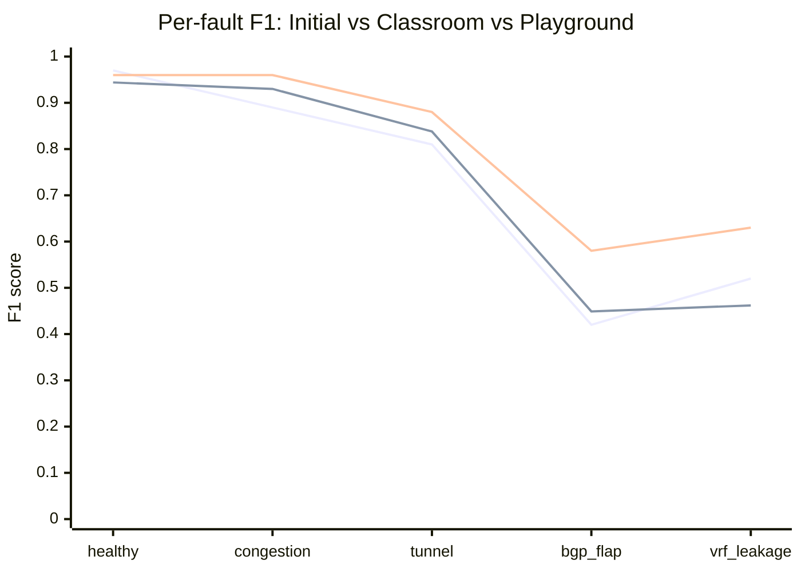

# DECA test scores

Score timeline for DECA after **Tier‑6**, **Temporal Loom**, and **circumstance circ_v2** (`20260715_191519_circ_v2`).

| Lake | Rows (features) | BGP | VRF | Campaigns |
| --- | ---: | ---: | ---: | --- |
| Before | 17,050 | 300 | 210 | `20260713_155333` |
| Tier‑6 | ~24k | 1,224 | 615 | + `20260714_165648_tier6_x10` (40 faults) |
| **Now (merged)** | **31,653** | **1,764** | **1,422** | + `20260715_191519_circ_v2` (20 circumstance events) |

Sources: `models/school_exam/latest_exam.json` · `models/temporal_persist_score.json` · `models/circumstance/metrics.json` · `docs/DECA_TEMPORAL_LOOM.md`

---

## Timeline at a glance

| Stage | Lake | What | Fault Macro‑F1 | BGP F1 | VRF F1 |
| --- | --- | --- | ---: | ---: | ---: |
| **1. Initial** | old 17k | Notebook Phase‑1 | **0.721** | 0.42 | 0.52 |
| **2. Classroom** | Tier‑6 | School Exam promote | **0.725** | 0.45 | 0.46 |
| **3. Playground** | Tier‑6 | Mixed blind paper | **0.802** | **0.58** | **0.63** |
| **4. Temporal Loom** | Tier‑6 | Sticky chrono tail | **0.880** | **0.86** | **0.87** |
| **5. circ_v2 merge** | merged 32k | School Exam re-baseline promote | **0.758** | 0.50 | 0.65 |
| **6. Sticky (merged)** | merged 32k | Chrono tail + loom | **0.908** | **0.77** | **0.90** |

**Loom (merged lake):** raw Macro 0.841 → sticky **0.908** (Δ **+0.066**).  
**Circumstance existence head:** Macro **0.719** · VRF F1 **0.830** · BGP F1 **0.484** — see below.

---

## circ_v2 + Temporal Loom — per fault (current live)

### Sticky chrono tail (`n=5874`, enter_k=3)

| Fault | Raw F1 | Sticky F1 | Δ |
| --- | ---: | ---: | ---: |
| healthy | 0.895 | **0.947** | +0.052 |
| congestion_breach | 0.943 | **0.967** | +0.024 |
| tunnel_degradation | 0.909 | **0.947** | +0.038 |
| bgp_route_flap | 0.616 | **0.774** | +0.158 |
| vrf_leakage | 0.844 | **0.903** | +0.059 |
| **Macro** | 0.841 | **0.908** | +0.066 |

### School Exam promote (random paper, raw)

| Fault | F1 |
| --- | ---: |
| healthy | 0.913 |
| congestion_breach | 0.879 |
| tunnel_degradation | 0.848 |
| bgp_route_flap | 0.502 |
| vrf_leakage | 0.645 |
| **Macro** | **0.758** (`plain` β=1.0) |

### Circumstance existence head

| Fault | F1 |
| --- | ---: |
| healthy | 0.950 |
| congestion_breach | 0.676 |
| tunnel_degradation | 0.653 |
| bgp_route_flap | 0.484 |
| vrf_leakage | **0.830** |
| **Macro** | **0.719** · Acc **0.913** |

Campaign quality (empirical): **~8.7 / 10** — BGP existence still the soft spot. Full design notes: [`DECA_TEMPORAL_LOOM.md`](DECA_TEMPORAL_LOOM.md).

---

## 1. Initial scores (old lake — Phase‑1 notebook)

Holdout: notebook stratified **25%**. Snapshot from first Phase‑1 train on 17,050 rows.



### Every model

| Model | Primary metric | Score | Notes |
| --- | --- | ---: | --- |
| Isolation Forest + Platt | ROC‑AUC | **0.720** | Precursor / dashboard confidence |
| XGBoost Phase‑1 | Macro‑F1 | **0.721** | Acc **0.94** · no SMOTE |
| LSTM time‑to‑breach | MAE | **2.133 min** | 623 sequences · $T=16$ |
| Prophet ×3 | Fit | complete | 4,502 / 8,000 / 320 points |
| Topology | eccentricity | $e(v)=1$ ∀ | PE1–PE2–CORE |

### Fault classifier — per class (initial)

| Class | Precision | Recall | F1 | Support |
| --- | ---: | ---: | ---: | ---: |
| healthy | 0.99 | 0.95 | 0.97 | 3,951 |
| congestion_breach | 0.84 | 0.94 | 0.89 | 108 |
| tunnel_degradation | 0.75 | 0.88 | 0.81 | 77 |
| bgp_route_flap | 0.31 | 0.68 | 0.42 | 75 |
| vrf_leakage | 0.43 | 0.65 | 0.52 | 52 |

Mean BGP+VRF recall ≈ **0.665**.

---

## 2. Classroom — just learnt (School Exam on new lake)

After Mode B ingest of the Tier‑6 campaign. Classroom = teach → test → examine → score → promote.

**Promoted head:** `wm` (KMeans cluster layer + regularized XGB) · $\beta=1.0$ · $\tau_{\mathrm{gate}}=0.60$.  
**Exam seed (promote sitting):** `1784130077` · baseline floor re‑set to **0.71** (old manifest 0.7498 was lake‑stale).

### Same-paper unit test vs classroom candidate

| Who | Macro‑F1 | Mean rare recall | Notes |
| --- | ---: | ---: | --- |
| Old deployed model (pre‑promote) | **0.335** | **0.00** | Trained on old lake — **stale** on new faults |
| Classroom candidate (`wm`) | **0.725** | 0.452 | Gate **PASS** → promoted |

### Candidate per-class F1 (promote exam paper)

| Class | F1 |
| --- | ---: |
| healthy | 0.944 |
| congestion_breach | 0.930 |
| tunnel_degradation | 0.838 |
| bgp_route_flap | 0.449 |
| vrf_leakage | 0.462 |

### Classroom stability (5 fresh papers — honest numbers)

Technique: **repeated holdout validation** + **promotion gate** (demo name: School Exam).

| Metric | Old lake (honest) | New lake (best family) | Δ |
| --- | ---: | ---: | ---: |
| Macro‑F1 | 0.714 ± 0.012 | **0.732 ± 0.004** | **+0.018** |
| BGP F1 | 0.408 ± 0.024 | **0.481 ± 0.015** | **+0.073** |
| VRF F1 | 0.466 ± 0.029 | 0.466 ± 0.021 | ~0 |
| `wm` beat `plain` | 0/5 | **4/5** | cluster head earns it |
| Gate PASS | 0/5 (stale floor) | **5/5** | after re‑baseline |

Full table: `models/school_exam/seed_report.md`.

### Companions at classroom stage

Retrained with `deca_retrain_companions.py` (classifier untouched):

| Model | Score after retrain |
| --- | ---: |
| Isolation Forest ROC‑AUC | **0.582** |
| LSTM MAE | **2.014 min** (1,316 sequences) |
| Prophet ×3 | Fit (5,344 / 8,000 / 320) |
| Topology | $e(v)=1$ |

---

## 3. Playground scores (mixed general test — new lake)

Run: `python scripts/deca_model_playground.py --exam-seed 20260715 --prophet-refit`  
Lake **23,909** · exam **4,782** rows · live **promoted `wm`** classifier + retrained companions.



### Every model individually

| Model | Primary metric | Score | Extra |
| --- | --- | ---: | --- |
| Isolation Forest + Platt | ROC‑AUC | **0.571** | AP 0.191 |
| Fault classifier (`wm`, promoted) | Macro‑F1 | **0.802** | Acc **0.925** · rareR **0.613** |
| LSTM time‑to‑breach | MAE | **2.467 min** | n=1,938 sequences on paper |
| Prophet ifInOctets | MAE | 1.816×10⁹ | sMAPE 2.00 · honest refit |
| Prophet jitter_ms | MAE | 185.8 | sMAPE 1.86 · honest refit |
| Prophet bgp_update_rate | MAE | 8882 | sMAPE 0.44 · honest refit |
| Topology | eccentricity | $e=1$ | structure only |

### Fault classifier — per class (playground paper)

| Class | Precision | Recall | F1 | Support |
| --- | ---: | ---: | ---: | ---: |
| healthy | 0.96 | 0.95 | 0.96 | 3,992 |
| congestion_breach | 0.94 | 0.98 | 0.96 | 252 |
| tunnel_degradation | 0.83 | 0.95 | 0.88 | 170 |
| bgp_route_flap | **0.57** | 0.60 | **0.58** | 245 |
| vrf_leakage | **0.63** | 0.63 | **0.63** | 123 |

---

## Cross-stage comparison (fault classifier)



| Metric | 1. Initial (old) | 2. Classroom (new) | 3. Playground (new) |
| --- | ---: | ---: | ---: |
| Macro‑F1 | 0.721 | **0.725** | **0.802** |
| Accuracy | 0.94 | — | **0.925** |
| Mean rare recall | ~0.665 | 0.452 | **0.613** |
| BGP F1 | 0.42 | 0.45 | **0.58** |
| VRF F1 | 0.52 | 0.46 | **0.63** |
| Holdout | notebook 25% | exam seed 1784130077 | exam seed 20260715 |

Papers differ across stages — treat playground as the **live stacked scoreboard**, and the **5‑seed classroom ranges** as the honest “did Tier‑6 help?” answer (BGP **yes**, VRF **steady**).

Re-run:

```bash
python scripts/deca_mlops_orchestrator.py --mode B --rpi-run <id>   # ingest + classroom
python scripts/deca_retrain_companions.py                          # IF / LSTM / Prophet
python scripts/deca_school_exam_train.py --report-seeds 5          # classroom stability
python scripts/deca_model_playground.py --exam-seed 20260715 --prophet-refit
```

---

## Cross-stage comparison (companions)



| Model | 1. Initial (old) | Retrain (new) | 3. Playground (new) |
| --- | ---: | ---: | ---: |
| Isolation Forest ROC‑AUC | 0.720 | 0.582 | 0.571 |
| LSTM MAE (min, ↓ better) | 2.133 | **2.014** | 2.467 |
| Prophet | fit-only | refit | honest-refit MAE (§3) |
| Topology $e(v)$ | 1 | 1 | 1 |

IF AUC dropped because the lake is denser in faults (anomaly rate ↑, contamination capped at 0.08) — expected, not a regression of “XGB got worse.” LSTM retrain improved; playground MAE is on a different sequence holdout.

---

## Per-fault F1 improvement (line chart)

Fault classifier F1 for each class: **Initial (old) → Classroom (new) → Playground (new)**.



| Fault | 1. Initial | 2. Classroom | 3. Playground | Δ (Initial → Playground) |
| --- | ---: | ---: | ---: | ---: |
| healthy | 0.97 | 0.944 | 0.96 | −0.01 |
| congestion_breach | 0.89 | 0.930 | **0.96** | **+0.07** |
| tunnel_degradation | 0.81 | 0.838 | 0.88 | +0.07 |
| bgp_route_flap | 0.42 | 0.449 | **0.58** | **+0.16** |
| vrf_leakage | 0.52 | 0.462 | **0.63** | **+0.11** |

---

## Bottom line

1. **New data worked** — BGP F1 rose in both honest multi-seed classroom (**+0.07**) and playground (**+0.16** vs initial).
2. **Classroom promoted a real upgrade** — replaced a model that scored **0.335** on the new lake with a `wm` cluster head at **0.725** exam / **0.802** playground Macro‑F1.
3. **Cluster head now earns wins** — `wm` beat `plain` on **4/5** fresh papers (it never did on the old lake).

---

## Related

| Doc / artifact | Role |
| --- | --- |
| [`MODELS.md`](MODELS.md) | Model catalog |
| [`DECA_MLOps_Continuous_Learning_Pipeline.md`](DECA_MLOps_Continuous_Learning_Pipeline.md) | School Exam / repeated-holdout |
| [`DECA_ROI_TIERS.md`](DECA_ROI_TIERS.md) | Tier 5.5 / Tier 6 |
| `models/playground/scoreboard.md` | Latest playground |
| `models/school_exam/seed_report.md` | 5-seed classroom stability |
| Chart assets | `docs/assets/scores/*.png` |
