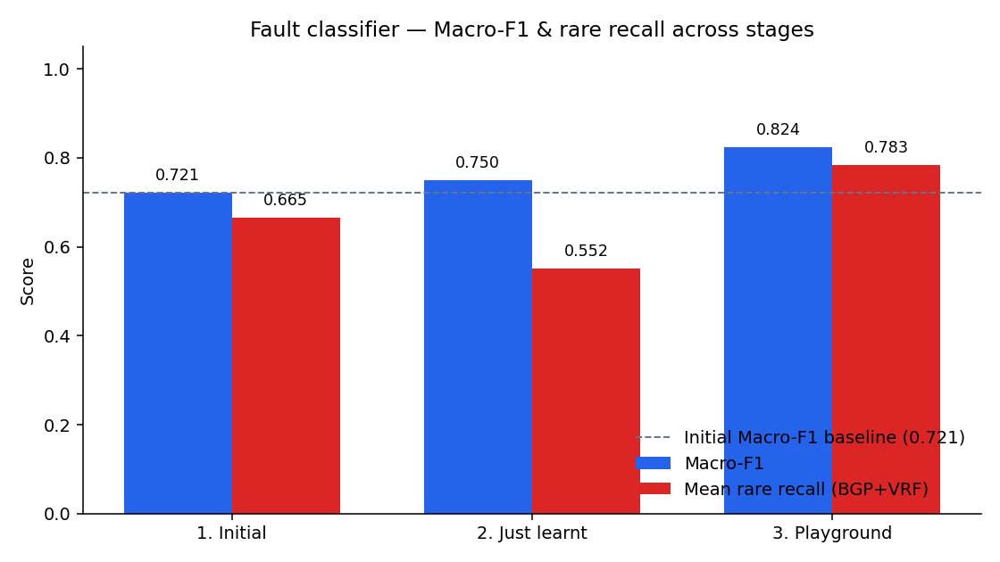

# DECA test scores

One place for the score timeline on the **17,050‑row** lake (`20260713_155333` features).  
Three sittings: **initial** notebook train → **School Exam** promote → **playground** mixed paper.

Sources: `models/scoreboard_*.csv` · `models/school_exam/orchestrator_latest.json` · `models/playground/scoreboard.md`

---

## Timeline at a glance

| Stage | When (UTC) | What was scored | Fault classifier Macro‑F1 |
| --- | --- | --- | ---: |
| **1. Initial** | notebook train (~06:37) | All models on notebook 25% holdout | **0.721** |
| **2. Just learnt** | School Exam cycle 1 (~09:40) | XGB candidate on fresh exam paper → **promoted** | **0.750** |
| **3. Playground** | mixed test (~09:45) | All live models on new stratified paper | **0.824** |



School Exam **retrains only** the Phase‑1 XGB stack (weights / thresholds). Isolation Forest, LSTM, Prophet, and topology were **not** re-fit in stages 2–3; playground re-scores the **current** artifacts (promoted XGB + original companions).

---

## 1. Initial scores (notebook / Phase‑1 train)

Holdout: notebook stratified **25%** test. Artifacts written under `models/`. Snapshot also in `models/scoreboard_summary.csv`.


### Every model

| Model | Primary metric | Score | Notes |
| --- | --- | ---: | --- |
| Isolation Forest + Platt | ROC‑AUC | **0.720** | Precursor / dashboard confidence |
| XGBoost Phase‑1 | Macro‑F1 | **0.721** | Acc **0.94** · `weighted_multiclass` · no SMOTE |
| LSTM time‑to‑breach | MAE | **2.133 min** | 623 sequences · $T=16$ |
| Prophet ×3 | Fit | complete | 4,502 / 8,000 / 320 points |
| Topology | eccentricity | $e(v)=1$ ∀ | PE1–PE2–CORE |

### Fault classifier — per class (initial)

| Class | Precision | Recall | F1 | Support |
| --- | ---: | ---: | ---: | ---: |
| healthy | 0.99 | 0.95 | 0.97 | 3,951 |
| congestion_breach | 0.84 | 0.94 | 0.89 | 108 |
| tunnel_degradation | 0.75 | 0.88 | 0.81 | 77 |
| bgp_route_flap | 0.31 | 0.68 | 0.42 | 75 |
| vrf_leakage | 0.43 | 0.65 | 0.52 | 52 |

Mean BGP+VRF recall (from table) ≈ **0.665**.

---

## 2. Just learnt (School Exam / orchestrator)

Run: `python scripts/deca_mlops_orchestrator.py` · Mode A · cycle **1/10** · exam seed `1784126256` · action **`promoted`**.

Baseline to beat (from pre-promote manifest): Macro‑F1 **0.721**.  
Best student: $\beta=1.5$, $\tau_{\mathrm{gate}}=0.60$.

### Unit test vs student (same new paper)

| Who | Macro‑F1 | Mean rare recall (BGP+VRF) | Weighted‑F1 |
| --- | ---: | ---: | ---: |
| Active model (before promote) | **0.806** | **0.858** | 0.964 |
| School Exam candidate (β=1.5) | **0.750** | **0.552** | 0.958 |

Gate: Macro‑F1 0.750 ≥ 0.721 **and** rare-recall ≥ floor → **PASS** → wrote `models/fault_classifier/`.

### Candidate per-class F1 (exam paper)

| Class | F1 |
| --- | ---: |
| healthy | 0.976 |
| congestion_breach | 0.931 |
| tunnel_degradation | 0.882 |
| bgp_route_flap | 0.421 |
| vrf_leakage | 0.539 |

### Other models at this stage

Not retrained. Still operating at **section 1** artifact metrics (IF 0.720 · LSTM 2.133 · Prophet fit · topology $e=1$).

---

## 3. Playground scores (mixed general test)

Run: `python scripts/deca_model_playground.py` · seed `1784108700` · holdout 20% random · **3,410** exam rows.  
Uses the **promoted** classifier + unchanged IF / LSTM / Prophet / topology.


### Every model individually

| Model | Primary metric | Score | Extra |
| --- | --- | ---: | --- |
| Isolation Forest + Platt | ROC‑AUC | **0.695** | AP 0.105 |
| Fault classifier (promoted XGB) | Macro‑F1 | **0.824** | Acc 0.966 · rareR **0.783** |
| LSTM time‑to‑breach | MAE | **2.317 min** | n=442 sequences on paper |
| Prophet ifInOctets | MAE | 1.733×10⁷ | sMAPE 1.66 · optimistic tail |
| Prophet jitter_ms | MAE | 609.1 | sMAPE 1.56 · optimistic tail |
| Prophet bgp_update_rate | MAE | 6757 | sMAPE 0.31 · optimistic tail |
| Topology | eccentricity | $e=1$ | structure only |

### Fault classifier — per class (playground paper)

| Class | Precision | Recall | F1 | Support |
| --- | ---: | ---: | ---: | ---: |
| healthy | 0.99 | 0.97 | 0.98 | 3,161 |
| congestion_breach | 0.90 | 0.95 | 0.93 | 86 |
| tunnel_degradation | 0.84 | 0.97 | 0.90 | 61 |
| bgp_route_flap | 0.46 | 0.73 | 0.56 | 60 |
| vrf_leakage | 0.67 | 0.83 | 0.74 | 42 |

---

## Cross-stage comparison (fault classifier)


| Metric | 1. Initial | 2. Just learnt (exam) | 3. Playground |
| --- | ---: | ---: | ---: |
| Macro‑F1 | 0.721 | **0.750** | **0.824** |
| Accuracy | 0.94 | — | 0.966 |
| Mean rare recall | ~0.665 | 0.552 | **0.783** |
| BGP F1 | 0.42 | 0.42 | **0.56** |
| VRF F1 | 0.52 | 0.54 | **0.74** |
| Holdout style | notebook 25% | stratified 20% (seed 1784126256) | stratified 20% (seed 1784108700) |

Papers differ, so columns are **not** paired A/B tests — they are the recorded sittings. Re-run:

```bash
python scripts/deca_mlops_orchestrator.py          # learn + gate
python scripts/deca_model_playground.py            # mixed scoreboard
```

---

## Cross-stage comparison (companions)


| Model | 1. Initial | 3. Playground |
| --- | ---: | ---: |
| Isolation Forest ROC‑AUC | 0.720 | 0.695 |
| LSTM MAE (min) | 2.133 | 2.317 |
| Prophet | fit-only | series-tail MAE (see §3) |
| Topology $e(v)$ | 1 | 1 |

---

## Related

| Doc / artifact | Role |
| --- | --- |
| [`MODELS.md`](MODELS.md) | Model catalog |
| [`DECA_MLOps_Continuous_Learning_Pipeline.md`](DECA_MLOps_Continuous_Learning_Pipeline.md) | School Exam methodology |
| `models/playground/scoreboard.md` | Latest playground markdown |
| `models/school_exam/orchestrator_latest.json` | Latest promote decision |
| Chart assets | `docs/assets/scores/*.png` |
| Architecture diagrams | `obsidian/DECA_Model_Architectures.md` (Preview only) |

---

## Per-fault F1 improvement (line chart)

Fault classifier F1 for each individual fault class across **Initial → Just learnt → Playground**.

> **Cursor’s Markdown preview cannot draw this chart** (it strips SVG/HTML and often blocks local images).  
> Open the interactive chart in a browser instead:

**[Open line chart (HTML)](per_fault_f1_line.html)** · [PNG](per_fault_f1_line.png) · [SVG](per_fault_f1_line.svg)

Same files under `docs/assets/scores/` for GitHub:

[per_fault_f1_line.html](assets/scores/per_fault_f1_line.html)

| Fault | 1. Initial | 2. Just learnt | 3. Playground | Δ (Initial → Playground) |
| --- | ---: | ---: | ---: | ---: |
| healthy | 0.97 | 0.976 | 0.98 | +0.01 |
| congestion_breach | 0.89 | 0.931 | 0.93 | +0.04 |
| tunnel_degradation | 0.81 | 0.882 | 0.90 | +0.09 |
| bgp_route_flap | 0.42 | 0.421 | 0.56 | **+0.14** |
| vrf_leakage | 0.52 | 0.539 | 0.74 | **+0.22** |
