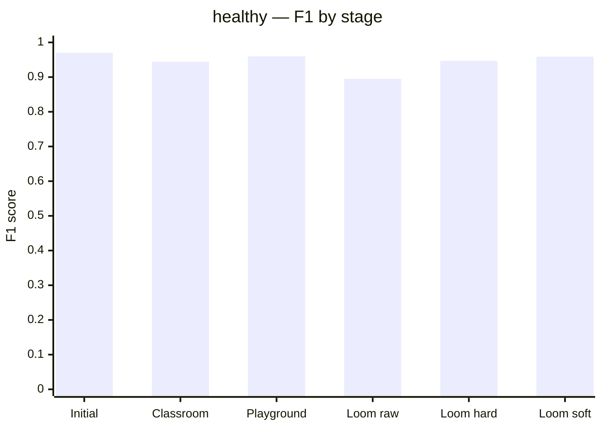
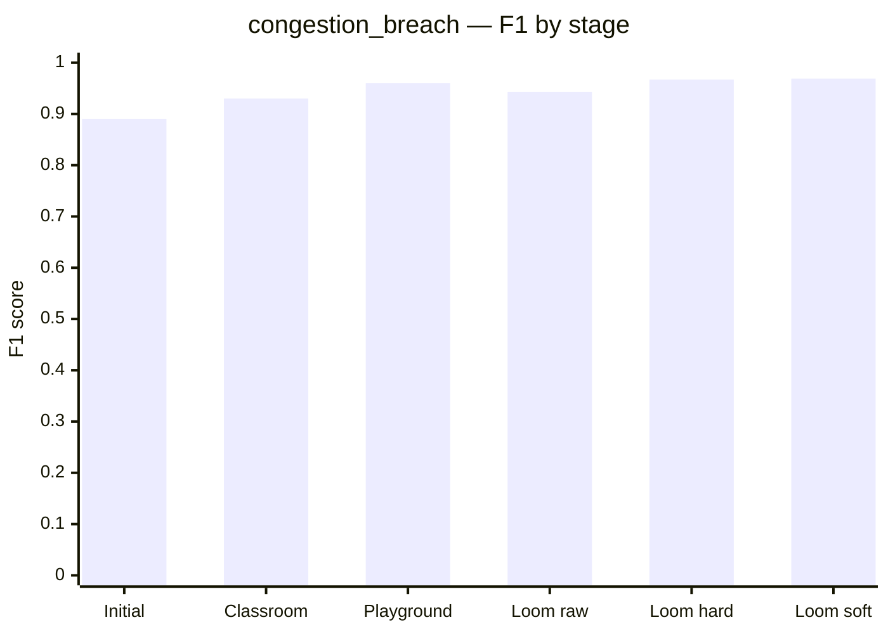
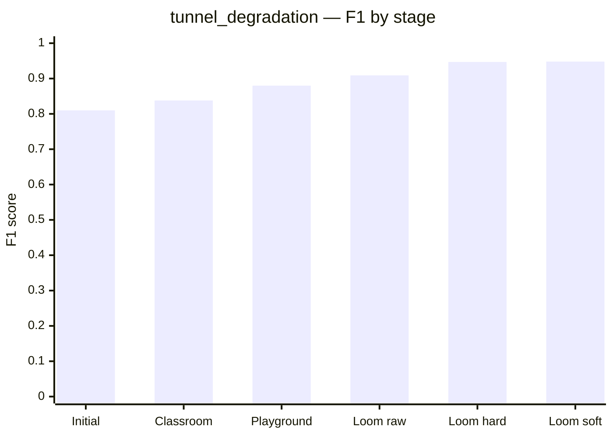
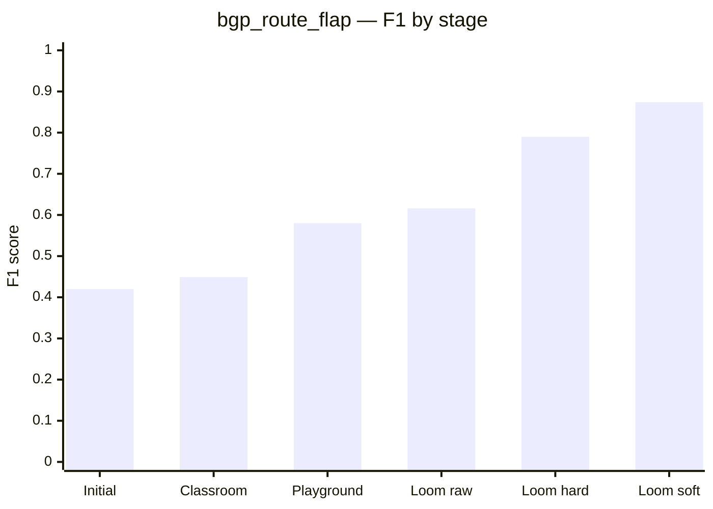
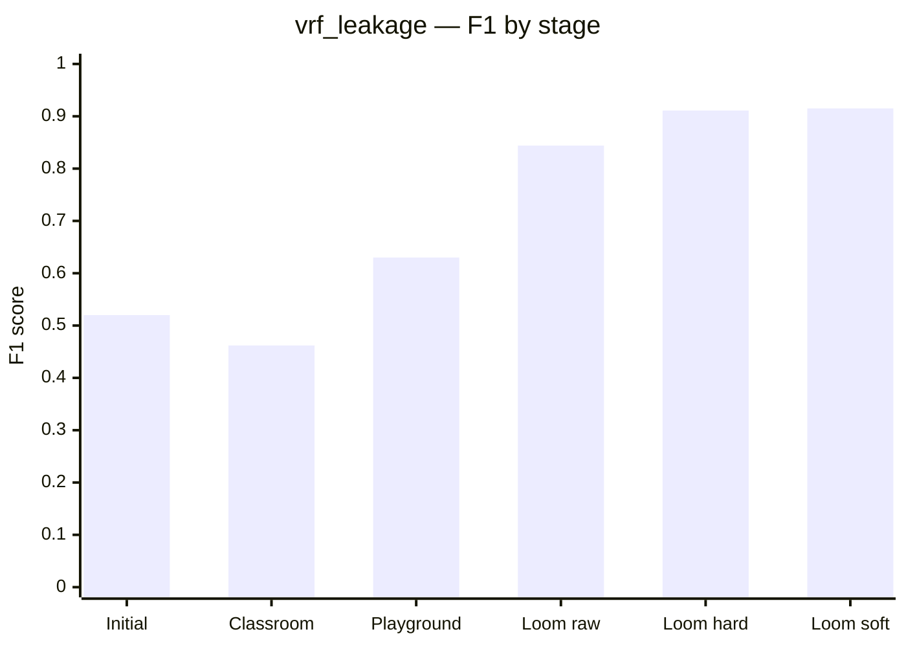

# DECA test scores

Score timeline for DECA after **Tier‑6**, **Temporal Loom**, and **circumstance circ_v2** (`20260715_191519_circ_v2`).

| Lake | Rows (features) | BGP | VRF | Campaigns |
| --- | ---: | ---: | ---: | --- |
| Before | 17,050 | 300 | 210 | `20260713_155333` |
| Tier‑6 | ~24k | 1,224 | 615 | + `20260714_165648_tier6_x10` (40 faults) |
| **Now (merged)** | **31,653** | **1,764** | **1,422** | + `20260715_191519_circ_v2` (20 circumstance events) |

Sources: `models/school_exam/latest_exam.json` · `models/temporal_persist_score.json` · `models/circumstance/metrics.json` · `docs/DECA_TEMPORAL_LOOM.md`

---

## Timeline at a glance

| Stage | Lake | What | Fault Macro‑F1 | BGP F1 | VRF F1 |
| --- | --- | --- | ---: | ---: | ---: |
| **1. Initial** | old 17k | Notebook Phase‑1 | **0.721** | 0.42 | 0.52 |
| **2. Classroom** | Tier‑6 | School Exam promote | **0.725** | 0.45 | 0.46 |
| **3. Playground** | Tier‑6 | Mixed blind paper | **0.802** | **0.58** | **0.63** |
| **4. Temporal Loom** | Tier‑6 | Sticky chrono tail | **0.880** | **0.86** | **0.87** |
| **5. circ_v2 merge** | merged 32k | School Exam re-baseline promote | **0.758** | 0.50 | 0.65 |
| **6. Sticky (merged, global loom)** | merged 32k | Chrono tail + loom | **0.908** | 0.77 | 0.90 |
| **7. Sticky (merged, per-class loom)** | merged 32k | Chrono tail + per-class exit_k | **0.912** | **0.79** | **0.91** |
| **8. Sticky (merged, soft streak)** | merged 32k | Chrono tail + soft confidence entry | **0.933** | **0.87** | **0.92** |

**Loom (merged lake, soft streak + per-class exit_k):** raw Macro 0.841 → sticky **0.933** (Δ **+0.092**).  
**Circumstance existence head:** Macro **0.719** · VRF F1 **0.830** · BGP F1 **0.484** — see below.

---

## circ_v2 + Temporal Loom — per fault (current live)

### Sticky chrono tail (`n=5874`) — per-class exit + soft confidence entry (live)

Per-class hysteresis (§4 of [`DECA_TEMPORAL_LOOM.md`](DECA_TEMPORAL_LOOM.md)): the naive "fast enter for flappy faults" hurt BGP (F1 dropped to 0.543 at hard `enter_k=1`); what actually won on exit was **more patience for BGP flap and VRF leakage** (`exit_k=3`). **Soft streak** (confidence-weighted entry, `enter_k=2` cumulative threshold) then lifted BGP again without hurting the rest.

| Fault | Raw F1 | Sticky (hard) | Sticky (per-class) | **Sticky (soft, live)** | Δ vs raw |
| --- | ---: | ---: | ---: | ---: | ---: |
| healthy | 0.895 | 0.947 | 0.946 | **0.959** | +0.064 |
| congestion_breach | 0.943 | 0.967 | 0.967 | **0.969** | +0.026 |
| tunnel_degradation | 0.909 | 0.947 | 0.947 | **0.948** | +0.039 |
| bgp_route_flap | 0.616 | 0.774 | 0.790 | **0.874** | **+0.258** |
| vrf_leakage | 0.844 | 0.903 | 0.911 | **0.915** | **+0.071** |
| **Macro** | 0.841 | 0.908 | 0.912 | **0.933** | **+0.092** |

Live config: `models/fault_classifier/decision_thresholds.json` → `soft_streak_enabled=true`, `enter_k=2` (confidence threshold), `exit_k_by_class = {"bgp_route_flap": 3, "vrf_leakage": 3}`.

### Two-tier loom — advisory vs confirmed (`n=5874`)

Same state machine run twice: **advisory** (`enter_k=2`, `exit_k=1` — "may be forming") alongside **confirmed** (the tuned loom above — "now declared"). See §4 of [`DECA_TEMPORAL_LOOM.md`](DECA_TEMPORAL_LOOM.md) for the full sweep.

| Mode | Macro‑F1 | BGP F1 | VRF F1 |
| --- | ---: | ---: | ---: |
| Raw frame | 0.841 | 0.616 | 0.844 |
| Advisory (`enter_k=2`) | 0.873 | 0.637 | 0.891 |
| **Confirmed (per-class + soft streak)** | **0.933** | **0.874** | **0.915** |

| Advisory lead-time metric (15 real fault events in tail) | Value |
| --- | ---: |
| Events advisory caught | 15 / 15 |
| Events confirmed caught | 15 / 15 |
| **Mean lead** (advisory correct before confirmed) | **3.8 frames** |
| Max lead | 15 frames |
| Advisory-only window (frames) | 93 |
| … correct early warning | 25 |
| … wrong-class | 0 |
| … pure noise | 68 |
| **Lead-window precision** | **0.269** |

Read honestly: advisory isn't a second model — it's the same classifier declared on a shorter fuse, so ~73% of its early-only frames are noise. The payoff is a genuinely richer dashboard story (early heads-up vs. trustworthy alarm), not a free accuracy win. Swept `enter_k=1` (no debounce): lead grows to 7.5 frames but precision drops to 0.149 — mostly noise, not adopted.

### "What" + "when" binding — LSTM TTB gate (tried, measured, shipped **off**)

Extra idea: only let the confirmed tier commit entry if the LSTM's time-to-breach trend is *also* falling over the same window as the classifier's streak. Swept — it's a net loss at this window size:

| `ttb_gate_tolerance` | Confirmed Macro‑F1 | Real events still caught |
| --- | ---: | ---: |
| Off (baseline) | **0.912** | 15 / 15 |
| 0 (strict) | 0.628 ↓↓ | 9 / 15 |
| 1 | 0.903 ↓ | 15 / 15 |
| ≥2 | 0.912 (no-op at `enter_k=3`) | 15 / 15 |

The LSTM's ~2‑minute MAE makes its frame-to-frame TTB output too noisy to be reliably monotonic over a 3-frame window — the gate blocks genuine buildups, not just noisy misclassifications. Kept in code (`--ttb-gate`, `--ttb-gate-tolerance`) for experimentation, default `ttb_gate_enabled=False`. Full sweep + reasoning: [`DECA_TEMPORAL_LOOM.md`](DECA_TEMPORAL_LOOM.md) §4.

### Soft streak — confidence-weighted entry (measured, shipped **on**)

Replace the hard consecutive-frame entry counter with a running sum of per-frame classifier confidence. Strong frames commit faster; weak wobbles need more evidence. Exit stays frame-based.

| Mode | Confirmed Macro‑F1 | BGP F1 | VRF F1 |
| --- | ---: | ---: | ---: |
| Hard streak (`enter_k=3` frames) | 0.912 | 0.790 | 0.911 |
| **Soft streak (`enter_k=2` conf)** | **0.933** | **0.874** | **0.915** |

The biggest win is BGP (0.790 → 0.874) — exactly where per-class hard hysteresis still left headroom. Live: `soft_streak_enabled=True`, `enter_k=2` (cumulative confidence threshold while soft is on). Full sweep: [`DECA_TEMPORAL_LOOM.md`](DECA_TEMPORAL_LOOM.md) §4.

### Multi-branch agreement — plain + wm (tried, shipped **off**)

Run promoted `plain` and challenger `wm` in parallel; entry requires the full streak to agree on both. Branches only agree on **41.5%** of raw fault frames — strict agreement devastates Macro‑F1:

| Mode | Confirmed Macro‑F1 | BGP F1 |
| --- | ---: | ---: |
| Soft streak alone | **0.933** | **0.874** |
| + branch agreement (`wm`) | 0.524 ↓↓ | 0.501 |

`branch_agreement_enabled=False` in live config. CLI: `--branch-agreement`.

### Topology correlation — neighbor echo (tried, shipped **off**)

Require ≥1 topology neighbor (PE1/CORE/PE2 graph) to echo the same fault at the same timestamp. Neighbor agree rate is **85%** on fault frames, but gating still costs Macro‑F1:

| `topology_min_neighbors` | Confirmed Macro‑F1 |
| --- | ---: |
| Off (soft baseline) | **0.933** |
| 1 | 0.927 ↓ |
| 2 | 0.929 ↓ |

`topology_gate_enabled=False` in live config. CLI: `--topology-gate`. Full reasoning: [`DECA_TEMPORAL_LOOM.md`](DECA_TEMPORAL_LOOM.md) §4.

### School Exam promote (random paper, raw)

| Fault | F1 |
| --- | ---: |
| healthy | 0.913 |
| congestion_breach | 0.879 |
| tunnel_degradation | 0.848 |
| bgp_route_flap | 0.502 |
| vrf_leakage | 0.645 |
| **Macro** | **0.758** (`plain` β=1.0) |

### Circumstance existence head

| Fault | F1 |
| --- | ---: |
| healthy | 0.950 |
| congestion_breach | 0.676 |
| tunnel_degradation | 0.653 |
| bgp_route_flap | 0.484 |
| vrf_leakage | **0.830** |
| **Macro** | **0.719** · Acc **0.913** |

Campaign quality (empirical): **~8.7 / 10** — BGP existence still the soft spot. Full design notes: [`DECA_TEMPORAL_LOOM.md`](DECA_TEMPORAL_LOOM.md).

---

## 1. Initial scores (old lake — Phase‑1 notebook)

Holdout: notebook stratified **25%**. Snapshot from first Phase‑1 train on 17,050 rows.

### Every model

| Model | Primary metric | Score | Notes |
| --- | --- | ---: | --- |
| Isolation Forest + Platt | ROC‑AUC | **0.720** | Precursor / dashboard confidence |
| XGBoost Phase‑1 | Macro‑F1 | **0.721** | Acc **0.94** · no SMOTE |
| LSTM time‑to‑breach | MAE | **2.133 min** | 623 sequences · $T=16$ |
| Prophet ×3 | Fit | complete | 4,502 / 8,000 / 320 points |
| Topology | eccentricity | $e(v)=1$ ∀ | PE1–PE2–CORE |

### Fault classifier — per class (initial)

| Class | Precision | Recall | F1 | Support |
| --- | ---: | ---: | ---: | ---: |
| healthy | 0.99 | 0.95 | 0.97 | 3,951 |
| congestion_breach | 0.84 | 0.94 | 0.89 | 108 |
| tunnel_degradation | 0.75 | 0.88 | 0.81 | 77 |
| bgp_route_flap | 0.31 | 0.68 | 0.42 | 75 |
| vrf_leakage | 0.43 | 0.65 | 0.52 | 52 |

Mean BGP+VRF recall ≈ **0.665**.

---

## 2. Classroom — just learnt (School Exam on new lake)

After Mode B ingest of the Tier‑6 campaign. Classroom = teach → test → examine → score → promote.

**Promoted head:** `wm` (KMeans cluster layer + regularized XGB) · $\beta=1.0$ · $\tau_{\mathrm{gate}}=0.60$.  
**Exam seed (promote sitting):** `1784130077` · baseline floor re‑set to **0.71** (old manifest 0.7498 was lake‑stale).

### Same-paper unit test vs classroom candidate

| Who | Macro‑F1 | Mean rare recall | Notes |
| --- | ---: | ---: | --- |
| Old deployed model (pre‑promote) | **0.335** | **0.00** | Trained on old lake — **stale** on new faults |
| Classroom candidate (`wm`) | **0.725** | 0.452 | Gate **PASS** → promoted |

### Candidate per-class F1 (promote exam paper)

| Class | F1 |
| --- | ---: |
| healthy | 0.944 |
| congestion_breach | 0.930 |
| tunnel_degradation | 0.838 |
| bgp_route_flap | 0.449 |
| vrf_leakage | 0.462 |

### Classroom stability (5 fresh papers — honest numbers)

Technique: **repeated holdout validation** + **promotion gate** (demo name: School Exam).

| Metric | Old lake (honest) | New lake (best family) | Δ |
| --- | ---: | ---: | ---: |
| Macro‑F1 | 0.714 ± 0.012 | **0.732 ± 0.004** | **+0.018** |
| BGP F1 | 0.408 ± 0.024 | **0.481 ± 0.015** | **+0.073** |
| VRF F1 | 0.466 ± 0.029 | 0.466 ± 0.021 | ~0 |
| `wm` beat `plain` | 0/5 | **4/5** | cluster head earns it |
| Gate PASS | 0/5 (stale floor) | **5/5** | after re‑baseline |

Full table: `models/school_exam/seed_report.md`.

### Companions at classroom stage

Retrained with `deca_retrain_companions.py` (classifier untouched):

| Model | Score after retrain |
| --- | ---: |
| Isolation Forest ROC‑AUC | **0.582** |
| LSTM MAE | **2.014 min** (1,316 sequences) |
| Prophet ×3 | Fit (5,344 / 8,000 / 320) |
| Topology | $e(v)=1$ |

---

## 3. Playground scores (mixed general test — new lake)

Run: `python scripts/deca_model_playground.py --exam-seed 20260715 --prophet-refit`  
Lake **23,909** · exam **4,782** rows · live **promoted `wm`** classifier + retrained companions.

### Every model individually

| Model | Primary metric | Score | Extra |
| --- | --- | ---: | --- |
| Isolation Forest + Platt | ROC‑AUC | **0.571** | AP 0.191 |
| Fault classifier (`wm`, promoted) | Macro‑F1 | **0.802** | Acc **0.925** · rareR **0.613** |
| LSTM time‑to‑breach | MAE | **2.467 min** | n=1,938 sequences on paper |
| Prophet ifInOctets | MAE | 1.816×10⁹ | sMAPE 2.00 · honest refit |
| Prophet jitter_ms | MAE | 185.8 | sMAPE 1.86 · honest refit |
| Prophet bgp_update_rate | MAE | 8882 | sMAPE 0.44 · honest refit |
| Topology | eccentricity | $e=1$ | structure only |

### Fault classifier — per class (playground paper)

| Class | Precision | Recall | F1 | Support |
| --- | ---: | ---: | ---: | ---: |
| healthy | 0.96 | 0.95 | 0.96 | 3,992 |
| congestion_breach | 0.94 | 0.98 | 0.96 | 252 |
| tunnel_degradation | 0.83 | 0.95 | 0.88 | 170 |
| bgp_route_flap | **0.57** | 0.60 | **0.58** | 245 |
| vrf_leakage | **0.63** | 0.63 | **0.63** | 123 |

---

## Cross-stage comparison (fault classifier)

| Metric | 1. Initial (old) | 2. Classroom (new) | 3. Playground (new) |
| --- | ---: | ---: | ---: |
| Macro‑F1 | 0.721 | **0.725** | **0.802** |
| Accuracy | 0.94 | — | **0.925** |
| Mean rare recall | ~0.665 | 0.452 | **0.613** |
| BGP F1 | 0.42 | 0.45 | **0.58** |
| VRF F1 | 0.52 | 0.46 | **0.63** |
| Holdout | notebook 25% | exam seed 1784130077 | exam seed 20260715 |

Papers differ across stages — treat playground as the **live stacked scoreboard**, and the **5‑seed classroom ranges** as the honest “did Tier‑6 help?” answer (BGP **yes**, VRF **steady**).

Re-run:

```bash
python scripts/deca_mlops_orchestrator.py --mode B --rpi-run <id>   # ingest + classroom
python scripts/deca_retrain_companions.py                          # IF / LSTM / Prophet
python scripts/deca_school_exam_train.py --report-seeds 5          # classroom stability
python scripts/deca_model_playground.py --exam-seed 20260715 --prophet-refit
```

---

## Cross-stage comparison (companions)

| Model | 1. Initial (old) | Retrain (new) | 3. Playground (new) |
| --- | ---: | ---: | ---: |
| Isolation Forest ROC‑AUC | 0.720 | 0.582 | 0.571 |
| LSTM MAE (min, ↓ better) | 2.133 | **2.014** | 2.467 |
| Prophet | fit-only | refit | honest-refit MAE (§3) |
| Topology $e(v)$ | 1 | 1 | 1 |

IF AUC dropped because the lake is denser in faults (anomaly rate ↑, contamination capped at 0.08) — expected, not a regression of “XGB got worse.” LSTM retrain improved; playground MAE is on a different sequence holdout.

---

## Per-fault F1 improvement (bar chart per fault)

Fault classifier F1 for each class: **Initial (old) → Classroom (new) → Playground (new) → Loom raw (merged) → Loom sticky hard → Loom soft (live)**.

> Mermaid's `xychart-beta` overlaps multiple `bar` series on one axis instead of grouping them, so each fault gets its own mini chart with **stage on the x-axis** — bars are directly comparable within a fault.

**healthy**



**congestion_breach**



**tunnel_degradation**



**bgp_route_flap**



**vrf_leakage**



| Fault | 1. Initial | 2. Classroom | 3. Playground | 4. Loom raw | 5. Loom hard | 6. Loom soft | Δ (Initial → soft) |
| --- | ---: | ---: | ---: | ---: | ---: | ---: | ---: |
| healthy | 0.97 | 0.944 | 0.96 | 0.895 | 0.946 | **0.959** | −0.01 |
| congestion_breach | 0.89 | 0.930 | 0.96 | 0.943 | 0.967 | **0.969** | **+0.08** |
| tunnel_degradation | 0.81 | 0.838 | 0.88 | 0.909 | 0.947 | **0.948** | **+0.14** |
| bgp_route_flap | 0.42 | 0.449 | 0.58 | 0.616 | 0.790 | **0.874** | **+0.45** |
| vrf_leakage | 0.52 | 0.462 | 0.63 | 0.844 | 0.911 | **0.915** | **+0.40** |

Loom raw/sticky/soft are scored on the **chrono-ordered tail** (`n=5874`, merged lake). "Loom soft" is the live promoted config: **soft confidence entry** (`soft_streak_enabled=true`, `enter_k=2`) plus **per-class exit** (`exit_k=3` for BGP/VRF) — see [`DECA_TEMPORAL_LOOM.md`](DECA_TEMPORAL_LOOM.md) §4.

---

## Live blind network tests (physical lab)

Offline Macro‑F1 is not the same claim as flying blind on the Pi lab. These are sealed adversarial / control runs — see [`DECA_BLIND_TEST.md`](DECA_BLIND_TEST.md) and the aggregate write-up [`BLIND_TEST_AGGREGATE_20260716.md`](results/BLIND_TEST_AGGREGATE_20260716.md).

| Run | Type | Detect | Class first→eventual | Conf lead | Near-miss FA | Spurious | Doc |
| --- | --- | ---: | ---: | ---: | ---: | ---: | --- |
| `blind_20260716_1537_60m` | Blind | 4/4 | 50%→100% | 2.6 min | 1/1 | 49 | [doc](results/BLIND_TEST_20260716_1537_60m.md) |
| `blind_20260716_1924_60m` | Blind | 5/5 | 80%→100% | 3.0 min | 2/2 | 17 | [doc](results/BLIND_TEST_20260716_1924_60m.md) |
| `control_20260716_1924_60m` | Control | n/a | n/a | n/a | **3/4** | 21 | [doc](results/BLIND_TEST_CONTROL_20260716_1924_60m.md) |
| `blind_20260718_0848_60m` | Blind | **3/4** | **75%→75%** | **4.6 min** | **0/2** | **3** | [doc](results/BLIND_TEST_20260718_0848_60m.md) |
| `control_20260718_0848_60m` | Control | n/a | n/a | n/a | **0/4** | **0** | [doc](results/BLIND_TEST_CONTROL_20260718_0848_60m.md) |
| **Pooled blinds (n=3)** | — | **12/13** | — | — | — | — | [aggregate](results/BLIND_TEST_AGGREGATE_20260718.md) |

**Blind-night range (n=3):** detection 0.75–1.0 · class first 0.50–0.80 · confirmed lead 2.6–4.6 min · spurious 3–49 (latest **3**).  
**Control cry-wolf (16 Jul):** 3/4 bait FAs + **21 spurious / hour** (18 BGP). Post densify gate (17 Jul `fp_check2`): spurious **5**, BGP **0**. **18 Jul control: 0 NM FA, 0 spurious.**  
**Specificity exam:** 17 Jul **FAIL** (NM 1/3, spurious 2) → campaign → 18 Jul **PASS** (0/3, 0). Prefer [SPECIFICITY_EXAM_V1.md](results/SPECIFICITY_EXAM_V1.md).  
**Specificity data campaign (17–18 Jul):** [`SPECIFICITY_DATA_CAMPAIGN_20260717.md`](results/SPECIFICITY_DATA_CAMPAIGN_20260717.md) — promote Macro-F1 **0.722**; soft loom **0.840**.  
**Severity:** never quote bucket agree alone; Pearson remains weak / negative on latest night.

Artifacts: `data/rpi-net/blind-tests/`. Canvas: `deca-blind-results.canvas.tsx`.

---

## Bottom line

1. **New data worked** — BGP F1 rose in both honest multi-seed classroom (**+0.07**) and playground (**+0.16** vs initial).
2. **Classroom promoted a real upgrade** — replaced a model that scored **0.335** on the new lake with a `wm` cluster head at **0.725** exam / **0.802** playground Macro‑F1.
3. **Cluster head now earns wins** — `wm` beat `plain` on **4/5** fresh papers (it never did on the old lake).
4. **Live blind (lab):** trust bar **met** on 18 Jul (exam PASS + control 0 spurious). Detection still strong across nights (**12/13** pooled) with one PE2 VRF miss on the latest blind. Quote [aggregate 18 Jul](results/BLIND_TEST_AGGREGATE_20260718.md) — not detection alone, and not the old 21/hour cry-wolf as current.

---

## Related

| Doc / artifact | Role |
| --- | --- |
| [`MODELS.md`](MODELS.md) | Model catalog |
| [`DECA_MLOps_Continuous_Learning_Pipeline.md`](DECA_MLOps_Continuous_Learning_Pipeline.md) | School Exam / repeated-holdout |
| [`DECA_ROI_TIERS.md`](DECA_ROI_TIERS.md) | Tier 5.5 / Tier 6 |
| [`DECA_BLIND_TEST.md`](DECA_BLIND_TEST.md) | Blind live harness runbook |
| [`BLIND_TEST_AGGREGATE_20260718.md`](results/BLIND_TEST_AGGREGATE_20260718.md) | Live blind aggregate (through 18 Jul 2026) |
| [`BLIND_TEST_AGGREGATE_20260716.md`](results/BLIND_TEST_AGGREGATE_20260716.md) | First-night aggregate (historical) |
| `models/playground/scoreboard.md` | Latest playground |
| `models/school_exam/seed_report.md` | 5-seed classroom stability |
