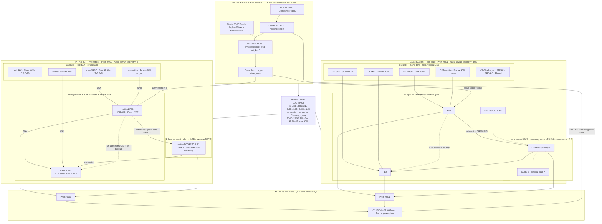

# DECA edge policy layers (CE / PE / P / network)

Mentor-aligned hierarchical policies so edges **do not conflict**.  
Same wire IDs and SLA budgets on **Pi and GNS3** (Aug 2026: Gold 99.9% vs Bronze 90%; CoS1 on MPLS; name rogue vs victim).

**Machine contract:** [`edge_policy_contract.json`](./edge_policy_contract.json)  
**Master catalog:** [`DECA_SDWAN_POLICY_RULES.md`](./DECA_SDWAN_POLICY_RULES.md) §1–§3  
**Audit:** `bash lab/audit_edge_policies.sh` · `FABRIC=pi|gns3|both`

**NOC (no GNS3 GUI):** Simulation source → Traffic Start → Simple fault → map/telemetry → Decide.  
APIs: `GET /api/v1/topology` · `POST /api/v1/traffic/start|stop` · fabric-aware `/fleet` + `/dashboard`.

---

## Conflict rule (top)

**More specific never overrides more critical.**

```text
TT&C / Gold  >  Payload / Silver  >  Admin / Bronze
```

Network AAR sets *path intent*; CE marks *site priority*; PE *enforces* QoS/VRF/IPsec; P *forwards without reclassifying*.

### Complete dual-fabric map (Pi + GNS3)

Same **network** policy plane and **wire contract** for both fabrics; only hardware / scale and Prom ports differ.



### Layer ownership (same jobs on both sides of the diagram)

| Layer | Owns | Must NOT do |
| --- | --- | --- |
| **Network** | Class SLAs, hysteresis (`enter_k=3` / `exit_k=10`), conflict / HITL, `force_path` | Per-packet QoS |
| **CE** | Site tier (Gold / Silver / Bronze), default CoS, “don’t starve Gold” | Choose CORE vs eth0 |
| **PE** | Mark→HTB (`1:10` / `1:15` / `1:20`), VRF (`vrf-mission` / `vrf-admin`), IPsec `copy_dscp`, AAR steer | Invent new classes |
| **P (CORE)** | Forward mission underlay, keep DSCP, TE costs | Re-mark ToS / run CE SLA logic |

**P nuance:** Pi CORE has no HTB (pure transit). GNS3 CORE may apply the **same** HTB PHB for demo realism — still **no remapping** of ToS.

---

## Shared wire + SLA (both fabrics)

| Class | ToS | HTB | VRF | Latency | Jitter | Loss | Primary | Backup |
| --- | --- | --- | --- | --- | --- | --- | --- | --- |
| **TT&C** | `0x88` | `1:10` | `vrf-mission` | ≤25 ms | ≤5 ms | ≤0.1% | `gre-te-core` | `eth0` |
| **Payload** | `0x80` | `1:15` | `vrf-mission` | ≤80 ms | ≤15 ms | ≤2% | `gre-te-core` | `eth0` |
| **Admin** | `0x00` | `1:20` | `vrf-admin` | — | — | — | `eth0` only | — |

| CE | Site | Tier | Availability | Default CoS | Demo role |
| --- | --- | --- | --- | --- | --- |
| `ce-a` / CE-NRSC | NRSC | **Gold** | **99.9%** | `0x88` | Critical victim |
| `ce-b` / CE-SAC | SAC | **Silver** | **99.5%** | `0x80` | DC bulk |
| `ce-mauritius` | Mauritius | **Bronze** | **90%** | `0x80` / BE | Typical rogue |
| `ce-mcf` | MCF | **Bronze** | **90%** | `0x80` / BE | Alternate rogue |

---

## Non-conflict matrix

| If this happens… | Winner | Mechanism |
| --- | --- | --- |
| TT&C and Payload both want backup | **TT&C** | `sdwan_policy_conflict` preemption |
| Bronze CE surges vs Gold CE | **Gold** | Decide `rogue_ce` / `victim_ce` · CE↔CE conflict |
| Admin / BE vs mission congestion | **Mission** | Admin pinned `vrf-admin`; scavenger `1:20` |
| CE default CoS vs network class SLA | **Network class** | CE suggests mark; PE enforces AAR table |
| P sees congestion | **Don’t reclassify** | Queue/drop under existing PHB only |

---

## Apply + audit (both fabrics)

| Fabric | Apply HTB | Snapshot | Prom |
| --- | --- | --- | --- |
| **Pi** | `bash lab/rpi/apply_sla_htb.sh` | `lab/rpi/state/sla_active.json` | `:9090` |
| **GNS3** | `bash lab/gns3/apply_sla_htb.sh` | `lab/gns3/state/sla_active.json` | `:9091` |

```bash
# After Start-all / stations up:
bash lab/rpi/apply_sla_htb.sh
bash lab/gns3/apply_sla_htb.sh
bash lab/audit_edge_policies.sh          # both if reachable
FABRIC=gns3 bash lab/audit_edge_policies.sh
```

Backend loads the same budgets via `deca-backend/fabric.py` → `GET /api/v1/fabric` (from `edge_policy_contract.json`).

---

## Mentor one-liner

> Policies are hierarchical: network AAR, CE site SLA, PE QoS/VRF/IPsec, P transit-only — **identical roles and numbers on Pi and GNS3** so Gold/TT&C always wins and the NOC can name the rogue vs victim.
