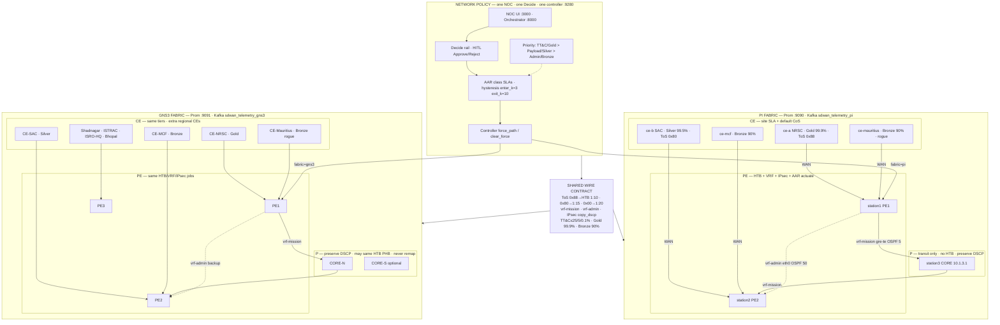

# DECA — Complete Policy Catalog (CE / PE / P / Network)

**This is the single authoritative policy document** for the ISRO DECA lab (Pi + GNS3).  
All AAR / CE / QoS / security / failover / routing / AI-governance rules live here.

| Artifact | Role |
| --- | --- |
| **This file** | Human-readable complete policy catalog |
| [`edge_policy_contract.json`](./edge_policy_contract.json) | Machine contract (backend / audit) |
| [`lab/rpi/SLA.md`](../lab/rpi/SLA.md) · [`lab/gns3/SLA.md`](../lab/gns3/SLA.md) | Fabric as-applied snapshots (numbers must match this doc) |
| Audit | `bash lab/audit_edge_policies.sh` · `FABRIC=pi\|gns3\|both` |

**Implementation bindings**

| Plane | Where it lives |
| --- | --- |
| AAR SLAs, hysteresis, conflict, human gate | `lab/deca_sdwan_controller.py` |
| HTB / IPsec / VRF / OSPF-TE | `lab/deca_htb_qos.sh`, `lab/swanctl/*.conf`, FRR, expansion-boot |
| Traffic generation | **Pi:** iperf3 (`lab/deca_iperf_qos_traffic.sh`). **GNS3:** iperf3 + NetEM — [`shared_fault_book.json`](./shared_fault_book.json) |
| HITL / Decide / air-gap UI | `deca-backend` + dashboard (fabric selector `pi` \| `gns3`) |
| Telemetry | Pi → Prom `:9090` · GNS3 → Prom `:9091` |
| Topology | [`STATION_NETWORK_SETUP.md`](./STATION_NETWORK_SETUP.md) · [`NETWORK_HOW_IT_WORKS.md`](./NETWORK_HOW_IT_WORKS.md) |

Dashboard shows these as **read-only** Mission policy. Operators govern via **Approve / Reject** and manual `force_path` only.

**NOC (no GNS3 GUI):** Simulation source → Traffic Start → Simple fault → map/telemetry → Decide.  
APIs: `GET /api/v1/topology` · `POST /api/v1/traffic/start|stop` · fabric-aware `/fleet` + `/dashboard`.

---

## 0. Conflict rule (top of stack)

**More specific never overrides more critical.**

```text
TT&C / Gold  >  Payload / Silver  >  Admin / Bronze
```

| Layer | Sets | Must NOT do |
| --- | --- | --- |
| **Network** | Class SLAs, hysteresis (`enter_k=3` / `exit_k=10`), conflict / HITL, `force_path` | Per-packet QoS |
| **CE** | Site tier (Gold / Silver / Bronze), default CoS, “don’t starve Gold” | Choose CORE vs eth0 |
| **PE** | Mark→HTB (`1:10` / `1:15` / `1:20`), VRF, IPsec `copy_dscp`, AAR steer | Invent new classes |
| **P (CORE)** | Forward mission underlay, keep DSCP, TE costs | Re-mark ToS / run CE SLA logic |

Network AAR sets *path intent*; CE marks *site priority*; PE *enforces* QoS/VRF/IPsec; P *forwards without reclassifying*.

**P nuance:** Pi CORE has **no HTB** (pure transit). GNS3 CORE may apply the **same** HTB PHB for demo realism — still **no remapping** of ToS.

### Dual-fabric map



---

## 1. Application-Aware Routing (AAR) & class SLAs

| Class | Match (PS13 wire) | VRF | Latency | Jitter | Loss | Primary | Backup |
| --- | --- | --- | --- | --- | --- | --- | --- |
| **TT&C Telemetry** (critical command) | ToS **`0x88`** (136) / CS4-class | `vrf-mission` | ≤ **25 ms** | ≤ **5 ms** | ≤ **0.1%** | `gre-te-core` | `eth0` |
| **Mission Payload** (bulk / EO data) | ToS **`0x80`** (128) / AF41-class | `vrf-mission` | ≤ **80 ms** | ≤ **15 ms** | ≤ **2.0%** | `gre-te-core` | `eth0` |
| **Administrative / Default** | Untagged **BE / `0x00`** | `vrf-admin` *(PS13: vrf-default)* | — | — | — | **Pinned `eth0` only** | Never on mission MPLS core |

Also matched into TT&C lane: legacy EF ToS **`0xb8`**, dport **5004**.  
Also matched into Payload lane: dport **5006**.

**iperf3 signatures (ARM-safe):**

```bash
iperf3 -u -b 1M  --tos 0x88   # TT&C
iperf3 -u -b 50M --tos 0x80   # Payload
iperf3 -b 20M                 # Admin (untagged)
```

Helper: `bash lab/deca_iperf_qos_traffic.sh start`

### Shared wire summary (both fabrics)

| Class | ToS | HTB | VRF | Latency | Jitter | Loss | Primary | Backup |
| --- | --- | --- | --- | --- | --- | --- | --- | --- |
| **TT&C** | `0x88` | `1:10` | `vrf-mission` | ≤25 ms | ≤5 ms | ≤0.1% | `gre-te-core` | `eth0` |
| **Payload** | `0x80` | `1:15` | `vrf-mission` | ≤80 ms | ≤15 ms | ≤2% | `gre-te-core` | `eth0` |
| **Admin** | `0x00` | `1:20` | `vrf-admin` | — | — | — | `eth0` only | — |

---

## 2. Customer-Edge (CE) SLA tiers

Per-**CE** availability / CoS mapping used by Decide rogue/victim attribution. Class SLAs (§1) still bind the wire; CE tiers answer *which site* is Gold vs Bronze when they share a PE/WAN.

| CE netns | Site | SLA tier | Availability | Default CoS | Role in demos |
| --- | --- | --- | --- | --- | --- |
| **`ce-a`** / CE-NRSC | NRSC Hyderabad | **Gold** | **99.9%** | TT&C `0x88` | Critical **victim** — never starve |
| **`ce-b`** / CE-SAC | SAC Ahmedabad | **Silver** | **99.5%** | Payload `0x80` | DC bulk / peer |
| **`ce-mauritius`** | Mauritius (distant) | **Bronze** | **90%** | Payload `0x80` / BE | Typical **rogue** burst source |
| **`ce-mcf`** | MCF Hassan | **Bronze** | **90%** | Payload `0x80` / BE | Alternate rogue / regional |

### Dual-fabric budgets (aligned)

One NOC · one controller · **same AAR + CE tier numbers** on Pi and GNS3. Active fabric from `GET/POST /api/v1/fabric` selects Prom + inject target only.

| Class / CE | **Pi** | **GNS3** |
| --- | --- | --- |
| TT&C latency / jitter / loss | ≤25 · ≤5 · ≤0.1% | **same** |
| Payload latency / jitter / loss | ≤80 · ≤15 · ≤2% | **same** |
| CE Gold / Silver / Bronze | 99.9% / 99.5% / 90% | **same** |

**Still fabric-local:** Prom port, link rates, node inventory, chaos tools, whether P runs HTB PHB.

Flow after Approve: Decide → controller `:9280` → OSPF/`force_path` on the **active** fabric’s PE1.

### CE↔CE SLA conflict

| Rule | Value |
| --- | --- |
| **Conflict condition** | Lower-tier CE util surge **and** higher-tier CE/path SLA at risk (latency↑, util→ceil, or `sdwan_policy_conflict=1`) |
| **Attribution** | Decide: `rogue_ce`, `victim_ce`, `victim_sla`, `rogue_sla` |
| **Alert class** | Prefer `policy_drift` or `congestion_breach` with `root_cause=ce_sla_conflict` |
| **Actuation** | HITL Approve → protect victim; **no silent auto-remediate** |
| **Demo inject** | `bash scripts/inject_ce_sla_conflict.sh` then `bash scripts/demo_ce_sla_conflict_seed.sh` |

### CE bandwidth anomaly (NOC uptime — not a security appliance)

| Rule | Value |
| --- | --- |
| **Quiet baseline** | **2–3 Mbps** typical rural/edge CE |
| **Surge fire** | Sustained **≥ 15 Mbps** (demo target **~20 Mbps**) for **N≥30** samples while peers stay near baseline |
| **Metric** | `ce_util_mbps{ce=…}` from PE `veth-pe-*` (`lab/exporters/deca-ce-util.sh`) |
| **Detector** | `predictive/ce_surge_detect.py` → seed-preemption with rogue CE named |
| **Framing** | Network anomaly / abusive consumer / misconfig for **uptime** — not IDS/malware |

### Multi-operator NOC

| Rule | Value |
| --- | --- |
| **Topology** | Many CEs → PEs → singular CORE → **one NOC** on brain |
| **Operators** | Multiple humans may watch the same Decide feed; Approve/Reject **audit** records identity when provided |
| **Priority** | Predictive ETA + SLA conflict over GUI polish |

---

## 3. Quality of Service (QoS) & congestion

| Policy | Lab binding | Behavior |
| --- | --- | --- |
| **Strict Priority (LLQ)** | HTB **`1:10`**, filter ToS **`0x88`** (+ `0xb8`, `:5004`) | TT&C bypasses standard congestion buffers |
| **Bandwidth Policing** | HTB **`1:15`**, filter ToS **`0x80`** (+ `:5006`), **~70%** of link rate | Payload assured; policed if it starves TT&C |
| **WRED / early drop** | RED qdisc on `1:15`; ceil ≈ **85%** of link (~**34 mbit** on 40 mbit parent) | Proactive Payload drop under pressure |
| **Scavenger** | HTB **`1:20`** default · rate **5 mbit** · ceil **24 mbit** | Admin / untagged / encap-miss land |

Canonical installer: `FORCE=1 IF=eth0 bash lab/deca_htb_qos.sh` (also in `deca-expansion-boot.sh`).

### HTB rates (40 mbit WAN parent — Pi PE eth0)

| Classid | Role | rate | ceil | prio |
| --- | --- | --- | --- | --- |
| **`1:10`** | TT&C | **2 mbit** | **40 mbit** | 1 |
| **`1:15`** | Payload | **~28 mbit** (70%) | **~34 mbit** (85%) + RED | 2 |
| **`1:20`** | BE | **5 mbit** | **24 mbit** (60%) | 5 |

### Where HTB is applied (Pi)

| Node | Interfaces | Link rate |
| --- | --- | --- |
| station1 (PE1) | `eth0` | 40 Mbit |
| station2 (PE2) | `eth0` | 40 Mbit |
| `ce-a` (Gold) | `veth-cea-pe` | 40 Mbit |
| `ce-b` (Silver) | `veth-ceb-pe` | 40 Mbit |
| `ce-mauritius` (Bronze) | CE WAN veth | **20 Mbit** *(skip if NetEM owns root)* |
| `ce-mcf` (Bronze) | CE WAN veth | **20 Mbit** |
| station3 (CORE) | — | **No HTB** — DSCP preserved |

---

## 4. Security & overlay data plane

| Policy | Rule |
| --- | --- |
| **Zero-Trust Encapsulation** | All WAN-bound mission traffic must be **IPsec ESP** (`deca-sdwan`). Cleartext transit across any underlay is strictly dropped. |
| **QoS preservation** | StrongSwan **`copy_dscp = out`** so outer ESP retains inner ToS (`0x88` / `0x80`) for PE HTB without decrypt. Templates: `lab/swanctl/`. |
| **Macro-Segmentation** | Strict VRF isolation: `vrf-mission` ⟂ `vrf-admin`. Zero route leakage. Check: `lab/deca_vrf_isolation_check.sh`. |
| **TT&C Fail-Closed** | If backup `eth0` path fails IPsec cryptographic negotiation, **TT&C is dropped** rather than sent unencrypted. |

---

## 5. Failover & controller state machine

| Policy | Value | Meaning |
| --- | --- | --- |
| **Degradation trigger (`enter_k`)** | **3** | Primary must violate class SLA for 3 consecutive polls |
| **Stability recovery (`exit_k`)** | **10** | 10 consecutive clean polls before fail-back |
| **Conflict preemption** | TT&C wins | Evicts Payload preference when TT&C needs backup; `sdwan_policy_conflict=1` |
| **CE↔CE conflict** | Gold wins narrative | Bronze/Silver surge that endangers Gold → Decide `ce_sla_conflict` (§2) |
| **Poll interval** | **5 s** | Controller probe / decision loop |

Human / AI gate (`POST /action`, localhost): `force_path` | `clear_force` | `reset_autonomy`.

---

## 6. Control plane & dynamic routing

| Policy | Rule |
| --- | --- |
| **Preferred / backup underlay** | `gre-te-core` OSPF **5**; `eth0` OSPF **50** |
| **Route flap dampening** | >3 adjacency bounces / 60 s → suppress **15 min** |
| **Geographic locality** | Higher local-pref for nearer ground station |
| **TE** | OSPF-TE + pathd SR-TE BSID **40001** / **40002** (not RSVP — unavailable in FRR 10.6). **HTB is QoS, not TE.** |
| **P role** | Singular CORE on station3 (`10.1.3.1`). Dual-P netns = design-only on Pi, not applied |
| **Provider BGP** | AS **65001**; RT `65001:100`; Mauritius CE may speak AS **65013** |

---

## 7. AI copilot & operations governance

| Policy | Rule |
| --- | --- |
| **Q1 TTI** | Multi-head LSTM (latency / loss / jitter / util); Decide when **$T_{breach}$ < 120 s** (warn band < 180 s) |
| **Q2 Root cause** | XGBoost severity classifier (Prom → features → declare); path asymmetry + rekey in schema v2 |
| **Q3 Preemption** | HITL Approve → budgeted `bgp_soft_clear` (when applicable) then `force_path` (no silent auto-remediate) |
| **HITL timeout** | Sim wait **90 s** for Approve |
| **Air-gap** | Local Ollama Phi-3 + ChromaDB runbooks; **no** outbound cloud / temporary WAN on brain |
| **P6.4 / policy drift** | Separate Decide track (CE SLA conflict / `policy_drift`) — **not** covered by Q1/Q2 L1–L5 protocol families alone |
| **Compound arbitration** | Single-label Q2 = dominant root; quieter-leg drowning disclosed until multi-label presence is wired |

---

## 8. Non-conflict matrix

| If this happens… | Winner | Mechanism |
| --- | --- | --- |
| TT&C and Payload both want backup | **TT&C** | `sdwan_policy_conflict` preemption |
| Bronze CE surges vs Gold CE | **Gold** | Decide `rogue_ce` / `victim_ce` · CE↔CE conflict |
| Admin / BE vs mission congestion | **Mission** | Admin pinned `vrf-admin`; scavenger `1:20` |
| CE default CoS vs network class SLA | **Network class** | CE suggests mark; PE enforces AAR table |
| P sees congestion | **Don’t reclassify** | Queue/drop under existing PHB only |

---

## 9. Apply + audit (both fabrics)

| Fabric | Apply HTB | Snapshot | Prom |
| --- | --- | --- | --- |
| **Pi** | `bash lab/rpi/apply_sla_htb.sh` | `lab/rpi/state/sla_active.json` | `:9090` |
| **GNS3** | `bash lab/gns3/apply_sla_htb.sh` | `lab/gns3/state/sla_active.json` | `:9091` |

```bash
bash lab/rpi/apply_sla_htb.sh
bash lab/gns3/apply_sla_htb.sh
bash lab/audit_edge_policies.sh
FABRIC=gns3 bash lab/audit_edge_policies.sh
```

Backend loads the same budgets via `deca-backend/fabric.py` → `GET /api/v1/fabric` (from `edge_policy_contract.json`).

---

## 10. Quick reference (live constants)

```
# Both fabrics (pi | gns3) — mentor-aligned (edge_policy_contract.json)

Priority:  TT&C/Gold > Payload/Silver > Admin/Bronze

TT&C:      lat≤25  jit≤5   loss≤0.1%   HTB 1:10   ToS 0x88 (136)   vrf-mission
Payload:   lat≤80  jit≤15  loss≤2.0%   HTB 1:15   ToS 0x80 (128)   70%/WRED@85%
Admin:     BE/0x00  vrf-admin → eth0 only           HTB 1:20  rate5/ceil24

CE SLA:    Gold ce-a 99.9% · Silver ce-b 99.5% · Bronze mauritius/mcf 90%
Layers:    network AAR · CE site tier · PE QoS/VRF/IPsec · P transit
Paths:     gre-te OSPF 5 preferred · eth0 OSPF 50 backup · IPsec copy_dscp=out
TE:        SR-TE BSID 40001/40002
Hysteresis: enter_k=3  exit_k=10  poll=5s
Surge:     baseline 2–3 Mbps → fire ≥15 Mbps (~20 demo) per CE
Governance: T_breach=120s red / 180s warn  HITL=90s  air-gap=on
Chaos:     Pi/GNS3 iperf3+NetEM · shared_fault_book.json (no TRex)
```

---

## Mentor one-liner

> Policies are hierarchical: network AAR, CE site SLA, PE QoS/VRF/IPsec, P transit-only — **identical roles and numbers on Pi and GNS3** so Gold/TT&C always wins and the NOC can name the rogue vs victim.
