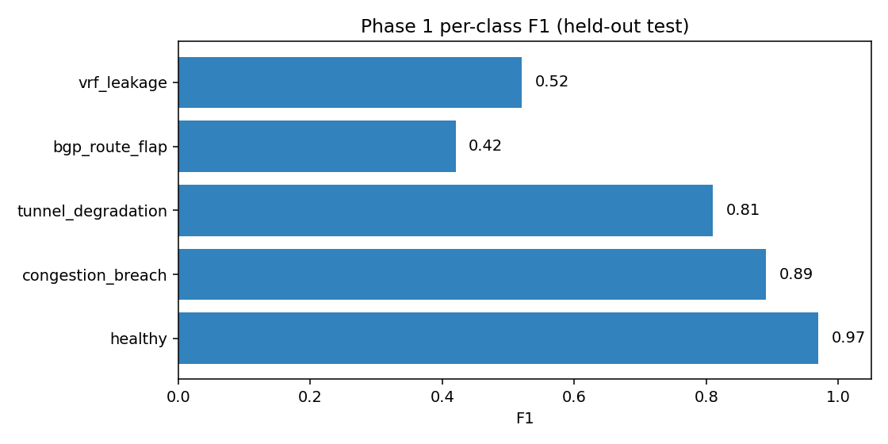
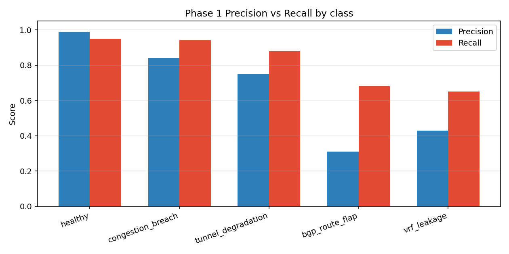
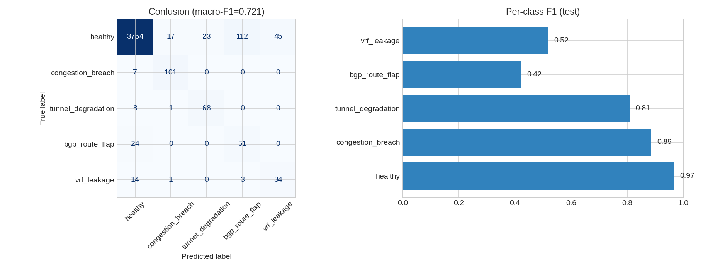
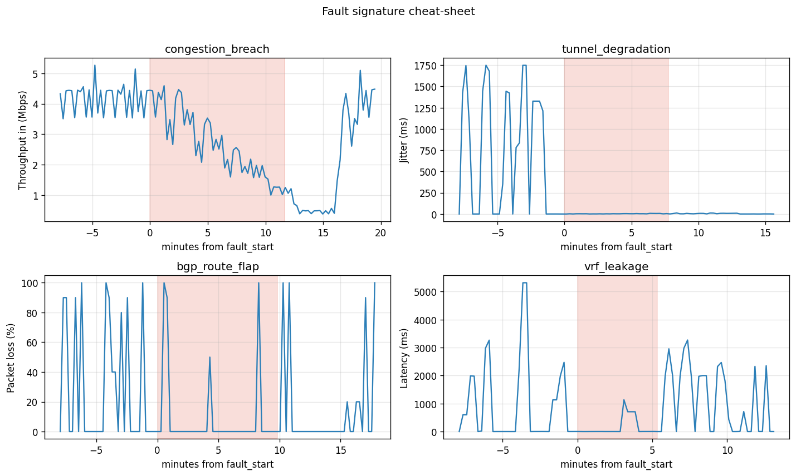
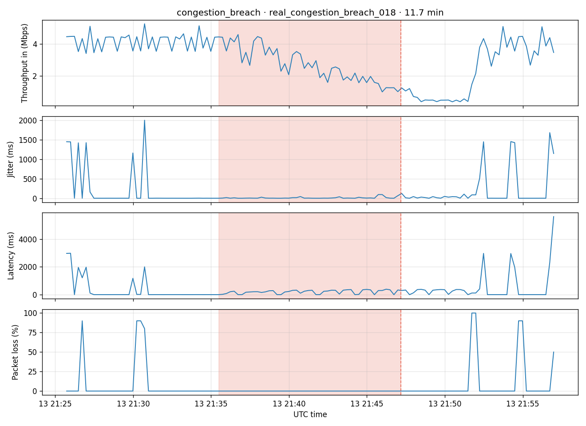
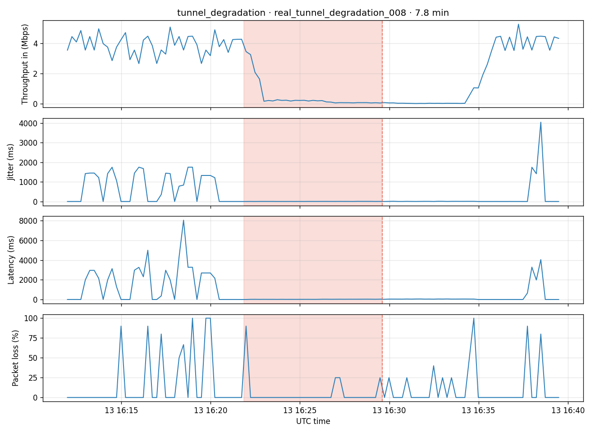
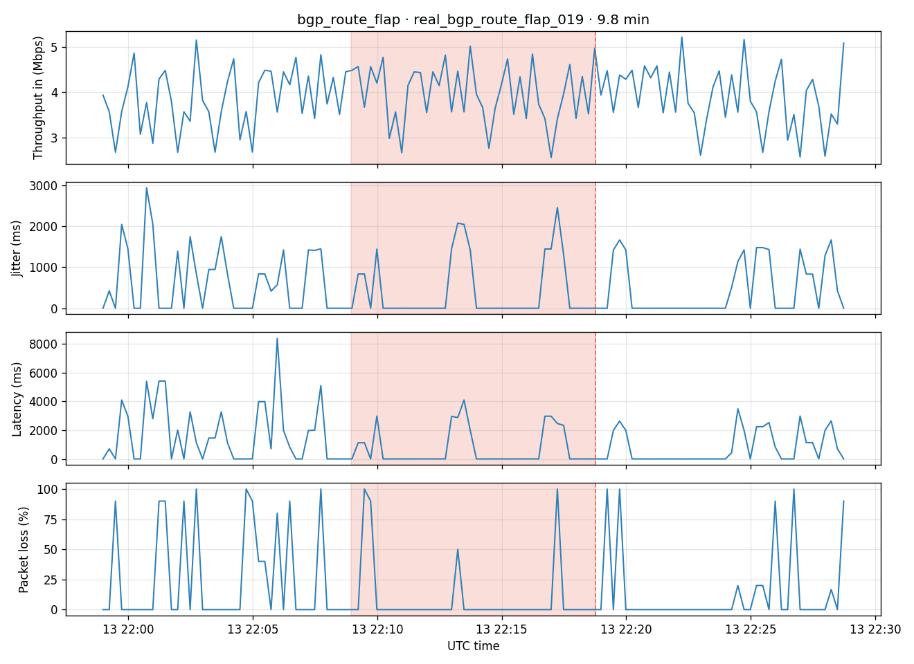
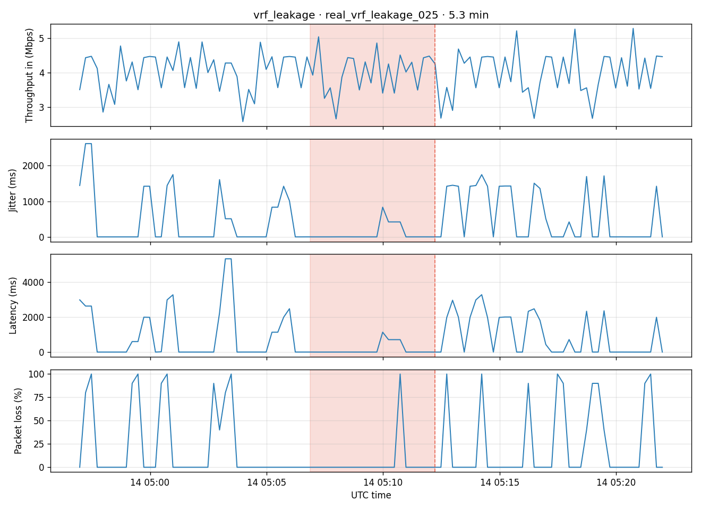
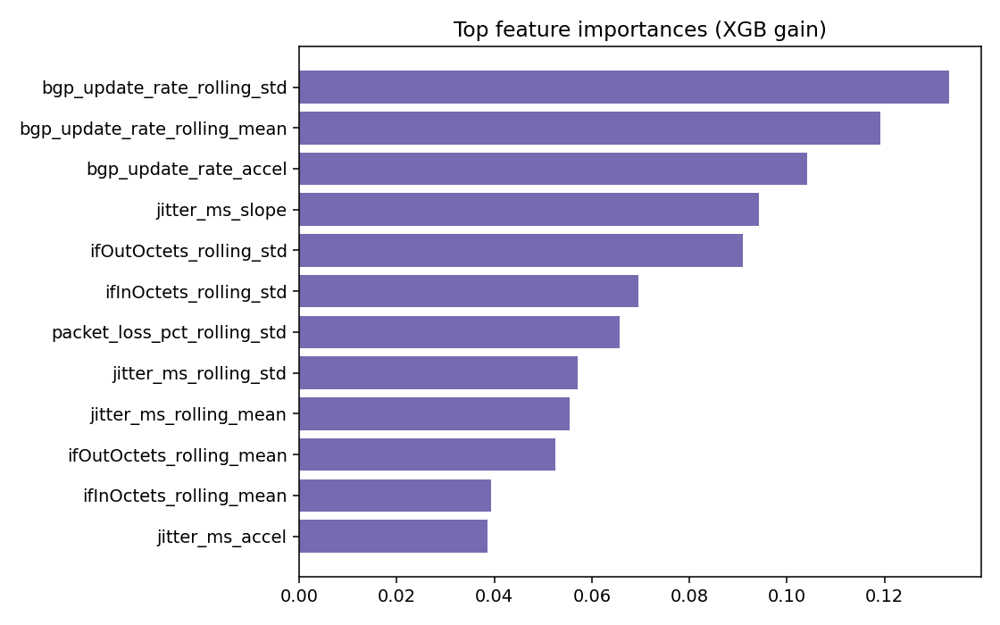
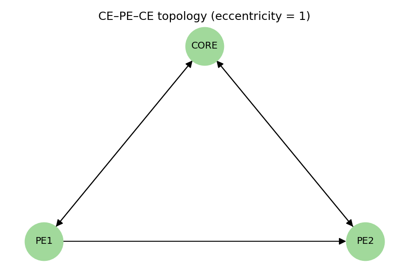

# DECA models catalog

Inventory of every artifact under [`models/`](../models/), trained by [`notebook/DECA_Model_Training.ipynb`](../notebook/DECA_Model_Training.ipynb) on `data/processed/deca_unified_dataset.parquet` (**17,050** rows). Formulas: section below · deeper theory: [`DECA_Model_Development_Blueprint.md`](DECA_Model_Development_Blueprint.md) · ROI tiers: [`DECA_ROI_TIERS.md`](DECA_ROI_TIERS.md).

**Retrain**

```bash
source .venv/bin/activate
python scripts/rebuild_unified.py   # after new campaign data
jupyter notebook notebook/DECA_Model_Training.ipynb
```

Figures below live in [`docs/assets/models/`](assets/models/) (copied from training outputs).

---

## Formulas

Shared Phase‑1 / scoreboard math also appears in [`DECA_ROI_TIERS.md`](DECA_ROI_TIERS.md) and the exam harness in [`DECA_MLOps_Continuous_Learning_Pipeline.md`](DECA_MLOps_Continuous_Learning_Pipeline.md).

### Classification metrics

$$
\mathrm{Precision}_c = \frac{\mathrm{TP}_c}{\mathrm{TP}_c+\mathrm{FP}_c},\quad
\mathrm{Recall}_c = \frac{\mathrm{TP}_c}{\mathrm{TP}_c+\mathrm{FN}_c},\quad
F1_c = \frac{2\,P_c\,R_c}{P_c+R_c}
$$

$$
\mathrm{Macro\text{-}F1} = \frac{1}{K}\sum_{c=1}^{K} F1_c,\qquad
\mathrm{Accuracy} = \frac{\sum_c \mathrm{TP}_c}{N_{\mathrm{test}}}
$$

### Isolation Forest + Platt

Anomaly score from path length $E(h(x))$ (IF):

$$
s(x, n) = 2^{-\frac{E(h(x))}{c(n)}}
$$

Platt calibration to operator confidence:

$$
P(y=1\mid s) = \frac{1}{1 + \exp(A\cdot s + B)}
$$

Reported scoreboard: ROC‑AUC of $P(\mathrm{anomaly})$ on held‑out rows (**0.720**).

### XGBoost Phase 1 (Tiers 1–3)

**Tier 1 — gate.** Binary target $y^{\mathrm{bin}}=\mathbf{1}[y\neq\texttt{healthy}]$. Predict:

$$
\hat{y}(x)=
\begin{cases}
\texttt{healthy} & P(\mathrm{anomaly}\mid x)<\tau_{\mathrm{gate}} \\
\arg\max_c\, p_c(x)/t_c & \text{otherwise}
\end{cases}
$$

This lake: mode `weighted_multiclass`, $\tau_{\mathrm{gate}}=0.40$.

**Tier 2 — inverse‑frequency weights** (fit split only; no SMOTE):

$$
w_i = \frac{N}{K\cdot n_{y_i}}
$$

**Tier 3 — rare‑aware threshold sweep** on validation:

$$
S = 0.4\cdot\mathrm{Macro\text{-}F1} + 0.6\cdot\overline{F1}_{\mathrm{rare}}
$$

### Prophet (macro envelopes)

Additive seasonal model on telemetry series $y(t)$:

$$
y(t) = g(t) + s(t) + h(t) + \epsilon_t
$$

($g$ trend, $s$ daily+weekly seasonality, $h$ holidays / events unused here, $\epsilon$ residual.)

### LSTM time‑to‑breach

Sliding windows of length $T=16$ on network rows with finite `time_to_breach_minutes`. Train with MSE; report MAE:

$$
\mathrm{MAE} = \frac{1}{m}\sum_{j=1}^{m}\bigl|\hat{\tau}_j - \tau_j\bigr|
$$

This lake: test MAE **2.133 min** ($m=623$ sequences).

### Topology eccentricity

On the CE–PE–CE digraph (treated undirected for $e$):

$$
e(v)=\max_{u\in V}\, d(v,u)
\quad\Rightarrow\quad
e(\mathrm{PE1})=e(\mathrm{PE2})=e(\mathrm{CORE})=1
$$

---

## Inshort

### 1. The XGBoost Classifier (The "What is happening now?" Model)

* **What it does:** This is the two-stage ensemble you just described. It acts as the operational layer.
* **Its job:** It looks at the current telemetry window and labels the specific known fault (e.g., classifying a BGP route flap versus a VRF leakage).

### 2. The LSTM Neural Network (The "When will it break?" Model)

* **What it does:** The Long Short-Term Memory (LSTM) network does not classify faults.
* **Its job:** It models short, non-linear precursor sequences (like sudden jitter spikes or bitrate swings) to estimate the **Time-to-Breach**. Instead of saying "this is a fault," it outputs the number of minutes you have until the network degrades.

### 3. Prophet Regression (The "Macro Baseline" Subtypes)

* **What it does:** These are likely the "subtypes" you noticed. The pipeline trains three separate Prophet models for specific metrics: one for traffic octets, one for jitter, and one for BGP update rates.
* **Its job:** Prophet doesn't look for faults at all. It forecasts daily and weekly seasonality. It draws the "normal" baseline trajectory for the future, so the system knows if a SLA breach is structurally likely.

### 4. Isolation Forest (The "Unknown Weirdness" Model)

* **What it does:** The XGBoost classifier only knows about the specific faults you trained it on (like your 26 new runs). The Isolation Forest is unsupervised, meaning it doesn't use labels.
* **Its job:** It explicitly looks for structural deviations from standard traffic matrices to act as a dashboard precursor warning. If a brand-new, never-before-seen cyberattack hits the router, the XGBoost model might fail the "unit test," but the Isolation Forest will still flag it as a severe anomaly.

**In short:** XGBoost categorizes the current disaster, the LSTM counts down the minutes until it happens, Prophet maps out what a normal day should look like, and the Isolation Forest acts as a tripwire for the unknown.

---

## Scoreboard (this lake)

| Component | Primary score | Notes |
| --- | --- | --- |
| Isolation Forest + Platt | ROC-AUC **0.720** | Unsupervised precursor / dashboard confidence |
| XGBoost Phase 1 (tiers 1–3) | Macro-F1 **0.721**, Acc **0.94** | Rare recall ↑; no SMOTE |
| LSTM time-to-breach | MAE **2.133 min** | 623 sequences, $T=16$ |
| Prophet ×3 | Fit complete | 4502 / 8000 / 320 points |
| Attribution | XGB gain | Top: BGP rate rolling features |
| Topology | $e(v)=1$ ∀ nodes | PE1–PE2–CORE |

### Per-class (held-out test)

| Class | Precision | Recall | F1 | Support |
| --- | ---: | ---: | ---: | ---: |
| healthy | 0.99 | 0.95 | 0.97 | 3,951 |
| congestion_breach | 0.84 | 0.94 | 0.89 | 108 |
| tunnel_degradation | 0.75 | 0.88 | 0.81 | 77 |
| bgp_route_flap | 0.31 | 0.68 | 0.42 | 75 |
| vrf_leakage | 0.43 | 0.65 | 0.52 | 52 |







CSV mirrors: `models/scoreboard_summary.csv`, `models/scoreboard_per_class.csv`.  
**Score timeline (initial → learnt → playground):** [`DECA_TEST_SCORES.md`](DECA_TEST_SCORES.md).

---

## Layout

```
models/
├── manifest.json                 # index of all artifacts + metrics
├── scoreboard_summary.csv
├── scoreboard_per_class.csv
├── isolation_forest/
├── fault_classifier/
├── prophet_ifInOctets/
├── prophet_jitter_ms/
├── prophet_bgp_update_rate/
├── lstm/
└── topology/
```

---

## Fault behaviour (inputs the models learn from)

Before the stack: visual signatures of each lab fault (campaign `20260713_155333`). Generated in notebook **Stage 0b**.



| Fault | Strip plot |
| --- | --- |
| congestion_breach |  |
| tunnel_degradation |  |
| bgp_route_flap |  |
| vrf_leakage |  |

---

## `isolation_forest/`

| | |
| --- | --- |
| **Purpose** | Multivariate anomaly / precursor scores; Platt-calibrated $P(\text{anomaly})$. |
| **Use case** | Operator confidence / dashboard gate before fine classification. |
| **How trained** | Fit IF **only on healthy** train rows; logistic Platt on train anomaly scores; eval on 25% test. |
| **Primary metric** | ROC-AUC **0.720** |
| **Artifacts** | |

| File | Role |
| --- | --- |
| `isolation_forest.pkl` | sklearn IsolationForest + imputer/scaler pipeline |
| `confidence_calibrator.pkl` | LogisticRegression Platt calibrator |
| `feature_scaler.pkl` | Imputer / scaler / feature column list |

---

## `fault_classifier/` (Phase 1 XGBoost)

| | |
| --- | --- |
| **Purpose** | Multiclass `unified_label` (healthy + four lab faults) with Tiers 1–3. |
| **Use case** | Operational fault ID after / with the anomaly gate. |
| **How trained** | Anomaly gate + inverse-frequency weights + val-tuned thresholds; **SMOTE refused**. Mode this run: `weighted_multiclass`, `gate_thr=0.40`. |
| **Candidate heads** | School Exam sweeps three heads and promotes only the gate winner: `plain` (this champion), `wm` (KMeans cluster layer + reg), `moe` (mixture of per-fault experts + stacked gate). On the current lake `plain` wins — deeper heads overfit the ~40-row rare classes (see [`DECA_ROI_TIERS.md`](DECA_ROI_TIERS.md) Tier 5.5). |
| **Primary metrics** | Macro-F1 **0.721** · Acc **0.94** |
| **Artifacts** | |

| File | Role |
| --- | --- |
| `fault_classifier_xgb.pkl` | Gate + fault_clf + full_clf + thresholds / mode |
| `label_encoder.pkl` | Class names, `smote: false` |
| `decision_thresholds.json` | `gate_thr`, per-class thr, val scores |
| `feature_attribution.json` | Top gain features |
| `scorecard.png` | Confusion + per-class F1 |



---

## `prophet_*` (×3)

| | |
| --- | --- |
| **Purpose** | Macro additive forecasts for SLA / breach foreshadowing. |
| **Use case** | Trend envelopes on octets, jitter, BGP update rate (alongside LSTM for micro TTB). |
| **How trained** | Fit on long-form `deca_unified_raw.parquet` series; daily+weekly seasonality; cap 8k points. |
| **Primary metric** | Fit complete (no holdout MAE logged — trend prior). |
| **Artifacts** | |

| Folder / file | Series points (this train) |
| --- | ---: |
| `prophet_ifInOctets/prophet_ifInOctets.pkl` | 4,502 |
| `prophet_jitter_ms/prophet_jitter_ms.pkl` | 8,000 |
| `prophet_bgp_update_rate/prophet_bgp_update_rate.pkl` | 320 |

Live forecast plots: notebook **Stage 3**.

---

## `lstm/`

| | |
| --- | --- |
| **Purpose** | Time-to-breach (minutes) from short feature sequences. |
| **Use case** | Micro precursor countdown on **network** rows with finite `time_to_breach_minutes`. |
| **How trained** | Windows $T=16$; dual LSTM → dense; MSE / MAE; 12 epochs default. |
| **Primary metric** | Test MAE **2.133 min** (623 sequences) |
| **Artifacts** | |

| File | Role |
| --- | --- |
| `fault_lstm_v1.keras` | Keras model |
| `lstm_scaler.pkl` | Feature mean/std, `seq_len`, columns |

Live loss + pred-vs-true plots: notebook **Stage 4**.

---

## `topology/`

| | |
| --- | --- |
| **Purpose** | CE–PE–CE digraph for alert eccentricity / dedup. |
| **Use case** | Collapse alert storms toward a root node once live alerts bind to stations. |
| **How built** | Static lab graph (not learned). |
| **Primary metric** | $e(\mathrm{PE1})=e(\mathrm{PE2})=e(\mathrm{CORE})=1$ |
| **Artifacts** | `topology_graph.json`, `topology_graph.pkl` |



---

## `manifest.json`

Machine-readable index written at the end of training:

- `training_date`, dataset row / label counts  
- `scoreboard.summary` / `scoreboard.per_class`  
- `models[]` with relative paths + metrics  
- `roi_roadmap` (Phase 1–3)  
- `feature_columns`

---

## Pipeline map

```
unified features (17,050)
        │
        ├─► Isolation Forest + Platt     → anomaly confidence
        ├─► XGB Phase 1 (tiers 1–3)      → unified_label + scorecard
        ├─► Prophet ×3 (from raw telem)  → macro envelopes
        ├─► LSTM TTB (network seq)       → minutes-to-breach
        └─► Topology graph               → eccentricity / alert merge
```

Panel note: rare-class F1 (BGP/VRF) is still precision-bound — next climb is **Tier 6** more lab faults ([`DECA_ROI_TIERS.md`](DECA_ROI_TIERS.md)), not SMOTE.

---

## Mixed-test playground

Score **all** live artifacts on one stratified random paper (no retrain):

```bash
python scripts/deca_model_playground.py
```

Report: [`../models/playground/scoreboard.md`](../models/playground/scoreboard.md) · JSON: `models/playground/latest_playground.json`.  
IF + XGB + LSTM share the mixed exam rows; Prophet uses a chronological series tail (add `--prophet-refit` for prefix-only fit).
