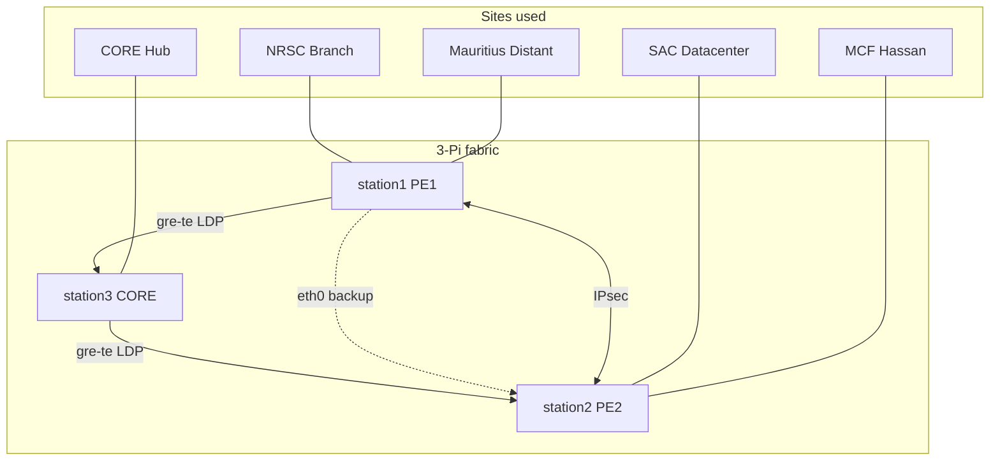

# Network expansion Phases A–H + TE — Findings

**Written:** 2026-07-22 (A–F); **G–H / SD-WAN / BGP VPNv4 / Phase TE updated 2026-07-23**  
**Promoted classifier:** `models/fault_classifier/` — **untouched** (sha16 `5165d46d87ee135b`)  
**Lab:** station1 (PE1), station2 (PE2), station3 (CORE/Hub) on `192.168.50.0/24`  
**Authoritative topology diagrams:** [`STATION_NETWORK_SETUP.md`](./STATION_NETWORK_SETUP.md)  
**Scripts:** `lab/deca_expand_phase_{a,b,c,d,g,h,te}.sh`, `lab/deca_sdwan_*`, exporters under `lab/exporters/`

Honesty bar: live evidence where we have it; scope-downs called out explicitly.



---

## Role model (functional, not three equal CEs)

| Site | Role | Host / attachment | Behavior |
| --- | --- | --- | --- |
| CORE | **Hub** (P) | station3 | Path management; minimal self-generated traffic |
| SAC, Ahmedabad | **Datacenter** | station2 / `ce-b` → PE2 | Sustained high-volume bulk (iperf) |
| NRSC, Hyderabad | **Branch** | station1 / `ce-a` → PE1 | Light / latency-sensitive (Phase C DSCP classes) |
| Mauritius | **Distant branch** | station1 / `ce-mauritius` → PE1 | Geographic distance via **netem 100 ms/dir → ~200 ms RTT** (SAFE Kochi↔Baie Jacotet class — see Fixes 1–3) |
| MCF, Hassan | **Regional branch** | station2 / `ce-mcf` → PE2 | Second CE on station2; Master Control Facility (Phase G) |

Mauritius attaches to **PE1**, not CORE (Hub/P role preserved).

Addressing: PE1↔Mauritius `10.10.3.0/30`, lo `10.100.3.1/32`, BGP AS 65013 ↔ PE AS 65001 in `vrf-mission`.

---

## Phase A — Topology + role differentiation

**Built:** `deca-ns-mauritius.service`, `deca-mauritius-bgp.service` (FRR pathspace `-N mauritius` so host VTY sockets are not clobbered), `deca-vrf-up.service`, IPsec selectors include Mauritius, VRF statics on PE2, Telegraf ping to `10.100.3.1` / `10.100.2.1`.

**Verify (live):**

| Check | Result |
| --- | --- |
| `ce-mauritius` present | Yes |
| BGP Established (Mauritius) | Yes — `bgp_mauritius_adj_up=1`; PE receives 1 prefix |
| Mauritius `/32` in PE2 VRF | Yes (static + IPsec) |
| NRSC↔SAC / NRSC↔Mauritius / SAC↔Mauritius | Reachable |
| Mauritius latency vs domestic | Telegraf: `ping_average_response_ms` url=`10.100.3.1` **~200.1 ms** vs url=`10.100.2.1` **~1 ms** (healthy); under bulk load domestic rises — Mauritius stays distinctly high |
| SAC throughput vs NRSC | Prom `rate(net_bytes_sent)`: **veth-pe-ceb ~66 Mbps** vs **veth-pe-cea ~17 Mbps** under Phase A bulk |
| Injector smoke | `clear bgp 10.1.3.1 soft` OK; Mauritius BGP stayed Established; VPN OK |

**Injector scope:** existing PE1/PE2 injectors remain NRSC/SAC-path only. **Mauritius is not a fault-injection target** — elevated absolute RTT is a healthy distant-site baseline for per-host `_z_*` features (distance ≠ fault).

**Ops note:** FRR restart can leave `vrf-mission` DOWN — `deca-vrf-up.service` brings it UP. Mauritius FRR must use pathspace (`-N mauritius`); an earlier attempt without it overwrote `/var/run/frr/*.vty`.

---

## Phase B — Dual-cost underlay + capacity shaping (not TE)

**Built:** GRE underlay PE1↔CORE↔PE2 (`10.50.1.0/30`, `10.50.2.0/30`), OSPF cost **5** on GRE vs **50** on eth0; HTB on PE eth0 (reserved vs scavenger). This is the **preferred/backup underlay pair** and **QoS capacity shaping** — not the traffic-engineering control plane.

**Verify:**

| Check | Result |
| --- | --- |
| Preferred path | PE1→`10.1.2.1` via **gre-te-core metric 10** (was eth0 metric 50) |
| Reserved vs scavenger | Under bulk: **EF reserved held ~15.0 Mbit/s**; scavenger VPN bulk **~14 Mbit/s** (ceil-limited) vs unconstrained ~60 Mbit/s earlier |

**Honesty:** Phase B is **not** MPLS-TE / RSVP / SR-TE. Real TE constructs are **Phase TE** below (`PS13-O1.2`). Demo contention path = **Datacenter (SAC) ↔ Branch (NRSC)**.

---

## Phase TE — OSPF-TE + pathd SR-TE (`PS13-O1.2`)

**Built (2026-07-23):** FRR-native traffic engineering on the 3-Pi lab. FRR 10.6.1 has **no RSVP-TE**; TE is delivered as:

1. **OSPF-TE** — `mpls-te on` + per-link `link-params` (metric / max-bw / admin-grp) on GRE + eth0; `mpls-te export` / pathd `mpls-te import ospfv2`
2. **OSPF Segment Routing** — SRGB `16000–23999`; prefix-SIDs PE1=idx1, PE2=idx2, CORE=idx3
3. **pathd SR-TE policies** — PE1 `pe1-to-pe2-te` color 1 → `10.1.2.1` BSID **40001**; PE2 `pe2-to-pe1-te` BSID **40002**
   - Preferred candidate `via-gre`: labels CORE→remote PE (`16003/16002` or `16003/16001`) → nexthop `gre-te-core`
   - Backup candidate `via-eth`: Adj SID + node SID → nexthop `eth0`

**Scripts:** [`lab/deca_expand_phase_te.sh`](../lab/deca_expand_phase_te.sh), [`lab/deca_te_verify.sh`](../lab/deca_te_verify.sh); boot heal in [`lab/deca-expansion-boot.sh`](../lab/deca-expansion-boot.sh) `ensure_te`.

**Verify evidence:** `data/rpi-net/te-verify/deca-te-verify-20260723_123711/` — **10/10 PASS** (TED ≥3 vertices, preferred Active on GRE, failover to eth0 BSID, restore, CE ping SAC).

| Check | Result |
| --- | --- |
| `show pathd ted database verbose` | Vertices + GRE/eth edges with TE metrics |
| `show sr-te policy detail` (PE1) | Active; `* via-gre` preferred, `via-eth` backup |
| BSID 40001 preferred | `via 10.50.1.2 dev gre-te-core` labels `16003/16002` |
| BSID after removing preferred CP | `via 192.168.50.30 dev eth0` |
| VPN after TE | NRSC CE → SAC CE ping OK |

**Honesty:** This is **SR-TE + OSPF-TE**, not RSVP-TE. HTB remains **QoS** (`O1.3`), not the TE claim.

---

## Phase C — Application-aware QoS

**Built:** DSCP EF (0xb8) / AF41 (0x88) → HTB reserved class; Branch generators (UDP voice-like + TCP interactive); SAC bulk BE; mangle marks on CE attach.

**Verify:**

| Check | Result |
| --- | --- |
| Classes present | HTB 1:10 reserved / 1:20 scavenger on PE1/PE2 eth0 |
| Under SAC saturation | NRSC ping to SAC: avg **~32–59 ms**, mdev **~17–22 ms** (healthy baseline ~1 ms) |
| Reserved class traffic | PE2 class 1:10 carried EF underlay flow (~16 MB in proof window) |

**Honesty (superseded by Fixes 1–3 for DSCP-copy):** Multiple `iperf3 -s` in one netns is fragile (port conflicts). Pre-fix Phase C/H relied on CE-uplink HTB because ESP outer TOS was 0x0 under stroke; swanctl `copy_dscp=out` now copies inner DSCP to outer ESP (see Fixes 1–3).

---

## Phase D — Missing telemetry (Tier-5 pattern)

**Exporters** (`lab/exporters/`, deploy via `lab/deca_expand_phase_d.sh`):

| Metric | Meaning |
| --- | --- |
| `syslog_err_count` | journal warning+ lines / 60s |
| `netflow_flow_count` | **softflowd IPFIX** active-flow count (Fixes 1–3); conntrack kept as `netflow_proxy_flow_count` |
| `ospf_adj_up` | Full OSPF neighbor count |
| `bgp_mauritius_adj_up` | Mauritius CE BGP Established |
| `ipsec_sa_age_s` / `ipsec_child_sa_count` | IPsec SA age / child count (rekey moves age) |
| `path_asymmetry_ratio` | \|tx−rx\|/(tx+rx) on eth0 |

**Before → after smoke (IPsec down/up):** `ipsec_sa_age_s` **4620 → 14** in Prom; Mauritius BGP stayed up; OSPF/netflow/asymmetry series present. Path asymmetry ~0.91 on PE1/PE2 under Datacenter bulk — contrasts with Mauritius **latency** baseline (distance ≠ fault).

**Scope-down:** Prom scrape of lab Telegraf — not ES/Kafka. NetFlow was a count proxy in Phase D; **replaced with softflowd IPFIX in Fixes 1–3**.

---

## Phase E — Graph anomaly signal (metadata only)

**Updated:** `models/topology/topology_graph.json` — Hub / Datacenter / Branch / DistantBranch roles; CE sites use `attach_host` so they do not collide with PE `host` keys used by `topology_neighbor_hosts`.

**Live operator:** `neighbor_correlation_meta()` in `scripts/deca_live_operator.py` attaches neighbor-echo metadata to declarations / feed (`[topo-echo:…]`). **Does not** enable the topology gate, **does not** retrain the promoted model.

---

## Phase F — Docs

- This file  
- [`STATION_NETWORK_SETUP.md`](./STATION_NETWORK_SETUP.md) role diagram + Mauritius addressing  
- Pointer from [`PROBLEM_STATEMENT_13_FINDINGS.md`](./PROBLEM_STATEMENT_13_FINDINGS.md)

---

## Scope-downs (summary)

| Topic | Lab reality |
| --- | --- |
| TE | **OSPF-TE + pathd SR-TE** (Phase TE) — **not** RSVP-TE (unavailable in FRR 10.6) |
| Simulator | Physical Pis — **not** EVE-NG/GNS3 |
| Telemetry bus | Prometheus — **not** ES/Kafka |
| Mauritius | netem RTT **referenced** to SAFE Kochi↔Mauritius (Fixes 1–3); **not** a fault injector target |
| Model | Promoted weights **unchanged** |

---

## Phase G–H — Site realism + full application-aware traffic

**Written:** 2026-07-23  
**Promoted classifier:** untouched  
**Scripts:** `lab/deca_expand_phase_{g,h}.sh`, helper `/usr/local/bin/deca-site-lan.sh`, unit `deca-ns-mcf.service`

### Phase G — Internal LANs + MCF Hassan

**Built:**

| Site | CE | Attach | Site LAN `/29` | Host netns |
| --- | --- | --- | --- | --- |
| NRSC | `ce-a` | `10.10.1.0/30` | `10.101.1.0/29` | `nrsc-ws` `.2`, `nrsc-srv` `.3` |
| SAC | `ce-b` | `10.10.2.0/30` | `10.101.2.0/29` | `sac-ws` `.2`, `sac-srv` `.3` |
| Mauritius | `ce-mauritius` | `10.10.3.0/30` | `10.101.3.0/29` | `mau-ws` `.2`, `mau-srv` `.3` |
| **MCF, Hassan** | `ce-mcf` (new, station2) | `10.10.4.0/30` | `10.101.4.0/29` | `mcf-ws` `.2`, `mcf-srv` `.3` |

MCF role = **Regional/secondary branch** (distinct from SAC Datacenter). Station2 now hosts two sites (SAC + MCF), mirroring station1’s NRSC + Mauritius pattern.

Also: IPsec selectors extended for site LANs + MCF; VRF statics; policy rules including `to 10.100.1.1 lookup 100` on PE1 (required post-decrypt for CE-lo delivery); topology graph + `STATION_NETWORK_SETUP.md` updated.

**Verify (live):**

| Check | Result |
| --- | --- |
| Quiet site-LAN RTT NRSC-ws→SAC-ws | **avg 0.997 ms** (10 pkts, 0% loss) |
| Quiet MCF-ws→NRSC-ws | **avg 0.949 ms** |
| MCF-ws → NRSC-ws through fabric | 0% loss (under residual load earlier ~63 ms; quiet ~1 ms) |
| Mauritius-ws → SAC-ws | **avg ~266 ms** (netem + hop overhead) |
| CE-lo MCF↔NRSC after PE1 rule fix | OK |
| Injector smoke (`clear bgp … soft`) | OK; Mauritius BGP stays Established |
| Phase-D exporters | All six series still present on PE1/PE2 `:9273` |

**Exporters vs MCF:** MCF **does not** need its own exporter instances. Syslog / NetFlow-proxy / OSPF / IPsec / path-asymmetry remain **PE-level** (station1/station2). Mauritius keeps the only site-specific series (`bgp_mauritius_adj_up`). MCF is reachable topology metadata only — same injector policy as Mauritius (not a fault target).

**Ops notes:** Linux IFNAMSIZ forced short veth names (`vnrscw` / `vnrscs`, …). FRR/IPsec conf on Pis; `deca-expansion-boot` restores MCF unit + site LANs + rules.

### Phase H — Voice / video / data

**Built:** Three classes from NRSC internal hosts → SAC `sac-srv`:

| Class | Source | DSCP | Profile |
| --- | --- | --- | --- |
| Voice | `nrsc-ws` | EF (tos 184) | UDP 160 B, 500 kbps → `:5004` |
| Video | `nrsc-srv` | AF41 (tos 136) | UDP 1200 B, 8 Mbps → `:5006` |
| Bulk | `nrsc-srv` | BE | TCP unconstrained → `:5201` |

Shaping: **3-class HTB on CE uplink** `ce-a`/`veth-cea-pe` (15 Mbit parent; EF 1:10 / AF41 1:15 / BE 1:20) — applied **pre-IPsec** where DSCP is still visible.

**Verify (live, same-direction contention, 30 s):**

| Metric | Baseline (voice only) | Under voice+video+bulk |
| --- | --- | --- |
| Voice jitter | **0.032 ms**, 0% loss, 498 kbps | **0.256 ms**, 0% loss, 499 kbps |
| Video | — | **0.138 ms** jitter, **7.99 Mbps**, 0% loss |
| Bulk | — | **~5.7 Mbps** recv (ceil-limited); sender retr=209 |
| HTB CE class bytes | — | 1:10 voice 2.37 MB **0 drops**; 1:15 video 31.1 MB **0 drops**; 1:20 bulk 23.0 MB **147 drops** / 9311 overlimits |

Voice stays near-baseline (sub-ms jitter, zero loss) while bulk is scavenged and video holds its AF41 rate. Quiet site-LAN ping ~1 ms vs ~44 ms under earlier reverse-path saturation (Phase C style).

**Scope-downs (Phase H era; see Fixes 1–3 for updates):**

- ~~ESP outer DSCP~~ — **fixed** via swanctl `copy_dscp=out` (Fix 2).
- Background `/home/brain/run_traffic.sh` may need pausing during iperf QoS windows.
- Multiple `iperf3 -s` in one netns needs distinct `-p` and a clean restart.

---

## Restore / expand commands

```bash
bash lab/deca_expand_phase_a.sh   # Mauritius + role traffic
bash lab/deca_expand_phase_b.sh   # dual-cost GRE underlay + HTB shaping
bash lab/deca_expand_phase_c.sh   # DSCP QoS generators (2-class era)
bash lab/deca_expand_phase_d.sh   # Tier-5 exporters
bash lab/deca_expand_phase_g.sh   # site LANs + MCF Hassan
bash lab/deca_expand_phase_h.sh   # voice/video/data measure
# cold boot: lab/deca-deploy.sh / lab/deca_install_expansion_boot.sh
```

---

## Fixes 1–3 (post A–H scope-downs)

**Written:** 2026-07-23  
**Promoted classifier:** untouched (sha16 `5165d46d87ee135b`)  
**Campaigns during work:** none

### Fix 1 — Mauritius RTT reference (netem kept at 100 ms/dir)

**Physical path:** SAFE (South Africa Far East) submarine cable lands at **Kochi, India** and **Baie Jacotet, Mauritius** ([Submarine Networks — SAFE](https://www.submarinenetworks.com/en/systems/asia-europe-africa/safe); [GeoCables SAFE](https://geocables.com/cable/safe)).

**Distance reasoning:**

| Quantity | Value |
| --- | --- |
| Great-circle Kochi → Baie Jacotet | **~3957 km** |
| Fiber RTT floor (×1.0–1.5 path, 200 km/ms) | **~40–60 ms** |
| Realistic direct SAFE-class RTT (+equipment) | **~90–130 ms** |
| Lab netem | **100 ms/dir → ~200 ms RTT** |

**Decision:** Keep **100 ms/dir (~200 ms RTT)**. It is ~1.5–2× the direct fiber floor — a defensible **enterprise overlay / mild routing-detour** India↔Mauritius class, not an unreferenced guess. GeoCables SAFE corridor probe averages (~300 ms) include longer Africa–Asia hops and are an upper bound, not the Kochi–Mauritius segment alone.

**Live check:** `mau-ws` → SAC-ws ping **avg 201.3 ms** (5 pkts, 0% loss) — matches 100+100 ms netem.

Docs (`NETWORK_EXPANSION_FINDINGS.md`, `STATION_NETWORK_SETUP.md`) now cite SAFE + the distance reasoning above instead of “no live path RTT reference.”

### Fix 2 — StrongSwan `copy_dscp` through ESP

**Version:** strongSwan **5.9.5-2ubuntu2.7** (jammy). `swanctl.conf` documents `children.<child>.copy_dscp` (supported since 5.7.0). Legacy `ipsec.conf`/stroke had **no** `copy_dscp` knob — only `ikedscp` for IKE. Pis had no vici socket until `strongswan-swanctl` was installed and charon restarted (`vici` then appeared in loaded plugins).

**What we did:** Migrated `deca-sdwan` to **swanctl** with `copy_dscp = out`, stroke `auto=ignore`, boot unit `deca-swanctl-up.service`.

**Before (stroke, no copy):** `tcpdump -v eth0` on ESP → **`tos 0x0`** while inner CE attach showed **`tos 0xb8`**.

**After (swanctl `copy_dscp=out`):** EF voice UDP → **1953 ESP packets with `tos 0xb8`** vs 18 with `tos 0x0` (control) in an 8 s window.

**Phase H re-run post-encryption (same-direction voice+video+bulk, 30 s):**

| Metric | Baseline | Under load (post-ESP + PE eth0 HTB) |
| --- | --- | --- |
| Voice jitter | **0.032 ms**, 0% loss | **0.164 ms**, 0% loss, 499 kbps |
| Video | — | **0.098 ms**, **7.99 Mbps**, 0% loss |
| Bulk | — | **~5.7 Mbps** recv |
| PE eth0 HTB | — | 1:10 **4.88 MB / 0 drops**; 1:15 **32.7 MB**; 1:20 **24.1 MB** (scavenger) |

Differentiation holds **through the encrypted underlay** now that outer DSCP is visible to PE `eth0` HTB — closing the Phase H scope-down.

### Fix 3 — Real IPFIX via softflowd

**Installed:** `softflowd` 1.0.0-2 (apt; arm64 deb copied onto air-gapped Pis). Export **IPFIX** (`-v 10`) to local UDP sink `127.0.0.1:2055` (`deca-nf-sink.service`); live query via `softflowctl`.

**Exporter** (`lab/exporters/deca-netflow-flow-count.sh`) now emits:

| Metric | Meaning |
| --- | --- |
| `netflow_flow_count` | Active softflowd flows |
| `netflow_bytes_total` / `netflow_packets_total` | Sum over active dump |
| `netflow_top_talker_bytes` | Max flow bytes |
| `netflow_voice/video/bulk_bytes` | Bytes on :5004 / :5006 / :5201 |
| `netflow_ipfix_datagrams` | Count of exported IPFIX UDP datagrams |
| `netflow_proxy_flow_count` | Conntrack fallback (kept) |

**Live Prom (`:9273`):** e.g. `netflow_flow_count_value=23`, `netflow_bytes_total≈6.4e6`, `netflow_top_talker_bytes≈5.8e6`, `netflow_bulk_bytes≈4.6e5`, `netflow_ipfix_datagrams=36`.

**Class signatures under Phase H traffic:** distinct 5-tuples for `:5004`, `:5006`, `:5201`; bulk TCP flow ~**115 KB** vs control ~**376 B**; ESP aggregate (proto 50) is the eth0 top talker (~MB-scale) because application data is encrypted — honest for an underlay capture point. Expired-flow stats: min **32 B**, max **~16 MB**.

**Scope-down:** softflowd watches **eth0** (underlay). Inner voice/video UDP octets mostly sit inside ESP; port-class byte counters catch cleartext/control and any residual inner visibility, while ESP + bulk TCP still prove real multi-flow IPFIX export. `nfdump`/`nfcapd` skipped (heavy `librrd8` dependency chain on air-gapped Pis); local Python IPFIX sink + softflowctl is sufficient.

---

## SD-WAN dynamic path controller

**Gap closed:** Application-aware dynamic path selection over the Phase B dual-cost underlay. IPsec + BGP/OSPF + QoS were already present; the controller polls path health, applies per-class thresholds with hysteresis, resolves conflicts, actuates underlay, and emits controller telemetry (`PS13-D4`).

**Authoritative live policy:** [`DECA_SDWAN_POLICY_RULES.md`](./DECA_SDWAN_POLICY_RULES.md) (TT&C + Payload AAR, security, QoS, `enter_k=3` / `exit_k=10`, HITL). Historical verify evidence below used the earlier voice/video naming and looser SLAs — mechanics unchanged.

**This is not a commercial SD-WAN product.** Lab demonstration: **TT&C/EF + Payload/AF41**, two paths, site pair **SAC↔NRSC**. Admin/BE is scavenger / eth0-pinned (never steers alone).

| Item | Live value (2026-07-28+) |
| --- | --- |
| Paths | `gre-te-core` (preferred, OSPF cost 5) vs `eth0` (backup, cost 50) |
| TT&C / CS4-class thresholds | ≤25 ms / ≤5 ms jitter / ≤0.1% loss · wire ToS **0x88** |
| Payload / AF41-class thresholds | ≤80 ms / ≤15 ms jitter / ≤2% loss · wire ToS **0x80** |
| Hysteresis | enter_k=3 / exit_k=10 |
| Conflict rule | Single ESP underlay — **TT&C preempts**; `sdwan_policy_conflict=1` |
| Admin / BE | `vrf-admin` → eth0 only; does not initiate steer |
| Traffic gen | **iperf3 only** (no TRex); `lab/deca_iperf_qos_traffic.sh` |
| QoS | `lab/deca_htb_qos.sh` — LLQ 1:10 · Payload 70%+RED@85% · BE 1:20 |
| IPsec | swanctl `copy_dscp=out` |
| Actuation | OSPF cost on `gre-te-core` + IPsec peer `/32` steer (`192.168.50.20`) |

**Why the `/32` steer:** ESP peers are `192.168.50.10`↔`192.168.50.20`. Changing OSPF for `10.1.2.1` alone does not move ESP off connected eth0.

**Evidence (historical verify, 2026-07-23):** `data/rpi-net/sdwan-verify/deca-sdwan-verify-20260723_123755/` — mild netem → voice wants eth0 while video still wants gre (`sdwan_policy_conflict 1`) → shared path eth0; hard netem → both want eth0; recover to gre; transient spike no flap. Classifier sha16 unchanged. *(Recorded under prior ≤8 ms / ≤2% / exit_k=5 constants.)*

**Metrics:** laptop `:9280` + PE1 `:9273` — `sdwan_active_path`, `sdwan_class_wanted_path`, `sdwan_policy_conflict`, per-class streaks/switches, probe gauges.

**Scripts:** [`lab/deca_sdwan_controller.py`](../lab/deca_sdwan_controller.py), [`lab/deca_sdwan_verify.sh`](../lab/deca_sdwan_verify.sh); user unit `deca_sdwan_controller.service`.

### Earlier voice-only proof (superseded scope)

First single-class proof (2026-07-23 morning): `data/rpi-net/sdwan-verify/deca-sdwan-verify-20260723_100449/` and voice jitter tables under netem — still valid as switch/recover mechanics; **policy scope is now TT&C+Payload** (see table above). Classifier sha16 unchanged (`5165d46d87ee135b`).

### Honesty / limits

- Lab policy loop, not a commercial SD-WAN product. No multi-site orchestration catalog.
- Bulk/BE never steers; HTB still scavenges BE under contention (QoS, not TE).
- Utilization is secondary; primary switch trigger is latency/jitter/loss vs per-class thresholds.
- Laptop metrics mirrored to PE1 `:9273` for Prom scrape.
### Run / verify

```bash
# daemon (user systemd on laptop)
systemctl --user enable --now deca_sdwan_controller.service
# or: python3 lab/deca_sdwan_controller.py

# live degrade/switch/recover harness
bash lab/deca_sdwan_verify.sh
```

---

## BGP VPNv4 native (statics retired)

**Date:** 2026-07-23  
**Classifier:** untouched (`5165d46d87ee135b`)

### What was wrong (honest)

FRR 10 uses `address-family ipv4 vpn` (not Cisco-style `vpnv4 unicast`). Activate + RD/RT `65001:100` were **already correct**, and CORE was already an ipv4-vpn RR. The diagnostic “NoNeg” was on **ipv4 unicast** toward CORE — intentional (`no neighbor activate` under unicast; VPN AF only).

Dataplane still depended on **VRF static safety-nets** (`nexthop-vrf default`). Those statics (AD 1) also got `redistribute static` into VPNv4, so the RR’s best path for SAC prefixes was sometimes **PE1** (bogus). Imported iBGP paths stayed **invalid** in `vrf-mission` because **LDP ran only on eth0** while OSPF preferred **gre-te-core** (IGP/LDP desync).

### Fix (live)

1. Dropped cross-PE `nexthop-vrf default` statics; kept local CE-facing statics only.  
2. Stopped `redistribute static`; advertised site LANs / MCF via `network` statements.  
3. Enabled **MPLS + LDP on GRE** (`gre-te-core` / `gre-te-pe1/2`) so transport labels track the IGP path.  
4. Boot: `lab/deca-expansion-boot.sh` → `ensure_mpls_gre`.

### Live proof

| Check | Result |
| --- | --- |
| `show bgp ipv4 vpn summary` | PE1/PE2 ↔ CORE: **PfxRcd=6 / PfxSnt=6** |
| CORE best paths | Each prefix owned by the correct PE (no cross-advertised static pollution) |
| `show ip route vrf vrf-mission` | Remote prefixes **`B>`** via PE lo, FIB `label 19/80` over `gre-te-core` |
| NRSC CE-lo → SAC CE-lo | **0% loss**, ~4 ms |
| NRSC-ws → SAC-ws | **0% loss** |
| MCF-ws → NRSC-ws | **0% loss** |
| Mauritius-ws → SAC-ws | **0% loss**, ~201 ms |

Configs backed up under `data/rpi-net/bgp-vpnv4-fix/`.

### RSVP-TE

**Not available** in FRR 10.6.1 (no `rsvpd`). **Closed for `PS13-O1.2` via Phase TE** (OSPF-TE TED + pathd SR-TE policies with preferred GRE / backup eth0 candidate paths). Do not claim RSVP.

---

## Restore / expand commands (updated)

```bash
bash lab/deca_expand_phase_a.sh   # Mauritius + role traffic
bash lab/deca_expand_phase_b.sh   # dual-cost GRE underlay + HTB shaping
bash lab/deca_expand_phase_te.sh  # OSPF-TE + pathd SR-TE (PS13-O1.2)
bash lab/deca_te_verify.sh        # TED + preferred/backup BSID proof
bash lab/deca_expand_phase_c.sh   # DSCP QoS generators (2-class era)
bash lab/deca_expand_phase_d.sh   # Tier-5 exporters
bash lab/deca_expand_phase_g.sh   # site LANs + MCF Hassan
bash lab/deca_expand_phase_h.sh   # voice/video/data measure
# Fixes 1–3: swanctl copy_dscp + softflowd IPFIX (units on Pis)
# SD-WAN path controller: systemctl --user enable --now deca_sdwan_controller.service
#   verify: bash lab/deca_sdwan_verify.sh
# cold boot: lab/deca-deploy.sh / lab/deca_install_expansion_boot.sh
```
