# How the DECA Network Works (Simple Guide)

**Audience:** someone who needs clear basics — how routers are set up, what separates each CE, which software does what, what connects to what, and how the lab is managed.

**Companion docs:** detailed addressing → [`STATION_NETWORK_SETUP.md`](./STATION_NETWORK_SETUP.md) · maps → [`DECA_COMPLETE_MERMAID_MAPS.md`](./DECA_COMPLETE_MERMAID_MAPS.md) · synth/faults → [`SYNTHETIC_DATASET_NETWORK_SPEC.md`](./SYNTHETIC_DATASET_NETWORK_SPEC.md)

---

## 1. Big picture in one minute

Think of the lab as a **small private internet for ISRO-style sites**:

- **Three Raspberry Pis** are the “provider network” (routers + core).
- **Four customer sites** (NRSC, SAC, Mauritius, MCF) live *inside* those Pis as **isolated virtual routers** called **CEs**.
- A **laptop (`brain`)** is the control room: SSH, Prometheus, SD-WAN controller, Decide UI.
- Sites talk to each other over a **preferred tunnel path** (GRE through CORE) with an **encrypted overlay** (IPsec). If that path is bad, a **backup cable path** (`eth0`) can be used for mission traffic under policy.

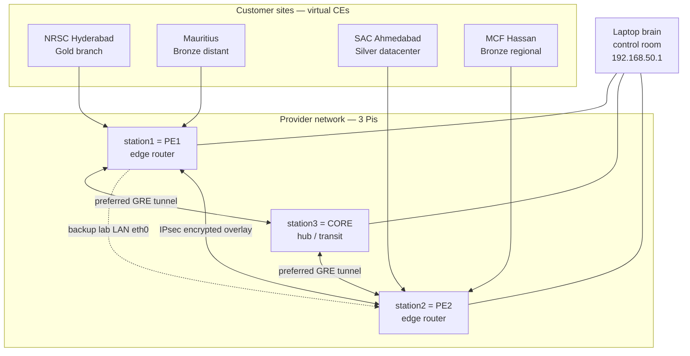

**Roles in plain words**

| Name | Like… | Job |
| --- | --- | --- |
| **PE** (Provider Edge) | ISP edge router at a city | Talks to customer CEs + provider core; applies QoS + IPsec |
| **CORE / P** | Backbone transit | Forwards between PEs; does **not** terminate customer sites |
| **CE** (Customer Edge) | Site router / branch firewall | Owns that site’s LAN and VPN identity |
| **VRF** | Separate routing table | Keeps mission traffic and admin traffic from mixing |
| **netns** | Mini Linux OS network world | Physically isolates one CE from another on the same Pi |

---

## 2. What is physically connected?

All three Pis and the laptop sit on **one lab Ethernet LAN**: `192.168.50.0/24`.

| Device | eth0 address | Role |
| --- | --- | --- |
| `brain` | `192.168.50.1` | Orchestrator / Prom / controller |
| `station1` | `192.168.50.10` | PE1 |
| `station2` | `192.168.50.20` | PE2 |
| `station3` | `192.168.50.30` | CORE |

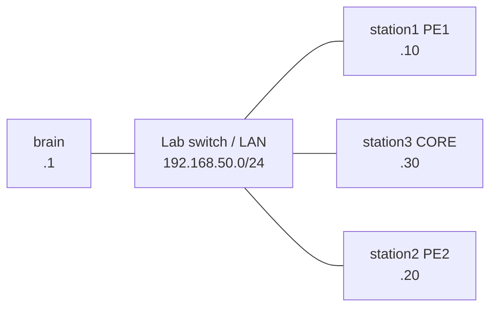

**Important:** that single cable/LAN does **two jobs**:

1. **Management** — SSH, metrics, Telegraf, heal scripts.
2. **Backup underlay** — if the GRE/MPLS preferred path is bad, mission can fall back onto `eth0` (higher OSPF cost = less preferred).

There is **no separate physical cable per site**. Extra “sites” are created with **Linux network namespaces** and **veth virtual cables** inside each PE Pi.

---

## 3. How a router is “established” on a Pi

Each PE Pi boots into layers. Order matters:

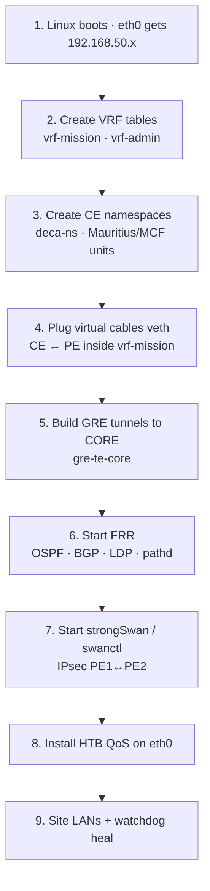

**Cold boot (simple):** power on Pis → wait ≥120 s → on laptop run `check stations` (or `bash lab/deca_diagnostic.sh`).  
Heal/restore: `bash lab/deca_ops.sh heal` · full deploy: `bash lab/deca-deploy.sh`.

Sticky units on each Pi: `deca-ns` → extra CE units → `deca-expansion-boot` → FRR / IPsec → `deca-watchdog`.

---

## 4. What separates each CE?

Four things keep CEs from becoming one big messy network:

### 4.1 Separate Linux namespaces (`netns`)

A **network namespace** is a private set of interfaces, IPs, and routes.  
`ce-a` cannot see `ce-mauritius`’s interfaces even though both live on station1.

| CE netns | Host Pi | Site |
| --- | --- | --- |
| `ce-a` | station1 | NRSC |
| `ce-mauritius` | station1 | Mauritius |
| `ce-b` | station2 | SAC |
| `ce-mcf` | station2 | MCF |

### 4.2 Separate virtual cables (`veth` pairs)

Each CE is plugged into its PE with a **veth pair** (two ends of one virtual Ethernet cable):

| PE side (in `vrf-mission`) | CE side (inside netns) | Attach subnet |
| --- | --- | --- |
| `veth-pe-cea` | `veth-cea-pe` | `10.10.1.0/30` |
| `veth-pe-mauritius…` | … | `10.10.3.0/30` |
| `veth-pe-ceb` | `veth-ceb-pe` | `10.10.2.0/30` |
| `veth-pe-mcf…` | … | `10.10.4.0/30` |

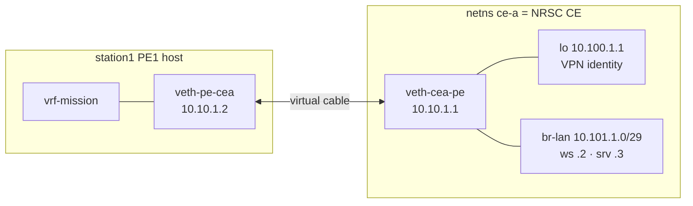

### 4.3 Separate IP identities

| Site | CE loopback (VPN ID) | Site LAN |
| --- | --- | --- |
| NRSC | `10.100.1.1` | `10.101.1.0/29` |
| SAC | `10.100.2.1` | `10.101.2.0/29` |
| Mauritius | `10.100.3.1` | `10.101.3.0/29` (+ ~200 ms delay) |
| MCF | `10.100.4.1` | `10.101.4.0/29` |

Different addresses ⇒ routing can treat them as different sites.

### 4.4 VRF isolation (mission vs admin)

| VRF | What goes here | Path |
| --- | --- | --- |
| **`vrf-mission`** | Site / VPN / TT&C / Payload | Prefer GRE+MPLS; IPsec overlay |
| **`vrf-admin`** | Management-ish / default | Pinned to **`eth0`** — never rides mission MPLS |

So even on the same PE, **customer mission traffic** and **admin underlay** use different routing tables.

**Also:** Mauritius and MCF are **role baselines**, not general fault-injection targets. Fault campaigns mostly stress **NRSC ↔ SAC** (`ce-a` → `10.100.2.1`).

---

## 5. Software stack — what is used for what

These are not Python “libraries” for routing. They are **system services / tools**. Python shows up on the laptop for control and ML.

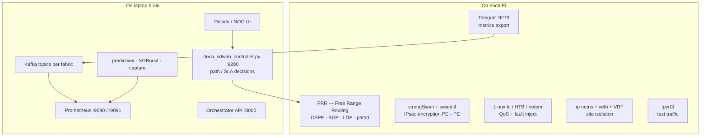

| Tool | Where | What it does in plain terms |
| --- | --- | --- |
| **FRR** (`vtysh`) | Pis | The **router software**. Learns neighbors (OSPF), VPN routes (BGP), labels (LDP), TE paths (`pathd`) |
| **strongSwan / swanctl** | PE1 + PE2 | Builds the **encrypted IPsec tunnel** `deca-sdwan` between edges |
| **Linux VRF** | Pis | Separate routing tables (`vrf-mission` vs `vrf-admin`) |
| **`ip netns` + veth** | Pis | Creates **fake separate site boxes** on one Pi |
| **`tc` HTB** | PE `eth0` | **QoS queues**: TT&C first, Payload next, Best-Effort last |
| **`tc netem`** | GRE / Mauritius link | Adds **delay or loss** for rain-fade / loss faults / distant RTT |
| **iperf3** | CE netns | Generates **real bulk traffic** for util / SLA demos |
| **Telegraf** | Pis `:9273` | Scrapes local stats → Prometheus client |
| **Kafka** | brain | Carries telemetry streams (`sdwan_telemetry_pi` / `_gns3`) |
| **Prometheus** | brain `:9090` Pi / `:9091` GNS3 | Time-series store the models/UI read |
| **SD-WAN controller** | brain `:9280` | Watches SLAs; can **steer path** (GRE vs backup) with hysteresis |
| **Orchestrator / Decide** | brain | Operator workflow + HITL approve/reject |
| **predictive Python** | brain | Capture campaigns, window features, train/eval models |

**FRR daemons (inside FRR), simply:**

| Piece | Job |
| --- | --- |
| **OSPF** | “Who is my neighbor?” — discovers PE/CORE links; cost **5** = prefer GRE, cost **50** = eth0 backup |
| **LDP** | Puts **MPLS labels** on the GRE path so packets can be switched like a label network |
| **BGP (VPNv4)** | Advertises **site/VPN routes** between PEs (AS **65001**; Mauritius CE may speak AS **65013**) |
| **pathd / SR-TE** | Picks a **preferred vs backup engineered path** (BSID 40001 / 40002) |

---

## 6. Paths: preferred vs backup vs encrypted

Three layers people often mix up:

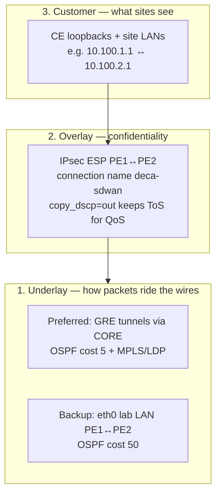

| Layer | Example | Meaning |
| --- | --- | --- |
| Underlay preferred | `gre-te-core` PE1↔CORE↔PE2 | Normal mission path through hub |
| Underlay backup | `eth0` PE1↔PE2 | Direct lab LAN fallback |
| Overlay | IPsec `deca-sdwan` | Encrypts mission between PEs |
| Customer | ping `10.100.2.1` from `ce-a` | “Can NRSC reach SAC?” — the **gold path** check |

CORE **does not** run HTB QoS; it **forwards** and preserves DSCP/ToS so PEs can queue fairly.

---

## 7. Packet walk: NRSC → SAC (happy path)

What happens when NRSC pings SAC loopback `10.100.2.1`:

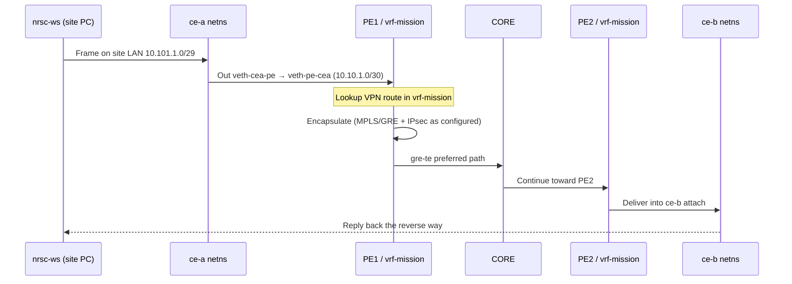

**Gold health check (operators):**

```bash
ssh station1 'sudo ip netns exec ce-a ping -c 3 10.100.2.1'
```

If that works, sites, VRF, GRE/MPLS, and IPsec are basically alive.

---

## 8. Inside one PE (station1) — lines and boxes

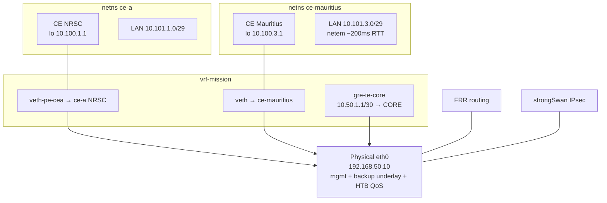

station2 is the mirror for SAC + MCF. station3 is mostly **FRR transit** (OSPF/LDP/BGP-RR + GRE legs), not customer CEs.

---

## 9. QoS in simple terms (why ToS matters)

On PE `eth0`, Linux HTB creates **three lanes**:

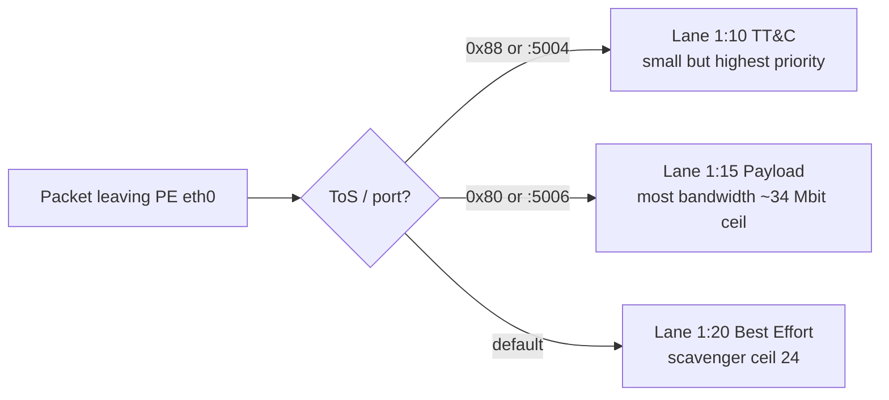

| Lane | Who | Everyday meaning |
| --- | --- | --- |
| TT&C / Gold | Critical control | Always gets through first |
| Payload / Silver | Bulk science / iperf `:5006` | Big pipe, but limited |
| Best Effort / Bronze | Leftover | Can be starved |

The SD-WAN controller watches latency/jitter/loss and can **move traffic** between preferred GRE and backup eth0 when SLAs trip (`enter_k=3` bad samples to switch, `exit_k=10` to return). TT&C wins conflicts.

---

## 10. How the control room manages everything

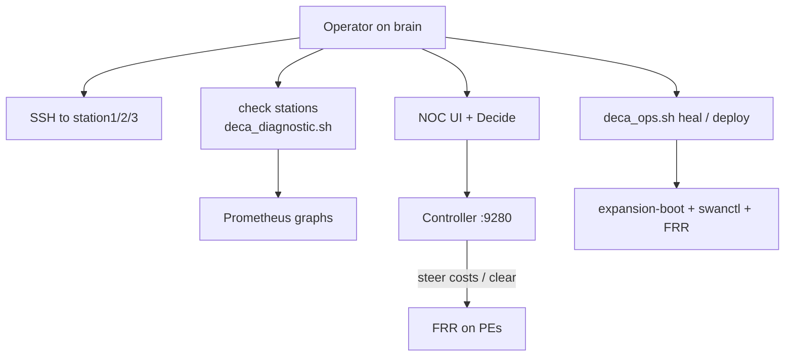

| Need | Command / place |
| --- | --- |
| Health map | `check stations` |
| Heal sticky mess | `bash lab/deca_ops.sh heal` |
| Full rebuild | `bash lab/deca-deploy.sh` |
| Talk to router CLI | `ssh station1` then `sudo vtysh` |
| Enter a CE | `sudo ip netns exec ce-a bash` |
| Bring IPsec up | `lab/deca-swanctl-up.sh` / expansion boot |
| Metrics | Prometheus `:9090` (Pi fabric) |

**SSH hosts** (from laptop `~/.ssh/config`): `station1` `.10`, `station2` `.20`, `station3` `.30`.

---

## 11. Dual fabric note (Pi vs GNS3)

There are **two labs that share the same wire contract** (same ToS → HTB ideas, same VRF names):

| | Pi | GNS3 |
| --- | --- | --- |
| Hardware | 3 real Pis | Many virtual nodes on a PC |
| Prom | `:9090` | `:9091` |
| Kafka topic | `sdwan_telemetry_pi` | `sdwan_telemetry_gns3` |

Do **not** mix their scrapes into one training CSV. Same *policy*, different *physics* (especially CPU and util).

---

## 12. Glossary (fast)

| Term | Simple meaning |
| --- | --- |
| **PE** | Edge router facing customers |
| **CE** | Customer site router (here: a netns) |
| **CORE / P** | Middle transit router |
| **VRF** | Separate routing table |
| **netns** | Isolated network world on one Linux box |
| **veth** | Virtual Ethernet cable with two ends |
| **GRE** | Tunnel that carries packets over another path |
| **MPLS / LDP** | Label switching on the preferred path |
| **IPsec / swanctl** | Encryption between PEs |
| **OSPF cost** | Preference number — lower = better path |
| **HTB** | Bandwidth lanes / priorities on eth0 |
| **DSCP / ToS** | Packet “color” that picks a QoS lane |
| **AAR** | Auto path repair when SLA fails |
| **Gold path** | NRSC `ce-a` → SAC `10.100.2.1` |

---

## 13. One-page mental model

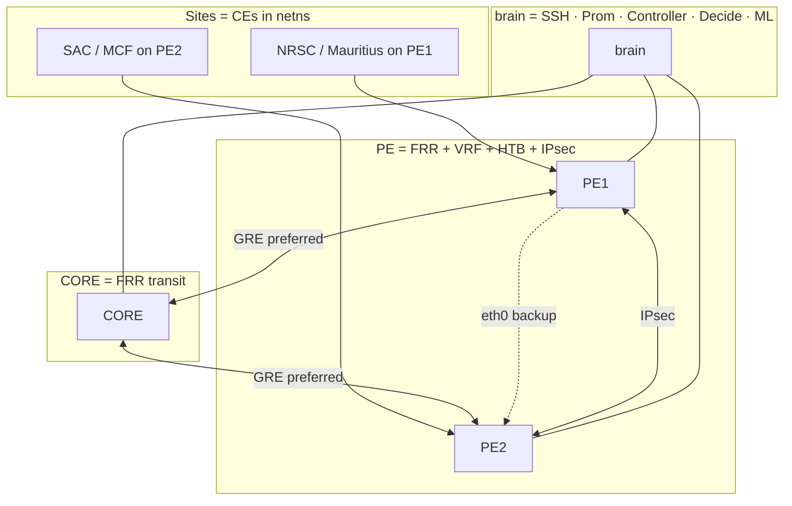

**Remember:**

1. **Cables between Pis** = lab LAN `192.168.50.0/24`.  
2. **Sites** = namespaces + veths + unique `10.100.x.1` / `10.101.x.0/29`.  
3. **Routing brain** = FRR. **Encryption** = strongSwan. **Queues** = `tc` HTB.  
4. **Control room** = laptop services, not the Pis.  
5. **Separation** = netns + different IPs + VRF tables (+ IPsec policy).

For exact systemd unit text and heal recipes, use [`STATION_NETWORK_SETUP.md`](./STATION_NETWORK_SETUP.md). For fault/synthetic signals, use [`SYNTHETIC_DATASET_NETWORK_SPEC.md`](./SYNTHETIC_DATASET_NETWORK_SPEC.md).
