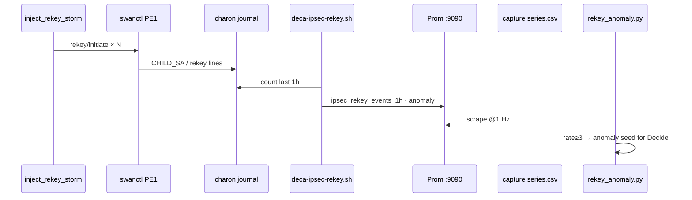

# O2.3 Rekey-storm injector — design only

**Status:** DESIGN LOCKED · **DO NOT LAUNCH** while densify/chaos runs · not in variant campaign yet  
**Goal:** Make `PS13-O2.3` rekey **demo-injectable** — force `ipsec_rekey_events_1h` / `ipsec_rekey_anomaly` to fire on demand, without pretending ambient gauges are a storm.

**Existing pieces (keep):**
- Exporter: [`lab/exporters/deca-ipsec-rekey.sh`](../lab/exporters/deca-ipsec-rekey.sh) → Telegraf `:9273`
- Rules: [`deca-backend/rekey_anomaly.py`](../deca-backend/rekey_anomaly.py) (`REKEY_RATE_1H_THRESHOLD = 3`)
- Series cols: `ipsec_rekey_events_1h`, `ipsec_rekey_anomaly` (already in capture schema / `FEATURE_COLS`)
- Conn: swanctl child **`net`** under `deca-sdwan` (PE1↔PE2)

---

## 1. Why ambient is not enough

Today the exporter counts charon journal lines matching `rekey|CHILD_SA…|IKE_SA…` over 1 h and sets anomaly if count ≥ 3. Lab rekeys are rare and uncontrolled → you cannot schedule a jury “inject → watch Decide light up” moment. Loss/jitter already have injectors; rekey does not.

---

## 2. What “storm” means (success criteria)

| Gate | Pass |
| --- | --- |
| **Counter** | `ipsec_rekey_events_1h` rises by **≥ 3** within the inject window (hits rule threshold) |
| **Flag** | `ipsec_rekey_anomaly` = **1** on Prom + in `series.csv` for ≥ **30 s** continuous |
| **Decide** | `rekey_anomaly.decide_seed_payload` would seed `root_cause=rekey_anomaly` (rules path — not Q2 class) |
| **Mission** | Gold path `ce-a → 10.100.2.1` recovers within **30 s** after inject ends (no sticky blackhole) |
| **Non-goals** | New Q2 severity class · retrain · cite-board change · chaos_final promote |

This is a **rules/demo inject**, not a 14-way Q2 label. Optional later: a campaign recipe that stamps a sidecar `rekey_storm=1` for supervised experiments — still not FEATURE_COLS promote without explicit go.

---

## 3. Mechanism options (pick one primary)

### Preferred: **CHILD_SA rekey / reinitiate cycles** (least collateral)

```text
On station1 (PE1), for N cycles:
  swanctl --rekey --child net     # or --initiate --child net after soft terminate
  sleep PERIOD_SEC
Restore: ensure child UP (swanctl --initiate --child net)
```

| Pros | Cons |
| --- | --- |
| Matches exporter’s journal regex | Needs verification that swanctl emits countable log lines |
| Keeps IKE up more often than full teardown | Brief crypto blip may nudge latency/util |

### Fallback A: **IKE rekey**

`swanctl --rekey --ike deca-sdwan` — heavier; use only if child rekey does not move the 1 h counter.

### Fallback B: **Soft terminate + initiate** (last resort)

`swanctl --terminate --child net` → sleep → `--initiate --child net`.  
Higher risk of path drop; require gold-path gate and refuse if other injects active (same posture as L6 `--force-clear`).

### Rejected

| Idea | Why not |
| --- | --- |
| Fake Prom gauge without swanctl | Dishonest vs O2.3 “tunnel health” |
| Shorten SA lifetime in conf mid-demo | Sticky config drift; fights expansion-boot |
| Run during util densify / chaos | Resource + IPsec conflict with live campaign |

---

## 4. Proposed CLI (script not shipped until post-campaign)

Path (when implemented): `scripts/inject_rekey_storm.sh`

```bash
# DESIGN ONLY — do not create/run against live densify fabric yet
bash scripts/inject_rekey_storm.sh \
  --host station1 \
  --peer station2 \
  --child net \
  --ike deca-sdwan \
  --cycles 6 \
  --period-sec 10 \
  --mode child-rekey \   # child-rekey | ike-rekey | terminate-initiate
  --schedule-out /path/rekey_storm_schedule.jsonl \
  --clear
```

Defaults aimed at clearing threshold 3 with margin: **cycles=6**, **period=10 s** → ~60 s wall, journal should show ≥6 establish/rekey lines → `events_1h ≥ 3` → anomaly=1.

**Safety flags (mandatory in impl):**

- Refuse if `deca` fault injects / util campaign / chaos already hold IPsec (detect pgrep / lockfile).
- Trap EXIT: `--initiate --child net`; verify `swanctl --list-sas` shows INSTALLED.
- Optional `--check-gold`: ping `10.100.2.1` from `ce-a` before/after; fail inject if pre-check down.
- `--clear` only restores; never leaves child down.

**Schedule JSONL** (mirror L3/L5):

```json
{"ts_unix": ..., "cycle": 1, "action": "child_rekey", "child": "net"}
```

---

## 5. Signal path (no new Prom names)



Exporter already sets on-box `anom=1` at ≥3; brain rules refine with SA age reset. **Do not invent parallel gauges.**

---

## 6. Smoke plan (after densify+chaos complete — operator go only)

1. Confirm gold path UP; no other injects.
2. Start short capture (~120 s) on station1 scrape path.
3. Run inject `cycles=6 period=10`.
4. Assert: `events_1h` Δ ≥ 3; `anomaly` residency ≥ 30 s; schedule JSONL has N events.
5. Assert: post gold ping OK; `swanctl --list-sas` healthy.
6. Optional: trigger Decide seed path once (HITL, no auto-approve).
7. `--clear` / EXIT trap verified.

**Wall estimate:** < 5 minutes. Not part of util_clean stamp.

---

## 7. Campaign integration (later, optional)

| Item | Choice |
| --- | --- |
| Variant folder | `L7_rekey_storm` **or** keep outside L0–L6 taxonomy as **demo SOP only** |
| Q2 label | **None** by default — rules alert, not a 14-way class |
| Chaos mix | **Do not** add to 7200 s util-offnom chaos until util story is closed |
| Cite board | Untouched |

Preferred product posture: **runbook + one-shot inject** for jury, same honesty as “rules yes / inject was no” → flip inject to yes without claiming ML detects rekey.

---

## 8. Risks

| Risk | Mitigation |
| --- | --- |
| Journal regex misses swanctl wording | Smoke first; adjust exporter grep **once** if needed (disclose) |
| Rekey blips look like L1/L5 | Keep storm short; don’t train Q2 on it as rain/util |
| Sticky downed SA | EXIT initiate + gold check; watchdog/expansion-boot remains backstop |
| Collision with densify | **Hard ban** until `ACTIVE_DONE` + chaos done |

---

## 9. Implementation checklist (when unblocked)

- [ ] Add `scripts/inject_rekey_storm.sh` with modes + trap + gold check  
- [ ] Smoke on idle Pi fabric (not during campaign)  
- [ ] Confirm Prom + `series.csv` columns move  
- [ ] One Decide seed dry-run (HITL)  
- [ ] Update FINDINGS O2.3 row: gauges **and** injectable demo  
- [ ] Optional: `deca-backend/runbooks/` one-pager for jury  

**Explicit non-goals now:** writing the script into the live densify host path · shortening SA lifetimes in `lab/swanctl/*.conf` · wiring rekey into chaos fractions · promoting any model.

---

## 10. One-liner for the board

> O2.3 rekey remains **rules + ambient gauges** until a post-campaign `inject_rekey_storm` smoke proves we can force `ipsec_rekey_anomaly=1` without killing the gold path — design ready; **not launched**.
