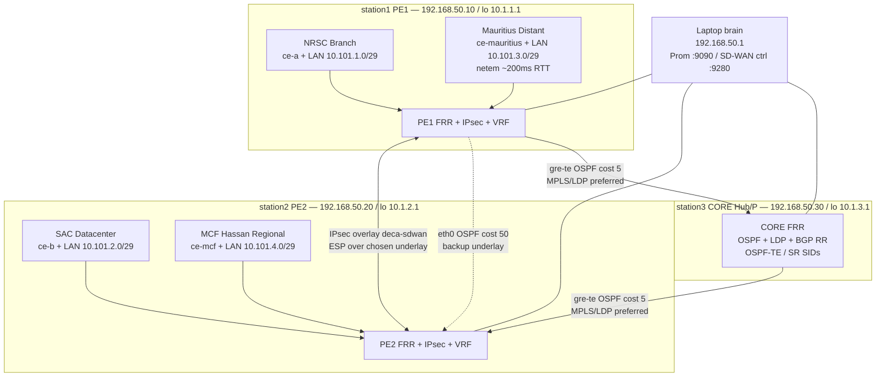
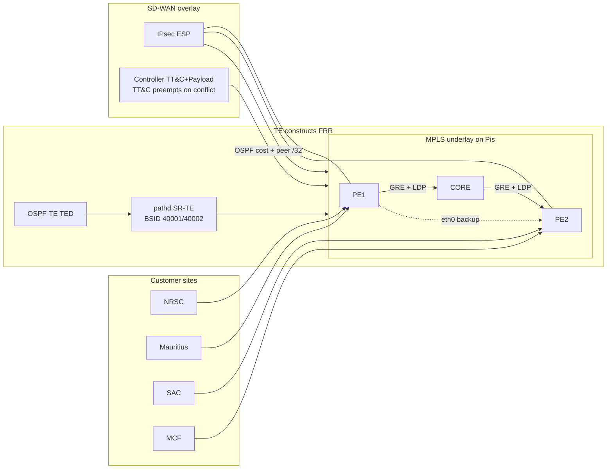
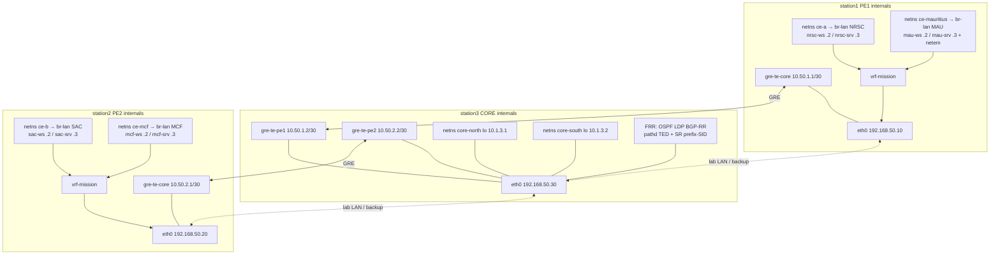

# DECA Station Network Setup

## Start
- To Check the status of the stations 
```bash
check stations
```
---

Physical multi-site SD-WAN/MPLS lab on **three Raspberry Pis** + laptop orchestrator (five functional sites via CE netns). This is the **authoritative station networking reference** for plug-and-play restore and ISRO handover.

**Alignment:** closes `PS13-O1` at lab scale — see [`PROBLEM_STATEMENT_13_FINDINGS.md`](./PROBLEM_STATEMENT_13_FINDINGS.md). Evidence trail: [`NETWORK_EXPANSION_FINDINGS.md`](./NETWORK_EXPANSION_FINDINGS.md).

**Apply / restore everything:**

```bash
# Preferred laptop ops live under lab/ (see lab/README.md)
bash ~/deca-isro/lab/deca-deploy.sh
bash ~/deca-isro/lab/deca_diagnostic.sh   # or: check stations
# bash ~/deca-isro/lab/deca_ops.sh check

# Optional: keep ~/ shortcuts → current lab/ scripts
# bash ~/deca-isro/lab/link_home.sh
```

Cold boot: power-cycle all three Pis, wait **≥120s** (watchdog sleeps 60s), then re-run the diagnostic.

---

## 1. Topology (role-differentiated)

Five functional roles — not equal CEs. Each CE site has an internal `/29` LAN (ws + srv host netns) so traffic originates *inside* the site and exits via the CE:

| Site | Functional role | Host / attachment | Site LAN / hosts | Traffic / latency behavior |
| --- | --- | --- | --- | --- |
| **CORE** | **Hub** (P / backbone) | station3 | — | Path management; minimal self-generated traffic |
| **SAC, Ahmedabad** | **Datacenter** | station2 / `ce-b` → PE2 | `10.101.2.0/29` (`.2` ws, `.3` srv) | Sustained high-volume bulk (iperf) |
| **NRSC, Hyderabad** | **Branch** | station1 / `ce-a` → PE1 | `10.101.1.0/29` | Light / latency-sensitive (voice EF / video AF41) |
| **Mauritius** | **Distant branch** | station1 / `ce-mauritius` → PE1 | `10.101.3.0/29` | `netem` 100 ms/dir → ~200 ms RTT (SAFE Kochi↔Baie Jacotet class) |
| **MCF, Hassan** | **Regional / secondary branch** | station2 / `ce-mcf` → PE2 | `10.101.4.0/29` | Second CE on station2 (multi-site Pi pattern) |

### Sites and Pis (how roles map onto three boxes)



### Planes: underlay, TE, overlay, sites



| Role | Host | Lab LAN | Loopback / RID | CE netns |
| --- | --- | --- | --- | --- |
| PE1 | `station1` | `192.168.50.10/24` | `10.1.1.1` | `ce-a` (NRSC) + `ce-mauritius` (Distant) |
| PE2 | `station2` | `192.168.50.20/24` | `10.1.2.1` | `ce-b` (SAC) + `ce-mcf` (MCF Hassan) |
| CORE / Hub | `station3` | `192.168.50.30/24` | `10.1.3.1` (host) | — |
| Laptop / desktop | `brain` | `192.168.50.1/24` | — | — |

### Dual-core P fabric (optional — **not applied**)

Design scripts (`lab/deca_dual_core_bootstrap.sh`) can split station3 into CORE-NORTH / CORE-SOUTH netns. **As-built lab uses a single CORE** at `10.1.3.1` with GRE legs `gre-te-pe1` / `gre-te-pe2`. Do not claim dual netns until `ip netns list` shows them **and** LDP inside each netns is real.

| Logical (design only) | netns | Loopback | Role |
| --- | --- | --- | --- |
| **CORE-NORTH** | `core-north` | `10.1.3.1` | West/North transit (SAC affinity) |
| **CORE-SOUTH** | `core-south` | `10.1.3.2` | South transit (NRSC / MCF affinity) |

### VRFs & path policy (summary)

| VRF | Traffic | Underlay |
| --- | --- | --- |
| `vrf-mission` | TT&C + Payload (AAR) | Preferred `gre-te-core` (OSPF 5), backup `eth0` (OSPF 50), always IPsec ESP |
| `vrf-admin` *(PS13: vrf-default)* | Administrative / default | **Pinned to `eth0`** — never on mission MPLS core |

Full aerospace policy catalog (AAR SLAs, QoS, security, hysteresis, HITL, air-gap):
[`EDGE_POLICY_LAYERS.md`](./EDGE_POLICY_LAYERS.md).
End-to-end process (management → CE/AAR/IPsec → PE/VRF/P → DC):
[`DECA_SDWAN_PROCESS_FLOW.md`](./DECA_SDWAN_PROCESS_FLOW.md).

### Inside each Pi (namespaces and tunnels)



**SSH (`~/.ssh/config`):**

```
Host station1
    HostName 192.168.50.10
    User station1

Host station2
    HostName 192.168.50.20
    User station2

Host station3
    HostName 192.168.50.30
    User station3
```

**IPsec overlay:** `deca-sdwan` between PE1↔PE2. Traffic selectors include CE attach, loopbacks, and site LANs (incl. Mauritius + MCF):

`10.10.1/30 10.100.1.1 10.10.3/30 10.100.3.1 10.101.1/29 10.101.3/29  ===  10.10.2/30 10.100.2.1 10.10.4/30 10.100.4.1 10.101.2/29 10.101.4/29`

**Traffic engineering (`PS13-O1.2`):** OSPF-TE TED + pathd SR-TE (not RSVP — unavailable in FRR 10.6). PE1 policy `pe1-to-pe2-te` BSID **40001** (preferred GRE / backup eth0); PE2 BSID **40002**. Apply/verify: `lab/deca_expand_phase_te.sh`, `lab/deca_te_verify.sh`. HTB is **QoS**, not TE.

**SD-WAN path controller (`PS13-O1.3` / `D4`):** laptop `lab/deca_sdwan_controller.py` —
TT&C (ToS `0x88`, SLA ≤25 ms / ≤5 ms / ≤0.1%) + Payload (ToS `0x80`, ≤80 / ≤15 / ≤2%);
`enter_k=3` / `exit_k=10`; TT&C preempts on conflict; metrics `:9280`.
Traffic: **iperf3 only** (`lab/deca_iperf_qos_traffic.sh`) — **no Cisco TRex**.
QoS: `lab/deca_htb_qos.sh` (LLQ + 70% Payload + RED@85%). IPsec: `copy_dscp=out`.
Policy catalog: [`EDGE_POLICY_LAYERS.md`](./EDGE_POLICY_LAYERS.md).
Verify: `lab/deca_sdwan_verify.sh` · VRF check: `lab/deca_vrf_isolation_check.sh`.

**Security:** WAN mission traffic is IPsec-only (`deca-sdwan`); cleartext underlay drop;
`vrf-mission` ⟂ `vrf-admin`; TT&C fail-closed if backup crypto fails.

**Diagnostic gold path:** from `ce-a`, `ping 10.100.2.1` (script: `lab/deca_diagnostic.sh`). Site-LAN: `ip netns exec nrsc-ws ping 10.101.2.2`. MCF: `ip netns exec mcf-ws ping 10.101.1.2`. Mauritius: from `mau-ws`, expect ~200+ ms.

**Fault injectors:** existing PE1/PE2 injectors stay on NRSC/SAC paths. Mauritius and MCF are **not** fault-injection targets (role/distance baselines ≠ fault).

**Expand / cold boot:**

```bash
bash lab/deca_expand_phase_g.sh          # site LANs + MCF Hassan
bash lab/deca_expand_phase_h.sh          # voice/video/data QoS measure
bash lab/deca_expand_phase_te.sh         # OSPF-TE + pathd SR-TE (PS13-O1.2)
bash lab/deca_te_verify.sh               # TED + SR-TE preferred/backup proof
bash lab/deca_install_expansion_boot.sh  # or: bash lab/deca_ops.sh install-boot
systemctl --user enable --now deca_sdwan_controller.service
bash lab/deca_sdwan_verify.sh            # multi-class path switch/recover
# After power-cycle (≥120s): check stations   # or: bash lab/deca_diagnostic.sh
```

Boot order on each Pi: `deca-ns` → `deca-ns-mauritius` (PE1) / `deca-ns-mcf` (PE2) → `deca-expansion-boot` (VRF/GRE/HTB/MPLS/SR-TE heal/site-LANs) → FRR/IPsec → `deca-watchdog` (+60s heal).
---

## 2. Addressing cheat sheet

| Prefix / address | Where | Purpose |
| --- | --- | --- |
| `192.168.50.0/24` | eth0 all nodes | Management / Telegraf / SSH |
| `10.1.1.1`, `10.1.2.1`, `10.1.3.1` | PE/CORE loopbacks | OSPF / BGP / LDP router-IDs |
| `10.10.1.0/30` | PE1 ↔ ce-a (NRSC) | Local Branch attachment |
| `10.10.2.0/30` | PE2 ↔ ce-b (SAC) | Local Datacenter attachment |
| `10.10.3.0/30` | PE1 ↔ ce-mauritius | Distant branch attachment (+ netem 100 ms/dir; SAFE-referenced ~200 ms RTT) |
| `10.10.4.0/30` | PE2 ↔ ce-mcf (MCF Hassan) | Regional branch attachment |
| `10.100.1.1/32` | ce-a `lo` | NRSC Branch VPN identity |
| `10.100.2.1/32` | ce-b `lo` | SAC Datacenter VPN identity |
| `10.100.3.1/32` | ce-mauritius `lo` | Mauritius Distant VPN identity |
| `10.100.4.1/32` | ce-mcf `lo` | MCF Hassan VPN identity |
| `10.101.1.0/29` | NRSC internal LAN | ws `.2` / srv `.3` (host netns) |
| `10.101.2.0/29` | SAC internal LAN | ws `.2` / srv `.3` |
| `10.101.3.0/29` | Mauritius internal LAN | ws `.2` / srv `.3` |
| `10.101.4.0/29` | MCF internal LAN | ws `.2` / srv `.3` |
| `vrf-mission` | PE1 / PE2 | Mission VRF for CE traffic |
| Telegraf | each Pi `:9273` | Prometheus scrape |
| Route-target | `65001:100` | VPN RT (campaign / FRR) |

---

## 3. Services per station

| Unit | station1 | station2 | station3 |
| --- | :---: | :---: | :---: |
| `deca-ns.service` | ✓ CE-A (NRSC) | ✓ CE-B (SAC) | — |
| `deca-ns-mauritius.service` | ✓ Distant branch | — | — |
| `deca-mauritius-bgp.service` | ✓ BGP AS 65013 | — | — |
| `deca-vrf-up.service` | ✓ | ✓ | — |
| `deca-expansion-boot.service` | ✓ GRE/HTB/Mauritius heal | ✓ GRE/HTB | ✓ GRE |
| `frr.service` | ✓ | ✓ | ✓ |
| `strongswan-starter` | ✓ | ✓ | — |
| `telegraf` | ✓ | ✓ | ✓ |
| `chrony` | ✓ | ✓ | ✓ |
| `deca-watchdog.service` | ✓ (+expansion heal) | ✓ | ✓ |

Ordering on PE1/PE2:

- `deca-ns` **Before** `frr` and `strongswan-starter`
- `frr` / `strongswan-starter` **Requires** + **After** `deca-ns` (drop-ins)

---

## 4. Systemd units (code)

### 4.1 station1 — `/etc/systemd/system/deca-ns.service`

```ini
[Unit]
Description=Setup CE-A Network Namespace
After=systemd-networkd.service network-online.target
Wants=network-online.target
Before=frr.service strongswan-starter.service

[Service]
Type=oneshot
RemainAfterExit=yes
Restart=on-failure
RestartSec=2
ExecStartPre=/bin/bash -c "ip link del veth-pe-cea 2>/dev/null; ip link del veth-pe-ce1 2>/dev/null; ip netns del ce-1 2>/dev/null; for i in 1 2 3 4 5; do ip netns del ce-a 2>/dev/null; ip netns list | grep -q \"^ce-a\" || break; sleep 0.5; done; true"
ExecStart=/bin/bash -c "ip netns add ce-a && ip link add veth-pe-cea type veth peer name veth-cea-pe && ip link set veth-cea-pe netns ce-a && ip link set veth-pe-cea master vrf-mission && ip addr add 10.10.1.2/30 dev veth-pe-cea && ip link set veth-pe-cea up && ip netns exec ce-a ip addr add 10.10.1.1/30 dev veth-cea-pe && ip netns exec ce-a ip link set veth-cea-pe up && ip netns exec ce-a ip link set lo up && ip netns exec ce-a ip addr add 10.100.1.1/32 dev lo && ip netns exec ce-a ip route add default via 10.10.1.2 && ip rule add from 10.100.2.1/32 iif eth0 lookup 100 && sysctl -w net.ipv4.conf.veth-pe-cea.forwarding=1 && ip netns exec ce-a iptables -F && ip netns exec ce-a iptables -P INPUT ACCEPT && ip netns exec ce-a iptables -P OUTPUT ACCEPT && ip netns exec ce-a iptables -P FORWARD ACCEPT"
ExecStop=/bin/bash -c "ip netns del ce-a 2>/dev/null; ip link del veth-pe-cea 2>/dev/null; true"

[Install]
WantedBy=multi-user.target
```

**Must have exactly one `ExecStartPre=`.** Duplicate lines (from blind `sed` patches) discard the real cleanup and break boot.

### 4.2 station2 — `/etc/systemd/system/deca-ns.service`

```ini
[Unit]
Description=Setup CE-B Network Namespace
After=systemd-networkd.service network-online.target
Wants=network-online.target
Before=frr.service strongswan-starter.service

[Service]
Type=oneshot
RemainAfterExit=yes
Restart=on-failure
RestartSec=2
ExecStartPre=/bin/bash -c "ip link del veth-pe-ceb 2>/dev/null; ip link del veth-pe-ce2 2>/dev/null; ip netns del ce-2 2>/dev/null; for i in 1 2 3 4 5; do ip netns del ce-b 2>/dev/null; ip netns list | grep -q \"^ce-b\" || break; sleep 0.5; done; true"
ExecStart=/bin/bash -c "ip netns add ce-b && ip link add veth-pe-ceb type veth peer name veth-ceb-pe && ip link set veth-ceb-pe netns ce-b && ip link set veth-pe-ceb master vrf-mission && ip addr add 10.10.2.2/30 dev veth-pe-ceb && ip link set veth-pe-ceb up && ip netns exec ce-b ip addr add 10.10.2.1/30 dev veth-ceb-pe && ip netns exec ce-b ip link set veth-ceb-pe up && ip netns exec ce-b ip link set lo up && ip netns exec ce-b ip addr add 10.100.2.1/32 dev lo && ip netns exec ce-b ip route add default via 10.10.2.2 && ip rule add to 10.100.2.1/32 lookup 100 && ip rule add to 10.10.2.0/30 lookup 100 && ip netns exec ce-b sysctl -w net.ipv4.conf.veth-ceb-pe.forwarding=1 && ip netns exec ce-b iptables -F && ip netns exec ce-b iptables -P INPUT ACCEPT && ip netns exec ce-b iptables -P FORWARD ACCEPT && ip netns exec ce-b iperf3 -s -D"
ExecStop=/bin/bash -c "ip netns del ce-b 2>/dev/null; ip link del veth-pe-ceb 2>/dev/null; true"

[Install]
WantedBy=multi-user.target
```

### 4.3 FRR / strongSwan drop-ins (PE1 + PE2)

`/etc/systemd/system/frr.service.d/override.conf` and  
`/etc/systemd/system/strongswan-starter.service.d/override.conf`:

```ini
[Unit]
After=deca-ns.service
Requires=deca-ns.service
```

### 4.4 Watchdog — `/etc/systemd/system/deca-watchdog.service`

```ini
[Unit]
Description=DECA Post-Boot Self-Healing Watchdog
After=frr.service network-online.target deca-ns.service
Wants=network-online.target

[Service]
Type=oneshot
ExecStartPre=/bin/sleep 60
ExecStart=/usr/local/sbin/deca-watchdog.sh

[Install]
WantedBy=multi-user.target
```

(On station3, `After=` omits `deca-ns.service`; script only heals FRR + Telegraf.)

### 4.5 Watchdog script — PE `/usr/local/sbin/deca-watchdog.sh`

```bash
#!/bin/bash
set -e
systemctl reset-failed
systemctl is-active --quiet deca-ns.service 2>/dev/null || systemctl restart deca-ns.service 2>/dev/null || true
sleep 2
systemctl is-active --quiet frr || systemctl restart frr
systemctl is-active --quiet strongswan-starter 2>/dev/null || systemctl restart strongswan-starter 2>/dev/null || true
systemctl is-active --quiet telegraf || systemctl restart telegraf
IP=$(ip -4 -br addr show eth0 2>/dev/null | awk '{print $3}' | cut -d/ -f1)
case "$IP" in
  192.168.50.10)
    vtysh -c "configure terminal" -c "vrf vrf-mission" \
      -c "ip route 10.100.2.1/32 192.168.50.20 nexthop-vrf default" \
      -c "ip route 10.10.2.0/30 192.168.50.20 nexthop-vrf default" \
      -c "exit" -c "exit" -c "write" >/dev/null 2>&1 || true
    ;;
  192.168.50.20)
    vtysh -c "configure terminal" -c "vrf vrf-mission" \
      -c "ip route 10.100.1.1/32 192.168.50.10 nexthop-vrf default" \
      -c "ip route 10.10.1.0/30 192.168.50.10 nexthop-vrf default" \
      -c "exit" -c "exit" -c "write" >/dev/null 2>&1 || true
    ;;
esac
```

**Why `systemctl reset-failed` every boot:** a June-era `deca-ns` / `strongswan` dependency failure can stick in systemd state and silently block IPsec on later boots even when units look “fine.”

---

## 5. BGP VPNv4 native L3VPN (FRR 10 `ipv4 vpn`)

Cross-PE mission prefixes are learned via **BGP VPNv4** (CORE RR `10.1.3.1`), not VRF static safety-nets.

| Check | Expect |
| --- | --- |
| `show bgp ipv4 vpn summary` | Peer `10.1.3.1` **Established**, PfxRcd **> 0** (typically 6) |
| RD / RT | `65001:100` both PEs (`rd vpn export` + `rt vpn both`) |
| VRF RIB | `B>` routes for remote CE/site prefixes via PE lo + MPLS labels |
| LDP | `mpls ldp` on **eth0 and gre-te-*** (IGP prefers GRE; LDP must follow) |

`show ip bgp summary` may still show **NoNeg** on ipv4 unicast toward CORE — that is intentional (RR activates **ipv4 vpn** only).

Local CE-facing statics (e.g. `10.100.2.1 via 10.10.2.1`) stay; **do not** reinstall `nexthop-vrf default` routes to the remote PE.

Verify:

```bash
ssh station1 'sudo vtysh -c "show bgp ipv4 vpn summary"'
ssh station1 'sudo vtysh -c "show ip route vrf vrf-mission"'
ssh station1 'sudo ip netns exec ce-a ping -c 3 10.100.2.1'
```

Boot restore: `deca-expansion-boot.sh` enables MPLS/LDP on GRE and re-asserts OSPF-TE / SR-TE (`ensure_te`). Historical static safety-net docs below are **obsolete** except as emergency rollback.

<details><summary>Emergency rollback (static safety-net)</summary>

```bash
# PE1 only if BGP/LDP broken:
sudo vtysh -c "configure terminal" -c "vrf vrf-mission" \
  -c "ip route 10.100.2.1/32 192.168.50.20 nexthop-vrf default" \
  -c "ip route 10.10.2.0/30 192.168.50.20 nexthop-vrf default" \
  -c "exit" -c "exit" -c "write"
```

</details>

---

## 6. Laptop Prometheus

`/etc/prometheus/prometheus.yml`:

```yaml
global:
  scrape_interval: 5s
  evaluation_interval: 5s

scrape_configs:
  - job_name: "deca_edge_nodes"
    static_configs:
      - targets: ["192.168.50.10:9273", "192.168.50.20:9273"]

  - job_name: "deca_core_router"
    static_configs:
      - targets: ["192.168.50.30:9273"]
```

Telegraf on Pis uses `[[outputs.prometheus_client]]` with `metric_version = 2` on port **9273**.

### Known failure: `lastError=out of bounds` while `:9273` curls OK

Usually poisoned TSDB after a clock jump. Wipe + **correct ownership** (service `User=prometheus`):

```bash
sudo systemctl stop prometheus
sudo rm -rf /var/lib/prometheus/metrics2/*
sudo mkdir -p /var/lib/prometheus/metrics2
sudo chown -R prometheus:prometheus /var/lib/prometheus/metrics2
sudo chmod 0755 /var/lib/prometheus/metrics2
sudo systemctl reset-failed prometheus
sudo systemctl start prometheus
curl -s localhost:9090/-/ready
curl -s localhost:9090/api/v1/targets
```

If owned by `nobody`, Prometheus panics: `queries.active: permission denied`.

---

## 7. Hostnames

Telegraf tags `host=` from hostname. station2 historically stuck as `ubuntu`.

```bash
sudo hostnamectl set-hostname station1   # on .10
sudo hostnamectl set-hostname station2   # on .20
sudo hostnamectl set-hostname station3   # on .30
sudo systemctl restart telegraf
```

(Deploy script does this automatically.)

---

## 8. Verify (expected green)

```bash
bash lab/deca_diagnostic.sh
# or, after lab/link_home.sh: bash ~/deca_diagnostic.sh
```

| Step | Expect |
| --- | --- |
| [1/8] L3 | All three UPS |
| [2/8] NTP | chrony tracking OK |
| [3/8] OSPF | Full neighbors |
| [4/8] BGP | `show bgp ipv4 vpn summary` — PfxRcd>0 (unicast NoNeg toward CORE is OK) |
| [5/8] LDP | ACTIVE & POPULATED |
| [6/8] IPsec | one `deca-sdwan` ESTABLISHED |
| [7/8] VPN | `VPN Path time=…` to `10.100.2.1` |
| [8/8] Prom | `3 / 3` |

Helpers:

| Script | Role |
| --- | --- |
| `lab/deca-deploy.sh` | Full plug-and-play (laptop ops pack) |
| `lab/deca_ops.sh` | Unified check / heal / install-boot |
| `lab/deca_diagnostic.sh` | Master health check (`check stations`) |
| `lab/run_traffic.sh` | Laptop iperf (not during fault campaigns) |
| `scripts/deca_deploy_stations.sh` | Alternate deploy packaging |
| `scripts/deca_fix_prom_vpn.sh` | Prom TSDB wipe (+ VPN verify) |
| `lab/archive/pre-expansion/` | Superseded helpers (check_step7, heal, startupppp, …) |

---

## 9. Campaign note

Do **not** run laptop `lab/run_traffic.sh` during `deca_fault_campaign.py` — it fights eth0 baseline iperf on the VPN path. Use campaign traffic only.

Fault campaign SSH targets: `station1@192.168.50.10`, `station2@192.168.50.20`, `station3@192.168.50.30` (`scripts/deca_fault_campaign.py`).

---

## 10. Related docs

- Architecture / ML: [`what_is_this.md`](what_is_this.md)
- Blind live-network test: [`DECA_BLIND_TEST.md`](DECA_BLIND_TEST.md)
- Lab laptop ops pack: [`../lab/README.md`](../lab/README.md)
- Data generation: [`DATA_GEN.md`](DATA_GEN.md)
- Prior failure log (duplicates, MOBIKE, DNS): `~/deca-workspace/troubleshooting.md` (if present)
- Model blueprint: [`DECA_Model_Development_Blueprint.md`](DECA_Model_Development_Blueprint.md)

## 11. Breakdown

If validation breaks at **stage 6** (IPsec / VPN path), redeploy then re-check:

```bash
bash ~/deca-isro/lab/deca-deploy.sh
bash ~/deca-isro/lab/deca_diagnostic.sh
```

### IP addresses inside `deca_deploy_stations.sh`

Lab LAN form: `192.168.50.x`

| Station | Role | `x` | Address |
| --- | --- | ---: | --- |
| `station1` | PE1 | **10** | `192.168.50.10` |
| `station2` | PE2 | **20** | `192.168.50.20` |
| `station3` | CORE | **30** | `192.168.50.30` |
| laptop | management | **1** | `192.168.50.1` |

The deploy script SSHs to `station1` / `station2` / `station3`, then branches VRF safety-net routes by reading each PE’s eth0 address:

```bash
# pattern inside the watchdog / vtysh blocks
IP=$(ip -4 -br addr show eth0 | awk '{print $3}' | cut -d/ -f1)
case "$IP" in
  192.168.50.10)  # PE1 — peer is x=20
      vtysh ... "ip route 10.100.2.1/32 192.168.50.20 nexthop-vrf default" ...
      ;;
  192.168.50.20)  # PE2 — peer is x=10
      vtysh ... "ip route 10.100.1.1/32 192.168.50.10 nexthop-vrf default" ...
      ;;
esac
```

VPN check target (CE-B loopback): `10.100.2.1` (ping from `ce-a` on PE1).
