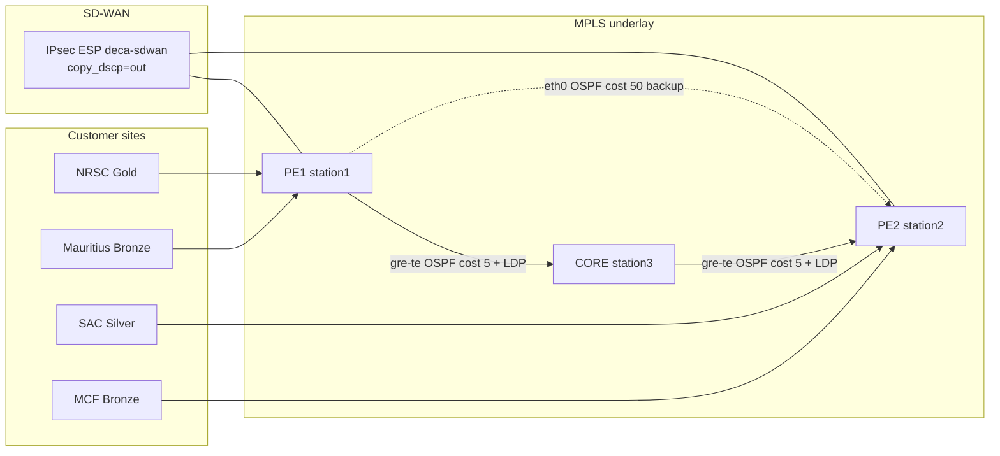

# DECA Network Spec for Synthetic Fault Datasets

**Purpose:** One self-contained reference so you can generate synthetic `series.csv` / Q2 windows that match the faults DECA predicts — without inventing topology, labels, or physics that the real lab does not exhibit.

**Scope:** Pi fabric (authoritative for training physics) + GNS3 twin deltas that matter for transfer claims. Cite board / promote discipline is **out of scope** here; this is a network + label + signal contract for data generation.

**Beginner topology (how routers/CEs/software fit together):** [`NETWORK_HOW_IT_WORKS.md`](./NETWORK_HOW_IT_WORKS.md)

**Authoritative sources (do not diverge):**
[`STATION_NETWORK_SETUP.md`](./STATION_NETWORK_SETUP.md) · [`CAPTURE_CONTRACT.md`](./CAPTURE_CONTRACT.md) · [`METRIC_DATA_SAMPLES.md`](./METRIC_DATA_SAMPLES.md) · [`DECA_COMPLETE_MERMAID_MAPS.md`](./DECA_COMPLETE_MERMAID_MAPS.md) · `predictive/severity_label.py` · `predictive/severity_bands.py` · `predictive/variant_recipes.py` · `predictive/q2_windows.py` · `scripts/inject_*.sh` · `lab/deca_htb_qos.sh`

---

## 0. How to use this doc for synthesis

Generate data in this order:

1. **Emit 1 Hz rows** with the `series.csv` schema (§4).
2. **Apply one fault recipe** (§6–7) with the correct primary signal trajectory.
3. **Stamp per-row severity** with Pi bands (§5), then build **30 s windows / stride 5** (§8).
4. Respect **physics constraints** (§9) — especially util (L5) and asymmetry.
5. Keep **COMPOUND** as multi-signal rows with a single dominant root for Q2 (§10).
6. If claiming GNS3 transfer, apply **twin gaps** (§11) — do not copy Pi absolute CPU/util bands onto shared-host virtual nodes.

Synthetic data that violates §9 will train models that fail on real Pi capture.

---

## 1. Lab topology (Pi fabric)

### 1.1 Hosts

| Role | Host | Lab LAN | Loopback / RID | CE namespaces |
| --- | --- | --- | --- | --- |
| PE1 | `station1` | `192.168.50.10/24` | `10.1.1.1` | `ce-a` (NRSC), `ce-mauritius` |
| PE2 | `station2` | `192.168.50.20/24` | `10.1.2.1` | `ce-b` (SAC), `ce-mcf` |
| CORE (P) | `station3` | `192.168.50.30/24` | `10.1.3.1` | — (single CORE as-built) |
| Orchestrator | `brain` | `192.168.50.1/24` | — | Prom `:9090`, controller `:9280` |

Dual CORE-NORTH/SOUTH netns is **design-only** on Pi (not applied). GNS3 may have dual-P.

### 1.2 ISRO-style sites

| Site | Role / class | Attachment | Site LAN | Inject role |
| --- | --- | --- | --- | --- |
| **NRSC Hyderabad** | Branch · Gold | station1 / `ce-a` | `10.101.1.0/29` (ws `.2`, srv `.3`) | Primary inject source |
| **SAC Ahmedabad** | Datacenter · Silver | station2 / `ce-b` | `10.101.2.0/29` | Inject sink (`10.100.2.1`) |
| **Mauritius** | Distant · Bronze | station1 / `ce-mauritius` | `10.101.3.0/29` | L6 rogue; netem **100 ms/dir → ~200 ms RTT**; **not** general L1–L5 target |
| **MCF Hassan** | Regional · Bronze | station2 / `ce-mcf` | `10.101.4.0/29` | Baseline only — not inject target |

### 1.3 Attachment and VPN identities

| Prefix | Purpose |
| --- | --- |
| `10.10.1.0/30` | PE1 ↔ `ce-a` (`veth-pe-cea` / `veth-cea-pe`) |
| `10.10.2.0/30` | PE2 ↔ `ce-b` |
| `10.10.3.0/30` | PE1 ↔ `ce-mauritius` (+ distant netem) |
| `10.10.4.0/30` | PE2 ↔ `ce-mcf` |
| `10.100.1.1/32` | CE-A (NRSC) loopback |
| `10.100.2.1/32` | CE-B (SAC) loopback — **gold path ping / util dst** |
| `10.100.3.1/32` | Mauritius loopback |
| `10.100.4.1/32` | MCF loopback |

Diagnostic gold path: `ce-a` → ping `10.100.2.1`.

### 1.4 Underlay, TE, overlay



| Construct | Value |
| --- | --- |
| GRE PE1↔CORE | PE1 `gre-te-core` `10.50.1.1/30` ↔ CORE `gre-te-pe1` `10.50.1.2/30` |
| GRE PE2↔CORE | PE2 `gre-te-core` `10.50.2.1/30` ↔ CORE `gre-te-pe2` `10.50.2.2/30` |
| Preferred path | GRE + LDP, OSPF cost **5** |
| Backup underlay | `eth0` PE1↔PE2, OSPF cost **50** |
| Overlay | IPsec `deca-sdwan` PE1↔PE2 (ESP always for mission) |
| Mission VRF | `vrf-mission` (TT&C + Payload) |
| Admin VRF | `vrf-admin` (PS13: vrf-default) — **pinned eth0**, never mission MPLS |
| Provider BGP AS | **65001** (PE/CORE iBGP; RT `65001:100`) |
| Mauritius CE BGP | **AS 65013** ↔ PE AS 65001 in `vrf-mission` |
| SR-TE BSIDs | **40001** preferred / **40002** backup |
| Default BGP flap neighbor | `10.1.3.1` (CORE) from station1 |

**Fault inject locus (default):** station1 `gre-te-core` for L1/L3/L4; station1 CPU for L2; `ce-a`→`10.100.2.1:5006` for L5; `ce-mauritius` rogue + `ce-a` TT&C for L6.

---

## 2. QoS, ToS, and SLA budgets

### 2.1 HTB on PE `eth0` (parent **40 mbit**)

From `lab/deca_htb_qos.sh`:

| Class | Match | rate | ceil | prio | Role |
| --- | --- | --- | --- | --- | --- |
| **1:10** TT&C | ToS `0x88` (136), also EF `0xb8`, dport **5004** | **2 mbit** | **40 mbit** | 1 | Strict priority / LLQ-like |
| **1:15** Payload | ToS `0x80` (128), dport **5006** | **~28 mbit** (70%) | **~34 mbit** (85%) + RED | 2 | Bulk / util inject class |
| **1:20** BE | default | **5 mbit** | **24 mbit** (60%) | 5 | Scavenger |

CORE: **no HTB** — preserve DSCP only.

### 2.2 AAR / class SLAs (Decide budgets)

| Class | Latency | Jitter | Loss | Availability target |
| --- | --- | --- | --- | --- |
| TT&C / Gold | ≤ **25 ms** | ≤ **5 ms** | ≤ **0.1%** | 99.9% |
| Payload / Silver | ≤ **80 ms** | ≤ **15 ms** | ≤ **2%** | 99.5% |
| Admin / Bronze | looser | — | — | 90% |

Priority: **TT&C/Gold > Payload/Silver > Admin/Bronze**.

Q1 breach thresholds used in training: latency **25 ms**, loss **2%**, jitter **5 ms**, util = **scheduled HTB ceil** (not a fixed Mbps alone).

### 2.3 Critical util physics (must model)

CE→PE util traffic is **IPsec/MPLS-encapped** on PE `eth0`. PE `1:15` ToS/port filters often **miss** encapped packets → traffic lands in **BE `1:20`** (nominal ceil **24**).

Honest L5 inject therefore:

1. Continuous iperf offer ≥ **2× `end_mbit`** on `:5006`.
2. Shape on CE **`veth-cea-pe`** (pre-IPsec).
3. Temporarily lift PE **`1:20` ceil → 40**; restore **5/24** after.
4. Keep `end_mbit` ≤ soft payload ceil **~34** on 40 Mbit parent.
5. Write schedule `htb_payload_ceil_mbps` — labels use schedule, not raw eth0 alone.

Post–BE-lift measured ratio `util_gre_mbps / ceil ≈ 1.07` (encap overhead) across ends 12…34.

---

## 3. What the model predicts (fault taxonomy)

### 3.1 Root labels (Q2 family)

| Root ID | Folder / name | Meaning |
| ---: | --- | --- |
| 0 | `L0_normal` / `normal` | Healthy baseline |
| 1 | `L1_rain_fade` / `physical_degradation` | Physical / rain fade (GRE delay) |
| 2 | `L2_cpu_stress` / `crypto_cpu_exhaustion` | CPU exhaustion |
| 3 | `L3_bgp_flap` / `route_flap` | BGP soft-clear / flap storm |
| 4 | `L4_loss_progression` / `loss_progression` | GRE loss ramp |
| 5 | `L5_util_congestion` / `util_congestion` | Payload-class congestion vs ceil |
| 6 | `L6_ce_sla` / `ce_sla_conflict` | Bronze rogue vs gold TT&C |

### 3.2 Severity IDs (14-way Q2)

`SEVERITY_ORDER` index = model class ID:

| ID | Severity | Name | Primary Pi band |
| ---: | --- | --- | --- |
| 0 | `0` | normal | — |
| 1 | `1A` | physical_early | GRE latency **10–19 ms** |
| 2 | `1B` | physical_critical | **19–25 ms** |
| 3 | `1C` | physical_breach | **≥ 25 ms** |
| 4 | `2A` | cpu_moderate | `cpu_usage_user` **40–70%** |
| 5 | `2B` | cpu_severe | **≥ 70%** |
| 6 | `3A` | bgp_mild | 10 s flap rate **0.2–1.0**/s |
| 7 | `3B` | bgp_severe | **≥ 1.0**/s |
| 8 | `4A` | loss_moderate | GRE loss **0.5–2%** |
| 9 | `4B` | loss_breach | **≥ 2%** |
| 10 | `5A` | util_elevated | scheduled ceil ∈ **`[0.5·end, end)`** (Mbps fallback 20–35) |
| 11 | `5B` | util_near_ceil | scheduled ceil **≥ end** (Mbps fallback ≥35) |
| 12 | `6A` | ce_sla_mild | util **10–18 Mbps** |
| 13 | `6B` | ce_sla_severe | util **≥ 18 Mbps** |

`RED_SEVERITIES` (urgency): `{1B,1C,2B,3B,4B,5B,6B}`.

**Window rule:** severity of a window = **worst** (max order) severity seen inside the window.

Bands live in `predictive/severity_bands.py` → `PI_BANDS`. GNS3 may fit CPU/util/CE at **label time only** (`fit_gns3_bands`) — never remap predictions at inference.

---

## 4. Telemetry schema (what to synthesize)

### 4.1 Cadence

- Capture / edge probes: **1 Hz** (`ts_unix` consecutive integers; disclose gaps).
- Align with `align_1hz` + EMA span **5** before windowing (real pipeline).
- Do **not** synthesize controller 5 s poll as training asymmetry/util.

### 4.2 `series.csv` columns

```
ts_unix,
latency_gre_ms, latency_eth0_ms, jitter_gre_ms, loss_gre_pct,
util_gre_mbps, htb_payload_ceil_mbps,
net_bytes_recv_eth0, net_bytes_sent_eth0,
cpu_usage_system, cpu_usage_user, mem_used_percent,
bgp_flap_count,
netflow_bulk_bytes, netflow_voice_bytes,
ipsec_rekey_events_1h, ipsec_rekey_anomaly,
path_asymmetry
```

| Column | Meaning for synthesis |
| --- | --- |
| `latency_gre_ms` | Preferred-path probe latency (GRE TE path) |
| `latency_eth0_ms` | Backup underlay probe (usually stays ~0.2–1 ms on L1) |
| `path_asymmetry` | **Exact** `\|latency_gre_ms − latency_eth0_ms\|` at same sample |
| `jitter_gre_ms` | GRE path jitter |
| `loss_gre_pct` | GRE probe loss % |
| `util_gre_mbps` | **Name kept for schema** — meaning is **PE eth0 TX Mbps** (not GRE iface bytes) |
| `htb_payload_ceil_mbps` | Live/scheduled payload class ceil (L5); 0/NaN when idle |
| `cpu_usage_user` | Primary L2 signal (not system alone) |
| `bgp_flap_count` | **Monotonic counter** (use Δ / rates in features) |
| `net_bytes_*` / `netflow_*` | Cumulative — window as rates only |
| `ipsec_rekey_*` | Ambient gauges today (no storm injector yet) |

Real row examples: [`METRIC_DATA_SAMPLES.md`](./METRIC_DATA_SAMPLES.md).

### 4.3 Q2 `FEATURE_COLS` (base series → window stats)

Base series used:

`latency_gre_ms`, `latency_eth0_ms`, `jitter_gre_ms`, `loss_gre_pct`, `util_gre_mbps`, `htb_payload_ceil_mbps`, `cpu_usage_system`, `cpu_usage_user`, `mem_used_percent`, `bgp_flap_count`, `net_bytes_recv_eth0`, `net_bytes_sent_eth0`, `netflow_bulk_bytes`, `netflow_voice_bytes`, `ipsec_rekey_events_1h`, `ipsec_rekey_anomaly`

Per window (default **win=30**, **stride=5**): for each col → `{mean,max,std,last,slope}` (and delta/rate for cumulative cols).

**Derived (required):** `path_asymmetry_ms_{last,mean,max,std,slope}` from gre−eth0.  
**Forbidden in FEATURE_COLS:** raw `path_asymmetry` column as a feature (stale-controller hazard).

`skip_head`: **0** for L0; typically **20** for fault iters (skip early baseline).

### 4.4 Prom mapping (Pi)

| Series | Prom (conceptual) |
| --- | --- |
| latency GRE/eth0 | `sdwan_path_latency_ms{path=gre\|eth0,src=edge}` |
| jitter / loss | `sdwan_path_jitter_ms` / `sdwan_path_loss_pct` path=gre |
| util | `sdwan_path_util_mbps{path=eth0,src=edge}` → column `util_gre_mbps` |
| ceil | `htb_payload_ceil_mbps` |
| CPU / BGP | `cpu_usage_user`, `cpu_usage_system`, `bgp_flap_count` |

---

## 5. Healthy / idle baseline (L0)

Synthesize first — everything else is a perturbation of this.

| Property | Typical Pi idle |
| --- | --- |
| Duration (full recipe) | **600 s**, `traffic_profile=idle` |
| `latency_gre_ms` | ~0.2–2 ms |
| `latency_eth0_ms` | ~0.2–1 ms |
| `path_asymmetry` | ≈ \|gre−eth0\| (near 0–2 ms) |
| `jitter_gre_ms` | ≪ 5 ms |
| `loss_gre_pct` | ~0 |
| `util_gre_mbps` | low (≪ 5 unless background traffic profile) |
| `htb_payload_ceil_mbps` | nominal payload ceil ~**34** or unset/0 off-inject |
| `cpu_usage_user` | low single digits–teens |
| `bgp_flap_count` | flat (Δ ≈ 0) |
| Severity | `"0"` |

Traffic profiles used on **fault** captures (not L5): `idle`, `ttc_light`, `payload_medium`, `mixed`. L5 forces **`idle`** so util GT stays clean.

---

## 6. Fault injectors → synthetic trajectories

Each subsection: **mechanism**, **recipe knobs**, **primary signals**, **cross-effects you should (and should not) invent**.

### 6.1 L1 — Rain fade (`inject_rain_fade.sh`)

| | |
| --- | --- |
| **Mechanism** | `tc netem delay` ramp on **station1 `gre-te-core`** |
| **Script defaults** | start 5 → end 100 ms, 24×5 s, jitter 5 ms |
| **Full-campaign grid** | `end_ms ∈ {30,55,90,110}` · inject 600–1500 s · start_ms `{1,2,5,8}` · step_sec `{3,5,8,5}` · jitter_ms `{2,5,10,5}` |
| **Primary** | `latency_gre_ms` rises; `jitter_gre_ms` often rises with it |
| **Must keep clean** | `latency_eth0_ms` stays low → asymmetry ≈ GRE latency |
| **Do not** | raise eth0 latency in lockstep; invent loss as the main effect |
| **Severity** | from GRE latency bands 1A/1B/1C |
| **Restore** | `--clear` deletes netem; campaign otherwise leaves end delay until cleared |

### 6.2 L2 — CPU stress (`inject_cpu_stress.sh`)

| | |
| --- | --- |
| **Mechanism** | `stress-ng --cpu` (or burn) plateau on station1 |
| **Defaults** | workers = nproc (`0`), seconds 90 |
| **Full grid** | workers `{1,2,3,0,…}` · inject 120–270 s |
| **Primary** | `cpu_usage_user` sustained plateau |
| **Forbidden** | labeling/training on `cpu_usage_system` alone |
| **Smoke gates** | user max ≥35 · residency(≥25%) ≥20 s |
| **Severity** | 2A/2B from user % bands |
| **Side effects** | mild latency/jitter possible under load — keep secondary to CPU |

### 6.3 L3 — BGP flap (`inject_bgp_flap.sh`)

| | |
| --- | --- |
| **Mechanism** | `clear bgp <nbr> soft` cycles; optional `--link-bounce` DOWN/UP GRE |
| **Defaults** | neighbor `10.1.3.1`, period 5 s, cycles 18, down 2 s |
| **Full grid** | period `{3,5,8,12,4,6,10,7}` · inject 120–270 s · `cycles = max(8, inject//period)` · link_bounce every 4th iter |
| **Primary** | `bgp_flap_count` steps up; rate = Δ over ~10 s |
| **Schedule** | optional `bgp_flap_schedule.jsonl` |
| **Smoke** | Δ ≥8 · ≥4 positive steps |
| **Severity** | 3A if rate ∈ [0.2,1.0) · 3B if ≥1.0 flaps/s |
| **Do not** | invent huge latency/loss as the BGP signature (unless link_bounce is on) |

### 6.4 L4 — Loss progression (`inject_loss_progression.sh`)

| | |
| --- | --- |
| **Mechanism** | `tc netem loss` ramp on `gre-te-core` |
| **Defaults** | 0 → 3.5%, 24×5 s |
| **Full grid** | `end_pct ∈ {5,8,12,18}` · inject 300–600 s · start 0 or 0.2 · step_sec `{4,5,8,5}` |
| **Primary** | `loss_gre_pct` (probe may show stepped 0↔N% texture) |
| **Severity** | 4A [0.5,2) · 4B ≥2% (Payload SLA) |
| **Note** | Q1 loss windows are thin at ×4 — real train uses stride-1 for loss TTI; Q2 still uses default stride 5 unless you densify |

### 6.5 L5 — Util congestion (`inject_util_congestion.sh`)

| | |
| --- | --- |
| **Mechanism** | Continuous iperf `ce-a` → `10.100.2.1:5006` + CE veth HTB ramp + BE lift |
| **Defaults** | start 5 → end 34 Mbit, steps 16×5 s, plateau 40 s, offer ≥2×, parallel 4 |
| **Full grid** | `end_mbit ∈ {12,16,20,24,28,30,32,34}` · plateau ≥40 · inject 300–600 · `traffic_profile=idle` |
| **Primary** | `util_gre_mbps` tracks ceil (~1.07×); `htb_payload_ceil_mbps` from schedule |
| **Schedule JSONL fields** | `ts_unix`, `htb_payload_ceil_mbps`, `end_mbit`, `offer_mbit`, `shape=ce_veth`, `be_lifted`, `phase=ramp\|plateau` |
| **Q2 severity** | **5A** if ceil ∈ `[0.5·end, end)` · **5B** if ceil ≥ end |
| **Q1 usable** | only while ceil ≥ **0.70 × end**; breach = first ceil ≥ end |
| **Chaos util phase** | `end_mbit=24` (off-nominal vs idle ceil 34) |
| **Forbidden** | pulsed `--coarse` / iperf bitrate handoffs for train; labeling “near ceil” from eth0 while schedule ceil still low; ends > ~34 |

### 6.6 L6 — CE SLA conflict (`inject_ce_sla_conflict.sh`)

| | |
| --- | --- |
| **Mechanism** | Continuous bronze rogue: `ce-mauritius` → SAC `:5006` @ `rogue_mbit` + gold TT&C probe `ce-a` UDP ToS **0x88** 1 Mbit `:5201` |
| **Full grid** | `rogue_mbit ∈ {12,16,20,24}` · continuous hold (no kill/restart steps) |
| **Primary** | shared PE util pressure → util bands 6A/6B |
| **Story** | Decide rogue (Mauritius Bronze) vs victim (NRSC Gold TT&C) |
| **Pi vs GNS3** | Pi L6 exact ~0.997; GNS3 ~0.30 (often predicted healthy) — do not claim twin parity |

---

## 7. Campaign recipe grids (copy these for diversity)

Locked full-plan counts (`FULL_N_VARIANTS`):

| Block | Count | Notes |
| --- | --- | --- |
| L0 | ≥1 | 600 s idle |
| L1 | **×4** | ends above |
| L2 | **×8** | short injects |
| L3 | **×8** | short injects |
| L4 | **×4** | keep inject length for loss density |
| L5 | **×8** | plateau ≥40 s |
| L6 | **×4** | continuous rogue |
| COMPOUND | **×8** | patterns below |
| chaos_holdout | **7200 s** | **never train** |

### 7.1 COMPOUND patterns (dominant-root Q2)

Eight patterns (`variant_recipes.compound_recipe`):

1. rain + cpu  
2. rain + bgp  
3. loss + util  
4. cpu + util  
5. rain + loss  
6. bgp + loss  
7. rain + cpu + util  
8. loss + bgp  

Knobs (full): `rain_end_ms ∈ {35,50,70}`, `loss_end_pct ∈ {2,3.5,5}`, `util_end_mbit ∈ {16,24,32}`, `cpu_workers ∈ {1,2,0}`, `bgp_period_sec ∈ {4,5,8}`, total ~900–1500 s.

**Q2 label:** single `dominant_root_label` (argmax / compound policy) + `is_compound=1`.  
**Presence multi-hot** (`presence_L1`…`L6`) is a separate skeleton — optional sidecar, not Decide-wired.

Smoke pair gate: rain + cpu with `latency_max≥15` **and** `cpu_user_max≥30`.

### 7.2 Chaos phase fractions (for holdout synth only)

| % of run | Phase |
| ---: | --- |
| 0–15 | healthy |
| 15–35 | rain alone |
| 35–50 | rain + CPU |
| 50–65 | loss |
| 65–80 | util `end=24` |
| 80–100 | BGP flap |

Never put chaos windows in the train set.

---

## 8. Labeling and window construction (match the pipeline)

```text
1 Hz series.csv
    → align_1hz + EMA(span=5)
    → stamp per-row severity from root + PI_BANDS (or schedule for L5)
    → sliding windows win=30, stride=5 (skip_head as above)
    → window severity = max(row severities)
    → FEATURE_COLS aggregates + path_asymmetry_ms_*
```

### 8.1 Per-row severity sketch (Pi)

```text
if root==0: severity = "0"
elif root==1:  # rain — latency_gre_ms
  <10 → "0" (or keep root context); [10,19)→1A; [19,25)→1B; ≥25→1C
elif root==2:  # cpu_usage_user
  <40→0/under; [40,70)→2A; ≥70→2B
elif root==3:  # flap_rate over ~10s
  <0.2→0/under; [0.2,1.0)→3A; ≥1.0→3B
elif root==4:  # loss_gre_pct
  <0.5→0/under; [0.5,2)→4A; ≥2→4B
elif root==5:  # prefer schedule
  ceil in [0.5*end, end) → 5A; ceil ≥ end → 5B
  else Mbps fallback: [20,35)→5A; ≥35→5B
elif root==6:  # util
  [10,18)→6A; ≥18→6B
```

Exact code: `predictive/severity_label.py` + `util_schedule.py`. Prefer calling those when possible instead of reimplementing.

### 8.2 Folder layout (real captures)

```text
<data_stamp>/
  L0_normal/iter_00/{series.csv,label.json,...}
  L1_rain_fade/iter_00..
  L2_cpu_stress/...
  L3_bgp_flap/...
  L4_loss_progression/...
  L5_util_congestion/.../{series.csv,util_ceil_schedule.jsonl,label.json}
  L6_ce_sla/...   # or campaign naming for CE
  COMPOUND/iter_...
  dataset/q2_windows.csv
```

---

## 9. Physics checklist (fail synth if violated)

| # | Constraint |
| ---: | --- |
| 1 | Asymmetry = \|gre − eth0\| at **same** timestamp |
| 2 | L1: eth0 latency stays clean while GRE rises |
| 3 | L2: `cpu_usage_user` plateau; not system-only spikes |
| 4 | L3: `bgp_flap_count` is cumulative; features use rates/Δ |
| 5 | L4: loss crosses 0.5% and 2% with clear residence |
| 6 | L5: offer ≥ 2× end; util tracks ceil (~1.07×); schedule drives 5A/5B |
| 7 | L5: without BE-lift model, util hard-caps ~24 — do not claim 34 Mbps residency |
| 8 | L5 ends ≤ ~34 on 40 Mbit parent |
| 9 | L6: continuous rogue (no high→idle pulsing ≥5 drops) |
| 10 | L5/L6 util_max should not wildly exceed HTB root (~40) without disclosure |
| 11 | Gaps: prefer dense 1 Hz; if skip seconds, leave hole (real captures do) |
| 12 | Cumulative counters only increase (or flat) |

---

## 10. Separability expectations (what a good synth looks like)

| Fault | Separable signature |
| --- | --- |
| L1 | GRE lat/jit ↑; eth0 flat; asymmetry ≈ GRE |
| L2 | user CPU plateau; other metrics secondary |
| L3 | flap-rate bands; mild vs severe by period |
| L4 | loss ramp vs SLA 2% |
| L5 | util separates across `end_mbit` grid after BE-lift physics |
| L6 | rogue util 6A/6B; TT&C ToS present in story |
| COMPOUND | **both** primary signals fire; Q2 may drown quieter leg (known) |

---

## 11. GNS3 twin — what synthetic transfer must respect

| Topic | Pi | GNS3 |
| --- | --- | --- |
| Scale | 3 Pis · 1 CORE · 4 CEs | ~16-node (extra CEs, optional CORE-S, IPERF nodes) |
| Prom | `:9090` · Kafka `sdwan_telemetry_pi` | `:9091` · `sdwan_telemetry_gns3` |
| Util gauge | eth0 TX @1 Hz | often `path=gre` / chaos_state — contract wants eth0-equivalent |
| CPU | dedicated cores | shared-host cgroup — **same % ≠ same meaning** |
| L6 | strong (~0.997 exact) | weak (~0.30; ~78% predicted healthy) |
| L5 transfer | — | util root transfer historically weak (~0.46) |
| L3 | — | soft storms often score as **3A** — disclose |
| Bands | `PI_BANDS` | fit at label time only |

**Forbidden:** mash unlabeled Pi+GNS3 into one train CSV; remap inference outputs to GNS3 bands.

---

## 12. Ports and ToS cheat sheet

| Port / ToS | Class | Use |
| --- | --- | --- |
| UDP/TCP **5004**, ToS **0x88** | HTB 1:10 TT&C | Gold probe / L6 TT&C |
| **5006**, ToS **0x80** | HTB 1:15 Payload | L5 util, L6 rogue bulk |
| **5201** | TT&C probe port (L6) | gold 1 Mbit UDP |
| Default / unmarked | HTB 1:20 BE | scavenger (encap miss land here) |

---

## 13. Minimal synthetic generators (spec, not code)

For each labeled iter, emit:

1. **baseline_sec** idle rows (severity `"0"` under that root’s under-threshold).
2. **inject_sec** rows following the primary trajectory for the recipe knobs.
3. **post_sec** recovery (optional; real campaigns include it).
4. Sidecar schedules when L5/L3 require them.
5. `label.json` with root, recipe, fabric=`pi`, inject params.

Suggested noise: small Gaussian on latency (~0.05–0.3 ms), discrete Prom-like hold (values repeat 1–3 s), occasional 1 s gap.

Do **not** use chaos_holdout recipes in train. Do **not** promote models from synth alone without a sealed Pi chaos score — this doc only enables dataset generation.

---

## 14. Source index

| Need | File |
| --- | --- |
| Topology / IPs / VRFs | `docs/STATION_NETWORK_SETUP.md` |
| Mermaid maps + util §4.1 | `docs/DECA_COMPLETE_MERMAID_MAPS.md` |
| Capture / label contract | `docs/CAPTURE_CONTRACT.md` |
| Real metric rows | `docs/METRIC_DATA_SAMPLES.md` |
| Policy / SLA catalog | `docs/EDGE_POLICY_LAYERS.md` |
| Severity IDs / stamping | `predictive/severity_label.py` |
| Band tables | `predictive/severity_bands.py` |
| Recipe grids | `predictive/variant_recipes.py` |
| Window features | `predictive/q2_windows.py` |
| Util schedule labels | `predictive/util_schedule.py` |
| HTB install | `lab/deca_htb_qos.sh` |
| Injectors | `scripts/inject_{rain_fade,cpu_stress,bgp_flap,loss_progression,util_congestion,ce_sla_conflict}.sh` |
| GNS3 twin map | `lab/gns3/TOPOLOGY.md` |
| Twin gaps / findings | `docs/PROBLEM_STATEMENT_13_FINDINGS.md` |

---

## 15. Explicit non-goals of this document

- Does not change cite board, FEATURE_COLS promotion, or live Decide wiring.
- Does not define a rekey-storm injector (gauges exist; storm recipe does not).
- Does not replace running `stamp_series` / `build_windows` — prefer those for labels when integrating with the repo.
- Does not claim synthetic data equals sealed Pi chaos_final scores.
