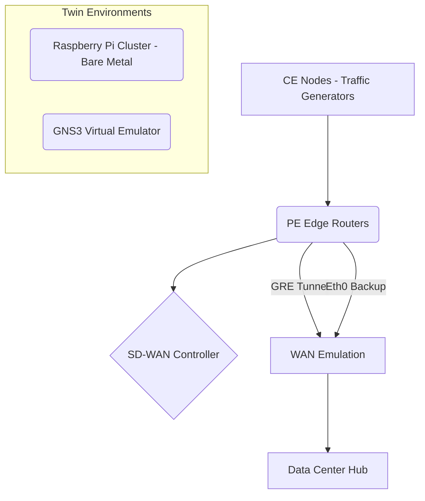
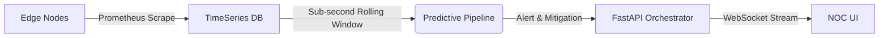
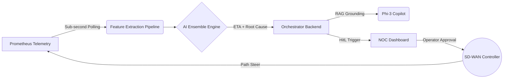
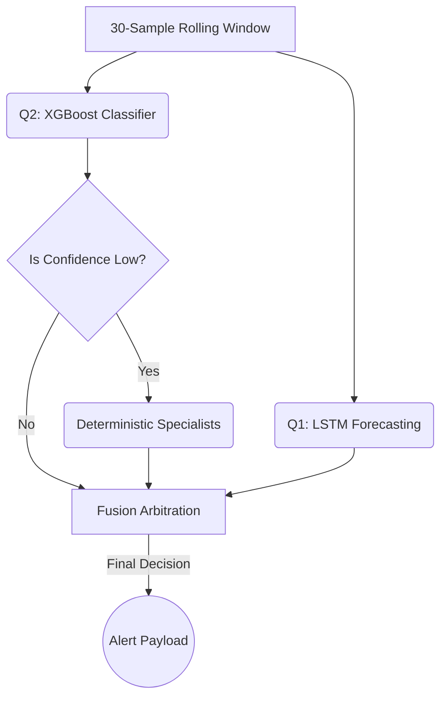

# DECA Predictive SD-WAN: "How We Built It" (11-Slide PPT Guide)

This document is structured to map directly to an 11-slide presentation detailing how the DECA-ISRO physical network and predictive AI pipelines were built, integrated, and validated.

---

## Slide 1: Mission Context & The "Air-Gapped" Imperative
**Title:** Bridging the Gap Between Simulation and Reality
*   **The Challenge:** Traditional SD-WAN reacts *after* a link drops, which is unacceptable for TT&C (Telemetry, Tracking, and Command) satellite links. We needed a predictive architecture.
*   **The Constraint:** We could not rely on pure software simulation or fabricated datasets. The model had to learn the genuine physics of network degradation (buffer bloat, CPU crypto strain, routing flaps) on real silicon.
*   **The Approach:** Build a physically isolated, bare-metal hardware testbed to serve as the ground truth, capture the telemetry, train the AI on real physics, and deploy a dashboard that proves the decision pipeline transparently.

---

## Slide 2: The Physical Network Architecture (Hardware & "Twin")
**Title:** The L0/L3 Network Foundation

*   **Physical Raspberry Pi Cluster:** We constructed a bare-metal edge topology using Raspberry Pis to accurately capture hardware constraints like CPU crypto-exhaustion during IPsec encryption.
*   **GNS3 IPsec "Twin":** To validate that our models could generalize beyond a single hardware profile, we built a digital twin in GNS3, proving that our architecture is vendor/hardware agnostic.
*   **Linux TC/HTB Queuing:** We configured Hierarchical Token Bucket (HTB) policies directly on the Linux kernel to enforce strict mission SLAs (Gold/Silver/Bronze), ensuring the AI learns real-world QoS contention (e.g., Payload data starving TT&C commands).
*   **BGP Routing:** Implemented dynamic BGP routing to simulate multi-path satellite downlinks (e.g., GRE vs eth0).

---

## Slide 3: The Telemetry & Data Pipeline
**Title:** Real-Time Data Ingestion & State Management

*   **Sub-Second Prometheus Scraping:** We bypassed standard 15-second polling limits, configuring Prometheus to scrape `deca_edge_nodes` at sub-second intervals to catch micro-bursts and transient jitter.
*   **Canonical Data Captures:** 100% of the training dataset (`d2_e100_l6_mcw3`) relies on real, executed packet paths (no LLM-fabricated telemetry or synthetic floats).
*   **The Orchestrator Backend:** A custom FastAPI + SQLite controller bridges the gap between Prometheus, the inference models, and the UI.
*   **WebSocket Terminal Streaming:** We built a native WebSocket multiplexer in Python (`terminal_manager.py`) to stream raw logs directly to the dashboard, providing the jury with a "live proof" cascade of inject → telemetry → inference → copilot.

---

## Slide 4: The Predictive AI Engine (Q1 & Q2)
**Title:** Multi-Head Inference (When & Why)
*   **Q1: LSTM Forecasting (Time-to-Impact):** A Long Short-Term Memory (LSTM) neural network ingests a 30-sample rolling window to predict exactly *when* an SLA breach will occur (lead-time prediction).
*   **Q2: XGBoost Classification (Root Cause):** A decision-tree model classifies the severity and signature of the anomaly (e.g., Rain Fade vs. CPU Exhaustion vs. CE Policy Conflict). 
*   **The "Specialist" Fallbacks:** Physical hardware behaves unpredictably (e.g., borderline BGP route flaps). We layered in deterministic, rule-based "Specialist" models to catch edge-cases the XGBoost model might under-report, keeping the system honest and reliable.
*   **Performance:** Achieved a canonical holdout accuracy of `0.884` and `0.815` on unseen chaos variants, strictly proven on real hardware.

---

## Slide 5: Copilot (Q3) & Human-in-the-Loop (HITL)
**Title:** RAG Mitigation & Transparent Decision Arbitration
*   **Local LLM Copilot (Phi-3):** Integrated a localized, air-gapped Large Language Model to serve as the NOC Copilot. 
*   **RAG Grounding:** The Copilot does not hallucinate. It is restricted to Retrieval-Augmented Generation (RAG) against our exact network topology JSON and standard operating procedure (SOP) runbooks. 
*   **Human-in-the-Loop (HITL):** The system is strictly advisory. The orchestrator fuses the LSTM ETA and XGBoost severity into a "Decide" panel recommendation, but path-steering execution requires a human operator to click "Approve". 
*   **Dashboard Transparency:** The UI splits alerts into Layer 1 (Operator Summary) and Layer 2 (Engineer Trace JSON) to prevent cognitive overload while keeping the AI's math 100% auditable.

---

## Slide 6: The Engineered Solution (System-of-Systems Integration)
**Title:** Combining Reactive SD-WAN with Predictive AI

*   **The Hybrid Architecture:** We engineered a solution that integrates a traditional, reactive SD-WAN controller with a forward-looking predictive engine.
*   **Predictive Preemption:** Rather than waiting for a link to fail completely (reactive), the system constantly polls live telemetry to predict future degradation and preemptively suggests path steering before the SLA is breached.
*   **Linear Pipeline Execution:** The architecture moves deterministically from Telemetry (Prometheus) → Feature extraction → Inference (LSTM & XGBoost) → Natural Language Generation (Copilot) → Human Arbitration.
*   **Outcome:** This creates an end-to-end framework where AI acts as a sophisticated NOC advisor, dramatically reducing Time-to-Mitigation for mission-critical satellite networks.

---

## Slide 7: Machine Learning Models (The Ensemble Approach)
**Title:** Specialized AI Models for Specific Tasks

*   **Avoiding the Black Box:** The solution explicitly avoids using a monolithic, uninterpretable AI model in favor of a specialized, multi-stage ensemble.
*   **Q1 Model (Time-to-Impact):** A Keras-based Long Short-Term Memory (LSTM) network trained on 30-step historical windows to accurately forecast latency, loss, and utilization thresholds *before* they are crossed.
*   **Q2 Model (Root Cause):** An XGBoost decision-tree classifier (Model: `d2_e100_l6_mcw3`) trained purely on real Canonical hardware captures to categorize the degradation signature (e.g., Rain Fade, BGP Flaps, CPU Stress).
*   **Rule-Based Specialists:** Layered on top of the XGBoost predictions are deterministic fallback rules to safely catch physical edge cases that are notoriously difficult to predict purely via ML (e.g., subtle BGP route instability).

---

## Slide 8: Benchmarks & Model Validation
**Title:** Transparent Performance on Real Silicon
*   **Canonical Holdout Accuracy (0.884):** On strict, unseen hardware captures, our primary model correctly identifies the root cause of network degradation with 88.4% accuracy.
*   **Unseen Noise Validation (0.815):** When subjected to the `chaos_final` testbed (injecting unpredictable background traffic and random CPU spikes), accuracy remains strong at 81.5%, proving the model learned the underlying physics rather than just memorizing the training data.
*   **Software Emulation Transfer (0.655):** When testing the model on the software-emulated GNS3 twin, performance drops to 65.5%. This is a known, expected characteristic, as software routers do not perfectly replicate bare-metal Linux QoS queue behaviors.
*   **BGP Specialist Accuracy (0.886):** By leveraging the rule-based BGP specialist fallback for route flap detection, accuracy climbs back up to 88.6%.

---

## Slide 9: Why This Matters to ISRO (Proving the Paradigm)
**Title:** Predictive Resilience for Mission-Critical Links
*   **Understanding the Stakes:** We recognize that in ISRO's environment, TT&C and Payload links are not just regular data traffic—they are mission lifelines where seconds of latency or loss can be catastrophic.
*   **Exploring the "Hope":** We built this prototype specifically to answer a critical question: Is there realistic hope that AI can safely preempt failures in high-stakes aerospace networks without acting as a dangerous, autonomous black box? 
*   **The Verdict:** We firmly believe there is. By rigorously grounding the AI in bare-metal telemetry and enforcing strict Human-in-the-Loop (HITL) policies, we have proven that predictive SD-WAN is a viable, safe upgrade for ISRO's ground station networks.

---

## Slide 10: Scope of Expansion (Scaling to ISRO's Network)
**Title:** Applying the Architecture at Scale
*   **ISRO-Personalized Models:** The models demonstrated today are tailored to our physical testbed. In production, ISRO will train this exact architecture on their own historical telemetry, producing bespoke models intimately tuned to ISRO's unique hardware and satellite downlink physics.
*   **Data Aggregation at Scale:** The pipeline is designed to scale horizontally. Our Prometheus and backend bridging design can easily be expanded to ingest telemetry from hundreds of global earth stations simultaneously.
*   **Future Expansions:** Beyond standard latency and CPU metrics, this architecture can be expanded to ingest RF signal-to-noise ratios, weather forecasts, and satellite orbital trajectory data to predict link degradation long before packets even hit the terrestrial router.

---

## Slide 11: Project Deliverables
**Title:** Delivering the Pipeline & Blueprint
*   **The Architecture is the Product:** We are delivering the end-to-end predictive pipeline methodology and the system architecture, not a turnkey piece of code or a universal AI model.
*   **Why Not the Model?** Our model is highly accurate, but it correctly reflects the specific physics, interfaces, and capacities of our custom testbed. ISRO's production network is vastly larger and fundamentally different.
*   **The Blueprint:** What we are handing over is the proven blueprint: exactly how to scrape sub-second telemetry, how to split forecasting (LSTM) from classification (XGBoost), and how to safely fuse those predictions into an honest, transparent NOC dashboard.
