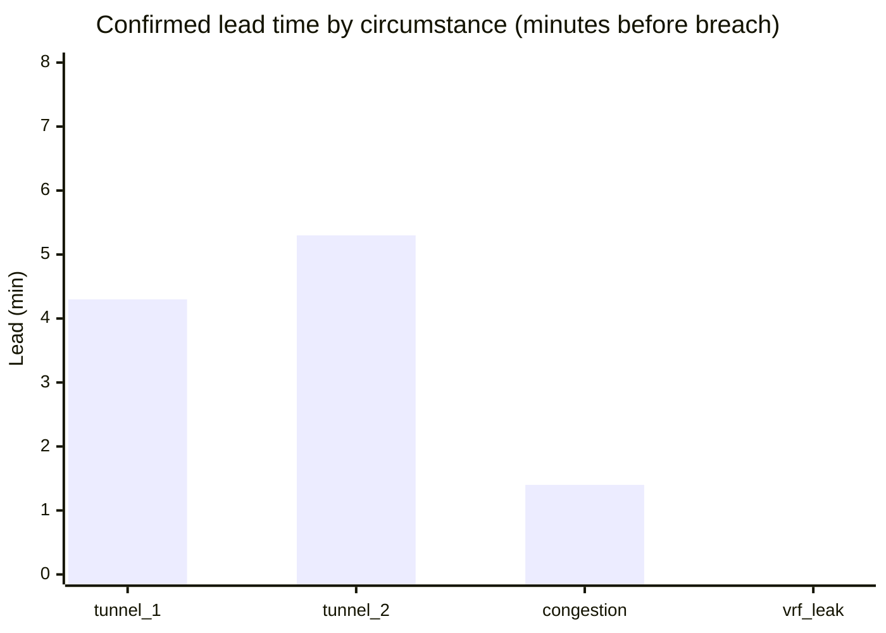
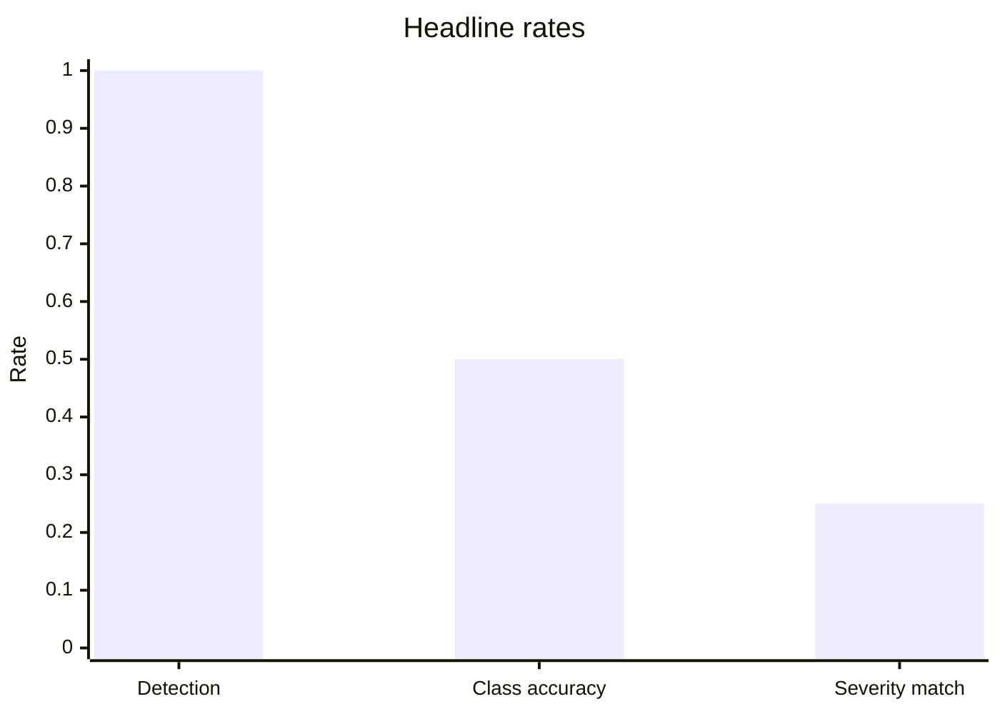

# DECA blind live test — 16 Jul 2026 (60 min)

**Date / time:** Thursday **16 July 2026**, **15:37 – 16:38 IST** (10:07 – 11:08 UTC) · graded **17:37 IST**

First archived blind live-network test on the physical CE-PE-CE Pi lab. The chaos scheduler randomly injected faults with a sealed ground truth; the live operator polled Prometheus and ran the promoted model stack with **no knowledge of the schedule**. This document records what happened and where the artifacts live.

**Archive folder:** [`data/rpi-net/blind-tests/blind_20260716_1537_60m/`](../../data/rpi-net/blind-tests/blind_20260716_1537_60m/)

**Runbook for future tests:** [`DECA_BLIND_TEST.md`](../DECA_BLIND_TEST.md)

---

## Run summary

| Field | Value |
| --- | --- |
| **Run ID** | `blind_20260716_1537_60m` |
| **Started** | 2026-07-16 15:37 IST (10:07 UTC) |
| **Ended** | 2026-07-16 16:38 IST (11:08 UTC) — 60.4 min |
| **Chaos seed** | `232335` (sealed in `run_meta.json`) |
| **Target** | 4–6 circumstances + 2 near-misses |
| **Actual** | **4 circumstances** + **1 near-miss** |
| **Lab** | station1 (PE1), station2 (PE2), station3 (CORE) |
| **Operator scope** | `station1`, `station2` only (CORE excluded — no CE ping / BGP telemetry) |
| **Baseline traffic** | ~48 Mbps iperf3 (station1 → station2 via eth0) |

### Model stack (promoted at test time)

Snapshot: [`model_config.json`](../../data/rpi-net/blind-tests/blind_20260716_1537_60m/model_config.json)

- Weighted multiclass gate + head (`plain` family)
- **Soft-streak loom:** `enter_k=2`, `exit_k=2`, per-class `exit_k` for BGP/VRF = 3
- **Advisory tier:** `advisory_enter_k=2`, `advisory_exit_k=1`
- Circumstance pre-arm enabled
- LSTM time-to-breach companion for ETA
- TTB gate, branch agreement, topology gate: **off**

---

## Headline scorecard

Graded at 2026-07-16 17:37 IST from sealed ground truth vs `declarations.jsonl`.
Re-graded later with eventual-class + continuous severity metrics (same declarations).

| Metric | Result |
| --- | ---: |
| Circumstances created | 4 |
| **Detected (confirmed tier)** | **4 / 4 (100%)** |
| **Correct fault class (first declaration)** | **2 / 4 (50%)** |
| **Correct class (ever, in-window)** | **4 / 4 (100%)** |
| Missed | 0 |
| Mean **confirmed** lead before breach | **2.6 min** |
| Mean **advisory** lead before breach | **4.3 min** (class-agnostic) |
| LSTM ETA mean absolute error | **2.7 min** |
| Severity bucket agreement | **1 / 4 (25%)** |
| Severity continuous Pearson r | **0.389** (4 pairs) |
| Near-miss false alarms (bait) | **1 / 1** |
| Spurious false alarms (baseline / post-run) | **49** |





---

## What the network did (ground truth)

| # | Event ID | Fault | Host | Fault start (UTC) | Breach (UTC) | Duration |
| --- | --- | --- | --- | --- | --- | --- |
| 1 | `…_e01_tunnel_degradation` | tunnel_degradation | station1 | 10:11:42 | 10:16:54 | ~5.2 min |
| 2 | `…_e02_tunnel_degradation` | tunnel_degradation | station1 | 10:22:42 | 10:31:25 | ~8.7 min |
| 3 | `…_e03_congestion_breach` | congestion_breach | station1 | 10:36:43 | 10:45:01 | ~8.3 min |
| — | `…_nm01` | near_miss (bait) | station1 | 10:48:45 | 10:49:39 | ~54 s |
| 4 | `…_e04_vrf_leakage` | vrf_leakage | station2 | 10:53:05 | 11:01:07 | ~8.0 min |

No `bgp_route_flap` was injected in this run (random draw).

---

## What the model declared (per circumstance)

| Fault (actual) | Host | Detected | Predicted class | Class OK | Eventually | Conf lead | Adv lead | ETA pred | ETA actual | Sev model | Sev actual |
| --- | --- | :---: | --- | :---: | :---: | ---: | ---: | ---: | ---: | --- | --- |
| tunnel_degradation | station1 | yes | vrf_leakage | no | **yes** | 4.3 min | 5.2 min | 3.5 min | 4.3 min | high | medium |
| tunnel_degradation | station1 | yes | tunnel_degradation | **yes** | yes | 5.3 min | 7.8 min | 3.0 min | 5.3 min | high | low |
| congestion_breach | station1 | yes | congestion_breach | **yes** | yes | 1.4 min | 2.2 min | 1.9 min | 1.4 min | medium | low |
| vrf_leakage | station2 | yes | congestion_breach | no | **yes** | **−0.6 min** | 2.2 min | 6.7 min | −0.6 min | low | low |

**Lead time** = minutes before breach that the tier first declared non-healthy. Negative confirmed lead on vrf_leakage means the confirmed tier fired **after** breach.

**Severity** = physical impact bucket (loss / jitter / throughput deviation vs healthy baseline), low / medium / high.

---

## Interpretation

### What worked

- **Detection:** Every injected circumstance was caught by the confirmed tier — the primary goal of a predictive copilot on unknown schedules.
- **Advisory lead:** ~4.3 min mean early “may be forming” signal before breach — useful for operator attention even when class was wrong.
- **Congestion:** Best overall — correct class, 1.4 min confirmed lead, ETA error only 0.5 min.
- **Second tunnel event:** Correct class with the longest advisory lead (7.8 min).

### What did not

- **Class confusion (50%):** tunnel↔vrf and vrf↔congestion swaps on PE1/PE2. Likely overlapping telemetry shapes under live multi-scale features.
- **VRF on station2:** Confirmed **late** (−0.6 min) despite 2.2 min advisory lead — soft-streak + pre-arm did not commit early enough on PE2 for this leak profile.
- **Severity over-estimation:** Model often reported high/medium while Prometheus replay showed low actual impact (especially tunnel #2). Severity definition may need calibration for live baseline vs campaign-scale ramps.
- **False alarms:** **49 spurious** confirmed raises outside any ground-truth window, plus **1/1** near-miss baited. Dominated by low-confidence `bgp_route_flap` and `vrf_leakage` flicker on flat baseline — inconsistent with static holdout scores. Primary follow-up after this test.

### Near-miss bait

The single benign aborted onset (`nm01`, ~54 s netem on station1) triggered a confirmed `congestion_breach` — the loom did not stay healthy through a fake-out.

---

## Known issues observed during the run

1. **Baseline false positives** before first injection (~10:08 UTC) — confirmed tier raised on flat telemetry.
2. **station3 (CORE) excluded** mid-run — CORE has no ping/BGP features and was never a fault target; early CORE alarms were meaningless.
3. **BGP live gap** — lab Prometheus has no FRR BGP counter; flaps rely on stamped `bgp_update_rate` pulses during injection only.

These were **not** fixed before grading so the scorecard reflects the promoted config honestly.

---

## Artifacts

All files under [`data/rpi-net/blind-tests/blind_20260716_1537_60m/`](../../data/rpi-net/blind-tests/blind_20260716_1537_60m/):

| File | Role |
| --- | --- |
| `ground_truth.sealed.jsonl` | Sealed injection truth |
| `declarations.jsonl` | 231 model state transitions |
| `scorecard.json` | Machine-readable grade |
| `run_meta.json` | Seed + chaos parameters |
| `model_config.json` | Promoted thresholds + loom at test time |
| `fault_injection_log.csv` | Injection log (rebuild-compatible) |
| `bgp_update_samples.csv` | BGP pulse telemetry |
| `chaos.log` | Injection timeline |
| `operator_feed.log` | Full terminal NOC feed |

**Visual scorecard (Cursor Canvas):** generated at grade time as `deca-blind-test.canvas.tsx` in the Cursor canvases folder.

### Reproduce the grade

```bash
python3 scripts/deca_blind_scorecard.py --run-id blind_20260716_1537_60m
# (point --run-id at a copy under data/rpi-net/live/ or extend scorecard to read blind-tests/)
```

---

## Follow-up (post-test)

Superseded by the post–ultimate-60+60 chase order in [`BLIND_TEST_AGGREGATE_20260716.md`](BLIND_TEST_AGGREGATE_20260716.md):

| Priority | Item |
| --- | --- |
| 1 | Calm-condition / control spurious FPs (densify helped 49→17; control still 21) |
| 2 | Third adversarial blind night before quoting a tight range |
| 3 | Tunnel–VRF–congestion confusion triangle (branch correlation / per-class hysteresis) |
| 4 | Severity calibration — later; never quote bucket % without Pearson |

---

## Related

- Harness design: [`DECA_BLIND_TEST.md`](../DECA_BLIND_TEST.md)
- Temporal Loom (promoted config): [`DECA_TEMPORAL_LOOM.md`](../DECA_TEMPORAL_LOOM.md)
- Static holdout scores: [`DECA_TEST_SCORES.md`](../DECA_TEST_SCORES.md)
- Station lab: [`STATION_NETWORK_SETUP.md`](../STATION_NETWORK_SETUP.md)
