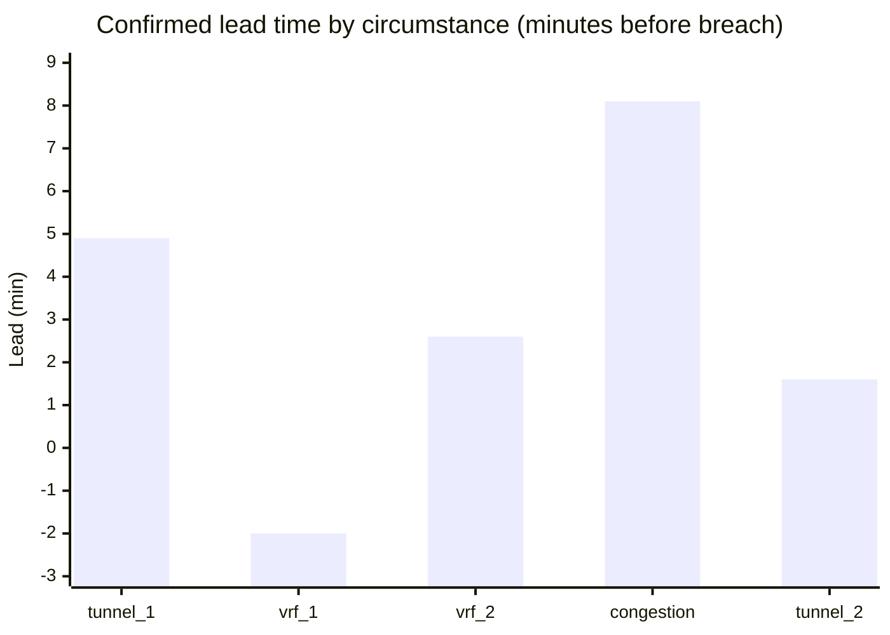

# DECA blind live test — 16 Jul 2026 night 2 (60 min)

**Date / time:** Thursday **16 July 2026**, **19:24 – 20:40 IST** (13:54 – 15:10 UTC) · chaos done **20:35 IST**, graded **20:40 IST**

Second adversarial blind live-network test on the physical CE-PE-CE Pi lab. Part of the **ultimate 60+60** sequence (`scripts/deca_ultimate_60_60.sh`): this leg is the sealed-chaos night; the control leg is documented separately.

**Archive folder:** [`data/rpi-net/blind-tests/blind_20260716_1924_60m/`](../../data/rpi-net/blind-tests/blind_20260716_1924_60m/)

**Paired control:** [`BLIND_TEST_CONTROL_20260716_1924_60m.md`](BLIND_TEST_CONTROL_20260716_1924_60m.md)

**Aggregate across nights:** [`BLIND_TEST_AGGREGATE_20260716.md`](BLIND_TEST_AGGREGATE_20260716.md)

**Runbook:** [`DECA_BLIND_TEST.md`](../DECA_BLIND_TEST.md)

---

## Run summary

| Field | Value |
| --- | --- |
| **Run ID** | `blind_20260716_1924_60m` |
| **Started** | 2026-07-16 19:24 IST (13:54 UTC) |
| **Chaos complete** | 2026-07-16 20:35 IST (15:05 UTC) — 70.4 min wall (budget 60; last event overran) |
| **Graded** | 2026-07-16 20:40 IST (15:10 UTC) |
| **Chaos seed** | `1784210097` (sealed in `run_meta.json`) |
| **Target** | 5–6 circumstances + 2 near-misses |
| **Actual** | **5 circumstances** + **2 near-misses** |
| **Compound** | off (`compound_prob=0`) |
| **Ensemble** | off |
| **Operator scope** | `station1`, `station2` |
| **Harness note** | BGP pulse densify fix live (prevents station1 feature wipe mid-flap) |

---

## Headline scorecard

| Metric | Result |
| --- | ---: |
| Circumstances created | 5 |
| **Detected (confirmed tier)** | **5 / 5 (100%)** |
| **Correct fault class (first declaration)** | **4 / 5 (80%)** |
| **Correct class (ever, in-window)** | **5 / 5 (100%)** |
| Missed | 0 |
| Mean **confirmed** lead before breach | **3.0 min** |
| Mean **advisory** lead before breach | **3.3 min** (class-agnostic) |
| LSTM ETA mean absolute error | **3.7 min** |
| Severity bucket agreement | **4 / 5 (80%)** |
| Severity continuous Pearson r | **−0.595** (5 pairs) |
| Near-miss false alarms (bait) | **2 / 2** |
| Spurious false alarms | **17** |

---

## What the network did (ground truth)

| # | Event | Fault | Host | Start (UTC) | Breach (UTC) |
| --- | --- | --- | --- | --- | --- |
| 1 | `…_e01_tunnel_degradation` | tunnel_degradation | station1 | 13:57:40 | 14:03:17 |
| — | `…_nm01` | near_miss (bait) | station1 | 14:08:31 | 14:09:21 |
| 2 | `…_e02_vrf_leakage` | vrf_leakage | station2 | 14:11:15 | 14:17:54 |
| — | `…_nm02` | near_miss (bait) | station1 | 14:22:44 | 14:23:49 |
| 3 | `…_e03_vrf_leakage` | vrf_leakage | station2 | 14:26:46 | 14:30:53 |
| 4 | `…_e04_congestion_breach` | congestion_breach | station1 | 14:40:00 | 14:48:08 |
| 5 | `…_e05_tunnel_degradation` | tunnel_degradation | station1 | 14:54:41 | 14:59:29 |

No `bgp_route_flap` was drawn this night. SSH timeouts to station1 occurred twice during the run (iperf client launch / near-miss) but Prom scrapes recovered.

---

## What the model declared (per circumstance)

| Fault (actual) | Host | Detected | First class | First OK | Eventually OK | Conf lead | Adv lead | ETA pred | ETA actual | Sev m~a |
| --- | --- | :---: | --- | :---: | :---: | ---: | ---: | ---: | ---: | --- |
| tunnel_degradation | station1 | yes | tunnel_degradation | **yes** | yes | 4.9 | 5.2 | 4.0 | 4.9 | low~low |
| vrf_leakage | station2 | yes | vrf_leakage | **yes** | yes | **−2.0** | **−1.2** | 3.6 | −2.0 | low~low |
| vrf_leakage | station2 | yes | vrf_leakage | **yes** | yes | 2.6 | 2.8 | 8.5 | 2.6 | low~low |
| congestion_breach | station1 | yes | vrf_leakage | no | **yes** | 8.1 | 7.5 | 6.1 | 8.1 | low~low |
| tunnel_degradation | station1 | yes | tunnel_degradation | **yes** | yes | 1.6 | 2.4 | 5.7 | 1.6 | high~low |

**Near-miss baits:** both `nm01` and `nm02` triggered confirmed false alarms (`tunnel_degradation`, `vrf_leakage`).

---

## Interpretation

### What worked

- **Detection 100%** again — every sealed circumstance got a confirmed raise.
- **First-class accuracy 80%** (up from 50% on night 1); eventual class **100%**.
- **Spurious confirms down sharply** vs night 1 (17 vs 49) after the BGP densify fix and cleaner warm-up.
- **Severity:** bucket agreement 80% (up from 25%) **but** Pearson **−0.595** — never quote the bucket % alone; continuous magnitude is not working.
- Strong early call on congestion (8.1 min confirmed lead) even though the *first* class was wrong.

### What did not

- **VRF #1 late:** confirmed **2.0 min after** breach (advisory also late).
- **Congestion first class wrong** (`vrf_leakage`) — self-corrected in-window; sits in the tunnel–VRF–congestion confusion triangle (see aggregate).
- **Near-miss discrimination still broken** — 2/2 baits cried wolf.
- **17 spurious confirms** still high; control later the same night hit **21** with zero real faults.
- **ETA MAE 3.7 min** — usable directionally, not precise.

---

## Artifacts

| File | Role |
| --- | --- |
| `ground_truth.sealed.jsonl` | Sealed network truth |
| `declarations.jsonl` | Operator state transitions |
| `scorecard.json` | Graded report |
| `chaos_run.log` | Injection timeline |
| `operator_feed.tail.log` | Last 200 lines of NOC feed |
| `run_meta.json` | Seed + budget |
| `bgp_update_samples.csv` | Stamped BGP telemetry |

Canvas: `deca-blind-results.canvas.tsx`
