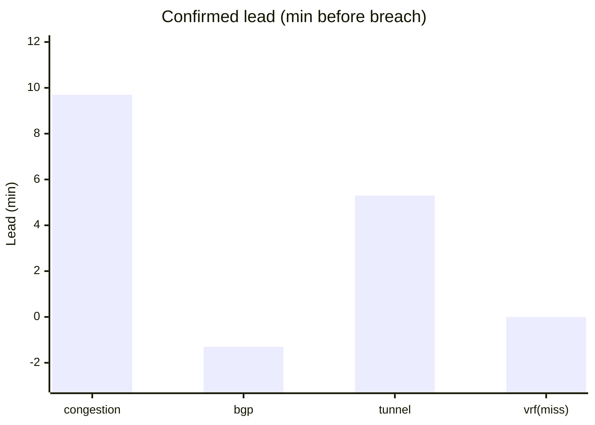

# DECA blind live test — 18 Jul 2026 (60 min)

**Date / time:** Saturday **18 July 2026**, **08:48 – 09:51 IST** (03:18 – 04:21 UTC)

Third adversarial blind live-network test on the physical CE-PE-CE Pi lab. Ultimate 60+60 leg 1 after the specificity retrain (`spec_data_20260717_2352` → promote Macro-F1 **0.722**, soft loom **0.840**) and a **PASS** on the same-day specificity exam.

**Archive:** [`data/rpi-net/blind-tests/blind_20260718_0848_60m/`](../../data/rpi-net/blind-tests/blind_20260718_0848_60m/)

**Paired control:** [`BLIND_TEST_CONTROL_20260718_0848_60m.md`](BLIND_TEST_CONTROL_20260718_0848_60m.md)

**Specificity exam (same morning):** [`SPECIFICITY_EXAM_V1.md`](SPECIFICITY_EXAM_V1.md) — **PASS**

**Aggregate:** [`BLIND_TEST_AGGREGATE_20260718.md`](BLIND_TEST_AGGREGATE_20260718.md)

**Runbook:** [`../DECA_BLIND_TEST.md`](../DECA_BLIND_TEST.md)

---

## Run summary

| Field | Value |
| --- | --- |
| **Run ID** | `blind_20260718_0848_60m` |
| **Ultimate stamp** | `20260718_0848` |
| **Chaos seed** | `1784344709` |
| **Budget** | 60 min |
| **Actual** | **4 circumstances** + **2 near-misses** |
| **Compound** | off |
| **Ensemble** | off |
| **Model** | Post–spec-data wm; soft-streak loom (tunnel enter **4**, others **3**); `circumstance_prearm=false` |

---

## Headline scorecard

| Metric | Result |
| --- | ---: |
| Circumstances created | 4 |
| **Detected (confirmed)** | **3 / 4 (75%)** |
| **Correct class (first = eventual)** | **3 / 4 (75%)** |
| Missed | **1** (`vrf_leakage` @ station2) |
| Mean **confirmed** lead | **4.6 min** |
| Mean **advisory** lead | **5.8 min** |
| LSTM ETA MAE | **3.9 min** |
| Severity bucket agree *(do not quote alone)* | **0 / 3 (0%)** |
| Severity Pearson r | **−0.854** (3 pairs) |
| Near-miss false alarms | **0 / 2** |
| Spurious false alarms | **3** (all station2; congestion×1 + tunnel×2) |

---

## What the network did (ground truth)

| # | Event | Fault | Host | Start (UTC) | Breach (UTC) |
| --- | --- | --- | --- | --- | --- |
| 1 | `…_e01_congestion_breach` | congestion_breach | station1 | 03:20:28 | 03:32:07 |
| — | `…_nm01` | near_miss | station1 | 03:39:05 | 03:39:52 |
| 2 | `…_e02_bgp_route_flap` | bgp_route_flap | station1 | 03:42:43 | 03:50:13 |
| — | `…_nm02` | near_miss | station1 | 03:53:00 | 03:53:47 |
| 3 | `…_e03_tunnel_degradation` | tunnel_degradation | station1 | 03:55:15 | 04:02:12 |
| 4 | `…_e04_vrf_leakage` | vrf_leakage | station2 | 04:07:38 | 04:12:51 |

---

## What the model declared

| Fault (actual) | Host | Detected | Class | Conf lead | Adv lead | ETA pred | ETA actual | Sev m~a |
| --- | --- | :---: | --- | ---: | ---: | ---: | ---: | --- |
| congestion_breach | station1 | yes | congestion_breach | **9.7** | 10.5 | 3.4 | 9.7 | low~medium |
| bgp_route_flap | station1 | yes | bgp_route_flap | **−1.3** | 0.5 | 3.7 | −1.3 | low~high |
| tunnel_degradation | station1 | yes | tunnel_degradation | **5.3** | 6.3 | 5.0 | 5.3 | medium~low |
| vrf_leakage | station2 | **no** | — | — | — | — | — | —~low |

**Near-miss baits:** both stayed healthy (0 FA) — first blind night with clean near-miss discrimination.

**Spurious confirms (3):** `congestion_breach` @ station2 (03:23), `tunnel_degradation` @ station2 (03:57, 04:05). No BGP invention.

---

## Vs prior blind nights

| Metric | Night 1 `1537` | Night 2 `1924` | **This night** |
| --- | ---: | ---: | ---: |
| Detection | 1.0 | 1.0 | **0.75** |
| Class first → eventual | 0.50 → 1.0 | 0.80 → 1.0 | **0.75 → 0.75** |
| Confirmed lead (min) | 2.6 | 3.0 | **4.6** |
| Near-miss FA | 1/1 | 2/2 | **0/2** |
| Spurious | 49 | 17 | **3** |

---

## Interpretation

1. **Trust win on the adversarial night** — near-miss FA 0/2 and spurious **3** (vs 17–49) after the specificity campaign + loom patience.
2. **Detection cost** — missed the only PE2 `vrf_leakage`; BGP confirmed slightly late (−1.3 min). Congestion/tunnel early and correct.
3. **Severity still not shippable** — bucket 0%, Pearson −0.854; do not present without that caveat.
4. **Paired control same morning is clean** (0 NM FA, 0 spurious) — see control write-up.
