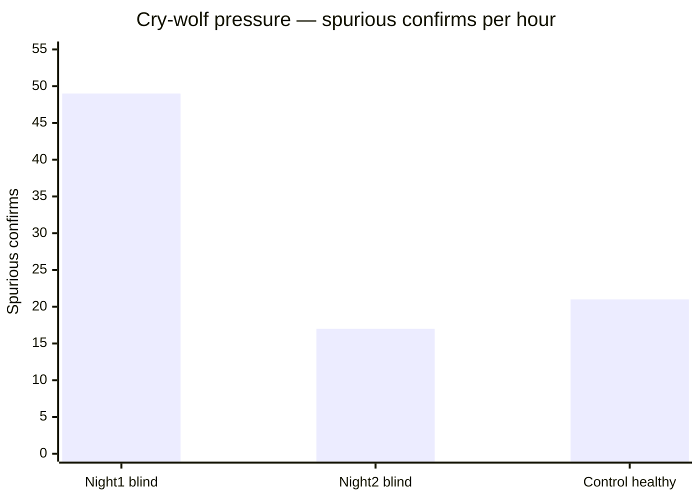

# DECA blind live tests — aggregate (16 Jul 2026)

> **Superseded for current claims** by [`BLIND_TEST_AGGREGATE_20260718.md`](BLIND_TEST_AGGREGATE_20260718.md) (adds 18 Jul exam PASS, clean control, third blind). Keep this file as the first-night snapshot.

**Date / time span:** Thursday **16 July 2026**, **15:37 – 21:41 IST** (10:07 – 16:11 UTC) — three runs on one calendar day.

Pooled results across every archived blind/control run under `data/rpi-net/blind-tests/` as of the ultimate 60+60 completion.

**Machine-readable:** [`data/rpi-net/blind-tests/aggregate_20260716_1924.json`](../../data/rpi-net/blind-tests/aggregate_20260716_1924.json)

**Canvas:** `deca-blind-results.canvas.tsx`

**Per-run write-ups:**

| Run | Type | Date / time (IST) | Doc |
| --- | --- | --- | --- |
| `blind_20260716_1537_60m` | Adversarial blind | **16 Jul 2026** 15:37 – 16:38 | [`BLIND_TEST_20260716_1537_60m.md`](BLIND_TEST_20260716_1537_60m.md) |
| `blind_20260716_1924_60m` | Adversarial blind | **16 Jul 2026** 19:24 – 20:40 | [`BLIND_TEST_20260716_1924_60m.md`](BLIND_TEST_20260716_1924_60m.md) |
| `control_20260716_1924_60m` | All-healthy control | **16 Jul 2026** 20:41 – 21:41 | [`BLIND_TEST_CONTROL_20260716_1924_60m.md`](BLIND_TEST_CONTROL_20260716_1924_60m.md) |

---

## Verdict

**Detection is strong; specificity is not — and specificity is the number that would break NOC trust first.**

Across two blind nights the models caught **every** real circumstance (9/9) and eventually named the right class on all of them. Confirmed lead time sits in a tight band (~2.6–3.0 min). That is not the headline an operator cares about after reading the control night.

### The real problem, stated plainly

With **zero** real faults, the control hour still produced **21 spurious confirmed alarms** and failed **3 of 4** near-miss discrimination tests. Operationally that is roughly **one false confirmed alarm every three minutes** during a period where nothing was wrong.

That is the alert-fatigue failure mode called out as Catch 9 in the original PS13 analysis: *a system generating 200 alerts an hour is worse than no AI at all.* This stack is not at 200 — but **21 false confirms per healthy hour** is squarely in that danger zone. It is the single number in this test suite that would erode trust with a real NOC operator fastest.

### A proven clue (and why more of the same remains)

Spurious confirms fell from **49 → 17** between night 1 and night 2 after the BGP pulse densify fix. That is a real improvement, not noise — whatever that class of bug addressed clearly moved the needle. The control run happened **after** that fix and still produced **21**, so more of the same category is left. Highest-priority next step is **false-positive rate under calm conditions**, not accuracy tuning. There is already evidence of exactly the kind of fix that moves it.

### Class confusion has a nameable pattern

Every first-class mix-up across both nights sits inside one triangle:

| Truth | First declaration |
| --- | --- |
| tunnel_degradation | vrf_leakage |
| vrf_leakage | congestion_breach |
| congestion_breach | vrf_leakage |

That is not random scatter — it is consistent early-onset overlap among **tunnel / VRF / congestion**. Branch-correlation and per-class hysteresis (from the loom work) would target this directly: short-window features for these three overlap, and the loom currently has little beyond waiting to disambiguate.

### Severity presentation rule

Bucket agreement (**25% → 80%**) looks like improvement on its own. Sitting next to it, continuous Pearson is **0.389 → −0.595**, pooling to essentially **~0.13** across all nine pairs. Buckets can coincidentally align even when the magnitude relationship is backwards. Both numbers are already reported together — keep it that way. **Never quote the bucket percentage alone** in front of a judge without Pearson beside it; alone it overstates what is working.

### What actually matters before presenting

- **n = 2** blind nights — treat as indicative. Hold strictly to **≥3 adversarial seeds** before standing behind a tight range under questioning.
- Severity can wait; it is already disclosed as unreliable.

**Priority order to chase next:**

1. **Spurious false-positive rate under calm / control conditions** — biggest real risk, and already proven movable (densify).
   - **BGP fix live-validated (17 Jul):** `control_fp_check2` — spurious **21 → 5**, BGP **18 → 0**. See [`BLIND_TEST_CONTROL_FP_CHECK2_20260717.md`](BLIND_TEST_CONTROL_FP_CHECK2_20260717.md).
   - **Deterministic exam ground (17 Jul):** playlist [`specificity_exam_v1`](../../scripts/playlists/specificity_exam_v1.json) + loom trust knobs (pre-arm off, tunnel/congestion/BGP soft enter ≥3). Prefer [`SPECIFICITY_EXAM_V1.md`](SPECIFICITY_EXAM_V1.md) over random `--control`.
   - **Exam v1 FAIL → data campaign (17–18 Jul):** [`SPECIFICITY_DATA_CAMPAIGN_20260717.md`](SPECIFICITY_DATA_CAMPAIGN_20260717.md) — `spec_data_20260717_2352` quotas met (8+4 near-miss + 3×4 reals); rebuild/promote Macro-F1 **0.722**, soft loom **0.840**; same-playlist re-exam is the acceptance test.
2. **Pass the specificity exam trust bar** (0 NM FA, 0 calm spurious) — then a third adversarial blind night.
3. Severity calibration — later.

---

## Per-run scoreboard

| Metric | Night 1 `1537` | Night 2 `1924` | Control `1924` |
| --- | ---: | ---: | ---: |
| Circumstances | 4 | 5 | **0** |
| Detection rate | **1.0** | **1.0** | n/a |
| Class accuracy (first) | 0.50 | **0.80** | n/a |
| Class accuracy (eventual) | **1.0** | **1.0** | n/a |
| Mean confirmed lead (min) | 2.6 | **3.0** | n/a |
| Mean advisory lead (min) | **4.3** | 3.3 | n/a |
| ETA MAE (min) | **2.7** | 3.7 | n/a |
| Severity bucket agree *(do not quote alone)* | 0.25 | 0.80 | n/a |
| Severity Pearson r *(required beside buckets)* | **0.389** | **−0.595** | n/a |
| Near-miss FAs | 1/1 | 2/2 | **3/4** |
| Spurious confirms | 49 | **17** | **21** |



---

## Pooled over combined event sample (blind + control artifacts)

| Metric | Value |
| --- | ---: |
| Runs aggregated | 3 |
| Total real circumstances | **9** |
| Total detected | **9 (rate 1.0)** |
| Pooled class accuracy (first) | **0.667** |
| Pooled class accuracy (eventual) | **1.0** |
| Pooled severity Pearson r | **0.13** (9 pairs) |
| Total near-misses | 7 |
| Total near-miss false alarms | **6 / 7** |
| Total spurious false alarms | **87** |

---

## Blind-night range (mean ± sd across the 2 adversarial runs)

| Metric | Mean ± sd | [min .. max] |
| --- | ---: | ---: |
| Detection rate | 1.00 ± 0 | [1.0 .. 1.0] |
| Class accuracy (first) | 0.65 ± 0.21 | [0.50 .. 0.80] |
| Class accuracy (eventual) | 1.00 ± 0 | [1.0 .. 1.0] |
| Confirmed lead (min) | 2.8 ± 0.28 | [2.6 .. 3.0] |
| Advisory lead (min) | 3.8 ± 0.71 | [3.3 .. 4.3] |
| ETA MAE (min) | 3.2 ± 0.71 | [2.7 .. 3.7] |
| Severity bucket agree | 0.53 ± 0.39 | [0.25 .. 0.80] |
| Spurious FAs / run (incl. control) | 29 ± 17 | [17 .. 49] |

> **n = 2 blind nights** — treat as indicative. Need ≥3 adversarial seeds before quoting a tight band to a judge.

---

## All real circumstances (both blind nights)

| Night | Fault | Host | Detected | First class | First OK | Eventually | Conf lead | Adv lead | Sev m~a |
| --- | --- | --- | :---: | --- | :---: | :---: | ---: | ---: | --- |
| 1537 | tunnel_degradation | station1 | yes | vrf_leakage | no | yes | 4.3 | 5.2 | high~medium |
| 1537 | tunnel_degradation | station1 | yes | tunnel_degradation | yes | yes | 5.3 | 7.8 | high~low |
| 1537 | congestion_breach | station1 | yes | congestion_breach | yes | yes | 1.4 | 2.2 | medium~low |
| 1537 | vrf_leakage | station2 | yes | congestion_breach | no | yes | −0.6 | 2.2 | low~low |
| 1924 | tunnel_degradation | station1 | yes | tunnel_degradation | yes | yes | 4.9 | 5.2 | low~low |
| 1924 | vrf_leakage | station2 | yes | vrf_leakage | yes | yes | −2.0 | −1.2 | low~low |
| 1924 | vrf_leakage | station2 | yes | vrf_leakage | yes | yes | 2.6 | 2.8 | low~low |
| 1924 | congestion_breach | station1 | yes | vrf_leakage | no | yes | 8.1 | 7.5 | low~low |
| 1924 | tunnel_degradation | station1 | yes | tunnel_degradation | yes | yes | 1.6 | 2.4 | high~low |

---

## Control cry-wolf detail

| Bait | Stayed healthy? | Declared |
| --- | :---: | --- |
| nm01 | **yes** | — |
| nm02 | no | tunnel_degradation |
| nm03 | no | tunnel_degradation |
| nm04 | no | bgp_route_flap |
| Spurious (outside baits) | — | **21** confirms |

---

## How to refresh

```bash
python3 scripts/deca_blind_aggregate.py \
  --glob 'data/rpi-net/blind-tests/*/scorecard.json' \
  --out data/rpi-net/blind-tests/aggregate_YYYYMMDD.json
```

Regenerate after every new archived night before updating this document.
