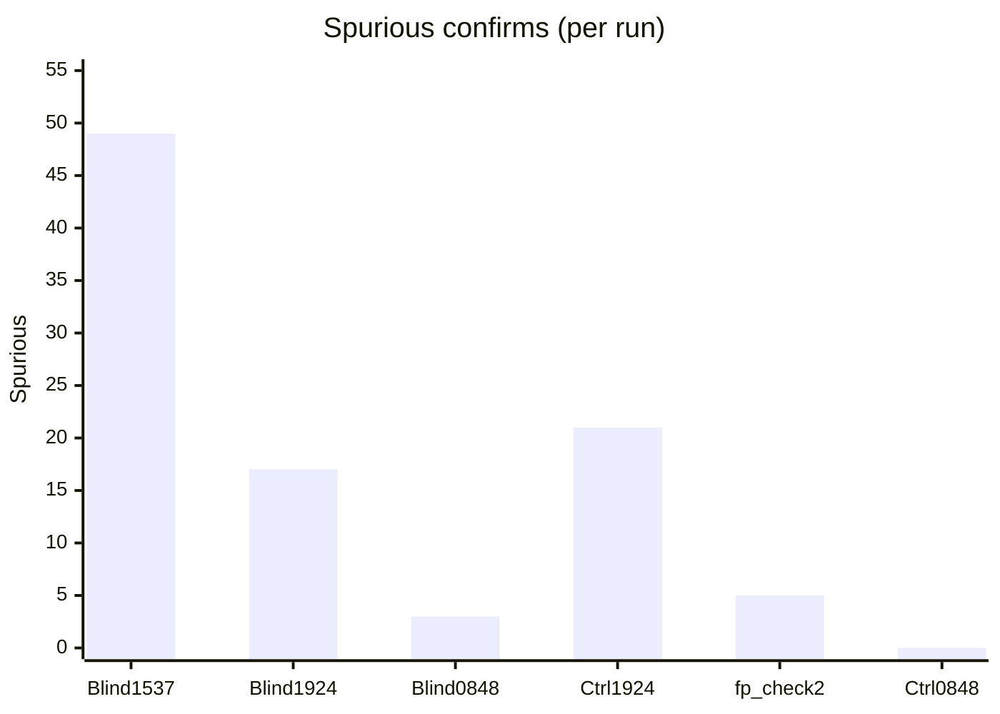

# DECA blind live tests — aggregate (through 18 Jul 2026)

**Date / time span:** **16 – 18 July 2026** — three adversarial blinds, three controls / FP checks, two specificity exam attempts, one targeted data campaign.

**Machine-readable:** [`data/rpi-net/blind-tests/aggregate_20260718_0848.json`](../../data/rpi-net/blind-tests/aggregate_20260718_0848.json)

**Prior 16 Jul-only write-up:** [`BLIND_TEST_AGGREGATE_20260716.md`](BLIND_TEST_AGGREGATE_20260716.md) (historical; superseded for current claim)

---

## Verdict

**Keep two claims separate when presenting:**

1. **We closed the false-alarm problem, independently verified** — specificity exam **PASS** (0 NM FA, 0 calm spurious, 0 BGP) plus ultimate control **0 / 4** NM FA and **0** spurious in 60 min. That is a clean break from Catch‑9 cry-wolf (21/hour on 16 Jul control; 5 on the post-BGP-fix check). **Exam PASS is a specificity instrument only** — it does not score detection of real faults.
2. **That came with a measured detection cost** — same-morning adversarial blind detection **3 / 4 (75%)**, down from **100%** on the prior two nights. The miss was a genuine PE2 `vrf_leakage`. That is the expected precision–recall trade after teaching aborted VRF/near-miss onsets to stay healthy: the VRF boundary moved conservative enough to also swallow one real leak. Near-miss FA on that blind was **0 / 2**; spurious fell to **3** (vs 17–49); mean confirmed lead **4.6 min**. BGP confirmed slightly late (−1.3 min). Severity remains unreliable (bucket 0%, Pearson **−0.854** on that night — worst in the sequence; out of any ship claim).

### Durability caveats (before calling PASS “closed”)

- Exam evidence is **n = 2** on the **same fixed playlist** (FAIL → PASS). Stronger than a single undeclared fix, weaker than the three-night blind aggregate. Prefer a **third sitting unchanged**, or a **second playlist variant** never used to diagnose a fix, before treating specificity as fully general.
- Campaign validation WARN on congestion/BGP duration uniformity was **hand-checked** against `fault_injection_log.csv`: congestion **9.70 / 9.88 / 11.03** min (spread **1.33**); BGP **9.34 / 10.15 / 10.89** min (spread **1.55**). Not a collapsed-timestamp bug — small-n WARN only.

### What actually matters before presenting

- **Trust / specificity:** met on the instruments we defined (exam + control). Do not let “we passed the exam” stand in for “the system works.”
- **Detection:** still strong across nights (**12/13** pooled) with an explicit **VRF sensitivity cost** on the latest seed.
- **Blind nights:** **n = 3** — detection **0.75–1.0**; class-first **0.50–0.80**; spurious **3–49** (latest **3**).
- Severity: still nowhere; do not afterthought it away.

**If tuning continues:** recover PE2 VRF recall **without** reopening calm cry-wolf (re-check exam + control after any change). **If not:** model-done on the specificity mission; next deliverables are overview + white paper with the two-sentence framing above.

---

## Per-run scoreboard

| Metric | Blind `1537` | Blind `1924` | Blind `0848` | Control `1924` | Control `0848` |
| --- | ---: | ---: | ---: | ---: | ---: |
| Circumstances | 4 | 5 | **4** | 0 | 0 |
| Detection | **1.0** | **1.0** | **0.75** | n/a | n/a |
| Class first | 0.50 | **0.80** | **0.75** | n/a | n/a |
| Class eventual | **1.0** | **1.0** | **0.75** | n/a | n/a |
| Conf lead (min) | 2.6 | 3.0 | **4.6** | n/a | n/a |
| Near-miss FA | 1/1 | 2/2 | **0/2** | 3/4 | **0/4** |
| Spurious | 49 | 17 | **3** | 21 | **0** |

### Specificity exam

| Attempt | NM FA | Calm spurious | BGP | Result |
| --- | ---: | ---: | ---: | --- |
| 17 Jul `…_1022` | 1/3 | 2 | 0 | **FAIL** |
| 18 Jul `…_0848` | **0/3** | **0** | **0** | **PASS** |

---

## Blind-night range (n=3 adversarial)

| Metric | Mean ± sd | [min .. max] |
| --- | ---: | ---: |
| Detection rate | 0.92 ± 0.14 | [0.75 .. 1.0] |
| Class accuracy (first) | 0.68 ± 0.16 | [0.50 .. 0.80] |
| Class accuracy (eventual) | 0.92 ± 0.14 | [0.75 .. 1.0] |
| Confirmed lead (min) | 3.4 ± 1.1 | [2.6 .. 4.6] |
| Advisory lead (min) | 4.5 ± 1.3 | [3.3 .. 5.8] |
| Spurious FAs (blind only) | — | [3 .. 49] |

---

## Per-run docs

| Run | Type | Doc |
| --- | --- | --- |
| `blind_20260716_1537_60m` | Blind | [`BLIND_TEST_20260716_1537_60m.md`](BLIND_TEST_20260716_1537_60m.md) |
| `blind_20260716_1924_60m` | Blind (ultimate) | [`BLIND_TEST_20260716_1924_60m.md`](BLIND_TEST_20260716_1924_60m.md) |
| `control_20260716_1924_60m` | Control | [`BLIND_TEST_CONTROL_20260716_1924_60m.md`](BLIND_TEST_CONTROL_20260716_1924_60m.md) |
| `control_fp_check2` | Control (30m) | [`BLIND_TEST_CONTROL_FP_CHECK2_20260717.md`](BLIND_TEST_CONTROL_FP_CHECK2_20260717.md) |
| `specificity_exam_v1` | Exam FAIL→PASS | [`SPECIFICITY_EXAM_V1.md`](SPECIFICITY_EXAM_V1.md) |
| `spec_data_20260717_2352` | Data campaign | [`SPECIFICITY_DATA_CAMPAIGN_20260717.md`](SPECIFICITY_DATA_CAMPAIGN_20260717.md) |
| `blind_20260718_0848_60m` | Blind (ultimate) | [`BLIND_TEST_20260718_0848_60m.md`](BLIND_TEST_20260718_0848_60m.md) |
| `control_20260718_0848_60m` | Control | [`BLIND_TEST_CONTROL_20260718_0848_60m.md`](BLIND_TEST_CONTROL_20260718_0848_60m.md) |
