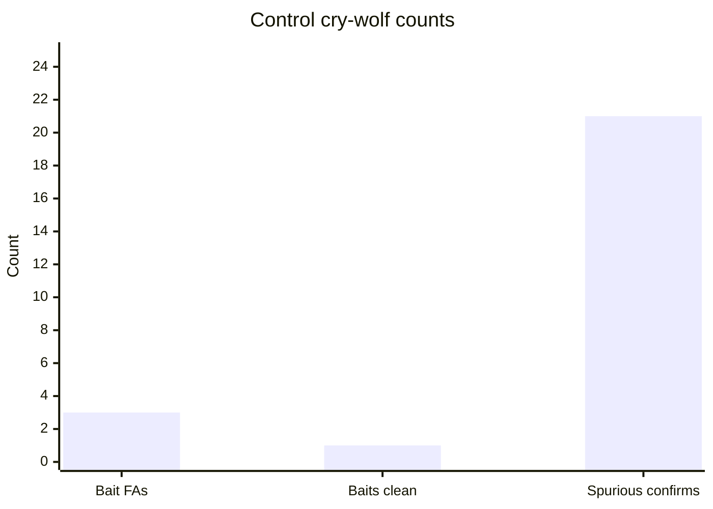

# DECA blind control test — 16 Jul 2026 (60 min, all-healthy)

**Date / time:** Thursday **16 July 2026**, **20:41 – 21:41 IST** (15:11 – 16:11 UTC)

All-healthy control leg of the **ultimate 60+60** sequence. Chaos injected **zero real faults** — only healthy baseline traffic plus four near-miss baits — so every confirmed alarm is a false positive. This is the clean “cry wolf” statistic.

**Archive folder:** [`data/rpi-net/blind-tests/control_20260716_1924_60m/`](../../data/rpi-net/blind-tests/control_20260716_1924_60m/)

**Paired blind night:** [`BLIND_TEST_20260716_1924_60m.md`](BLIND_TEST_20260716_1924_60m.md)

**Aggregate:** [`BLIND_TEST_AGGREGATE_20260716.md`](BLIND_TEST_AGGREGATE_20260716.md)

**Runbook:** [`DECA_BLIND_TEST.md`](../DECA_BLIND_TEST.md) (§ All-healthy control run)

---

## Run summary

| Field | Value |
| --- | --- |
| **Run ID** | `control_20260716_1924_60m` |
| **Mode** | `--control` (no real faults) |
| **Started** | 2026-07-16 20:41 IST (15:11 UTC) |
| **Graded** | 2026-07-16 21:41 IST (16:11 UTC) |
| **Chaos seed** | `1784214686` |
| **Budget** | 60 min |
| **Near-miss baits** | **4** |
| **Real circumstances** | **0** |
| **Baseline traffic** | ~55 Mbps iperf3 |
| **Operator scope** | `station1`, `station2` |
| **Ensemble** | off |

---

## Headline scorecard (false-positive focused)

| Metric | Result |
| --- | ---: |
| Circumstances created | **0** |
| Near-miss baits | 4 |
| **Near-miss false alarms** | **3 / 4 (75%)** |
| Baits that stayed healthy | **1 / 4** |
| **Spurious confirmed raises** | **21** |
| Detection / class / lead / severity | n/a (no real events) |

---

## What the network did (ground truth)

| # | Event | Type | Host | Start (UTC) | End (UTC) | Model stayed healthy? |
| --- | --- | --- | --- | --- | --- | :---: |
| 1 | `…_nm01` | near_miss | station1 | 15:21:23 | 15:21:52 | **yes** |
| 2 | `…_nm02` | near_miss | station1 | 15:37:38 | 15:38:18 | **no** → `tunnel_degradation` |
| 3 | `…_nm03` | near_miss | station1 | 15:48:16 | 15:48:50 | **no** → `tunnel_degradation` |
| 4 | `…_nm04` | near_miss | station1 | 15:55:25 | 15:55:56 | **no** → `bgp_route_flap` |

Plus **21** confirmed raises outside every bait window (baseline flicker).

---

## Interpretation

This is the number that answers *“how often does the model cry wolf when nothing is actually wrong?”*

- **Only 1 of 4** short aborted onsets was ignored (**3/4** near-miss FAs).
- **21** spurious confirmed raises in one healthy hour ≈ **one false confirm every ~3 minutes** with nothing wrong.
- That is the alert-fatigue / Catch‑9 danger zone from the PS13 analysis — not 200/hour, but already enough to break NOC trust fastest.
- This control ran **after** the sparse-pulse densify fix that cut night‑1 spurious 49→17; **21** remaining were mostly the same family.
- **Root cause (post-mortem):** **18/21** spurious confirms were `bgp_route_flap`. Control stamped **no** `bgp_update_samples.csv` pulses; densify was skipped on empty input → BGP feature columns absent → NaN after `reindex` → soft-streak invented flaps at mid confidence (many clears in ~15 s).
- **Fix landed:** always densify a zero BGP grid for every Prom host (even with zero pulses) + hard gate: never *confirm* BGP without a stamped pulse. Re-run a short `--control` before claiming the cry-wolf rate is fixed.
- Combined with the blind nights (near-miss FA **6/7** pooled), **specificity is the binding constraint** — not recall.

Do **not** quote live detection rates without putting this control number next to them. Full framing: [`BLIND_TEST_AGGREGATE_20260716.md`](BLIND_TEST_AGGREGATE_20260716.md) § Verdict.

---

## Artifacts

| File | Role |
| --- | --- |
| `ground_truth.sealed.jsonl` | Four near-miss seals only |
| `declarations.jsonl` | Every advisory/confirmed transition |
| `scorecard.json` | Graded FA report |
| `chaos_run.log` | Control timeline |
| `operator_feed.tail.log` | Last 200 NOC lines |
| `run_meta.json` | Seed + budget |
