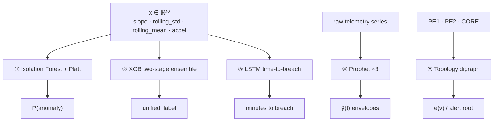
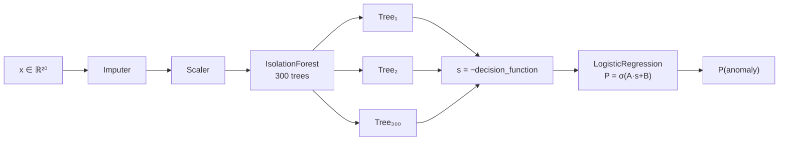
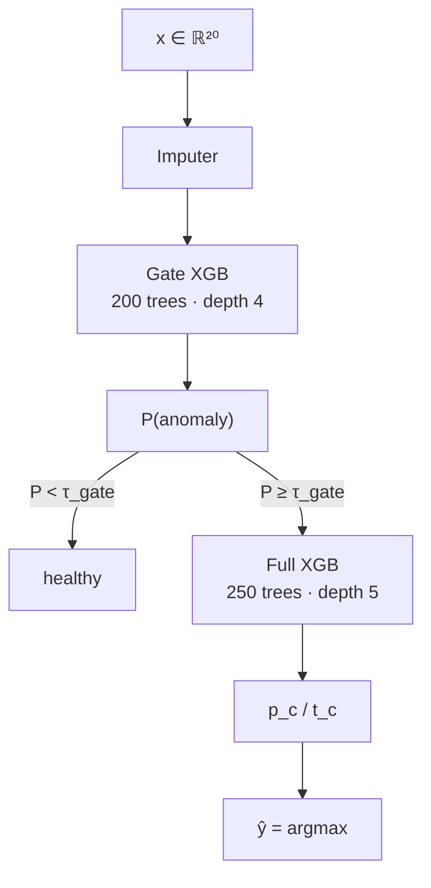
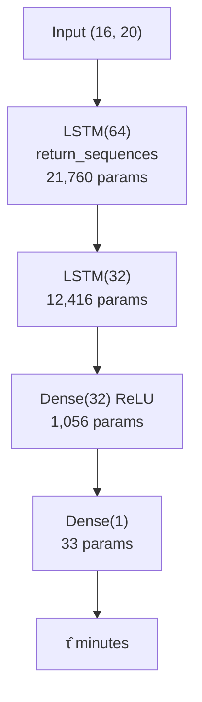
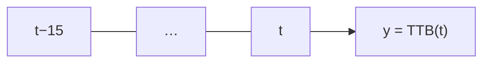
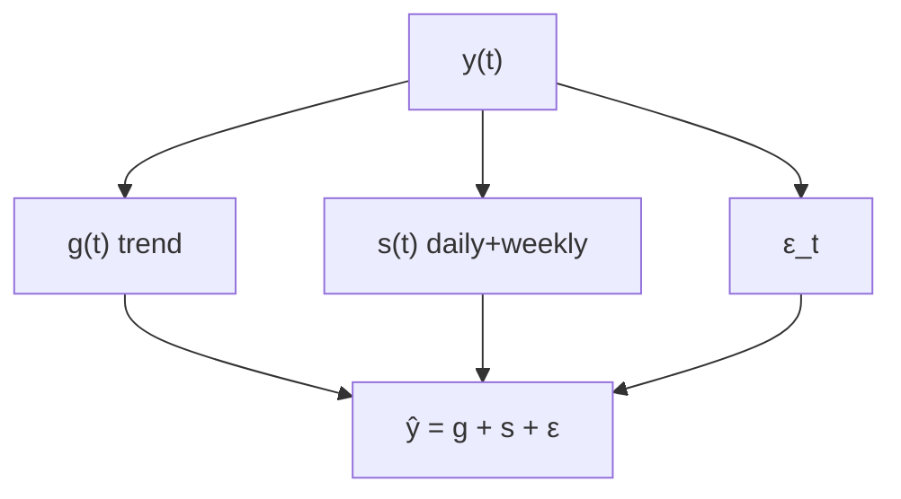
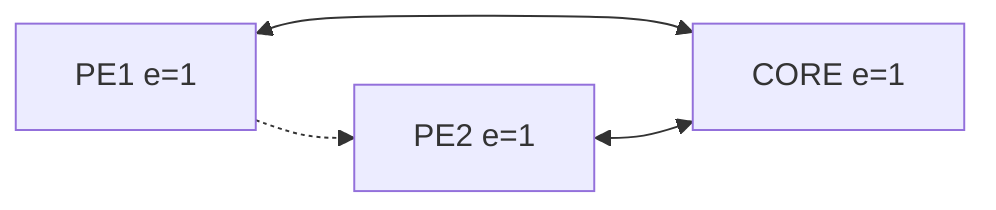
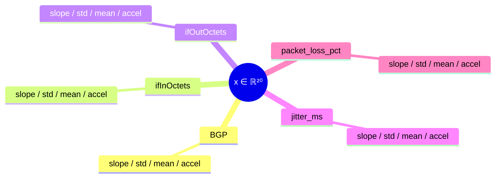

---
tags:
  - deca
  - architecture
  - models
aliases:
  - Model Architectures
cssclasses:
  - wide
---

# DECA — model architectures

Internals of each live artifact under `models/`. Training loop: [[DECA_Training_Architecture]]

---

## Stack map

---

## ① Isolation Forest + Platt

300 trees · contamination ≈ 0.073 · `models/isolation_forest/`

$$
s(x,n)=2^{-E(h(x))/c(n)},\qquad P=\frac{1}{1+e^{As+B}}
$$

---

## ② XGBoost Phase‑1

Gate 200×depth4 · Full 250×depth5 · `models/fault_classifier/`

$$
w_i=\frac{N}{K\,n_{y_i}},\quad w_i'=w_i\cdot\beta\ \text{(BGP/VRF)}
$$

---

## ③ LSTM *(neural network)*

`(batch, 16, 20)` → 35,265 trainable params · `models/lstm/fault_lstm_v1.keras`

| Layer | Shape | Params |
| --- | --- | ---: |
| LSTM(64) | `(None,16,64)` | 21,760 |
| LSTM(32) | `(None,32)` | 12,416 |
| Dense(32) | `(None,32)` | 1,056 |
| Dense(1) | `(None,1)` | 33 |

---

## ④ Prophet ×3

Additive seasonal model · not a neural net

| Series | Fit n |
| --- | ---: |
| ifInOctets | 4,502 |
| jitter_ms | 8,000 |
| bgp_update_rate | 320 |

---

## ⑤ Topology

$$
e(v)=\max_u d(v,u)=1
$$

---

## Feature vector

