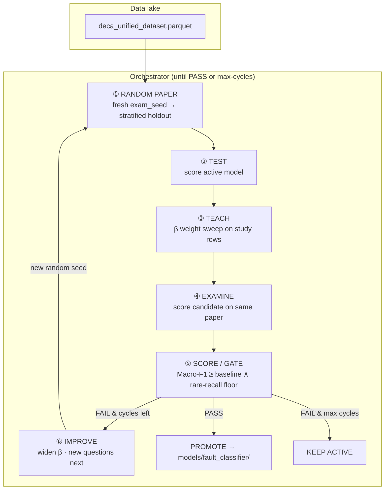
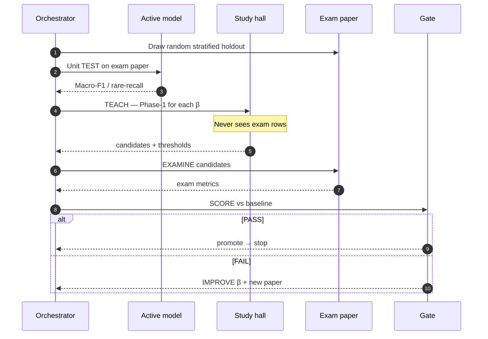
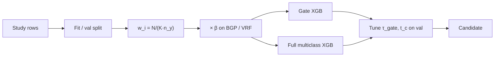
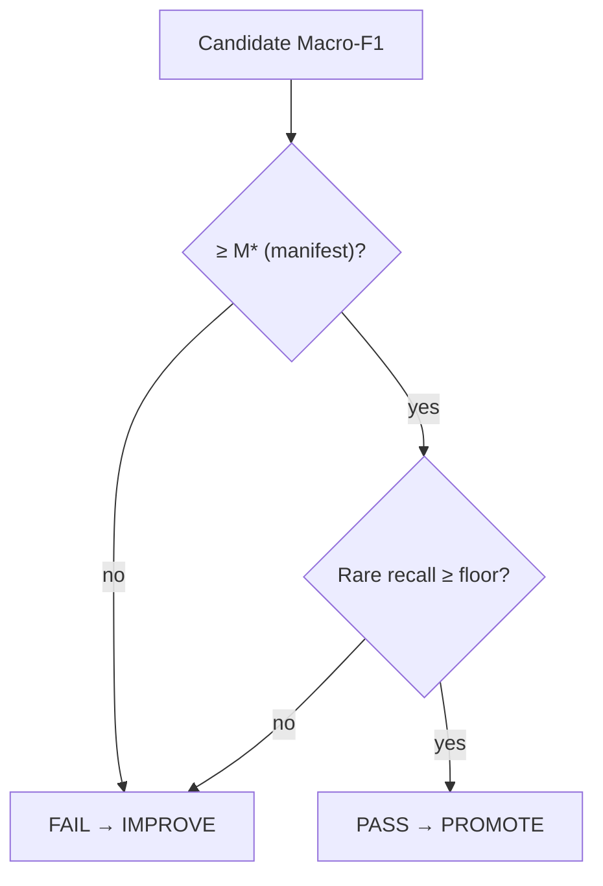
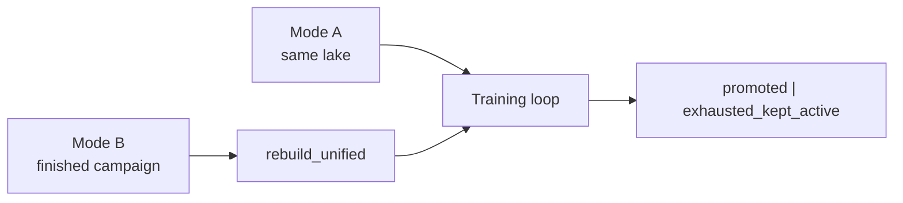

---
tags:
  - deca
  - architecture
  - training
aliases:
  - Training Architecture
  - School Exam Architecture
cssclasses:
  - wide
---

# DECA — training architecture

How models are taught, tested, and promoted. Diagrams only — prose docs: `docs/DECA_MLOps_Continuous_Learning_Pipeline.md`.  
Models’ internals: [[DECA_Model_Architectures]]

---

## Continuous learning loop

---

## One cycle (sequence)

---

## Study hall (weight adjust)

---

## Promotion gate

$$
\mathrm{PASS}\iff\mathrm{Macro\text{-}F1}\ge M^\star
\;\land\;
R_{\mathrm{rare}}\ge R_{\max}-\delta
$$

---

## Mode A vs Mode B

