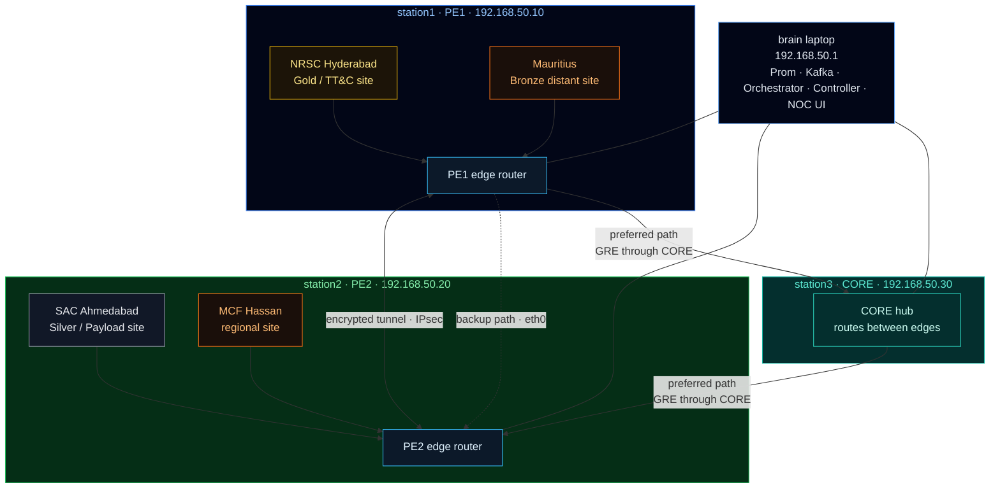
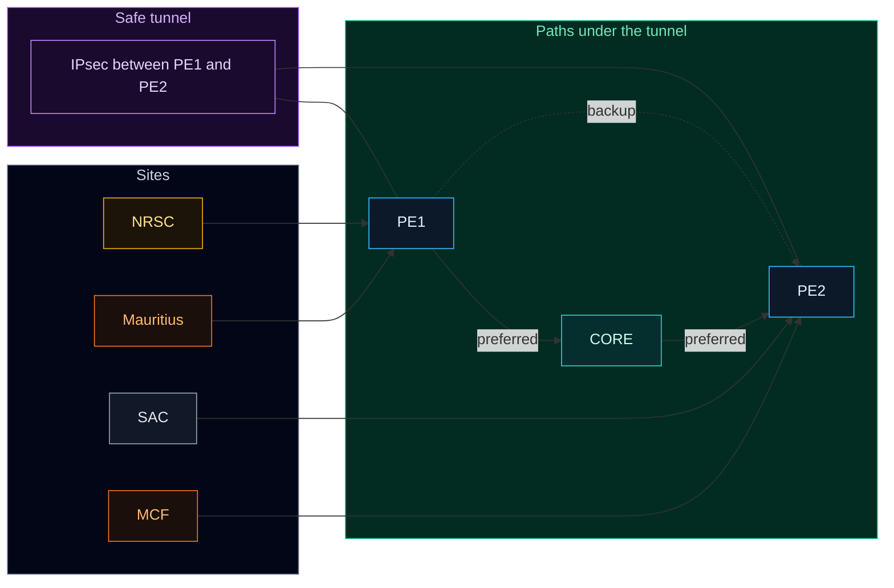

# DECA Predictive SD-WAN: Presentation Deck

Simple answers to the main questions about this project — from the problem to what we deliver.

---

## Slide 1: The Problem Statement
**What problem did we get?**
* Today’s SD-WAN usually waits for a link to get bad, then switches to a backup. That is **reactive**.
* For ISRO TT&C (Telemetry, Tracking, and Command), waiting until after failure is too late. Even a few seconds of loss can hurt the mission.

---

## Slide 2: Our Understanding of the Problem
**What did we understand?**
* Soft / fake data is not enough. Real hardware under stress behaves differently (CPU load, buffers, short bursts).
* The network must **predict** trouble early and act **before** the service limit is broken.
* Operators will not trust an AI that changes routes on its own with no clear reason.

---

## Slide 3: The Solution We Are Providing
**What are we building?**
* A **predictive SD-WAN**: normal controller + AI that looks ahead.
* Training on **real Pi hardware** metrics, not only simulation.
* A **NOC dashboard** with a Copilot that explains problems in plain English and tells the operator what to do next.

---

## Slide 4: Why This Solution?
**Why this approach?**
* We split the AI into clear jobs: **when** will it fail (Q1) and **why** (Q2). That is easier to check than one big black box.
* **Human in the loop:** AI advises; the operator clicks **Approve** before traffic moves.
* Copilot only uses our runbooks (RAG) and live metrics — it does not invent facts.

---

## Slide 5: System Architecture
**How does the system work?**
* **Step 1 — Telemetry:** Prometheus reads live metrics from the Pi cluster, often many times per second.
* **Step 2 — AI:** Models read a short window of those metrics and score risk.
* **Step 3 — Orchestrator:** FastAPI connects models, controller, and the UI.
* **Step 4 — Explain & act:** Copilot writes a short brief; the Decide card lets the operator Approve a backup path.

---

## Slide 6: Complete Network Topology
**How is the lab network wired?**

One laptop (brain) plus three Raspberry Pis. Five sites sit on those Pis as customer edges. Traffic prefers the GRE path through CORE; eth0 is backup; mission traffic is encrypted with IPsec between PE1 and PE2.

**Simple view of the layers**

| Role | Host | Lab IP | Sites attached |
| --- | --- | --- | --- |
| PE1 | station1 | 192.168.50.10 | NRSC, Mauritius |
| PE2 | station2 | 192.168.50.20 | SAC, MCF |
| CORE | station3 | 192.168.50.30 | — |
| Brain | laptop | 192.168.50.1 | Runs Prom, Kafka, NOC, controller |

---

## Slide 7: Models & Benchmarks
**What models do we use, and how good are they?**
* **Q1 — time left:** LSTM estimates how many minutes until the service limit (e.g. 25 ms).
* **Q2 — what kind of problem:** XGBoost names the pattern (rain fade, route flap, CPU stress, and so on).
* **Extra rules:** Simple specialists catch hard edge cases the trees miss.
* **Results:**
  * **88.4%** on clean, unseen hardware tests.
  * **81.5%** even with extra chaos and background noise.

---

## Slide 8: The Output
**What does the operator see?**
* A live **NOC dashboard** where a person stays in control.
* A **Decide** card: severity, time left, and **Approve backup**.
* An **Explain** Copilot: short story, what to check, and what to click next.

---

## Slide 9: Organizational Impact
**How does this help an organization?**
* Fix problems **before** packets are dropped — less firefighting.
* Less mental load: the system does the heavy reading; the operator decides.
* New staff can act faster because Copilot explains in plain English.

---

## Slide 10: Target Audience
**Who is this for?**
* **NOC operators** — need clear alerts and a simple Approve step.
* **Network engineers** — need traces, metrics, and rules they can audit.
* **Mission leads (e.g. ISRO)** — need uptime, human approval, and no silent auto-steer.

---

## Slide 11: Deliverability
**What exactly are we delivering?**
* A clear **end-to-end design** (how pieces fit), not only one script.
* A **working pipeline:** live metrics → AI → orchestrator → NOC dashboard.
* An **air-gapped Copilot** pattern grounded in local runbooks.
* A **testbed method** (Pi + GNS3) others can copy to train on their own network.

---

## Slide 12: Scope of Expansion
**How can this grow later?**
* Train the same models on **ISRO’s own** history and hardware.
* Scale Prom / orchestrator to **many** earth stations.
* Later add RF SNR, weather, and orbit data to warn even earlier — before the terrestrial path looks bad.
